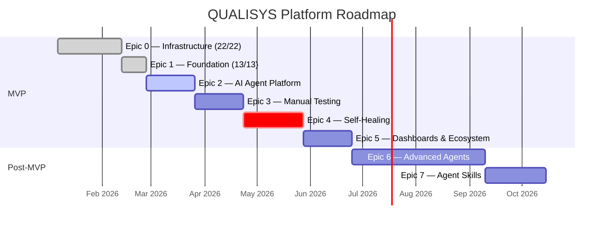

<p align="center">
  
</p>

<h1 align="center">QUALISYS</h1>

<p align="center">
  <strong>AI System Quality Assurance Platform</strong><br>
  <em>Transforming software testing from a manual bottleneck into an intelligent, self-maintaining system.</em>
</p>

<p align="center">
  
  
  
  
  
  
  
  
</p>

<p align="center">
  <a href="#-the-problem-we-solve">Problem</a> &bull;
  <a href="#-platform-capabilities">Capabilities</a> &bull;
  <a href="#-competitive-advantage">Advantage</a> &bull;
  <a href="#-business-impact--roi">ROI</a> &bull;
  <a href="#-technology-architecture">Architecture</a> &bull;
  <a href="#-roadmap">Roadmap</a> &bull;
  <a href="#-getting-started">Getting Started</a>
</p>

---

## Executive Summary

**QUALISYS** is a next-generation **AI System Quality Assurance Platform** that redefines how software teams approach testing. By harnessing the power of **7 specialized AI agents**, **self-healing test automation**, and an **end-to-end testing lifecycle**, QUALISYS collapses the time from requirements to executable test suites from **weeks to minutes** — while reducing test maintenance effort by **70%**.

QUALISYS doesn't just improve testing — it creates an entirely new category: **"AI System Quality Assurance"** — the first platform purpose-built for comprehensive quality assurance in the AI era, where non-deterministic systems demand fundamentally different testing approaches.

> **The "5-Minute Value Moment":** Upload a PRD. Connect your app URL and GitHub repo. Select AI agents. Within **5 minutes**, receive complete test suites — manual checklists, automated Playwright scripts, BDD scenarios, coverage matrices — ready to execute. What takes testing teams **weeks** collapses to **minutes**.

---

## The Problem We Solve

### The Testing Crisis

Software teams today face a systemic crisis that traditional tools cannot solve:

| Pain Point | Impact | Scale |
|-----------|--------|-------|
| **Manual Testing Burden** | Engineering teams lose **40% of capacity** to manual testing activities | Industry-wide |
| **Brittle Automation** | Test scripts break with every UI change, creating endless maintenance cycles | **70% of automation effort** spent on maintenance |
| **Coverage Gaps** | Manual processes miss critical test scenarios, letting bugs escape to production | **$1.9B lost annually** to undetected AI failures |
| **AI System Complexity** | Traditional tools built for deterministic software cannot handle AI-powered applications | **750M+ applications** using LLMs by 2025 |
| **Disconnected Toolchains** | Testing tools, issue trackers, source control, and communication operate as silos | Average team uses **6+ disconnected tools** |

### The Market Opportunity

The AI-enabled testing market is experiencing explosive growth, driven by the urgent need for quality assurance in the AI era:

| Metric | Value |
|--------|-------|
| **Market Size (2025)** | $1.01 Billion |
| **Projected Market (2032)** | $3.82 Billion |
| **CAGR** | 20.9% — **25% faster** than traditional testing tools |
| **IT Budget Allocation** | 40% of IT budgets now allocated to AI testing infrastructure |
| **Developer Adoption** | 81% of development teams use AI in testing workflows (2025 data) |

**QUALISYS is positioned to define and lead this emerging category.**

---

## Platform Capabilities

### Three Breakthrough Capabilities No Competitor Offers Together

<table>
<tr>
<td width="33%" valign="top">

#### 1. Multi-Agent AI System

**7 specialized AI agents** work in orchestrated pipelines, transforming raw requirements into executable test suites. Each agent is purpose-built for a specific domain — from business analysis to database validation — with human-in-the-loop governance at every critical stage.

</td>
<td width="33%" valign="top">

#### 2. Self-Healing Test Automation

When application changes break tests, QUALISYS doesn't just report failures — it **automatically detects DOM changes**, proposes patched selectors with confidence scoring, and updates tests with versioned audit trails. The test maintenance burden drops by **70%**.

</td>
<td width="33%" valign="top">

#### 3. End-to-End Testing Lifecycle

From ingesting requirements documents and generating test artifacts, to executing tests across browsers, to providing executive dashboards with KPIs and SLA monitoring — **one platform replaces an entire testing toolchain**.

</td>
</tr>
</table>

#### How It All Connects


---

### Core AI Agents (MVP)

| Agent | Mission | Key Outputs | Unique Value |
|-------|---------|-------------|-------------|
| **BAConsultant AI Agent** | Analyzes requirements documents, detects gaps and ambiguities, generates test-ready user stories with quality scoring (0-40 scale) | Coverage matrix, user stories, gap analysis, risk register, assumptions log | Dual-review approval: internal team + client stakeholder review before downstream release |
| **QAConsultant AI Agent** | Creates comprehensive test strategies, manual checklists, BDD/Gherkin scenarios across 6 testing types | Test plans, manual checklists, BDD scenarios, synthetic test data, sprint readiness validation | Covers Smoke, Sanity, Integration, Regression, Usability, and UAT — automatically |
| **AutomationConsultant AI Agent** | Generates Playwright/Puppeteer/REST-Assured scripts with smart locators, manages automation suites | Automated test scripts, framework blueprints (POM/Data-Driven/Hybrid), automation readiness scores | DOM crawling, sitemap generation, and coverage gap detection built-in |

### Advanced AI Agents (Post-MVP)

| Agent | Mission | Key Outputs | Unique Value |
|-------|---------|-------------|-------------|
| **AI Log Reader / Summarizer** | Analyzes application logs, identifies error patterns, generates targeted negative test cases | Error cluster reports, log summaries, negative test scenarios | Turns production logs into actionable test coverage |
| **Security Scanner Orchestrator** | Coordinates OWASP Top 10 scans, generates security test scenarios, orchestrates vulnerability analysis | Security scan results, OWASP compliance reports, security test cases, JIRA export | Automated security testing pipeline — no security specialist required |
| **Performance / Load Agent** | Generates k6/Locust scripts, identifies bottlenecks, validates SLA compliance under load | Load test scripts, bottleneck analysis, SLA compliance reports, capacity recommendations | Performance testing without performance specialists |
| **DatabaseConsultant AI Agent** | Validates schema migrations, enforces data integrity, profiles query performance, acts as CI/CD quality gate | Schema validation reports, ETL integrity checks, query optimization recommendations | Full-stack quality assurance: from UI to database layer |

---

### Agent Skills Integration (Architecture Board Approved — Score 7.8/10)

A progressive skill-loading system that optimizes LLM token costs by **40-60%** per agent invocation through three-level progressive disclosure:

| Level | What Loads | Token Cost | When |
|-------|-----------|-----------|------|
| **Level 1 — Metadata** | Skill name, description, tags | ~50-100 tokens | Always (discovery phase) |
| **Level 2 — Instructions** | Procedural steps, patterns, workflow rules | ~500-2,000 tokens | On invocation |
| **Level 3 — Resources** | Templates, examples, reference data, scripts | ~500-1,000 tokens | On demand |

**21 custom skills** across all 7 agents:

| Agent | Skills | Token Savings |
|-------|--------|---------------|
| BAConsultant | Document Parser, Requirements Extractor, Gap Analyzer | **76% reduction** |
| QAConsultant | Test Strategy Generator, BDD Scenario Writer, Test Data Generator | **72% reduction** |
| AutomationConsultant | Playwright Script Generator, Selector Optimizer, Self-Healing Analyzer | **70% reduction** |
| DatabaseConsultant | Schema Validator, ETL Checker, Performance Profiler | 65-75% reduction |
| Security Scanner | Vulnerability Analyzer, OWASP Top 10 Checker, Security Test Generator | 65-75% reduction |
| Performance/Load | Load Test Generator, Bottleneck Identifier, SLA Validator | 65-75% reduction |
| Log Reader | Error Pattern Detector, Log Summarizer, Negative Test Generator | 65-75% reduction |

**Zero Regression Guarantee:** Agents fall back to full-context mode if skills are unavailable. Skills are a strategic optimization — never a hard dependency.

---

### Admin-Configured Custom Agents (Epic 6 Phase 3)

Transforms QUALISYS from **"a product with agents"** to **"a platform for agents"**:

| Capability | Description | Impact |
|-----------|-------------|--------|
| **Agent Registry Service** | Register new agents at runtime via API or admin UI — no code deployment | New agent in hours, not weeks |
| **Per-Tenant Customization** | Client-specific prompts, output templates, enable/disable per organization | Every client gets a tailored experience |
| **Fault Isolation** | Per-agent token budgets, hard timeouts, circuit breaker patterns | One agent failure never affects others |
| **Prompt Versioning** | Semantic versioning with gradual rollout (percentage-based tenant bucketing) | Safe, incremental agent improvements |
| **Agent SDK** | TypeScript/Python SDK for community-created agents | Opens ecosystem for third-party innovation |
| **Agent Marketplace** | Discovery, ratings, revenue share for community agents | Network effects that compound over time |

---

### Intelligent Ingestion Pipeline

QUALISYS ingests diverse input sources and creates a unified knowledge base for all AI agents:

| Source | Format | What Gets Extracted |
|--------|--------|-------------------|
| **Document Parsing** | PDF, Word, Markdown | Requirements, user stories, acceptance criteria, business rules |
| **Source Code Analysis** | GitHub repos (read-only) | Routes, APIs, components, dependencies, manifests |
| **DOM Crawling** | Live application URLs | Site maps, page structures, forms, dynamic flows, auth flows |
| **Vector Embeddings** | All sources | Semantic embeddings stored in pgvector for cross-agent retrieval |

---

### Self-Healing Test Automation Engine


| Metric | Value |
|--------|-------|
| Auto-fix rate | **80%+** of UI-change-related test failures |
| Audit trail | Versioned before/after comparisons for every fix |
| Approval workflow | PM approval required before production test modifications |
| Confidence scoring | 0-100% score on every proposed fix |

---

### Enterprise Integrations

| Category | Integration | Capability |
|----------|------------|-----------|
| **Issue Tracking** | JIRA (bi-directional) | Auto-create defects with evidence, link test cases, sync status |
| **Issue Tracking** | GitHub Issues | Native workflow integration for GitHub-first teams |
| **Test Management** | TestRail | Import/export test plans, sync execution results, preserve IDs |
| **Test Management** | Testworthy | Bi-directional sync with folder structure preservation |
| **Version Control** | GitHub | PR comments with test results, merge gates, webhook triggers |
| **Communication** | Slack | Test completion notifications, failure alerts, ChatOps commands |
| **CI/CD** | GitHub Actions | Automated test triggers, deployment gates, quality checks |
| **Identity** | OAuth 2.0 (Google) | Standard SSO for cloud-first teams |
| **Identity** | SAML 2.0 (Okta, Azure AD) | Enterprise SSO with JIT provisioning |

**Growth Phase:** GitLab CI, Azure DevOps, Zephyr, Xray, PractiTest, MS Teams, DataDog, New Relic

---

### Dashboards & Reporting

| Dashboard | Audience | Key Metrics |
|-----------|----------|------------|
| **PM/CSM Dashboard** | Project Managers, Customer Success | Project health, test coverage %, execution velocity, P1/P2 defect leakage, SLA compliance |
| **QA Dashboard** | QA Engineers | Live test runs, failing suites, flaky test detection, environment status, runner availability |
| **Executive Reports** | Leadership, Stakeholders | PDF exports, scheduled email summaries, trend analysis |
| **Real-Time Updates** | All Users | Server-Sent Events for live test execution progress |
| **Role-Based Views** | 6 Personas | Optimized interfaces tailored to each persona's workflow |

---

### Governance & Compliance

| Feature | Description |
|---------|-------------|
| **15 Human-in-the-Loop Gates** | No agent can self-approve — every critical decision requires human authorization |
| **Dual-Review Gate** | User stories require both internal team review AND client stakeholder review before downstream release |
| **SOC 2 Type II** | Target certification (Growth phase) with immutable audit trails |
| **GDPR Ready** | Data export, right to be forgotten, consent management, configurable retention policies |
| **Multi-Tenant Isolation** | Schema-per-tenant PostgreSQL with Row-Level Security — zero cross-tenant leakage |
| **6-Role RBAC** | Owner/Admin, PM/CSM, QA-Manual, QA-Automation, Dev, Viewer — enforced at API level |
| **Encryption** | TLS 1.3 in transit, AES-256 at rest — bank-level security |
| **Continuous Scanning** | Semgrep, Snyk, Dependabot, OWASP ZAP — automated vulnerability detection |

---

## Competitive Advantage

### Market Positioning

| Capability | QUALISYS | DeepEval | Braintrust | Traditional Tools |
|-----------|----------|----------|------------|-------------------|
| Multi-Agent AI System (7 agents) | **Yes** | No | No | No |
| Self-Healing Test Automation | **Yes** | No | No | Limited |
| End-to-End Testing Lifecycle | **Yes** | No (eval only) | No (pre-deploy only) | Partial |
| Requirements-to-Test Generation | **Yes** | No | No | No |
| Admin-Configured Custom Agents | **Yes** | No | No | No |
| Agent Skills (Progressive Disclosure) | **Yes** | No | No | No |
| Multi-Tenant SaaS | **Yes** | Partial | Yes | Varies |
| Human-in-the-Loop Governance | **15 approval gates** | Limited | Limited | Manual |
| Multi-Cloud (AWS + Azure) | **Yes** | No | No | Varies |
| Agent Marketplace (Planned) | **Yes** | No | No | No |

### Competitive Landscape

| Competitor | Strengths | Gaps QUALISYS Fills |
|-----------|-----------|-------------------|
| **DeepEval / Confident AI** | 500K monthly downloads, 14+ LLM evaluation metrics, enterprise clients (Microsoft, BCG) | Narrow focus on LLM evaluation only — no full testing lifecycle, no self-healing, no multi-agent orchestration |
| **Braintrust** | Strong ROI messaging ("30% accuracy improvements"), unified LLM testing platform | Pre-deployment evaluation focus only — no continuous production testing, no requirements-to-test pipeline |
| **Humanloop** | Market presence in AI evaluation | Being acquired by Anthropic, sunsetting Sept 2025 — creates market vacuum QUALISYS fills |
| **Traditional (Selenium, Cypress)** | Established market presence, large community | Built for deterministic software — bolt-on AI features, no self-healing, no AI agent orchestration |

**Strategic Positioning:** While competitors focus on narrow "AI testing tools" or "LLM evaluation," QUALISYS owns the comprehensive **"AI System Quality Assurance"** category — a category that doesn't yet exist. **First mover advantage is everything.**

---

## Business Impact & ROI

### Why We Invested

| # | Strategic Rationale | Business Case |
|---|-------------------|---------------|
| 1 | **Market Timing** | Companies are moving from experimental AI to mission-critical AI deployments. The "move fast, break things" playbook is now existentially dangerous for AI systems. First company to solve AI System QA **owns the category**. |
| 2 | **Competitive Gap** | DeepEval (closest competitor) has 500K downloads but only covers LLM evaluation. Humanloop is being acquired by Anthropic (sunsetting Sept 2025), creating a market vacuum. **No one owns the full lifecycle.** |
| 3 | **Defensible Moat** | Multi-agent architecture, self-healing engine, 15-gate governance system, and Agent Skills framework are deeply technical — **hard to replicate**. The Agent Marketplace creates network effects that compound. |
| 4 | **Unit Economics** | Agent Skills integration reduces per-invocation token costs by 40-60%, directly improving gross margins. At 150 tenants, this saves **$82,080 annually**. |
| 5 | **Platform Play** | QUALISYS evolves from a product into a **platform** — with custom agents, Agent SDK, and marketplace creating an ecosystem that attracts third-party developers and compound growth. |

### Direct Cost Savings

| Metric | Before QUALISYS | After QUALISYS | Impact |
|--------|----------------|----------------|--------|
| Test maintenance time | 40% of engineering capacity | 12% of engineering capacity | **70% reduction** |
| Time to first test suite | 2-4 weeks | < 10 minutes | **99% faster** |
| Test coverage (after 60 days) | ~45% average | ~85%+ | **40% improvement** |
| Test failures auto-fixed | 0% | 80%+ | **Eliminates manual fix cycles** |
| Agent token costs (at scale) | $136,800/year | $54,720/year | **60% reduction via Agent Skills** |
| New agent capability time | 8-12 weeks (code deployment) | 2-4 weeks (skill creation) | **75% faster** capability expansion |

### Revenue & Growth Targets

| Metric | Target | Timeline |
|--------|--------|----------|
| Paying teams | 100 | 12 months post-launch |
| Integration adoption | 70% connect 1+ integration | 6 months post-launch |
| Enterprise deals (SSO/SOC 2) | 5 closed | 18 months post-launch |
| Agent marketplace | 20 community agents | 24 months post-launch |
| Self-hosted LLM adoption | 20% of customers | 18 months post-launch |

### Market Penetration Strategy

| Phase | Focus | Target Segment |
|-------|-------|---------------|
| **Beachhead** | Software houses, freelance dev teams, in-house development orgs | Organizations with PMs, CSMs, BAs, Devs, and QA engineers actively building software |
| **Expansion** | Enterprise (SOC 2, SAML SSO), vertical-specific agents | Regulated industries, large organizations with compliance needs |
| **Platform** | Agent Marketplace, Agent SDK, community ecosystem | Third-party developers, ISV partners, consulting firms |

---

## Industry Transformation

### How QUALISYS Modernizes Software Testing

| Paradigm Shift | Traditional Approach | QUALISYS Approach |
|---------------|---------------------|-------------------|
| **Manual to Intelligent** | Human testers manually write test cases, execute step-by-step, maintain brittle scripts | AI agents automatically generate comprehensive test suites from requirements — covering types humans often miss |
| **Reactive to Proactive** | Teams spend days debugging broken selectors after every UI change | Self-healing engine detects problems, proposes fixes with confidence scores, applies approved patches in minutes |
| **Siloed to Connected** | Testing tools, issue trackers, source control, and comms operate as disconnected silos | Unified pipeline: JIRA requirement becomes a test in QUALISYS, results appear on GitHub PRs, alerts fire on Slack |
| **Static to Adaptive** | Write-once, maintain-forever automation scripts | Agent Skills architecture enables modular capabilities that evolve with the platform — new testing capabilities in 2-4 weeks |
| **Generic to Custom** | One-size-fits-all testing tools | Admin-configured custom agents per tenant — industry-specific prompts, output templates, and workflows without code deployment |
| **Costly to Optimized** | Full-context LLM invocations for every agent call | Progressive skill loading reduces token costs by 40-60%, improving unit economics at every scale point |

### Market Validation

| Indicator | Data Point |
|-----------|-----------|
| Annual losses to undetected LLM failures | **$1.9 Billion** |
| Applications expected to use LLMs (2025) | **750 Million** |
| Development teams using AI in testing | **81%** |
| IT budgets allocated to AI testing | **40%** |
| AI testing market CAGR | **20.9%** — 25% faster than traditional testing |

---

## Technology Architecture

### Stack Overview


| Layer | Technology | Why This Choice |
|-------|-----------|----------------|
| **Frontend** | Vite + React 18 + TypeScript + Tailwind CSS + shadcn/ui | Modern, performant, component-driven UI with design system |
| **Backend** | Python 3.11+ FastAPI + SQLAlchemy 2.x | Async-first, high-performance API with production ORM |
| **AI Orchestration** | LangChain (MVP) + Custom Orchestrator (Production) | Rapid MVP development with planned optimization path |
| **LLM Providers** | OpenAI GPT-4 (MVP), Claude API (Skills), Self-hosted vLLM (Post-MVP) | Multi-provider strategy eliminates vendor lock-in |
| **Database** | PostgreSQL 15+ with pgvector | Multi-tenant schemas, vector search, enterprise-grade reliability |
| **Cache** | Redis 7+ (cluster mode) | Sessions, rate limiting, LLM response caching, circuit breakers |
| **Browser Automation** | Playwright | Cross-browser testing, smart locators, self-healing support |
| **Container Runtime** | Podman + Kubernetes (EKS/AKS) | Enterprise container orchestration with autoscaling |
| **Observability** | OpenTelemetry + LangFuse + Prometheus + Grafana | Full-stack observability including LLM cost tracking |
| **Infrastructure** | Terraform + Helm + GitHub Actions | Infrastructure as Code with multi-cloud support |

### Multi-Cloud Architecture

QUALISYS supports both **AWS** and **Azure** as build-time deployment targets — a single `CLOUD_PROVIDER` variable switches the entire deployment:

| Component | AWS | Azure |
|-----------|-----|-------|
| **Kubernetes** | EKS | AKS |
| **Database** | RDS PostgreSQL | PostgreSQL Flexible Server |
| **Cache** | ElastiCache Redis | Azure Cache for Redis |
| **Container Registry** | ECR | ACR |
| **Secrets** | Secrets Manager | Key Vault |
| **Object Storage** | S3 | Blob Storage |
| **Monitoring** | CloudWatch + CloudTrail | Log Analytics + Activity Log |
| **Identity** | IAM + IRSA | Managed Identities + Workload Identity |

### Scalability Targets

| Dimension | Target | Architecture Pattern |
|-----------|--------|---------------------|
| **Tenants** | 500 organizations | Schema-per-tenant PostgreSQL isolation |
| **Users** | 25,000 (50/tenant avg) | Stateless API with Redis session cache |
| **Test Executions** | 10,000+/day | Kubernetes HPA with pre-warmed container pools |
| **Test Artifacts** | 1M+ stored | S3/Blob with lifecycle policies |
| **Concurrent Agents** | 10+ per tenant | Async queue-based agent orchestration |
| **Documents** | 1,000 pages / 100MB per session | Chunked processing with streaming progress |
| **Skill Invocations** | 50,000+/day (at 500 tenants) | HPA-scaled Skill Proxy Service |

### Security & Compliance

| Domain | Capability | Standard |
|--------|-----------|----------|
| **Authentication** | OAuth 2.0, SAML 2.0, TOTP MFA, JWT sessions | Enterprise-grade SSO |
| **Encryption** | TLS 1.3 in transit, AES-256 at rest | Bank-level encryption |
| **Data Isolation** | Schema-per-tenant PostgreSQL + Row-Level Security | Zero cross-tenant leakage |
| **Access Control** | 6-role RBAC enforced at API level | Least privilege principle |
| **Audit** | Immutable audit logs of all actions | SOC 2 compliant |
| **Privacy** | GDPR-ready: export, deletion, consent, PII redaction | EU regulatory compliance |
| **Code Safety** | Semgrep, Snyk, Dependabot, OWASP ZAP | Continuous vulnerability scanning |
| **Secrets** | AWS Secrets Manager / Azure Key Vault, 90-day rotation | Zero hardcoded credentials |
| **Compliance** | SOC 2 Type II (target Month 9), ISO 27001 (demand-driven) | Enterprise certification path |

---

## Target Users

QUALISYS serves **6 distinct personas** with role-optimized interfaces:

| Persona | Primary Value | Key Workflows |
|---------|-------------|---------------|
| **Owner/Admin** | Full platform control, billing, compliance, agent configuration | Organization setup, user management, data governance, custom agent configuration |
| **PM/CSM** | Project oversight, SLA management, stakeholder reporting | Dashboards, coverage reports, defect tracking, JIRA sync, approval workflows |
| **QA-Manual** | Guided manual test execution with evidence capture | Checklist execution, screenshot/video capture, defect filing, evidence linking |
| **QA-Automation** | AI-powered test generation and self-healing management | Agent selection, script generation, self-healing approval, skill execution |
| **Dev** | Test results visibility integrated into development workflow | PR test results, on-demand test runs, failure investigation |
| **Viewer** | Read-only access to quality metrics and reports | Dashboard viewing, report exports, trend analysis |

---

## Roadmap

### MVP (Epics 0-5) — 15-19 Weeks

| Epic | Name | Duration | Status | Key Deliverable |
|------|------|----------|--------|----------------|
| **0** | Infrastructure Foundation | 2-3 weeks | **Complete** (22/22 stories) | Multi-cloud infra, CI/CD, monitoring, local dev |
| **1** | Foundation & Administration | 2 weeks | **Complete** (13/13 stories done) | Auth, orgs, invitations, member management, MFA, projects, audit, export |
| **2** | AI Agent Platform & Executive Visibility | 3-4 weeks | **In Progress** (10/18 stories done) | 3 MVP agents, document ingestion, PM dashboards, JIRA integration |
| **3** | Manual Testing & Developer Integration | 3-4 weeks | Backlog | Manual test execution, evidence capture, GitHub PR integration |
| **4** | Automated Execution & Self-Healing | 4-5 weeks | Backlog | Playwright execution, self-healing engine, QA dashboards |
| **5** | Complete Dashboards & Ecosystem | 3-4 weeks | Backlog | TestRail/Slack integrations, advanced reporting, SLA monitoring |

### Post-MVP (Epics 6-7) — 12-16 Weeks

| Epic | Name | Duration | Key Deliverable |
|------|------|----------|----------------|
| **6** | Advanced Agents & Extensibility | 8-11 weeks | 4 post-MVP agents, SAML SSO, SOC 2, custom agent platform, Agent SDK, Agent Marketplace |
| **7** | Agent Skills Integration | 4-5 weeks | 21 skills across 7 agents, 40-60% token cost reduction, progressive disclosure model |

**Total Platform Timeline:** 27-35 weeks (6.5-8.5 months)



### Current Implementation Progress

**Epic 0 — Infrastructure Foundation: COMPLETE** (22/22 stories)
- Multi-cloud Terraform (AWS + Azure dual-root architecture)
- Kubernetes cluster provisioning (EKS/AKS), PostgreSQL multi-tenant database, Redis caching layer
- Container registry (ECR/ACR), secret management (Secrets Manager/Key Vault + ExternalSecrets Operator)
- GitHub Actions CI/CD (PR checks, staging auto-deploy, production with approval gate)
- Monitoring (Prometheus + Grafana), log aggregation (CloudWatch/Log Analytics + Fluent Bit)
- Podman Compose local dev environment (5 services with hot reload)
- Retrospective complete — 0 HIGH findings across all code reviews

**Epic 1 — Foundation & Administration: COMPLETE** (13/13 stories done — retrospective complete)

| Story | Name | Status |
|-------|------|--------|
| 1-1 | User Account Creation (email/password + Google OAuth, email verification) | **Done** |
| 1-2 | Organization Creation & Setup (multi-tenant provisioning, ContextVar middleware) | **Done** |
| 1-3 | Team Member Invitation (bulk invite, SHA-256 token hashing, dual-path accept) | **Done** |
| 1-4 | User Management — Remove/Change Roles (soft-delete, last-admin guard, session invalidation) | **Done** |
| 1-5 | Login & Session Management (RS256 JWT, refresh rotation, reuse detection, multi-org) | **Done** |
| 1-6 | Password Reset Flow (Argon2id hashing, token expiry, Google OAuth guard) | **Done** |
| 1-7 | Two-Factor Authentication — TOTP (QR setup, backup codes, MFA lockout) | **Done** |
| 1-8 | Profile & Notification Preferences (avatar thumbnail, notification prefs per-user) | **Done** |
| 1-9 | Project Creation & Configuration (atomic Lua rate limiting, auto-assign creator) | **Done** |
| 1-10 | Project Team Assignment (bulk invite, project-scoped RBAC, email notifications) | **Done** |
| 1-11 | Project Management — Archive/Delete/List (server-side name confirmation on delete) | **Done** |
| 1-12 | Usage Analytics & Audit Logs (in-transaction audit, async fire-and-forget, CSV export) | **Done** |
| 1-13 | Data Export & Org Deletion (async ZIP export, TOTP-gated deletion, presigned URLs) | **Done** |

**Backend Architecture Implemented** (Python/FastAPI):
- 14+ API router modules: `auth`, `mfa`, `orgs`, `export`, `invitations`, `members`, `projects`, `users`, `admin`, `agent_runs`, `artifacts`, `crawls`, `documents`, `events`, `github`
- 20+ service layers: `AuthService`, `TOTPService`, `BackupCodeService`, `PasswordResetService`, `ProfileService`, `ProjectService`, `ProjectMemberService`, `AuditService`, `AnalyticsService`, `ExportService`, `OrgDeletionService`, `NotificationPreferencesService`, `AgentRunService`, `ArtifactService`, `DOMCrawlerService`, `DocumentService`, `EmbeddingService`, `GithubConnectorService`, `SourceCodeAnalyzerService`, `SSEManager`, `TokenBudgetService`
- 4 reusable integration patterns: LLM, pgvector, SSE, Playwright (`backend/src/patterns/`)
- 3 middleware components: RBAC (`require_role`, `require_project_role`), atomic Lua rate limiting, tenant context (ContextVar)
- 15 Alembic migrations applied (001–015: users → tenants → invitations → password resets → MFA → profile → projects → members → archive index → audit logs → export/deletion audit → pgvector/documents → github/crawls → agent runs/artifacts)
- 7 email templates: verification, invitation, role-changed, member-removed, password-reset, password-reset-google, project-assignment
- Comprehensive test suites: unit, integration, and security tests (350+ tests passing across Epics 1-2)
- **Retrospective:** [Epic 1 Retro 2026-02-26](./docs/stories/epic-1/epic-1-retro-2026-02-26.md) — 8 action items, 4 pattern spikes required before Epic 2

**Epic 2 — AI Agent Platform & Executive Visibility: IN PROGRESS** (10/18 stories done)

| Story | Name | Status |
|-------|------|--------|
| 2-1 | Document Upload & Parsing (PDF/DOCX/TXT, multi-format, vector-ready chunks) | **Done** |
| 2-2 | Vector Embeddings Generation (pgvector, semantic search, context retrieval) | **Done** |
| 2-3 | GitHub Repository Connection (OAuth App, encrypted credentials, repo listing) | **Done** |
| 2-4 | Source Code Analysis (file-tree traversal, language detection, embedding storage) | **Done** |
| 2-5 | Application DOM Crawling (Playwright-based, credential vault, page snapshots) | **Done** |
| 2-6 | AI Agent Selection UI (project agents tab, run creation, agent selection) | **Done** |
| 2-7 | Agent Pipeline Orchestration (3-agent pipeline, retry logic, budget gates) | **Done** |
| 2-8 | Agent Execution Engine (LLM calls, context hashing, token tracking) | **Done** |
| 2-9 | Real-Time Agent Progress Tracking (SSE streaming, live status, error handling) | **Done** |
| 2-10 | Test Artifact Storage & Viewer (artifact CRUD, versioning, 4-tab viewer) | **Done** |
| 2-11 | Artifact Editing & Versioning | Backlog |
| 2-12 | PM/CSM Dashboard — Project Health Overview | Backlog |
| 2-13 | PM Dashboard — Test Coverage Metrics | Backlog |
| 2-14 | PM Dashboard — Execution Velocity & Defect Leakage Placeholders | Backlog |
| 2-15 | JIRA Integration — Connection Setup | Backlog |
| 2-16 | JIRA Integration — Import Issues | Backlog |
| 2-17 | JIRA Integration — Bi-Directional Traceability | Backlog |
| 2-18 | Token Budget & Cost Monitoring | Backlog |

**Epic 2 Backend** (added on top of Epic 1):
- 4 pattern spikes completed before Epic 2: LLM, pgvector, SSE, Playwright (`backend/src/patterns/`)
- 3 AI agent services: BAConsultant, QAConsultant, AutomationConsultant + Agent Orchestrator
- 15 Alembic migrations (001–015, adding pgvector/documents, github/crawls, agent runs/artifacts)
- 350+ tests passing (unit + integration across both epics)

### By The Numbers

| Metric | Value |
|--------|-------|
| **Total Epics** | 8 (Epic 0-7) |
| **Total Stories** | 132 (100 MVP + 32 Post-MVP) |
| **Stories Completed** | 45 of 132 (~34%) — Epic 0 (22), Epic 1 (13), Epic 2 partial (10/18) |
| **Functional Requirements** | 147 (110 MVP + 9 Custom Agents + 28 Agent Skills) |
| **AI Agents** | 7 (3 MVP + 4 Post-MVP) |
| **Agent Skills** | 21 (across all 7 agents) |
| **Human-in-the-Loop Gates** | 15 mandatory approval checkpoints |
| **Integrations** | 6 MVP (JIRA, TestRail, Testworthy, GitHub, Slack, SSO) + 6 Growth |
| **Personas Served** | 6 distinct role-based interfaces |

---

## Success Metrics

### Product KPIs

| Metric | Target | Why It Matters |
|--------|--------|---------------|
| Time to First Test Suite | < 10 minutes | Validates "instant value" promise |
| Test Maintenance Reduction | 70% | Self-healing core value proposition |
| Test Coverage Improvement | 40% increase (60 days) | AI finds gaps humans miss |
| Self-Healing Success Rate | 80%+ auto-fixed | Core technical differentiator |
| Cross-Role Adoption | 3+ personas active weekly | Proves cross-functional value |
| Monthly Retention | > 85% MoM | Product-market fit indicator |

### Business KPIs

| Metric | Target | Timeline |
|--------|--------|----------|
| Paying Teams | 100 | 12 months post-launch |
| Integration Adoption | 70% connect 1+ integration | 6 months post-launch |
| Enterprise Deals (SSO/SOC 2) | 5 closed | 18 months post-launch |
| Agent Marketplace | 20 community agents | 24 months post-launch |
| Token Cost Reduction | 40-60% via Agent Skills | Epic 7 completion |
| Annual Cost Savings | $82,080 at 150 tenants | 24 months post-launch |

---

## Getting Started

### Prerequisites

| Software | Version | Purpose |
|----------|---------|---------|
| Python | 3.11+ | Backend (FastAPI + SQLAlchemy + Alembic) |
| Node.js | 18+ (20.x LTS recommended) | Frontend (React + Vite) |
| PostgreSQL | 15+ (with pgvector) | Database (multi-tenant, schema-per-tenant) |
| Redis | 7+ | Cache, sessions, and rate limiting |
| Podman Desktop | 1.x+ | Container runtime (Docker Desktop not approved) |
| Git | 2.40+ | Version control |

> **Note:** Docker Desktop is NOT approved for 10Pearls systems. Use Podman Desktop or `podman-compose` CLI.

### Quick Start

```bash
# Clone and configure
git clone <repository-url>
cd QUALISYS
cp .env.example .env

# Start local services (PostgreSQL, Redis, MailCatcher, API, Web)
podman-compose up -d

# Run database migrations
podman-compose exec api alembic upgrade head

# Access the application
# Web:  http://localhost:3000
# API:  http://localhost:8000
# Mail: http://localhost:1080  (MailCatcher web UI for email testing)
# API Health: http://localhost:8000/health
```

For the complete setup guide, see [Local Development Guide](./docs/local-development.md).

### Project Structure

```
QUALISYS/
├── backend/                     # Python FastAPI backend (Epics 0-1 complete, Epic 2 in progress — 10/18 done)
│   ├── src/                    # Application source code
│   │   ├── api/v1/             # REST API routers (auth, mfa, orgs, export, invitations, members,
│   │   │                       #   projects, users, admin, agent_runs, artifacts, crawls,
│   │   │                       #   documents, events, github)
│   │   ├── middleware/         # RBAC, rate limiting, tenant context (ContextVar)
│   │   ├── models/             # SQLAlchemy models (User, Tenant, Invitation, PasswordReset,
│   │   │                       #   UserBackupCode, UserNotificationPreferences)
│   │   ├── patterns/           # Reusable integration patterns (LLM, pgvector, SSE, Playwright)
│   │   ├── services/           # Business logic (agents/, auth, invitation, notification,
│   │   │                       #   artifact, agent_run, audit, document, dom_crawler,
│   │   │                       #   embedding, export, github_connector, password_reset,
│   │   │                       #   profile, project, project_member, source_code_analyzer,
│   │   │                       #   sse_manager, tenant_provisioning, token, token_budget,
│   │   │                       #   user_management)
│   │   └── templates/email/    # Email templates (7: verification, invitation, role-changed,
│   │                           #   member-removed, password-reset, password-reset-google,
│   │                           #   project-assignment)
│   ├── alembic/                # Database migrations (15 migrations applied: 001–015)
│   └── tests/                  # Unit, integration, and security test suites
├── web/                         # React frontend (Vite + TypeScript + Tailwind + shadcn/ui)
├── infrastructure/              # Infrastructure as Code
│   ├── terraform/              # Multi-cloud (aws/ and azure/ roots)
│   └── kubernetes/             # K8s manifests (shared/, aws/, azure/)
├── docs/                        # Comprehensive project documentation
│   ├── planning/               # PRD (147 FRs), product brief, UX design, agent specs
│   ├── architecture/           # System architecture (3,900+ lines)
│   ├── epics/                  # 8 epics with 132 stories
│   ├── tech-specs/             # Per-epic technical specifications + validation reports
│   ├── stories/epic-{n}/       # Story files organised by epic (epic-0, epic-1, epic-2...)
│   ├── evaluations/            # Agent Skills architecture evaluations
│   ├── reports/                # Validation and readiness reports
│   └── research/               # Market and competitive research
├── e2e/                         # End-to-end test suites
├── .github/                     # GitHub Actions CI/CD workflows
├── compose.yml                  # Podman Compose local dev (5 services)
└── .bmad/                       # BMad Method v6 framework
```

---

## Documentation

### Strategic & Planning

| Document | Description |
|----------|-------------|
| [Product Requirements Document](./docs/planning/prd.md) | 147 functional requirements across 16 categories |
| [Agent Skills Integration PRD](./docs/planning/prd-agent-skills-integration.md) | 28 FRs for progressive skill loading, cost optimization |
| [Agent Extensibility Tech Spec](./docs/planning/tech-spec-agent-extensibility-framework.md) | Custom agent platform architecture — runtime agent registration |
| [Agent Specifications](./docs/planning/agent-specifications.md) | 7 agent definitions, RBAC, governance, skill mapping |
| [Product Brief](./docs/planning/product-brief-QUALISYS-2025-12-01.md) | Market positioning and strategic vision |
| [UX Design Specification](./docs/planning/ux-design-specification.md) | 6 personas, 6 critical user flows, design system |

### Architecture & Implementation

| Document | Description |
|----------|-------------|
| [System Architecture](./docs/architecture/architecture.md) | Technical design, risk analysis, ADRs (3,900+ lines) |
| [Epic Overview](./docs/epics/epics.md) | 8 epics, 132 stories, complete breakdown |
| [Sprint Status](./docs/sprint-status.yaml) | Real-time implementation tracking |
| [Epic 0 Tech Spec](./docs/tech-specs/tech-spec-epic-0.md) | Infrastructure foundation specification |
| [Epic 1 Tech Spec](./docs/tech-specs/tech-spec-epic-1.md) | Foundation & Administration specification (validated 11/11) |
| [Epic 1 Tech Spec Validation](./docs/tech-specs/validation-report-tech-spec-epic-1-20260221.md) | Tech spec validation report — 9/11 PASS, 2/11 PARTIAL (remediated) |
| [Test Design System](./docs/planning/test-design-system.md) | Test strategy, patterns, and quality framework |

### Research & Validation

| Document | Description |
|----------|-------------|
| [Market Research](./docs/research/research-market-2025-11-30.md) | Market size, trends, growth projections |
| [Competitive Research](./docs/research/research-competitive-2025-12-01.md) | DeepEval, Braintrust, Humanloop analysis |
| [Architecture Board Review](./docs/reports/architecture-board-review-agent-skills-20260215.md) | Agent Skills approval (7.8/10) |
| [Implementation Readiness](./docs/reports/implementation-readiness-report-2026-01-22.md) | Phase 3 to Phase 4 validation (8.7/10) |
| [PRD Validation](./docs/reports/validation-report-prd-20251211.md) | PRD validation report |
| [Architecture Validation](./docs/reports/validation-report-architecture-20260214.md) | Architecture document validation |
| [Agent Skills Technical Review](./docs/evaluations/anthropic-agent-skills-technical-review.md) | Deep technical analysis, integration feasibility |
| [Agent Skills Executive Strategy](./docs/evaluations/anthropic-agent-skills-executive-strategy.md) | Business case, competitive positioning, ROI |
| [Agent Skills Architecture Board](./docs/evaluations/anthropic-agent-skills-architecture-board.md) | Architecture board evaluation for skills integration |

---

## Development Methodology

QUALISYS is built using the **BMad Method v6** — an AI-driven agile development framework with 12 specialized AI agents and 34+ workflows guiding development from conception through implementation.

- **Track:** Enterprise BMad Method (full 4-phase approach)
- **Current Phase:** Phase 4 — Implementation
- **Current Sprint:** Sprint 2 — AI Agent Platform & Executive Visibility (Epic 2)
- **Methodology agents:** PM, Architect, Scrum Master, Developer, Test Engineer, Analyst, UX Designer, Tech Writer, and more

The BMad framework is included in this repository (`.bmad/` directory) and requires no separate installation.

---

## Contributing

1. Check current sprint status: `docs/sprint-status.yaml`
2. Review the relevant epic and tech spec in `docs/tech-specs/`
3. Follow BMad Method workflows for story implementation
4. Run backend tests: `cd backend && python -m pytest tests/ -v`
5. Ensure all tests pass before submitting PRs

See [CONTRIBUTING.md](./CONTRIBUTING.md) for detailed guidelines.

### Sprint Change Proposals

| Date | Proposal | Impact |
|------|----------|--------|
| 2026-01-24 | [Docker to Podman Migration](./docs/sprint-changes/sprint-change-proposal-2026-01-24.md) | 9 documents updated per 10Pearls company policy |
| 2026-02-06 | [Agent Restructuring (8 → 7 agents)](./docs/sprint-changes/sprint-change-proposal-2026-02-06.md) | Consolidated agents: 3 MVP + 4 Post-MVP |
| 2026-02-09 | [Multi-cloud AWS + Azure](./docs/sprint-changes/sprint-change-proposal-2026-02-09.md) | Two Roots architecture adopted |
| 2026-02-20 | [Backend Tech Stack Correction](./docs/sprint-changes/sprint-change-proposal-2026-02-20.md) | TypeScript/Express → Python/FastAPI per architecture spec |

---

## Credits

<table>
<tr>
<td align="center" width="200">

**Syed Azfar Hussain**<br>
<em>Principal Test Consultant</em><br>
<a href="https://10pearls.com">10Pearls</a><br><br>
Product Visionary & Creator of QUALISYS.<br>
Conceptualized the "AI System Quality Assurance" category and architected the multi-agent testing platform from ground up.

</td>
</tr>
</table>

---

<p align="center">
  
</p>

<p align="center">
  <strong>QUALISYS</strong> — Defining the Future of AI System Quality Assurance
  <br>
  <sub>Built by <a href="https://10pearls.com">10Pearls</a> | Version 0.1.0 | Last Updated: 2026-02-22</sub>
</p>
