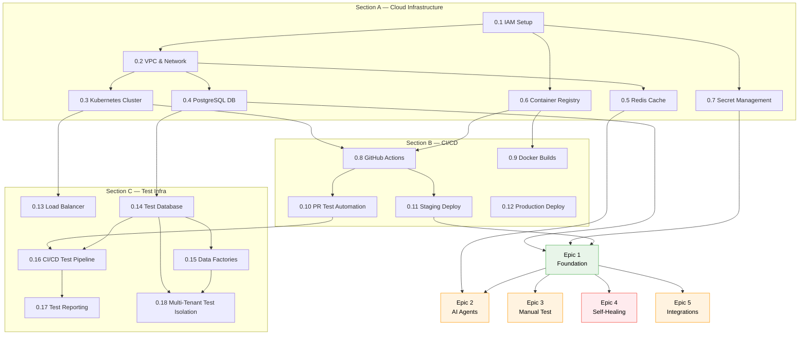

# Epic 0 — Infrastructure Foundation

**QUALISYS — AI System Quality Assurance Platform**

| Attribute | Detail |
|-----------|--------|
| **Epic** | 0 — Infrastructure Foundation |
| **Epic Owner** | DevOps Lead + Architect |
| **Sprint** | Sprint 0 (Pre-Implementation Setup) |
| **Duration** | 2–3 weeks |
| **Priority** | P0 CRITICAL — Blocking for all feature development |
| **Stories** | 22 stories across 5 sections |
| **Status** | DRAFT — Ready for Sprint 0 Planning |

---

> **P0 CRITICAL:** This epic addresses the 5 P0 CRITICAL gaps identified in the Implementation Readiness Assessment (2025-12-12). All feature epics (1–5) are blocked until Epic 0 is complete.

---

### Stakeholder Guide

| Stakeholder | Sections of Interest | Purpose |
|-------------|---------------------|---------|
| **DevOps Lead** | All sections — primary owner | Infrastructure provisioning, CI/CD, monitoring |
| **Architect** | Sections 3, 5 (Cloud Infra), 8 (Monitoring) | Multi-tenant design, network topology, observability |
| **Tech Lead** | Sections 6 (CI/CD), 9 (Dev Environment) | Pipeline configuration, dev workflow |
| **QA Lead** | Section 7 (Test Infrastructure) | Test databases, data factories, reporting |
| **Developer** | Sections 6 (CI/CD), 9 (Dev Environment) | Local setup, PR workflow, deployment |
| **PM / Scrum Master** | Part I (Overview), Part III (Governance) | Dependencies, risks, acceptance criteria |

---

### Table of Contents

**Part I — Overview & Context**
- [1. Executive Summary](#1-executive-summary)
- [2. Requirements & Dependencies](#2-requirements--dependencies)
- [3. Key Architectural Decisions](#3-key-architectural-decisions)
- [4. Epic Dependency Map](#4-epic-dependency-map)

**Part II — Infrastructure Stories (22 stories)**
- [5. Section A — Cloud Infrastructure Provisioning](#5-section-a--cloud-infrastructure-provisioning) (Stories 0.1–0.7)
- [6. Section B — CI/CD Pipeline Infrastructure](#6-section-b--cicd-pipeline-infrastructure) (Stories 0.8–0.12)
- [7. Section C — Test Infrastructure](#7-section-c--test-infrastructure) (Stories 0.13–0.18)
- [8. Section D — Monitoring & Observability](#8-section-d--monitoring--observability) (Stories 0.19–0.20)
- [9. Section E — Development Environment](#9-section-e--development-environment) (Stories 0.21–0.22)

**Part III — Governance & Validation**
- [10. Epic Dependencies](#10-epic-dependencies)
- [11. Risk Assessment](#11-risk-assessment)
- [12. Success Metrics](#12-success-metrics)
- [13. Acceptance Criteria & Sign-Off](#13-acceptance-criteria--sign-off)

---

# Part I — Overview & Context

> **Audience:** All Stakeholders | **Purpose:** Scope, dependencies, architecture decisions

---

## 1. Executive Summary

Provision complete cloud infrastructure, CI/CD pipelines, test infrastructure, and development environment to enable Epic 1–5 implementation.

### Without vs With Epic 0

| Dimension | Without Epic 0 | With Epic 0 |
|-----------|---------------|-------------|
| **Day 1 Experience** | Developers blocked: "Where do I deploy?" | Infrastructure ready, process defined |
| **CI/CD** | Manual builds, deployment errors | PRs auto-tested, deployments repeatable |
| **Test Infrastructure** | Cannot validate story DoD | 2,080 tests executable from Day 1 |
| **Dev Environment** | Each dev configures differently | Podman Compose onboarding <1 hour |
| **Timeline Impact** | 1–2 weeks lost to ad-hoc setup | Development flows smoothly from Sprint 1 |

### Success Criteria

| # | Criterion | Validation |
|:-:|-----------|-----------|
| 1 | Deploy "Hello World" to staging via CI/CD | Smoke test passes |
| 2 | Sample test suite passes in CI/CD with coverage | Coverage report generated |
| 3 | All Epic 1 infrastructure dependencies resolved | Dependency checklist green |
| 4 | Local development with Podman Compose | New dev setup <30 min |
| 5 | Monitoring dashboards show infrastructure health | Grafana dashboards live |

### Story Distribution

| Section | Stories | Focus Area | Effort |
|---------|:-------:|-----------|:------:|
| A — Cloud Infrastructure | 7 | IAM, VPC, K8s, DB, Redis, Registry, Secrets | 8–11 days |
| B — CI/CD Pipeline | 5 | GitHub Actions, Docker, Tests, Staging, Production | 7–10 days |
| C — Test Infrastructure | 6 | Load Balancer, Test DB, Data Factories, Reporting | 7–10 days |
| D — Monitoring | 2 | Prometheus + Grafana, Log Aggregation | 4 days |
| E — Dev Environment | 2 | Podman Compose, Third-Party API Keys | 2–3 days |
| **Total** | **22** | | **~28–38 days** |

---

## 2. Requirements & Dependencies

### Non-Functional Requirements Coverage

| NFR Range | Domain | Epic 0 Enablers |
|-----------|--------|-----------------|
| NFR1–NFR5 | Multi-tenant security | IAM, RLS, schema isolation, secret management |
| NFR6–NFR8 | Performance & uptime | VPC, K8s, load balancer, autoscaling |
| NFR9–NFR11 | Data retention & recovery | DB backups, disaster recovery, retention policies |
| NFR16–NFR19 | Audit & monitoring | Prometheus, Grafana, ELK, alerting |
| NFR20 | Technical documentation | README, runbooks, troubleshooting guides |

### Architectural Dependencies

| Infrastructure Component | Required By | Story |
|-------------------------|-------------|:-----:|
| PostgreSQL (schema-level isolation) | All feature epics | 0.4 |
| Redis caching layer | Epic 2+ (LLM caching) | 0.5 |
| Kubernetes orchestration (EKS/GKE/AKS) | All deployments | 0.3 |
| Container registry (ECR/GCR/ACR) | All deployments | 0.6 |
| Pre-warmed Playwright container pool | Epic 4 (self-healing) | 0.3 |
| Integration Gateway infrastructure | Epic 5 (integrations) | 0.13 |

## 3. Key Architectural Decisions

**Cloud Platform:** AWS + Azure — Two Roots architecture (updated 2026-02-09)

**Container Orchestration:** Kubernetes (EKS/GKE/AKS)
- Namespace per environment (dev, staging, production)
- Multi-tenant applications run in production namespace with schema isolation
- Pre-warmed Playwright containers in dedicated pool namespace

**Database Strategy:**
- PostgreSQL 15+ with multi-tenant schema design
- Schema per tenant (not just WHERE tenant_id filtering)
- Row-Level Security (RLS) policies as defense-in-depth
- Managed service (AWS RDS, GCP Cloud SQL, Azure PostgreSQL)

**Caching Layer:**
- Redis 7+ for session management, rate limiting, LLM response caching
- Managed service (AWS ElastiCache, GCP Memorystore, Azure Cache)

**CI/CD Platform:** GitHub Actions
- Automated builds on PR
- Automated tests on PR (unit, integration, E2E subset)
- Auto-deploy to staging on main branch merge
- Manual approval gate for production deployment

**Infrastructure as Code:** Terraform (preferred) or CloudFormation/Pulumi
- Version-controlled infrastructure definitions
- Environment parity (dev, staging, production)
- Repeatable provisioning

**Monitoring Stack:**
- Prometheus + Grafana for metrics
- ELK Stack (Elasticsearch, Logstash, Kibana) or CloudWatch for logs
- Alerting via PagerDuty/Slack

## 4. Epic Dependency Map

> Epic 0 is a prerequisite for ALL feature epics. The diagram below shows which stories unblock which epics.

---

# Part II — Infrastructure Stories

> **Audience:** DevOps, Architects, QA Leads, Developers | **Purpose:** Detailed story breakdown with acceptance criteria

---

## 5. Section A — Cloud Infrastructure Provisioning

**Stories 0.1–0.7** | **Estimated Effort:** 8–11 days

---

**Story 0.1: Cloud Account & IAM Setup**

As a DevOps Engineer, I want to set up the cloud account with proper IAM policies, so that we have secure, least-privilege access for all services.

**Acceptance Criteria:**
- AC1: AWS/GCP/Azure account created (or existing account configured)
- AC2: IAM roles created: DevOps (admin), Developer (deploy), CI/CD (deploy to staging)
- AC3: Service accounts created for Kubernetes, RDS, ElastiCache, Container Registry
- AC4: MFA enforced for all human users
- AC5: IAM policies follow least-privilege principle (documented in README)
- AC6: Access keys/credentials stored in 1Password/Vault (NOT committed to Git)

**Technical Approach:**
- Use Terraform or CloudFormation to define IAM roles
- Follow AWS Well-Architected Framework security pillar
- Create separate service accounts per service (no shared credentials)

**FRs Covered:** Infrastructure enabler for NFR1-NFR5 (security)

**Dependencies:** None

**Estimated Effort:** 1-2 days

---

**Story 0.2: VPC & Network Configuration**

As a DevOps Engineer, I want to configure VPC with proper network segmentation, so that we have secure network isolation between environments.

**Acceptance Criteria:**
- AC1: VPC created with CIDR block (e.g., 10.0.0.0/16)
- AC2: Subnets created: Public (2 AZs), Private (2 AZs), Database (2 AZs)
- AC3: Internet Gateway attached to public subnets
- AC4: NAT Gateway in each AZ for private subnet internet access
- AC5: Route tables configured for each subnet type
- AC6: Security groups created: ALB, Kubernetes nodes, RDS, ElastiCache
- AC7: Network ACLs configured for additional security layer
- AC8: VPC Flow Logs enabled for network traffic monitoring

**Technical Approach:**
- Use Terraform vpc module or manual CloudFormation
- Multi-AZ setup for high availability (2 AZs minimum)
- Private subnets for Kubernetes nodes and databases (no direct internet access)

**FRs Covered:** Infrastructure enabler for NFR6-NFR8 (performance, uptime)

**Dependencies:** Story 0.1 (IAM setup)

**Estimated Effort:** 2 days

---

**Story 0.3: Kubernetes Cluster Provisioning**

As a DevOps Engineer, I want to provision a Kubernetes cluster, so that we can deploy containerized applications with orchestration.

**Acceptance Criteria:**
- AC1: Kubernetes cluster created (EKS/GKE/AKS) with managed control plane
- AC2: Node groups created: General (t3.medium, 2-10 nodes autoscaling), Playwright Pool (c5.xlarge, 5-20 nodes)
- AC3: Namespaces created: dev, staging, production, playwright-pool, monitoring
- AC4: RBAC policies configured (developer, devops, ci-cd roles)
- AC5: kubectl access configured for team (context switching between namespaces)
- AC6: Cluster autoscaler enabled (scale nodes based on pod resource requests)
- AC7: Metrics server installed for resource monitoring
- AC8: Ingress controller installed (NGINX Ingress or ALB Ingress Controller)

**Technical Approach:**
- Use eksctl (AWS), gcloud (GCP), or az cli (Azure) for cluster creation
- Enable cluster logging to CloudWatch/Stackdriver
- Configure node groups with taints/tolerations for Playwright pool isolation

**FRs Covered:** Infrastructure enabler for NFR6-NFR8 (scalability, performance)

**Dependencies:** Story 0.2 (VPC setup)

**Estimated Effort:** 2-3 days

---

**Story 0.4: PostgreSQL Multi-Tenant Database**

As a DevOps Engineer, I want to provision a PostgreSQL database with multi-tenant design, so that Epic 1 can implement schema-level tenant isolation.

**Acceptance Criteria:**
- AC1: PostgreSQL 15+ RDS instance created (or Cloud SQL/Azure Database)
- AC2: Instance class: db.t3.medium (dev), db.r5.large (staging/prod)
- AC3: Multi-AZ deployment enabled for production
- AC4: Automated backups configured (7-day retention, daily at 3 AM UTC)
- AC5: Encryption at rest enabled (AWS KMS, GCP KMS, Azure Key Vault)
- AC6: Database parameter group configured (max_connections=200, shared_buffers optimized)
- AC7: Master database created: qualisys_master
- AC8: Database user created: app_user with schema creation privileges
- AC9: Connection string stored in secret manager
- AC10: Row-Level Security (RLS) enabled on master database

**Technical Approach:**
- Use Terraform rds module or manual console setup
- Configure security group to allow connections only from Kubernetes private subnets
- Enable Performance Insights for query monitoring

**FRs Covered:** Infrastructure enabler for FR1-FR110 (all features require database)

**Dependencies:** Story 0.2 (VPC with database subnets)

**Estimated Effort:** 1-2 days

---

**Story 0.5: Redis Caching Layer**

As a DevOps Engineer, I want to provision a Redis cluster, so that we can cache sessions, LLM responses, and rate limit data.

**Acceptance Criteria:**
- AC1: Redis 7+ ElastiCache cluster created (or Memorystore/Azure Cache)
- AC2: Node type: cache.t3.micro (dev), cache.r5.large (staging/prod)
- AC3: Cluster mode enabled with 2 shards (for horizontal scaling)
- AC4: Automatic failover enabled (Multi-AZ replica)
- AC5: Encryption in transit enabled (TLS)
- AC6: Encryption at rest enabled
- AC7: Redis connection string stored in secret manager
- AC8: Security group allows access only from Kubernetes private subnets
- AC9: Eviction policy configured: allkeys-lru (Least Recently Used)

**Technical Approach:**
- Use Terraform elasticache module
- Configure Redis client in application with connection pooling
- Set up monitoring for cache hit rate, memory usage

**FRs Covered:** Infrastructure enabler for NFR6-NFR8 (performance), FR58-FR66 (self-healing caching)

**Dependencies:** Story 0.2 (VPC setup)

**Estimated Effort:** 1 day

---

**Story 0.6: Container Registry**

As a DevOps Engineer, I want to set up a container registry, so that we can store and version Docker images for deployment.

**Acceptance Criteria:**
- AC1: Container registry created (ECR/GCR/ACR)
- AC2: Repositories created: qualisys-api, qualisys-web, playwright-runner
- AC3: Image scanning enabled (scan for vulnerabilities on push)
- AC4: Lifecycle policy configured (keep last 10 images, delete untagged after 7 days)
- AC5: IAM/RBAC policies allow CI/CD to push, Kubernetes to pull
- AC6: Registry configured for cross-region replication (if multi-region deployment)

**Technical Approach:**
- Use AWS ECR, GCP Artifact Registry, or Azure Container Registry
- Tag images with: <git-sha>, <branch>-<timestamp>, latest (production only)

**FRs Covered:** Infrastructure enabler for CI/CD deployment

**Dependencies:** Story 0.1 (IAM setup)

**Estimated Effort:** 0.5 day

---

**Story 0.7: Secret Management**

As a DevOps Engineer, I want to configure a secret management system, so that we can securely store and access API keys, database passwords, and credentials.

**Acceptance Criteria:**
- AC1: Secret manager configured (AWS Secrets Manager, GCP Secret Manager, Azure Key Vault, or HashiCorp Vault)
- AC2: Secrets created and stored:
  - Database connection string (PostgreSQL)
  - Redis connection string
  - JWT signing secret
  - OpenAI API key (for Epic 2)
  - Anthropic API key (for Epic 2)
  - Google OAuth client ID/secret
  - Email service API key (SendGrid/Postmark)
- AC3: Kubernetes configured to access secrets (ExternalSecrets Operator or native integration)
- AC4: Secrets rotated automatically (database passwords every 90 days)
- AC5: Access audit logging enabled (who accessed which secret when)
- AC6: IAM policies restrict secret access to specific roles

**Technical Approach:**
- Use ExternalSecrets Operator to sync secrets from cloud provider to Kubernetes
- Never commit secrets to Git
- Document secret management process in README

**FRs Covered:** Infrastructure enabler for NFR1-NFR5 (security)

**Dependencies:** Story 0.1 (IAM setup), Story 0.3 (Kubernetes cluster)

**Estimated Effort:** 1 day

---

## 6. Section B — CI/CD Pipeline Infrastructure

**Stories 0.8–0.12** | **Estimated Effort:** 7–10 days

---

**Story 0.8: GitHub Actions Workflow Setup**

As a DevOps Engineer, I want to configure GitHub Actions workflows, so that we can automate builds, tests, and deployments on every PR and merge.

**Acceptance Criteria:**
- AC1: GitHub Actions workflow files created:
  - `.github/workflows/pr-checks.yml` (runs on PR)
  - `.github/workflows/deploy-staging.yml` (runs on main branch merge)
  - `.github/workflows/deploy-production.yml` (manual trigger with approval)
- AC2: PR checks workflow runs: lint, format, type-check, unit tests, integration tests
- AC3: Deploy staging workflow: build Docker image, push to registry, deploy to Kubernetes staging namespace
- AC4: Deploy production workflow: deploy to production namespace, run smoke tests, rollback on failure
- AC5: GitHub Actions secrets configured: KUBECONFIG, REGISTRY_TOKEN, AWS_ACCESS_KEY
- AC6: Workflow status badges added to README

**Technical Approach:**
- Use GitHub Actions marketplace actions: actions/checkout, docker/build-push-action, azure/k8s-deploy
- Configure self-hosted runners if needed for performance (optional)
- Use GitHub Environments for staging/production with approval gates

**FRs Covered:** Infrastructure enabler for CI/CD automation

**Dependencies:** Story 0.3 (Kubernetes cluster), Story 0.6 (Container registry)

**Estimated Effort:** 2 days

---

**Story 0.9: Docker Build Automation**

As a DevOps Engineer, I want to automate Docker image builds, so that every code change produces a tested, versioned container image.

**Acceptance Criteria:**
- AC1: Dockerfiles created for each service:
  - `api/Dockerfile` (Node.js/Python backend)
  - `web/Dockerfile` (Next.js frontend)
  - `playwright-runner/Dockerfile` (Playwright test executor)
- AC2: Multi-stage builds optimize image size (build stage + runtime stage)
- AC3: Base images use official, security-scanned versions (node:18-alpine, python:3.11-slim)
- AC4: .dockerignore files exclude unnecessary files (node_modules, .git)
- AC5: Images tagged with Git SHA and branch name
- AC6: Build time <5 minutes per service (use layer caching)
- AC7: Image vulnerability scanning integrated (Trivy or Snyk)

**Technical Approach:**
- Use Docker BuildKit for improved caching and performance
- Configure GitHub Actions to cache Docker layers between builds
- Fail builds if critical vulnerabilities detected

**FRs Covered:** Infrastructure enabler for deployment automation

**Dependencies:** Story 0.6 (Container registry)

**Estimated Effort:** 1-2 days

---

**Story 0.10: Automated Test Execution on PR**

As a Developer, I want tests to run automatically on every PR, so that we catch bugs before merging to main.

**Acceptance Criteria:**
- AC1: PR checks workflow runs all tests:
  - Unit tests (Jest/pytest) with coverage report
  - Integration tests (API tests, database tests)
  - E2E tests (subset, critical paths only - full E2E in nightly)
- AC2: Test results posted as PR comment with pass/fail status
- AC3: Coverage report shows line coverage % (target: 80% for unit tests)
- AC4: PR cannot merge if tests fail (branch protection rule)
- AC5: Test execution time <10 minutes (parallelize tests)
- AC6: Failed tests show clear error messages and logs

**Technical Approach:**
- Use test frameworks with JUnit XML output for GitHub Actions integration
- Parallelize tests using Jest --maxWorkers or pytest-xdist
- Upload coverage reports to Codecov or Coveralls

**FRs Covered:** Infrastructure enabler for quality gates (Test Design System integration)

**Dependencies:** Story 0.8 (GitHub Actions setup), Story 0.14 (Test database)

**Estimated Effort:** 2 days

---

**Story 0.11: Staging Auto-Deployment**

As a Developer, I want code merged to main to automatically deploy to staging, so that we can test in a production-like environment.

**Acceptance Criteria:**
- AC1: On main branch merge, workflow triggers automatic deployment to staging
- AC2: Deployment updates Kubernetes deployment with new image tag
- AC3: Rolling update strategy (zero-downtime deployment)
- AC4: Health checks verify deployment success (readiness/liveness probes)
- AC5: Deployment rollback on failed health checks
- AC6: Slack notification sent on successful deployment (link to staging URL)
- AC7: Staging environment accessible at https://staging.qualisys.dev

**Technical Approach:**
- Use kubectl set image or Helm upgrade for deployment
- Configure Kubernetes probes: /health (liveness), /ready (readiness)
- Set up staging domain with SSL certificate (Let's Encrypt or AWS ACM)

**FRs Covered:** Infrastructure enabler for continuous deployment

**Dependencies:** Story 0.8 (GitHub Actions), Story 0.3 (Kubernetes), Story 0.13 (Load balancer)

**Estimated Effort:** 1-2 days

---

**Story 0.12: Production Deployment with Approval Gate**

As a DevOps Lead, I want production deployments to require manual approval, so that we maintain control over production changes.

**Acceptance Criteria:**
- AC1: Production deployment workflow requires manual trigger (not automatic)
- AC2: GitHub Environment "production" configured with required reviewers (DevOps Lead, Tech Lead)
- AC3: Approval required before deployment proceeds
- AC4: Deployment uses blue-green or canary strategy (gradual rollout)
- AC5: Smoke tests run post-deployment to verify critical paths
- AC6: Rollback procedure documented and tested
- AC7: Production accessible at https://app.qualisys.io

**Technical Approach:**
- Use GitHub Environments with protection rules
- Implement canary deployment: 10% traffic → 50% → 100% with health monitoring
- Configure rollback to previous deployment on failure

**FRs Covered:** Infrastructure enabler for safe production deployments

**Dependencies:** Story 0.11 (Staging deployment), Story 0.13 (Load balancer)

**Estimated Effort:** 2 days

---

## 7. Section C — Test Infrastructure

**Stories 0.13–0.18** | **Estimated Effort:** 7–10 days

---

**Story 0.13: Load Balancer & Ingress Configuration**

As a DevOps Engineer, I want to configure load balancing and ingress, so that external traffic reaches our applications with SSL termination.

**Acceptance Criteria:**
- AC1: Application Load Balancer (ALB) or NGINX Ingress Controller configured
- AC2: Ingress rules route traffic:
  - app.qualisys.io → qualisys-web service
  - api.qualisys.io → qualisys-api service
  - staging.qualisys.io → staging namespace
- AC3: SSL certificates provisioned (Let's Encrypt or AWS ACM)
- AC4: HTTPS enforced (HTTP redirects to HTTPS)
- AC5: Health checks configured for backend services
- AC6: Rate limiting configured (1000 req/min per IP)
- AC7: DDoS protection enabled (AWS Shield, Cloudflare)

**Technical Approach:**
- Use cert-manager for automatic SSL certificate renewal
- Configure NGINX Ingress with rate limiting annotations
- Set up DNS records in Route 53/CloudDNS/Azure DNS

**FRs Covered:** Infrastructure enabler for NFR6 (performance), NFR7 (uptime)

**Dependencies:** Story 0.3 (Kubernetes cluster)

**Estimated Effort:** 1-2 days

---

**Story 0.14: Test Database Provisioning**

As a QA Engineer, I want a dedicated test database, so that tests don't interfere with development or staging data.

**Acceptance Criteria:**
- AC1: Separate PostgreSQL database created: qualisys_test (or test schema in same instance)
- AC2: Test database accessible from CI/CD runners and local development
- AC3: Test data factories configured (seed data scripts)
- AC4: Database reset mechanism for clean test runs (drop/recreate or truncate tables)
- AC5: Test tenant schemas created: tenant_test_1, tenant_test_2, tenant_test_3
- AC6: Test database connection string stored in secrets (accessible to CI/CD)
- AC7: Isolation verification tests pass (tenant_test_1 cannot access tenant_test_2 data)

**Technical Approach:**
- Create test database in same RDS instance (different database) or separate instance
- Use database migrations to set up test schema
- Configure test framework to reset database before each test suite

**FRs Covered:** Infrastructure enabler for Test Design System (2,080 tests)

**Dependencies:** Story 0.4 (PostgreSQL database)

**Estimated Effort:** 1 day

---

**Story 0.15: Test Data Factories & Seeding**

As a QA Engineer, I want test data factories to generate realistic test data, so that tests are consistent and repeatable.

**Acceptance Criteria:**
- AC1: Test data factory library configured (Faker.js or Factory Bot)
- AC2: Factories created for core entities:
  - User factory (creates users with roles)
  - Organization factory (creates orgs with tenants)
  - Project factory
  - Test case factory
  - Test execution factory
- AC3: Seed data script creates baseline test data (3 tenants, 10 users, 5 projects)
- AC4: Factories support associations (user belongs to organization)
- AC5: Seed script idempotent (can run multiple times without duplicates)
- AC6: Seed data documented in README (what data exists, how to reset)

**Technical Approach:**
- Use faker library for realistic data generation
- Create seed.ts or seed.py script that runs after database migrations
- Store seed data in version control (fixtures/*.json)

**FRs Covered:** Infrastructure enabler for integration and E2E tests

**Dependencies:** Story 0.14 (Test database)

**Estimated Effort:** 1-2 days

---

**Story 0.16: CI/CD Test Pipeline Integration**

As a Developer, I want the CI/CD pipeline to run all tests with proper reporting, so that we have visibility into test results.

**Acceptance Criteria:**
- AC1: GitHub Actions workflow runs tests in parallel:
  - Unit tests (fastest, run first)
  - Integration tests (require test database)
  - E2E tests (subset, critical paths)
- AC2: Test results uploaded to GitHub Actions artifacts (JUnit XML, coverage reports)
- AC3: Test summary posted as PR comment (X/Y tests passed, Z% coverage)
- AC4: Failed tests show full stack traces and error logs
- AC5: Flaky test detection enabled (retry failed tests 3x before marking as failed)
- AC6: Test execution time tracked and optimized (target <10 min total)

**Technical Approach:**
- Use GitHub Actions matrix strategy to parallelize test suites
- Configure test frameworks to output JUnit XML
- Use dorny/test-reporter action to post PR comments

**FRs Covered:** Infrastructure enabler for Test Design quality gates

**Dependencies:** Story 0.10 (Automated tests on PR), Story 0.14 (Test database)

**Estimated Effort:** 1-2 days

---

**Story 0.17: Test Reporting Dashboard**

As a QA Lead, I want a test reporting dashboard, so that I can track test trends, flakiness, and coverage over time.

**Acceptance Criteria:**
- AC1: Test reporting tool configured (Allure, ReportPortal, or Codecov)
- AC2: Dashboard shows:
  - Test pass/fail trends (last 30 days)
  - Test execution time trends
  - Flaky test identification (tests that fail intermittently)
  - Code coverage trends (line, branch, function coverage)
- AC3: Dashboard accessible to team at https://reports.qualisys.io
- AC4: Test results automatically published from CI/CD pipeline
- AC5: Historical test data retained for 90 days

**Technical Approach:**
- Use Allure Framework with Allure Server for open-source solution
- Or integrate with Codecov for coverage tracking
- Configure retention policies for test artifacts

**FRs Covered:** Infrastructure enabler for Test Design monitoring

**Dependencies:** Story 0.16 (CI/CD test integration)

**Estimated Effort:** 1-2 days

---

**Story 0.18: Multi-Tenant Test Isolation Infrastructure**

As a QA Engineer, I want multi-tenant test isolation mechanisms, so that tests don't leak data across tenant boundaries.

**Acceptance Criteria:**
- AC1: Test tenant provisioning script creates isolated tenant schemas
- AC2: Test cleanup hooks delete tenant data after test completion
- AC3: Tenant context management library enforces tenant scope in tests
- AC4: Isolation verification test suite validates:
  - Tenant A cannot query Tenant B data
  - Tenant A cannot modify Tenant B data
  - RLS policies block cross-tenant access
- AC5: Test framework configured to run tests in isolated tenant contexts
- AC6: Parallel test execution uses separate tenant schemas (no conflicts)

**Technical Approach:**
- Create test utility: createTestTenant(), cleanupTestTenant()
- Use database transactions and rollback for test isolation (where possible)
- Configure pytest fixtures or Jest beforeEach hooks for tenant setup/teardown

**FRs Covered:** Infrastructure enabler for NFR1 (multi-tenant security testing)

**Dependencies:** Story 0.14 (Test database), Story 0.15 (Test data factories)

**Estimated Effort:** 2 days

---

## 8. Section D — Monitoring & Observability

**Stories 0.19–0.20** | **Estimated Effort:** 4 days

---

**Story 0.19: Monitoring Infrastructure (Prometheus + Grafana)**

As a DevOps Engineer, I want monitoring infrastructure set up, so that we can track application and infrastructure health in real-time.

**Acceptance Criteria:**
- AC1: Prometheus deployed in Kubernetes monitoring namespace
- AC2: Prometheus configured to scrape metrics from:
  - Kubernetes nodes (CPU, memory, disk)
  - Application pods (custom metrics via /metrics endpoint)
  - PostgreSQL (connection pool, query performance)
  - Redis (cache hit rate, memory usage)
- AC3: Grafana deployed with pre-built dashboards:
  - Kubernetes cluster overview
  - Application performance (request rate, latency, errors)
  - Database performance
  - Infrastructure costs (optional)
- AC4: Alerting rules configured:
  - Pod crash loop
  - High CPU/memory usage (>80%)
  - Database connection pool exhaustion
  - API response time >500ms (p95)
- AC5: Grafana accessible at https://grafana.qualisys.io

**Technical Approach:**
- Use Prometheus Operator or Helm charts for deployment
- Configure ServiceMonitor CRDs for automatic metrics discovery
- Import community dashboards from Grafana marketplace

**FRs Covered:** Infrastructure enabler for NFR18 (monitoring), NFR8 (99.9% uptime)

**Dependencies:** Story 0.3 (Kubernetes cluster)

**Estimated Effort:** 2 days

---

**Story 0.20: Log Aggregation (ELK or CloudWatch)**

As a Developer, I want centralized log aggregation, so that I can debug issues across distributed services.

**Acceptance Criteria:**
- AC1: Log aggregation system deployed (ELK Stack or CloudWatch Logs)
- AC2: All application logs shipped to central system:
  - API logs (request/response, errors)
  - Worker logs (background jobs)
  - Kubernetes system logs (kubelet, kube-proxy)
- AC3: Logs structured in JSON format with fields: timestamp, level, message, trace_id, tenant_id
- AC4: Log retention configured (30 days for staging, 90 days for production)
- AC5: Log search interface accessible at https://logs.qualisys.io (Kibana or CloudWatch Console)
- AC6: Log-based alerts configured:
  - Error rate spike (>10 errors/min)
  - 5xx response rate >5%

**Technical Approach:**
- Use Fluent Bit or Fluentd as log shipper (DaemonSet in Kubernetes)
- Configure log parsing for structured logs
- Set up index patterns and retention policies

**FRs Covered:** Infrastructure enabler for NFR18 (monitoring), debugging

**Dependencies:** Story 0.3 (Kubernetes cluster)

**Estimated Effort:** 2 days

---

## 9. Section E — Development Environment

**Stories 0.21–0.22** | **Estimated Effort:** 2–3 days

---

**Story 0.21: Local Development Environment (Podman Compose)**

As a Developer, I want a local development environment setup, so that I can develop and test locally without cloud dependencies.

**Acceptance Criteria:**
- AC1: compose.yml file created with services:
  - PostgreSQL (with pre-created schemas)
  - Redis
  - API service (with hot reload)
  - Web service (with hot reload)
  - MailCatcher (for email testing)
- AC2: README.md documents setup steps:
  1. Install Podman Desktop (or Podman CLI) - 10Pearls approved
  2. Run `podman-compose up`
  3. Run database migrations
  4. Access app at http://localhost:3000
- AC3: Environment variables template provided (.env.example)
- AC4: Seed data script populates local database with test data
- AC5: Local setup completes in <30 minutes for new developers
- AC6: Troubleshooting guide for common issues

**Technical Approach:**
- Use Podman Compose with health checks (rootless, OCI-compliant)
- Volume mount source code for hot reload (nodemon, Next.js fast refresh)
- Document port mappings and service URLs

**FRs Covered:** Infrastructure enabler for developer productivity

**Dependencies:** None (can work offline)

**Estimated Effort:** 1-2 days

---

**Story 0.22: Third-Party Service Accounts & API Keys**

As a DevOps Engineer, I want to provision all third-party service accounts and API keys, so that Epic 2-5 integrations can be implemented without delays.

**Acceptance Criteria:**
- AC1: OpenAI API account created, API key generated and stored in secret manager
- AC2: Anthropic API account created, API key generated and stored
- AC3: Google OAuth client ID/secret created for SSO (Epic 1)
- AC4: SendGrid or Postmark account created for transactional emails (Epic 1)
- AC5: Jira integration account created (Epic 5, can defer)
- AC6: Slack webhook configured for notifications (Epic 5, can defer)
- AC7: GitHub App created for repository integration (Epic 3, can defer)
- AC8: All API keys documented in secret manager with purpose and expiration
- AC9: API key rotation schedule defined (quarterly for LLM keys)

**Technical Approach:**
- Create organizational accounts (not personal accounts)
- Enable billing alerts for LLM APIs (prevent runaway costs)
- Document API rate limits and quotas

**FRs Covered:** Infrastructure enabler for FR26-FR32 (AI agents), FR96-FR110 (integrations)

**Dependencies:** Story 0.7 (Secret management)

**Estimated Effort:** 1 day

---

# Part III — Governance & Validation

> **Audience:** PM, Scrum Master, DevOps Lead, Tech Lead | **Purpose:** Risk management, metrics, sign-off

---

## 10. Epic Dependencies

> Epic 0 is a prerequisite for ALL feature epics.

| Feature Epic | Critical Story Dependencies | Additional Requirements |
|-------------|---------------------------|------------------------|
| **Epic 1** — Foundation & Admin | 0.4 (PostgreSQL), 0.7 (Secrets), 0.11 (Staging), 0.21 (Local Dev) | Base infrastructure |
| **Epic 2** — AI Agent Platform | 0.5 (Redis), 0.22 (OpenAI/Anthropic API keys) | All Epic 0 infra |
| **Epic 3** — Manual Test & GitHub | 0.22 (GitHub App credentials) | All Epic 0 infra |
| **Epic 4** — Self-Healing | Playwright container pool (can be added during Epic 4) | All Epic 0 infra |
| **Epic 5** — Integrations | 0.22 (JIRA, Slack credentials) | All Epic 0 infra |

---

## 11. Risk Assessment

| # | Level | Risk | Mitigation |
|:-:|:-----:|------|-----------|
| 1 | :red_circle: **High** | Cloud Platform Decision Delayed | Default to AWS (most documentation), can migrate later |
| 2 | :red_circle: **High** | Kubernetes Learning Curve | Training, use managed EKS, document common operations |
| 3 | :red_circle: **High** | Infrastructure Costs | Start with smallest instances (t3.micro), autoscale only when needed, billing alerts |
| 4 | :red_circle: **High** | Terraform State Management | Remote state backend (S3 + DynamoDB locking), document workflow |
| 5 | :yellow_circle: **Medium** | DNS Propagation Delays (24–48h) | Start domain registration early, use temporary domains |
| 6 | :yellow_circle: **Medium** | SSL Certificate Provisioning | Use staging certificates during testing, production certs only once |

---

## 12. Success Metrics

| Category | Metric | Target |
|----------|--------|--------|
| **Infrastructure Health** | Staging/production uptime | 99.9% |
| | Deployment time (merge → staging) | <2 seconds |
| | CI/CD pipeline execution time | <10 minutes |
| | Critical security vulnerabilities | 0 |
| **Developer Productivity** | Local environment setup (new dev) | <30 minutes |
| | Full test suite execution (local) | <5 minutes |
| | PRs with automated test results | 100% |
| | "Where do I deploy?" questions | 0 |
| **Cost Efficiency** | Infrastructure costs (Sprint 0–3) | <$500/month |
| | Idle resource cost reduction via autoscaling | 30% |

---

## 13. Acceptance Criteria & Sign-Off

> Before Sprint 1 begins, all smoke tests must pass and all sign-offs must be obtained.

### Smoke Tests

| # | Smoke Test | Validation |
|:-:|-----------|-----------|
| 1 | **Infrastructure** | Deploy "Hello World" service to staging via CI/CD |
| 2 | **Database** | Create tenant schema, insert data, query with RLS |
| 3 | **Test Infrastructure** | Run sample test suite in CI/CD with coverage report |
| 4 | **Monitoring** | Grafana dashboards show live metrics from staging |
| 5 | **Developer Onboarding** | New team member sets up local environment in <30 min |
| 6 | **Documentation** | README documents all infrastructure, credentials, troubleshooting |

### Required Sign-Offs

| Role | Validates |
|------|----------|
| **DevOps Lead** | Infrastructure provisioned correctly |
| **Tech Lead** | CI/CD pipeline functional |
| **QA Lead** | Test infrastructure operational |
| **Architect** | Multi-tenant design implemented correctly |

### Next Steps

| # | Action | Owner |
|:-:|--------|-------|
| 1 | Review Epic 0 with team (approve story scope) | Scrum Master |
| 2 | Assign stories to DevOps/Backend engineers | Tech Lead |
| 3 | Create Sprint 0 in `sprint-status.yaml` | Scrum Master |
| 4 | Begin Story 0.1 (Cloud account setup) | DevOps Lead |

---

---

**QUALISYS — Epic 0: Infrastructure Foundation**
*22 Stories | 5 Sections | 2–3 Week Sprint 0*

| Metric | Value |
|--------|-------|
| Document | Epic 0 — Infrastructure Foundation |
| Sections | 13 sections across 3 parts |
| Stories | 22 across 5 infrastructure domains |
| Estimated Effort | 28–38 days |
| Status | DRAFT — Ready for Sprint 0 Planning |

*Created by Bob (Scrum Master) — 2025-12-12*
*Updated 2026-02-09: Multi-cloud course correction — AWS + Azure (Two Roots architecture)*

---

