<div align="center">

# QUALISYS — Epic & Story Breakdown

**AI System Quality Assurance Platform**

</div>

| Attribute | Detail |
|-----------|--------|
| **Product** | QUALISYS — AI-Powered QA Platform |
| **Document** | Epic & Story Breakdown |
| **Author** | Azfar |
| **Date** | 2025-12-11 |
| **Version** | 2.0 |
| **Status** | Living Document |
| **Complexity** | Medium — Multi-tenant SaaS B2B |

---

> **Living Document Notice:** This is the initial version created with full context from PRD, UX Design, and Architecture documents. All available planning context has been incorporated.

---

### Stakeholder Guide

| Stakeholder | Sections of Interest | Purpose |
|-------------|---------------------|---------|
| **Owner / Admin** | Parts I-II (Epics 1-2), Part IV | Platform foundation, team setup, implementation timeline |
| **PM / CSM** | Part I (Overview), Epic 2, Epic 5 | Dashboard visibility, JIRA integration, reporting |
| **QA — Manual** | Epic 3 | Manual test execution, evidence capture, defect filing |
| **QA — Automation** | Epics 2, 4, 7 | AI agent platform, self-healing, skill optimization |
| **Developer** | Epics 3-4 | GitHub PR integration, automated testing, self-healing |
| **Scrum Master** | Part I (Summary), Part IV | Sprint planning, story estimation, risk awareness |
| **Architect** | All Parts — Architectural Decisions | Multi-tenancy, self-healing engine, integration resilience |
| **Enterprise Buyer** | Epics 5-6 | SSO, SOC 2, compliance, marketplace |

---

### Table of Contents

**Part I — Overview & Planning Framework**
- [1. Executive Summary](#1-executive-summary)
- [2. Functional Requirements Inventory](#2-functional-requirements-inventory)
- [3. Epic Structure Overview](#3-epic-structure-overview)

**Part II — MVP Epics (1–5)**
- [4. Epic 1 — Foundation & Administration](#4-epic-1--foundation--administration)
- [5. Epic 2 — AI Agent Platform & Executive Visibility](#5-epic-2--ai-agent-platform--executive-visibility)
- [6. Epic 3 — Manual Testing & Developer Integration](#6-epic-3--manual-testing--developer-integration)
- [7. Epic 4 — Automated Execution & Self-Healing](#7-epic-4--automated-execution--self-healing)
- [8. Epic 5 — Complete Dashboards & Ecosystem Integration](#8-epic-5--complete-dashboards--ecosystem-integration)

**Part III — Post-MVP & Growth**
- [9. Epic 6 — Advanced Agents & Growth Features](#9-epic-6--advanced-agents--growth-features)
- [10. Epic 7 — Agent Skills Integration](#10-epic-7--agent-skills-integration)

**Part IV — Implementation Guidance**
- [11. Summary & Timeline](#11-summary--timeline)
- [12. Critical Success Factors & Risk Prioritization](#12-critical-success-factors--risk-prioritization)
- [13. Technology Stack & Next Steps](#13-technology-stack--next-steps)

---


# Part I — Overview & Planning Framework

> **Audience:** All Stakeholders | **Purpose:** Context setting, scope definition, epic roadmap

---

## 1. Executive Summary

QUALISYS delivers AI-powered quality assurance through **7 specialized AI agents**, **self-healing test automation**, and **seamless enterprise integrations**. This document decomposes all **147 functional requirements** into **7 epics** with **110+ user stories**, providing a complete implementation roadmap.

| Metric | Value |
|--------|-------|
| **Total Functional Requirements** | 147 (110 MVP + 9 Agent Extensibility + 28 Agent Skills) |
| **MVP Epics** | 5 (Epics 1–5) |
| **Post-MVP Epics** | 2 (Epics 6–7) |
| **Total User Stories** | ~110 (78 MVP + 32 Post-MVP) |
| **MVP Timeline** | 15–19 weeks |
| **Full Platform Timeline** | 27–35 weeks (6.5–8.5 months) |
| **MVP Boundary** | Epics 1–5 = Shippable MVP (~110 FRs) |

**Epic Philosophy:** User value-driven (not technical layers), minimal foundation with incremental expansion, integration-first strategy, self-healing as cohesive capability.

**Methodology:** Pre-mortem Analysis, SWOT, Stakeholder Mapping, First Principles, Six Thinking Hats, Value Chain Analysis, Journey Mapping, Risk Matrix, and Decision Matrix.

```mermaid
gantt
    title QUALISYS Epic Progression Timeline
    dateFormat  X
    axisFormat Week %s
    
    section MVP
    Epic 1 — Foundation & Admin       :e1, 0, 2w
    Epic 2 — AI Agents & Dashboards   :e2, after e1, 4w
    Epic 3 — Manual Test & GitHub     :e3, after e2, 4w
    Epic 4 — Self-Healing (Breakthrough) :crit, e4, after e3, 5w
    Epic 5 — Dashboards & Ecosystem   :e5, after e4, 4w
    
    section Post-MVP
    Epic 6 — Advanced Agents & Growth :e6, after e5, 11w
    Epic 7 — Agent Skills Integration :e7, after e5, 5w
```



---

## 2. Functional Requirements Inventory

> **Full details:** See [PRD](../planning/prd.md) for complete FR specifications. Below is the coverage summary by domain.

| # | Domain | FR Range | Count | Epic Coverage | Key Capabilities |
|---|--------|----------|-------|---------------|-----------------|
| 1 | User Account & Access Management | FR1–FR10 | 10 | Epic 1 | Signup, SSO, RBAC, MFA, invitations |
| 2 | Project Management | FR11–FR15 | 5 | Epic 1 | Create, configure, archive, team assignment |
| 3 | Document Ingestion & Analysis | FR16–FR25 | 10 | Epic 2 | PDF/Word/MD upload, GitHub repo, DOM crawling |
| 4 | AI Agent Orchestration | FR26–FR31 | 6 | Epic 2 | Agent selection, pipelines, real-time progress |
| 5 | Test Artifact Generation | FR32–FR40 | 9 | Epic 2 | BAConsultant, QAConsultant, AutomationConsultant outputs |
| 6 | Test Execution — Manual | FR41–FR48 | 8 | Epic 3 | Step-by-step execution, evidence capture, defect filing |
| 7 | Test Execution — Automated | FR49–FR57 | 9 | Epic 4 | Playwright, parallel, containerized, re-run |
| 8 | Self-Healing Automation | FR58–FR66 | 9 | Epic 4 | Multi-locator, DOM fingerprint, confidence scoring |
| 9 | Dashboards & Reporting | FR67–FR77 | 11 | Epics 2, 5 | PM dashboard, QA dashboard, PDF export, email |
| 10 | Integrations — JIRA | FR78–FR84 | 7 | Epics 2, 3, 4 | Bi-directional sync, auto-defect creation |
| 11 | Integrations — TestRail/Testworthy | FR85–FR90 | 6 | Epic 5 | Import/export, bi-directional sync |
| 12 | Integrations — GitHub | FR91–FR95 | 5 | Epic 3 | PR comments, merge gates, webhooks |
| 13 | Integrations — Slack | FR96–FR101 | 6 | Epic 5 | Notifications, SLA alerts, ChatOps |
| 14 | Administration & Configuration | FR102–FR110 | 9 | Epics 1, 5 | Org settings, audit logs, preferences |
| 15 | Agent Extensibility (Post-MVP) | FR-CA1–CA9 | 9 | Epic 6 | Runtime registry, per-tenant customization |
| 16 | Agent Skills (Post-MVP) | FR-SK1–SK28 | 28 | Epic 7 | Skill registry, proxy, governance, orchestrator |
|   | **Total** | | **147** | | |

---

## 3. Epic Structure Overview

### Epic Summary

| Epic | Name | Duration | Risk | Stories | FRs | Primary Personas |
|:----:|------|:--------:|:----:|:-------:|:---:|-----------------|
| **1** | Foundation & Administration | 2 wk | :green_circle: Low | 13 | 25 | Owner/Admin |
| **2** | AI Agent Platform & Executive Visibility | 3–4 wk | :red_circle: Critical | 18 | 40 | PM/CSM, QA-Auto |
| **3** | Manual Testing & Developer Integration | 3–4 wk | :yellow_circle: Medium | 15 | 16 | QA-Manual, Dev |
| **4** | Automated Execution & Self-Healing | 4–5 wk | :red_circle: Critical | 16 | 18 | QA-Auto, Dev |
| **5** | Complete Dashboards & Ecosystem Integration | 3–4 wk | :yellow_circle: Medium | 16 | 20 | All Personas |
|      | **MVP Subtotal** | **15–19 wk** | | **78** | **110** | |
| **6** | Advanced Agents & Growth Features | 8–11 wk | :green_circle: Low-Med | 12 | 9 | Enterprise, Power Users |
| **7** | Agent Skills Integration | 4–5 wk | :green_circle: Low-Med | 20 | 28 | All Agent Users |
|      | **Full Platform Total** | **27–35 wk** | | **~110** | **147** | |

### Epic Value Chain

> Each epic builds on the previous, delivering incrementally higher value:

```mermaid
flowchart LR
    E1["**Epic 1**<br/>Foundation<br/>& Admin<br/><small>2 wk</small>"]
    E2["**Epic 2**<br/>AI Agents<br/>& Dashboards<br/><small>3-4 wk</small>"]
    E3["**Epic 3**<br/>Manual Test<br/>& GitHub<br/><small>3-4 wk</small>"]
    E4["**Epic 4**<br/>Self-Healing<br/>(Breakthrough)<br/><small>4-5 wk</small>"]
    E5["**Epic 5**<br/>Dashboards<br/>& Ecosystem<br/><small>3-4 wk</small>"]
    E6["**Epic 6**<br/>Advanced Agents<br/>& Enterprise<br/><small>8-11 wk</small>"]
    E7["**Epic 7**<br/>Agent Skills<br/>Integration<br/><small>4-5 wk</small>"]

    E1 --> E2 --> E3 --> E4 --> E5
    E5 -.-> E6 -.-> E7

    style E1 fill:#e8f5e9,stroke:#4caf50,color:#000
    style E2 fill:#fff3e0,stroke:#ff9800,color:#000
    style E3 fill:#fff3e0,stroke:#ff9800,color:#000
    style E4 fill:#ffebee,stroke:#f44336,color:#000
    style E5 fill:#fff3e0,stroke:#ff9800,color:#000
    style E6 fill:#e3f2fd,stroke:#2196f3,color:#000
    style E7 fill:#e3f2fd,stroke:#2196f3,color:#000
```



> **Legend:** Solid arrows = MVP sequential dependency | Dashed arrows = Post-MVP (can start after MVP)

---

# Part II — MVP Epics (1–5)

> **Audience:** Dev Team, QA Team, PM/CSM | **Purpose:** Detailed story breakdown, acceptance criteria, architecture decisions

---

## 4. Epic 1 — Foundation & Administration

**Duration:** 2 weeks
**Primary Persona:** Owner/Admin
**Risk Level:** 🟢 Low (Score 2-3) - Standard auth patterns, proven libraries

### Objective

Establish minimal viable infrastructure for multi-tenant SaaS platform. Enable organization setup, user management, and project creation. Strictly scoped to avoid "foundation creep" - maximum 10-12 stories.

### Functional Requirements Coverage

**Account & Access Management (FR1-10):**
- FR1: Users can create accounts with email/password or Google SSO
- FR2: Users can create organizations and become the first Owner/Admin
- FR3: Users can log in securely with session persistence across devices
- FR4: Users can reset passwords via email verification workflow
- FR5: Users can enable two-factor authentication (TOTP) for their accounts
- FR6: Admins can invite team members to organization via email with role assignment
- FR7: Invited users can accept invitations and join organization
- FR8: Admins can remove users from organization
- FR9: Admins can change user roles within organization
- FR10: Users can configure their profile information and notification preferences

**Project Management (FR11-15):**
- FR11: Users can create new test projects within their organization
- FR12: Users can configure project settings (name, description, app URL, repo link)
- FR13: Users can assign team members to projects with role-based access
- FR14: Users can archive or delete projects
- FR15: Users can view list of all projects with status and health indicators

**Basic Administration (FR102-108):**
- FR102: Admins can configure organization-wide settings (name, logo, domain)
- FR103: Admins can manage billing and subscription (basic setup)
- FR104: Admins can view usage analytics (tests run, storage consumed)
- FR105: Admins can configure data retention policies for their organization
- FR106: Admins can export all organization data for backup or migration
- FR107: Admins can delete organization and all associated data
- FR108: System provides audit logs of all administrative actions

**Total FRs in Epic 1:** 25 FRs

### Value Delivered

**Owner/Admin Can:**
- ✅ Sign up with email/password or Google SSO in <2 minutes
- ✅ Create organization with branding (name, logo)
- ✅ Invite team members (PM, QA-Manual, QA-Automation, Dev) via email
- ✅ Assign role-based permissions (6 persona types)
- ✅ Create first test project
- ✅ Configure basic org settings and data retention

**Success Criteria:**
- Onboarding wizard completes in <10 minutes (signup → org setup → team invite → project creation)
- Multi-tenant foundation established (schema-level isolation patterns)
- All invites delivered successfully within 1 hour
- Audit trail captures all admin actions

### Key Architectural Decisions

**Multi-Tenancy Foundation (Preventive Architecture from Pre-mortem):**
- PostgreSQL schemas per tenant (schema-level isolation, not just WHERE tenant_id)
- Row-level security policies as defense-in-depth
- Tenant-scoped queries enforced at ORM level
- Zero-trust principle: every query validates tenant scope

**Authentication Strategy (First Principles - Use Proven Libraries):**
- NextAuth.js or Clerk for auth (don't build from scratch)
- OAuth 2.0 (Google) in Epic 1, SAML 2.0 (Okta, Azure AD) deferred to Epic 5
- MFA (TOTP) via authenticator apps
- Session management with JWT tokens

**RBAC Design (6 Personas from Stakeholder Mapping):**
- Owner/Admin: Full org control
- PM/CSM: Project oversight, dashboard access
- QA-Manual: Manual test execution, defect filing
- QA-Automation: Agent selection, automated execution, self-healing approval
- Dev: Read-only test results, GitHub PR integration
- Viewer: Read-only dashboards and reports

### Stories (Estimated 10-12 stories)

**User Story Format:**
```
As a [persona]
I want to [action]
So that [value]

Acceptance Criteria:
- [ ] AC1
- [ ] AC2
- [ ] AC3
```

**Story 1.1: User Account Creation**
As a new user, I want to sign up with email/password or Google SSO, so that I can access the QUALISYS platform.
- AC1: Signup form accepts email/password with validation (email format, password strength)
- AC2: Google OAuth flow redirects and creates account
- AC3: Email verification sent for email/password signup
- AC4: Account created in database with encrypted password (bcrypt)
- **FRs Covered:** FR1

**Story 1.2: Organization Creation & Setup**
As an Owner, I want to create my organization and configure settings, so that my team can collaborate.
- AC1: First-time user prompted to create organization (name, logo, domain)
- AC2: User automatically assigned Owner/Admin role
- AC3: Org settings page shows name, logo, domain, data retention policy
- AC4: Multi-tenant schema created for organization
- **FRs Covered:** FR2, FR102, FR105

**Story 1.3: Team Member Invitation**
As an Admin, I want to invite team members via email with role assignment, so that my team can access projects.
- AC1: Invite form accepts email + role selection (PM/CSM, QA-Manual, QA-Automation, Dev, Viewer)
- AC2: Email sent with invitation link (expires in 7 days)
- AC3: Invited user clicks link, sets password, joins organization
- AC4: Invite status tracked (pending, accepted, expired)
- **FRs Covered:** FR6, FR7

**Story 1.4: User Management (Remove, Change Roles)**
As an Admin, I want to remove users or change their roles, so that I can manage team access.
- AC1: User list shows all org members with current roles
- AC2: "Remove User" button removes user from org (soft delete, preserves audit trail)
- AC3: "Change Role" dropdown updates user permissions
- AC4: User receives email notification when removed or role changed
- **FRs Covered:** FR8, FR9

**Story 1.5: Login & Session Management**
As a returning user, I want to log in securely with session persistence, so that I can access my projects across devices.
- AC1: Login form accepts email/password with validation
- AC2: Google OAuth login option available
- AC3: JWT token issued on successful login (expires 7 days)
- AC4: "Remember me" checkbox extends session to 30 days
- AC5: Session persists across browser tabs and devices
- **FRs Covered:** FR3

**Story 1.6: Password Reset Flow**
As a user who forgot their password, I want to reset it via email verification, so that I can regain access.
- AC1: "Forgot Password" link on login page
- AC2: Email sent with reset link (expires in 1 hour)
- AC3: Reset page allows new password entry with strength validation
- AC4: Password updated, user redirected to login
- **FRs Covered:** FR4

**Story 1.7: Two-Factor Authentication (TOTP)**
As a security-conscious user, I want to enable 2FA with authenticator app, so that my account is protected.
- AC1: Settings page shows "Enable 2FA" option
- AC2: QR code displayed for authenticator app (Google Authenticator, Authy)
- AC3: User enters 6-digit code to confirm setup
- AC4: Backup codes provided (10 one-time use codes)
- AC5: Login flow requires TOTP code after password
- **FRs Covered:** FR5

**Story 1.8: Profile & Notification Preferences**
As a user, I want to configure my profile and notification preferences, so that I receive relevant updates.
- AC1: Profile page shows name, email, avatar upload
- AC2: Notification preferences: email (on/off), Slack (on/off), frequency (real-time, daily digest, weekly)
- AC3: Preferences saved per user
- AC4: Email notifications respect user preferences
- **FRs Covered:** FR10

**Story 1.9: Project Creation & Configuration**
As an Owner/PM, I want to create test projects and configure settings, so that I can organize testing efforts.
- AC1: "Create Project" form accepts name, description, app URL, GitHub repo link
- AC2: Project created with unique ID
- AC3: Project settings page allows editing name, description, URLs
- AC4: Project creator automatically assigned as project admin
- **FRs Covered:** FR11, FR12

**Story 1.10: Project Team Assignment**
As a PM, I want to assign team members to projects with role-based access, so that the right people can collaborate.
- AC1: Project settings shows "Team Members" tab
- AC2: "Add Member" dropdown shows org users with role assignment
- AC3: Project-level permissions enforced (PM can view/edit, QA can execute, Viewer can view)
- AC4: Team member receives email notification when added to project
- **FRs Covered:** FR13

**Story 1.11: Project Management (Archive, Delete, List)**
As an Admin, I want to archive or delete projects and view project list, so that I can manage projects over time.
- AC1: Project list shows all projects with status (Active, Archived), health indicator (placeholder for Epic 2)
- AC2: "Archive Project" button soft-deletes project (data retained, hidden from active list)
- AC3: "Delete Project" button hard-deletes project (confirmation required: type project name)
- AC4: Archived projects accessible via "Show Archived" toggle
- **FRs Covered:** FR14, FR15

**Story 1.12: Usage Analytics & Audit Logs (Basic)**
As an Admin, I want to view usage analytics and audit logs, so that I can monitor platform usage.
- AC1: Admin dashboard shows basic metrics: users count, projects count, tests run (placeholder for Epic 2-4)
- AC2: Audit log page shows all admin actions (user added, role changed, project deleted) with timestamp, actor
- AC3: Audit log filterable by date range, action type, user
- AC4: Audit log exportable as CSV
- **FRs Covered:** FR104, FR108

**Story 1.13: Data Export & Org Deletion**
As an Admin, I want to export org data or delete organization, so that I can migrate or close my account.
- AC1: Settings page shows "Export Data" button → generates ZIP file (users, projects, tests, results in JSON format)
- AC2: Export completes in background, email sent with download link when ready
- AC3: "Delete Organization" button requires confirmation (type org name) and 2FA verification
- AC4: Org deletion queues background job (hard delete all tenant data, notify users)
- **FRs Covered:** FR106, FR107

### Risks & Mitigation

**Risk 1: Foundation Scope Creep (From Pre-mortem)**
- **Scenario:** Epic 1 bloats to 8+ weeks with "just one more auth feature"
- **Impact:** Delays all subsequent epics, no user value for 2 months
- **Mitigation:** Strict 10-12 story limit enforced. OAuth SAML, advanced RBAC, billing UI deferred to Epic 5.

**Risk 2: Multi-Tenancy Bugs (From Risk Matrix - CRITICAL)**
- **Scenario:** Tenant isolation fails, Customer A sees Customer B's data
- **Impact:** Trust destroyed, regulatory violations, customer exodus
- **Mitigation:**
  - Schema-level isolation (PostgreSQL schemas per tenant)
  - Automated daily audit: scan logs for cross-tenant queries
  - Manual QA: test with 3 tenants, verify strict isolation

**Risk 3: Onboarding Friction (From Journey Mapping)**
- **Scenario:** Signup/org setup confusing, 50% abandonment rate
- **Impact:** Platform adoption blocked before Epic 2 value delivered
- **Mitigation:**
  - Onboarding wizard (guided flow: Signup → Org Setup → Team Invite → Project Creation)
  - User testing with 5 real users before Epic 2 starts
  - Analytics tracking: measure completion rate, identify drop-off points

### Epic Completion Criteria

Before moving to Epic 2, Epic 1 must achieve:
- ✅ All 10-12 stories 100% complete (acceptance criteria met)
- ✅ Demo-able: Owner/Admin can complete full onboarding flow (signup → org → invite → project) in <10 minutes
- ✅ Multi-tenant isolation validated: 3 test tenants, no cross-tenant data leakage
- ✅ Regression tests passing (auth, RBAC, project CRUD)
- ✅ Deployed to staging environment
- ✅ Documentation updated (README, API docs for auth endpoints)

---

## 5. Epic 2 — AI Agent Platform & Executive Visibility

**Duration:** 3-4 weeks
**Primary Personas:** QA-Automation, PM/CSM, Owner/Admin
**Risk Level:** 🔴 Critical (Score 7-9) - LLM costs, latency, integration brittleness

### Objective

Deliver core value engine: AI-powered test generation from requirements. Establish executive visibility with PM/CSM dashboard. Prove integration-first strategy with JIRA bi-directional sync. This is the "magic moment" epic where platform value becomes tangible.

### Functional Requirements Coverage

**Document Ingestion & Analysis (FR16-25):**
- FR16: Users can upload requirement documents (PDF, Word, Markdown) to projects
- FR17: System parses uploaded documents and extracts text content
- FR18: System generates embeddings for document content and stores in vector database
- FR19: Users can connect GitHub repositories with read-only access tokens
- FR20: System clones connected repositories and analyzes source code structure
- FR21: System maps application routes, API endpoints, and components from source code
- FR22: Users can provide application URLs for DOM crawling
- FR23: System crawls application using Playwright to capture page structure, forms, and flows
- FR24: System handles authentication flows (login, cookies) during crawling
- FR25: Users can view ingested content summary (documents, code files, pages crawled)

**AI Agent Orchestration (FR26-31):**
- FR26: Users can select which AI agents to run on their project
- FR27: System provides agent descriptions and capabilities for informed selection
- FR28: Users can create agent execution pipelines (sequential or parallel workflows)
- FR29: System executes selected agents with project context (documents, code, DOM)
- FR30: Users can view agent execution progress and status in real-time
- FR31: System stores agent outputs (coverage matrices, test cases, scripts) as project artifacts

**Test Artifact Generation (FR32-40):**
- FR32: BAConsultant AI Agent analyzes requirements, performs gap/ambiguity detection, and generates requirements-to-test coverage matrix with user story quality scoring. Generated user stories require dual-review approval (internal team review + client stakeholder review) before release to downstream agents
- FR33: QAConsultant AI Agent generates manual test checklists with step-by-step instructions, supporting checklist-driven testing across Smoke, Sanity, Integration, Regression, Usability, and UAT types
- FR34: QAConsultant AI Agent generates exploratory testing prompts, BDD/Gherkin scenarios, negative test cases, boundary condition tests, and domain-aware synthetic test data
- FR35: AutomationConsultant AI Agent generates automated test scripts (Playwright, Puppeteer, REST-Assured) with smart locators, supporting multiple framework architectures (POM, Data-Driven, Hybrid)
- FR36: QAConsultant AI Agent creates test strategy documents, test plans, and validates sprint readiness
- FR37: AutomationConsultant AI Agent performs automated DOM crawling, sitemap generation, and coverage gap detection for application discovery
- FR38: Users can view all generated test artifacts organized by type and agent
- FR39: Users can edit generated test artifacts before execution
- FR40: Users can version and track changes to test artifacts

**PM/CSM Dashboard (FR67-71):**
- FR67: PM/CSM users can view project health dashboard with key metrics
- FR68: Dashboard shows test coverage percentage by requirements
- FR69: Dashboard shows test execution velocity (tests run per day/week)
- FR70: Dashboard shows P1/P2 defect leakage rates (placeholder for Epic 3-4)
- FR71: Dashboard shows SLA compliance status with trend indicators (placeholder for Epic 5)

**JIRA Integration (FR78-84):**
- FR78: Admins can connect JIRA instances with API credentials
- FR79: Users can import JIRA issues (user stories, bugs) into QUALISYS projects
- FR80: System maps JIRA issue types to QUALISYS test requirements
- FR81: Users can link test cases to JIRA issues for bi-directional traceability
- FR82: System automatically creates JIRA issues when tests fail (connected in Epic 3)
- FR83: System includes test failure evidence (screenshots, logs, steps) in JIRA issues (connected in Epic 3)
- FR84: System updates JIRA issue status when linked tests pass (connected in Epic 4)

**Total FRs in Epic 2:** 40 FRs (largest epic by FR count)

### Value Delivered

**QA-Automation Can:**
- ✅ Upload PRD (50-page PDF) and see it parsed + embedded
- ✅ Connect GitHub repo and see code structure analyzed
- ✅ Select 3 MVP AI agents (BAConsultant AI Agent, QAConsultant AI Agent, AutomationConsultant AI Agent)
- ✅ Watch agents run in real-time (progress bar, status updates)
- ✅ See generated artifacts: Coverage matrix (127 test scenarios from 47 requirements), Manual checklists (23 procedures), Playwright scripts (89 tests), BDD scenarios (45 Gherkin files)
- ✅ Edit generated tests before execution

**PM/CSM Can:**
- ✅ Connect JIRA instance and import 100+ user stories
- ✅ View PM dashboard showing test coverage % (placeholder metrics until Epic 3-4)
- ✅ Link JIRA stories to generated test cases (traceability)
- ✅ Present project health to leadership (dashboard looks professional)

**Owner/Admin Can:**
- ✅ See platform delivering tangible value (not just infrastructure)
- ✅ Demo "5-minute wow moment" preparation (Epic 3 will complete it)

**Success Criteria:**
- Upload PRD → Select agents → Generate tests → View coverage matrix completes in <10 minutes
- 100+ test scenarios generated from typical PRD (40-50 requirements)
- JIRA integration: Import 100+ issues, bi-directional sync working
- PM dashboard shows real coverage % (calculated from generated tests)
- LLM token costs <$0.50 per test generation run (monitored, alerts configured)

### Key Architectural Decisions

**AI Agent Platform Architecture (From Value Chain Analysis - High-Value Investment):**
- LangChain for MVP (fast development), plan custom orchestrator for production
- 3 MVP agents only (BAConsultant AI Agent, QAConsultant AI Agent, AutomationConsultant AI Agent)
- 4 Post-MVP agents deferred to Epic 6+ (AI Log Reader/Summarizer, Security Scanner Orchestrator, Performance/Load Agent, DatabaseConsultant AI Agent)
- Agent outputs stored as JSON artifacts (versioned, editable)

**LLM Cost & Latency Mitigation (From Pre-mortem & Risk Matrix - CRITICAL):**
- **Token Budget Enforcement:** Hard limits per tenant (configurable by tier: Free=1K tokens/day, Pro=10K, Enterprise=100K)
- **Aggressive Caching:** Redis cache for LLM responses (24h TTL, cache key = prompt hash)
- **Prompt Optimization:** Reduce agent chain calls from 15 → 5 maximum
- **Streaming Responses:** Show agent progress in real-time (not blank "Generating..." spinner)
- **Self-Hosted Fallback:** Ollama dev environment, plan vLLM production (deferred to Epic 6+)
- **Cost Monitoring Dashboard:** Real-time token usage per tenant, alert at 80% budget

**Vector Database Strategy (From Pre-mortem - Vendor Independence):**
- Abstraction layer: `VectorStore` interface supporting multiple providers
- MVP: pgvector (PostgreSQL extension, no vendor lock-in)
- Alternative: Pinecone or Weaviate if pgvector performance insufficient
- Embeddings stored in portable format (can migrate providers)

**Document Parsing Strategy (From Risk Matrix - Medium Risk):**
- PDF: PyPDF2 for MVP (known quirks with complex layouts)
- Word: python-docx for .docx parsing
- Markdown: Direct text extraction (preferred format)
- Fallback: If PDF parsing fails, prompt user to upload Markdown version
- Chunking: 1000-token chunks with 200-token overlap for embeddings

**JIRA Integration Resilience (From Pre-mortem - Integration Brittleness):**
- **Dead Letter Queue:** Failed JIRA API calls queued for retry (7-day retention)
- **Exponential Backoff:** 5 retry attempts over 24 hours (1min, 5min, 30min, 2hr, 12hr)
- **Webhook Validation:** HMAC signature verification for JIRA webhooks
- **Health Monitoring:** Integration dashboard shows last sync time, error rate, status (green/yellow/red)
- **Graceful Degradation:** Platform works if JIRA down (show cached data, queue sync for later)

**PM Dashboard Architecture (From Stakeholder Mapping - High-Influence Persona):**
- Real-time metrics: Coverage % calculated from generated tests vs requirements
- Placeholder metrics for Epic 3-4: Execution velocity, defect leakage (show "Coming Soon" or sample data)
- Dashboard framework: Recharts for visualization (React charting library)
- Auto-refresh: Server-Sent Events (SSE) for real-time updates (simpler than WebSocket)

### Stories (Estimated 15-18 stories)

**Story 2.1: Document Upload & Parsing**
As a QA-Automation user, I want to upload requirement documents (PDF, Word, Markdown), so that AI agents can analyze them.
- AC1: Upload form accepts PDF, DOCX, MD files (max 25MB)
- AC2: PDF parsed with PyPDF2, DOCX with python-docx, MD as plain text
- AC3: Extracted text displayed in preview (first 500 chars)
- AC4: Parse errors show fallback message: "Upload Markdown for better results"
- **FRs Covered:** FR16, FR17

**Story 2.2: Vector Embeddings Generation**
As the system, I want to generate embeddings for uploaded documents, so that AI agents can perform semantic search.
- AC1: Document text chunked into 1000-token segments (200-token overlap)
- AC2: Embeddings generated via OpenAI embedding model (text-embedding-ada-002)
- AC3: Embeddings stored in pgvector (PostgreSQL extension)
- AC4: Embedding generation progress shown to user ("Processing page 12 of 47...")
- AC5: Token usage tracked per tenant (counted toward budget)
- **FRs Covered:** FR18

**Story 2.3: GitHub Repository Connection**
As a QA-Automation user, I want to connect GitHub repos with access tokens, so that AI can analyze my codebase.
- AC1: "Connect GitHub" form accepts repo URL (github.com/org/repo) and personal access token (read-only)
- AC2: Token validation: test API call to verify permissions
- AC3: Repo cloned to isolated directory (tenant-scoped, auto-cleanup after 7 days)
- AC4: Connection status shown: "Connected" (green), "Failed" (red with error message)
- **FRs Covered:** FR19

**Story 2.4: Source Code Analysis**
As the system, I want to analyze connected GitHub repos, so that AI agents understand app structure.
- AC1: Code files parsed (TypeScript, JavaScript, Python, Java supported in MVP)
- AC2: Routes/endpoints extracted (Express.js, FastAPI, Spring Boot patterns)
- AC3: Component structure mapped (React components, API controllers)
- AC4: Analysis summary shown: "47 routes, 23 components, 12 API endpoints"
- **FRs Covered:** FR20, FR21

**Story 2.5: Application DOM Crawling**
As a QA-Automation user, I want to provide app URLs for crawling, so that AI understands live app structure.
- AC1: "Crawl App" form accepts URL (https://staging.myapp.com) and optional login credentials
- AC2: Playwright headless browser launched, navigates to URL
- AC3: Auth flow handled: login form filled, cookies captured
- AC4: DOM structure captured (HTML elements, forms, buttons, links)
- AC5: Max 100 pages crawled (breadth-first search), timeout 30 minutes
- AC6: Crawl summary shown: "Crawled 73 pages, 45 forms, 234 links"
- **FRs Covered:** FR22, FR23, FR24, FR25

**Story 2.6: AI Agent Selection UI**
As a QA-Automation user, I want to select which AI agents to run, so that I can customize test generation.
- AC1: Agent selection page shows 3 MVP agents (BAConsultant AI Agent, QAConsultant AI Agent, AutomationConsultant AI Agent)
- AC2: Each agent card shows: Icon, Name, Description, Inputs (e.g., "Requires: PRD"), Outputs (e.g., "Generates: Coverage Matrix"), Est. Runtime (~2-5 min)
- AC3: Agents selectable via checkbox
- AC4: "Use Recommended Pipeline" button auto-selects all 4 agents
- AC5: Selected agents highlighted, count shown: "4 agents selected"
- **FRs Covered:** FR26, FR27

**Story 2.7: Agent Pipeline Orchestration**
As a QA-Automation user, I want to create agent pipelines (sequential/parallel), so that I can control execution flow.
- AC1: Simple mode (default): "Run Sequential" (one agent at a time) or "Run in Parallel" (all agents simultaneously)
- AC2: Advanced mode (deferred to Epic 6+): Drag-and-drop pipeline builder with dependencies
- AC3: "Run Selected Agents" button starts execution
- AC4: Pipeline saved to project (can rerun later)
- **FRs Covered:** FR28

**Story 2.8: Agent Execution Engine**
As the system, I want to execute selected agents with project context, so that tests are generated.
- AC1: Agent execution starts, context loaded (documents, code, DOM data)
- AC2: LangChain agent chains invoked (BAConsultant AI Agent → QAConsultant AI Agent → AutomationConsultant AI Agent)
- AC3: LLM API calls made (OpenAI GPT-4 for MVP)
- AC4: Token usage tracked per agent, per tenant
- AC5: Agent outputs (JSON) stored in database
- AC6: Errors handled: LLM timeout (retry 3x), API rate limit (exponential backoff)
- **FRs Covered:** FR29

**Story 2.9: Real-Time Agent Progress Tracking**
As a QA-Automation user, I want to see agent execution progress in real-time, so that I know it's working.
- AC1: Progress page shows agent status cards: Queued (gray) → Running (blue, animated) → Complete (green)
- AC2: Progress bars per agent: "BAConsultant AI Agent: Analyzing... 47% (page 23 of 47)"
- AC3: Estimated time remaining shown: "~3 minutes remaining"
- AC4: Logs stream in real-time (expandable section, not blocking)
- AC5: On completion: Success animation (green checkmark) + confetti effect
- AC6: SSE (Server-Sent Events) for real-time updates
- **FRs Covered:** FR30

**Story 2.10: Test Artifact Storage & Viewer**
As a QA-Automation user, I want to view generated test artifacts organized by type, so that I can review AI outputs.
- AC1: Artifacts page shows tabs: Coverage Matrix, Manual Checklists, Playwright Scripts, BDD Scenarios
- AC2: Coverage Matrix tab: Table (Requirements in rows, Test Scenarios in columns, coverage %)
- AC3: Manual Checklists tab: List of 23 procedures with step-by-step instructions
- AC4: Playwright Scripts tab: 89 test files with syntax highlighting
- AC5: BDD Scenarios tab: 45 Gherkin files with Given/When/Then format
- AC6: Each artifact shows metadata: Created by (agent name), Created at (timestamp), Tokens used, Version
- **FRs Covered:** FR31, FR32, FR33, FR34, FR35, FR36, FR37, FR38

**Story 2.11: Artifact Editing & Versioning**
As a QA-Automation user, I want to edit generated artifacts and track versions, so that I can refine tests.
- AC1: Edit button on each artifact opens in-line editor (Monaco editor for code, rich text for checklists)
- AC2: Syntax highlighting for Playwright (TypeScript), Gherkin (BDD)
- AC3: Save button creates new version (version 2, version 3, etc.)
- AC4: Version history dropdown shows all versions with timestamps
- AC5: Diff view shows changes between versions (git-style diff)
- **FRs Covered:** FR39, FR40

**Story 2.12: PM/CSM Dashboard - Project Health Overview**
As a PM/CSM, I want to view project health dashboard with key metrics, so that I can report to leadership.
- AC1: Dashboard landing page shows project grid (if multiple projects, otherwise single project view)
- AC2: Each project card shows: Name, Health indicator (Green/Yellow/Red dot - calculated from coverage %), Coverage % (e.g., "67%"), Recent activity (e.g., "3 tests generated 2 hours ago")
- AC3: Click project card → drill into project details
- AC4: Dashboard auto-refreshes every 30 seconds (SSE)
- **FRs Covered:** FR67

**Story 2.13: PM Dashboard - Test Coverage Metrics**
As a PM/CSM, I want to see test coverage % by requirements, so that I know testing completeness.
- AC1: Coverage widget shows: "67 of 100 requirements covered (67%)"
- AC2: Line chart: Coverage % over time (last 30 days)
- AC3: Target line shown (e.g., 80% coverage goal - configurable)
- AC4: Trend indicator: "↑ +5% from last week" (green) or "↓ -3%" (red)
- AC5: Click widget → drill down to coverage matrix (see which requirements lack tests)
- **FRs Covered:** FR68

**Story 2.14: PM Dashboard - Execution Velocity & Defect Leakage (Placeholders)**
As a PM/CSM, I want to see execution velocity and defect leakage, so that I can track quality trends.
- AC1: Execution velocity widget shows: "Placeholder - Coming in Epic 3" or sample data (1,234 tests run this week)
- AC2: Defect leakage widget shows: "Placeholder - Coming in Epic 4" or sample data (P1/P2 bugs chart)
- AC3: Widgets grayed out with "Coming Soon" tooltip
- AC4: Epic 3-4 will replace placeholders with real data
- **FRs Covered:** FR69, FR70 (partial - placeholders)

**Story 2.15: JIRA Integration - Connection Setup**
As an Admin, I want to connect JIRA instance with API credentials, so that I can import stories and sync defects.
- AC1: Settings → Integrations → JIRA card shows "Connect" button
- AC2: Connection modal: JIRA URL (https://myteam.atlassian.com), API Username (email), API Key (password field)
- AC3: "Test Connection" button validates credentials (JIRA API call to /rest/api/2/myself)
- AC4: Success: "Connected" status (green), Failed: Error message with troubleshooting link
- AC5: Connection details saved (API key encrypted at rest)
- **FRs Covered:** FR78

**Story 2.16: JIRA Integration - Import Issues**
As a PM/QA user, I want to import JIRA issues into QUALISYS, so that tests are linked to requirements.
- AC1: "Import from JIRA" button in project page
- AC2: Import dialog: Select JIRA project (dropdown), Select issue types (Story, Bug, Task - multi-select)
- AC3: "Start Import" triggers background job
- AC4: Progress notification: "Importing 247 issues from JIRA..."
- AC5: Completion: "✅ Successfully imported 247 issues" (toast notification)
- AC6: Imported issues shown in Requirements tab with JIRA ID, title, description
- **FRs Covered:** FR79, FR80

**Story 2.17: JIRA Integration - Bi-Directional Traceability**
As a QA user, I want to link test cases to JIRA issues, so that I can track coverage per story.
- AC1: Test case page shows "Link to JIRA" button
- AC2: Search dialog: Type JIRA ID (PROJ-123) or search by title
- AC3: Link created: Test case ↔ JIRA issue (stored in database)
- AC4: Test case shows linked JIRA issues (badges with JIRA IDs)
- AC5: JIRA issue (in JIRA UI) shows linked QUALISYS tests (via JIRA custom field - configured separately)
- **FRs Covered:** FR81

**Story 2.18: Token Budget & Cost Monitoring**
As an Admin, I want to monitor LLM token usage and costs, so that I can control spend.
- AC1: Admin dashboard shows: "Token Usage This Month: 45,000 / 100,000 (45%)"
- AC2: Usage breakdown by agent: BAConsultant AI Agent (20K tokens), QAConsultant AI Agent (15K), etc.
- AC3: Cost estimation: "$0.90 spent this month" (based on OpenAI pricing)
- AC4: Alert configured: Email sent at 80% budget usage
- AC5: Hard limit enforced: LLM calls refused when 100% budget exceeded (user sees "Budget exceeded" error)
- **FRs Covered:** N/A (internal cost control, preventive architecture)

### Risks & Mitigation

**Risk 1: LLM Cost Explosion (From Pre-mortem - CRITICAL)**
- **Scenario:** Token costs hit $5K/month for 50 tenants (unsustainable)
- **Impact:** Forced price increase 3x, customer churn
- **Mitigation:**
  - Token budgets enforced (hard limits per tenant tier)
  - Aggressive Redis caching (24h TTL, identical prompts cached)
  - Prompt optimization (reduce agent chain length)
  - Real-time cost dashboard with 80% budget alerts
  - Self-hosted LLM (Ollama) planned for Epic 6+ to reduce dependency

**Risk 2: LLM Latency & Quality (From Risk Matrix - Score 9)**
- **Scenario:** Agent execution takes 30+ seconds, outputs hallucinated/low-quality tests
- **Impact:** User abandons during "Generating..." wait, loses trust in AI
- **Mitigation:**
  - Streaming responses (show progress, not blank spinner)
  - Agent output validation (check generated tests syntactically valid, reference real FRs)
  - User testing: 10 real PRDs, validate quality before Epic 3
  - Latency target: <10 seconds for typical PRD (40-50 requirements)

**Risk 3: JIRA Integration Brittleness (From Pre-mortem - Score 7)**
- **Scenario:** JIRA API changes, sync breaks, users see stale data
- **Impact:** "Doesn't work with our tools" churn reason
- **Mitigation:**
  - Dead letter queue (7-day retention for failed syncs)
  - Exponential backoff retry (5 attempts over 24 hours)
  - Integration health dashboard (last sync time, error rate)
  - Graceful degradation (show cached JIRA data if API down)

**Risk 4: Document Parsing Failures (From Risk Matrix - Score 4)**
- **Scenario:** Complex PDF layouts (tables, images) parsed incorrectly, AI gets bad input
- **Impact:** Test generation quality suffers, coverage incomplete
- **Mitigation:**
  - Support Markdown upload as fallback (preferred format)
  - Parse error handling: Show preview, prompt user to verify text extraction
  - Chunking strategy prevents loss (1000-token chunks with overlap)

**Risk 5: Vector DB Vendor Lock-In (From Pre-mortem - Score 4)**
- **Scenario:** pgvector performance insufficient at scale, forced to migrate to Pinecone
- **Impact:** 2-week migration project mid-sprint
- **Mitigation:**
  - `VectorStore` abstraction layer (interface supports multiple providers)
  - Embeddings stored in portable JSON format
  - Quarterly review: benchmark pgvector vs alternatives

### Epic Completion Criteria

Before moving to Epic 3, Epic 2 must achieve:
- ✅ All 15-18 stories 100% complete
- ✅ Demo-able: Upload PRD → Select agents → Generate tests → View coverage matrix in <10 minutes
- ✅ Quality validation: 10 real PRDs tested, 100+ test scenarios generated per PRD (average)
- ✅ JIRA integration: Import 100+ issues, bi-directional sync working, health dashboard green
- ✅ PM dashboard: Real coverage % calculated and displayed
- ✅ LLM costs: <$1.00 per test generation run (average), token budget alerts configured
- ✅ Performance: Agent execution <10 seconds P95 latency
- ✅ Regression tests: Epic 1 still works (auth, org, projects)
- ✅ Deployed to staging

---

## 6. Epic 3 — Manual Testing & Developer Integration

**Duration:** 3-4 weeks
**Primary Personas:** QA-Manual, Dev, PM/CSM
**Risk Level:** 🟡 Medium (Score 4-7) - Evidence capture cross-platform, GitHub webhook reliability

### Objective

Complete the "5-minute wow moment" by enabling manual test execution with evidence capture and GitHub PR integration. Engage 3 new personas (QA-Manual primary, Dev via GitHub, PM/CSM observing). By end of Epic 3, platform delivers end-to-end value: Requirements → Test generation → Manual execution → Defect filing → GitHub PR feedback.

### Functional Requirements Coverage

**Manual Test Generation (FR33-34 - Connected from Epic 2):**
- FR33: QAConsultant AI Agent generates manual test checklists (already generated in Epic 2)
- FR34: QAConsultant AI Agent generates exploratory testing prompts (already generated in Epic 2)

**Manual Test Execution (FR41-48):**
- FR41: Manual testers can view assigned manual test checklists
- FR42: Manual testers can execute test steps one-by-one with pass/fail/skip status
- FR43: Manual testers can capture screenshots as evidence during manual testing
- FR44: Manual testers can record video of test execution sessions
- FR45: Manual testers can add notes and observations to test steps
- FR46: Manual testers can mark tests as passed, failed, or blocked with reason
- FR47: Manual testers can file defects directly from failed test steps
- FR48: System links defects to test cases for traceability

**GitHub Integration (FR91-95):**
- FR91: Users can connect GitHub repositories with read-only access tokens (connection already in Epic 2, now webhooks)
- FR92: System posts test execution results as comments on pull requests
- FR93: Users can configure test success/failure as PR merge gate
- FR94: System triggers test runs automatically on push or PR events (webhook)
- FR95: Users can view test results directly in GitHub PR interface

**JIRA Integration - Defect Creation (FR82-83 - Connected from Epic 2):**
- FR82: System automatically creates JIRA issues when tests fail
- FR83: System includes test failure evidence (screenshots, logs, steps) in JIRA issues

**Total FRs in Epic 3:** 16 FRs

### Value Delivered

**QA-Manual Can:**
- ✅ View assigned manual test checklists (23 procedures from Epic 2)
- ✅ Execute tests step-by-step (pass/fail/skip buttons)
- ✅ Capture screenshots with Spacebar hotkey (inline evidence)
- ✅ Record screen video during test session
- ✅ Add notes to steps ("Button text says 'Submit' but should say 'Save'")
- ✅ Mark test complete (7 passed, 1 failed) and see summary
- ✅ File defect from failed step → JIRA issue created instantly with evidence auto-attached
- ✅ Complete 5 tests in 1-hour session (streamlined workflow)

**Dev Can:**
- ✅ Push code to feature branch, create PR
- ✅ See "Tests running..." status in GitHub PR
- ✅ View PR comment: "✅ 124 passed, ❌ 3 failed" with test details
- ✅ Click "View Details" → redirects to QUALISYS dashboard (full logs, screenshots)
- ✅ Fix code, push update → tests re-run automatically
- ✅ All tests pass → PR status green → merge enabled

**PM/CSM Can:**
- ✅ See dashboard update: "5 manual tests completed today" (execution velocity metric now real, not placeholder)
- ✅ View defects filed: "3 new P1 bugs created in JIRA from failed manual tests"
- ✅ Observe QA team productivity increase (evidence capture faster than separate tools)

**"5-Minute Wow Moment" Achieved:**
- Upload PRD (Epic 2) → Select agents (Epic 2) → Generate tests (Epic 2) → Execute manually (Epic 3) → File defect to JIRA (Epic 3) → See results in GitHub PR (Epic 3) = Complete end-to-end workflow in <10 minutes total

**Success Criteria:**
- QA-Manual executes 8-step test in <5 minutes (including evidence capture)
- Screenshot capture works on Windows/Mac/Linux (cross-platform validated)
- Defect created in JIRA from failed step in <30 seconds (one-click flow)
- GitHub PR comments show test results within 2 minutes of test completion
- GitHub webhook delivery >95% success rate (monitored, dead letter queue for failures)

### Key Architectural Decisions

**Manual Execution Interface (From UX Design - Flow 3):**
- Split-screen layout: Test steps (60% width) | Evidence capture (40% width)
- Current step highlighted in blue background
- Keyboard shortcuts: P = Pass, F = Fail, S = Skip, Spacebar = Screenshot, Enter = Next
- Auto-save progress (test resumable if browser crashes)
- Timer shows execution duration

**Evidence Capture Strategy (From Risk Matrix - Medium Risk):**
- **Screenshots:** Playwright browser automation (capture active window) - works cross-platform
- **Video:** Browser MediaRecorder API (screen capture permission required)
- **Storage:** S3-compatible object storage (MinIO for self-hosted, AWS S3 for cloud)
- **Compression:** Images WebP format (smaller than PNG), Video H.264 codec (limit 720p resolution)
- **Size Limits:** Max 25MB per screenshot, 500MB per video (enforce to control storage costs)

**JIRA Defect Auto-Creation (From Journey Mapping - QA-Manual Pain Point):**
- Inline defect form pre-filled:
  - Summary: Test name + step number ("Login fails at Step 8: Enter credentials")
  - Description: Expected vs Actual + test context
  - Attachments: All screenshots/videos from execution auto-attached
  - JIRA project & issue type: User selects from dropdown (defaults to last used)
- "Create in JIRA" checkbox (default on)
- "Also create in QUALISYS" checkbox (internal defect tracking, default off)
- Created defect linked: Test case ↔ JIRA issue (FR48 traceability)

**GitHub Integration Architecture (From Pre-mortem - Integration Resilience):**
- **Webhook Setup:** GitHub App or webhook configured to send events (push, pull_request)
- **Webhook Receiver:** Dedicated endpoint `/api/webhooks/github` validates signature (HMAC SHA-256)
- **Event Processing:** Background job queues test run (PR detected → trigger automated tests from Epic 4, manual tests from Epic 3 show in comment)
- **PR Comment Format:**
  ```
  🤖 QUALISYS Test Results

  ✅ 124 passed
  ❌ 3 failed
  ⏭️ 2 skipped

  Duration: 8m 32s

  Failed Tests:
  1. User Login - Happy Path ❌
     Error: Element not found: button.submit-btn
     [View Details] [View Logs] [View Screenshots]

  [View Full Report in QUALISYS →]
  ```
- **Merge Gate:** GitHub status check (success/failure) based on test results
- **Dead Letter Queue:** Failed PR comment deliveries retried (exponential backoff)

**Real-Time Progress (From First Principles - SSE vs WebSocket):**
- Server-Sent Events (SSE) for manual test execution progress
- Simpler than WebSocket (one-way server→client sufficient)
- Stateless servers (easier horizontal scaling)
- Automatic browser reconnection

### Stories (Estimated 12-15 stories)

**Story 3.1: Manual Test Queue & Assignment**
As a QA-Manual tester, I want to view assigned manual test checklists sorted by priority, so that I know what to test.
- AC1: "Test Queue" page shows assigned tests (filtered by current user)
- AC2: Tests sorted by priority: P0 (red badge), P1 (orange), P2 (yellow)
- AC3: Test cards show: Name, Priority, Status (Ready/In Progress/Blocked), Assigned to (avatar)
- AC4: Click test card → opens execution interface
- AC5: "Start Test" button changes status to "In Progress"
- **FRs Covered:** FR41

**Story 3.2: Manual Test Execution Interface (Split-Screen)**
As a QA-Manual tester, I want to execute test steps one-by-one with pass/fail/skip, so that I can test methodically.
- AC1: Execution interface split-screen: Steps (left 60%) | Evidence (right 40%)
- AC2: Steps section shows: Test name, Priority badge, Assigned to, Timer ("Started 5m ago")
- AC3: Steps displayed: "Step 1 of 8: Navigate to login page, Expected: Login form visible"
- AC4: Current step highlighted (blue background)
- AC5: Buttons per step: ✅ Pass (green), ❌ Fail (red), ⏸️ Skip (gray), 📝 Note (opens text field)
- AC6: Keyboard shortcuts work: P=Pass, F=Fail, S=Skip
- **FRs Covered:** FR42

**Story 3.3: Screenshot Capture**
As a QA-Manual tester, I want to capture screenshots as evidence, so that I can document findings.
- AC1: Evidence panel shows "📸 Screenshot" button (large, prominent)
- AC2: Keyboard shortcut: Spacebar captures screenshot
- AC3: Playwright automation captures active window (cross-platform: Windows, Mac, Linux)
- AC4: Thumbnail appears in evidence gallery below (organized by step number)
- AC5: Click thumbnail → lightbox view (full-size image, download button)
- AC6: Screenshot saved to S3 (WebP format, <25MB)
- **FRs Covered:** FR43

**Story 3.4: Video Recording**
As a QA-Manual tester, I want to record video of test sessions, so that I can capture dynamic issues.
- AC1: Evidence panel shows "🎥 Record Video" toggle button
- AC2: Click toggle → browser prompts for screen capture permission
- AC3: Recording starts: Red dot indicator shown, timer ("Recording 1m 32s")
- AC4: Click toggle again → recording stops, video saved
- AC5: Video thumbnail in evidence gallery with play button
- AC6: Video saved to S3 (H.264 codec, 720p max, <500MB)
- **FRs Covered:** FR44

**Story 3.5: Test Step Notes**
As a QA-Manual tester, I want to add notes to test steps, so that I can document observations.
- AC1: "📝 Note" button per step opens inline text field
- AC2: User types note: "Button text says 'Submit' but expected 'Save'"
- AC3: Note saved (auto-save after 2 seconds of inactivity)
- AC4: Step shows note icon badge (blue dot) if note exists
- AC5: Hover note icon → tooltip shows note content
- **FRs Covered:** FR45

**Story 3.6: Test Completion & Summary**
As a QA-Manual tester, I want to mark tests complete and see summary, so that I can finish testing.
- AC1: After last step executed, summary screen shown:
  - "Test Complete! 7 of 8 steps passed, 1 failed"
  - Duration: "8m 32s"
  - Defects filed: "1 defect created: PROJ-123" (if defect filed)
- AC2: "Submit Results" button marks test as complete (status: Completed)
- AC3: "Start Next Test" button loads next test in queue
- AC4: Test results saved: Pass/Fail/Skip counts, duration, evidence attached
- **FRs Covered:** FR46

**Story 3.7: Inline Defect Filing to JIRA**
As a QA-Manual tester, I want to file defects from failed steps with evidence auto-attached, so that defect filing is fast.
- AC1: When step marked "Fail", modal appears: "Create Defect"
- AC2: Form pre-filled:
  - Summary: "[Test Name] - Step [N]: [Step description]"
  - Project: Dropdown (JIRA projects, default to last used)
  - Issue Type: Dropdown (Bug, Task, default Bug)
  - Priority: Dropdown (P0/P1/P2, default from test priority)
  - Description: "Test: [Name], Step [N], Expected: [X], Actual: [Y]"
- AC3: Attachments section shows: All screenshots/videos from current execution (auto-selected)
- AC4: Checkboxes: "☑ Create in JIRA", "☐ Also create in QUALISYS"
- AC5: "Create Defect & Continue Test" button submits
- AC6: JIRA API called, issue created (PROJ-123)
- AC7: Defect link stored: Test case ↔ JIRA issue (traceability)
- AC8: Success toast: "✅ Defect PROJ-123 created" with link
- **FRs Covered:** FR47, FR48, FR82, FR83

**Story 3.8: Evidence Gallery & Management**
As a QA-Manual tester, I want to view all captured evidence organized by step, so that I can review what I captured.
- AC1: Evidence panel (right side) shows gallery: Thumbnails grid (3 per row)
- AC2: Each thumbnail labeled: "Step 3: Screenshot" or "Step 5: Video"
- AC3: Click thumbnail → Lightbox view (full-size, navigation arrows)
- AC4: Download button per evidence item
- AC5: Delete button (removes from test execution, doesn't delete from S3 if already submitted)
- **FRs Covered:** FR43, FR44 (management aspect)

**Story 3.9: GitHub Webhook Configuration**
As an Admin, I want to configure GitHub webhooks for test triggers, so that tests run automatically on PR events.
- AC1: Settings → Integrations → GitHub card (already connected in Epic 2 for repo analysis)
- AC2: "Configure Webhooks" button opens modal
- AC3: Webhook URL displayed: `https://qualisys.com/api/webhooks/github` (copy button)
- AC4: Instructions: "Add this URL to GitHub repo settings → Webhooks → Add webhook"
- AC5: Secret shown: Random generated string (for HMAC signature validation)
- AC6: Events to subscribe: "Pull requests" and "Pushes"
- AC7: "Test Webhook" button sends test payload (validates signature)
- AC8: Webhook status: "Connected" (green) or "Not receiving events" (red with troubleshooting)
- **FRs Covered:** FR91, FR94

**Story 3.10: GitHub Webhook Receiver & Event Processing**
As the system, I want to receive GitHub webhooks and trigger test runs, so that tests run automatically.
- AC1: Webhook endpoint `/api/webhooks/github` receives POST requests
- AC2: HMAC SHA-256 signature validation (GitHub secret)
- AC3: Invalid signature → 401 Unauthorized (log event, alert admin)
- AC4: Valid signature → Parse event type (pull_request, push)
- AC5: If pull_request event → Queue test run (background job)
- AC6: If push event → Queue test run
- AC7: Dead letter queue: Failed events stored (7-day retention) for manual replay
- **FRs Covered:** FR94

**Story 3.11: GitHub PR Test Results Comment**
As a Dev, I want to see test results as PR comments, so that I know if my code broke tests.
- AC1: Test run completes (manual or automated from Epic 4)
- AC2: GitHub API called: POST /repos/{owner}/{repo}/issues/{pr_number}/comments
- AC3: Comment body formatted (see format in Architectural Decisions above)
- AC4: Comment includes: Passed count, Failed count, Skipped count, Duration, Failed test details, Link to full report
- AC5: Comment posted within 2 minutes of test completion
- AC6: If API call fails → Dead letter queue (retry with exponential backoff)
- **FRs Covered:** FR92, FR95

**Story 3.12: GitHub PR Status Check & Merge Gate**
As a Dev/PM, I want test results to control PR merge gates, so that broken code doesn't merge.
- AC1: Settings → GitHub Integration → "Enable Merge Gate" checkbox
- AC2: If enabled: GitHub status check created (context: "QUALISYS Tests")
- AC3: Test run started → Status: Pending (yellow dot in GitHub PR)
- AC4: Tests pass → Status: Success (green checkmark, merge button enabled)
- AC5: Tests fail → Status: Failure (red X, merge blocked with message "Tests must pass")
- AC6: "Override" option available (requires justification, logged in audit trail)
- **FRs Covered:** FR93

**Story 3.13: Cross-Platform Evidence Capture Testing**
As QA, I want to validate evidence capture works on Windows/Mac/Linux, so that all users can capture screenshots/video.
- AC1: Test matrix: Windows 10/11, macOS 12+, Ubuntu 20.04+
- AC2: Screenshot capture: Validate Playwright works on all platforms
- AC3: Video capture: Validate browser MediaRecorder API permissions and recording
- AC4: Evidence upload to S3: Validate from all platforms
- AC5: Regression tests: Automated tests for evidence capture (headless browsers)
- **FRs Covered:** N/A (QA validation task)

**Story 3.14: Manual Test Execution Performance Optimization**
As a QA-Manual tester, I want fast UI response, so that testing feels smooth.
- AC1: Step navigation: <100ms response time (pass/fail/skip button click → next step displayed)
- AC2: Screenshot capture: <2 seconds (click → thumbnail appears)
- AC3: Video upload: Background upload (doesn't block test execution)
- AC4: Auto-save: <500ms debounce (notes saved without blocking)
- AC5: SSE connection: Reconnect automatically if dropped (graceful degradation)
- **FRs Covered:** N/A (performance optimization)

**Story 3.15: GitHub Integration Health Dashboard**
As an Admin, I want to monitor GitHub integration health, so that I can detect issues early.
- AC1: Integrations page → GitHub card shows health metrics:
  - Last webhook received: "2 minutes ago"
  - Webhook delivery success rate: "98.5% (197 of 200 delivered)"
  - Failed deliveries: "3 events in dead letter queue"
- AC2: Health indicator: Green (>95% success), Yellow (90-95%), Red (<90%)
- AC3: "View Failed Events" button shows dead letter queue with retry buttons
- AC4: Alert configured: Email if success rate <90% over 1-hour window
- **FRs Covered:** N/A (integration resilience, preventive architecture)

### Risks & Mitigation

**Risk 1: Evidence Capture Cross-Platform Failures (From Risk Matrix - Score 4-5)**
- **Scenario:** Screenshot capture fails on Linux, video recording doesn't work on older Macs
- **Impact:** QA-Manual users frustrated, evidence incomplete
- **Mitigation:**
  - Cross-platform testing matrix (Windows/Mac/Linux) before Epic 3 complete
  - Fallback: Manual upload button if screenshot capture fails
  - Browser compatibility check: Warn if browser doesn't support MediaRecorder API
  - User documentation: System requirements (Chrome 90+, Firefox 88+)

**Risk 2: GitHub Webhook Delivery Failures (From Pre-mortem - Score 7)**
- **Scenario:** GitHub webhooks fail silently, tests don't trigger on PR
- **Impact:** Dev pushes code, no test feedback, broken code merges
- **Mitigation:**
  - Dead letter queue (7-day retention, manual replay capability)
  - Webhook health dashboard (last received, success rate)
  - Alert if no webhooks received in 24 hours (repo is active)
  - Manual trigger button: "Run Tests on PR #123" (fallback if webhook missed)

**Risk 3: JIRA Defect Creation Failures (From Risk Matrix - Score 7)**
- **Scenario:** JIRA API rate limit hit, defect creation fails, evidence lost
- **Impact:** QA-Manual files defect, thinks it's created, but JIRA has nothing
- **Mitigation:**
  - Retry logic: 3 attempts with exponential backoff (1min, 5min, 15min)
  - If all retries fail: Save defect locally in QUALISYS (don't lose data)
  - Show warning: "JIRA defect creation failed, saved locally. Retry later?"
  - Dead letter queue for failed JIRA API calls

**Risk 4: "5-Minute Wow Moment" Demo Failures (From Six Thinking Hats - Black Hat)**
- **Scenario:** Epic 3 complete, but end-to-end demo has bugs, stakeholders unimpressed
- **Impact:** Confidence shaken, funding questioned
- **Mitigation:**
  - **"Dogfooding Sprint" (from Six Thinking Hats - Green Hat Creative Alternative):** After Epic 3 complete, 1-week sprint where team uses QUALISYS to test QUALISYS
  - Find usability issues before customer demos
  - Rehearse demo script 3x before presenting to stakeholders
  - Have fallback: Pre-recorded demo video if live demo fails

**Risk 5: Storage Costs Explosion (From Risk Matrix - Medium)**
- **Scenario:** Video files too large (1GB+ per test), storage costs spike
- **Impact:** AWS S3 bill hits $500/month unexpectedly
- **Mitigation:**
  - Video compression enforced (H.264, 720p max resolution)
  - Size limits: Max 500MB per video (warns user if exceeding)
  - Storage lifecycle: Auto-delete evidence >90 days old (configurable retention policy)
  - Storage usage dashboard: Show per-org storage consumed, alert at 80% quota

### Epic Completion Criteria

Before moving to Epic 4, Epic 3 must achieve:
- ✅ All 12-15 stories 100% complete
- ✅ **"5-Minute Wow Moment" Demo:** Upload PRD → Generate tests → Execute manually → File defect to JIRA → See GitHub PR comment - complete flow in <10 minutes
- ✅ Cross-platform validated: Evidence capture works on Windows/Mac/Linux (test matrix complete)
- ✅ GitHub integration: Webhook delivery >95% success rate, PR comments posting within 2 minutes
- ✅ JIRA defect creation: <30 seconds from failed step to JIRA issue created
- ✅ Performance: Step navigation <100ms, screenshot capture <2 seconds
- ✅ Dogfooding sprint complete: Team used QUALISYS to test QUALISYS for 1 week, found and fixed usability issues
- ✅ Stakeholder demo successful: Presented to 3 stakeholders (Owner, PM, QA-Manual), positive feedback
- ✅ Regression tests: Epic 1-2 still working (auth, projects, agent generation)
- ✅ Deployed to staging

---

## 7. Epic 4 — Automated Execution & Self-Healing

**Duration:** 4-5 weeks
**Primary Personas:** QA-Automation, Dev
**Risk Level:** 🔴 Critical (Score 8-9) - Self-healing correctness, AI reliability, production trust

### Objective

Deliver the **breakthrough differentiator**: AI-powered self-healing test automation. Enable automated Playwright test execution with intelligent DOM change detection and multi-strategy selector fallback. This epic transforms QUALISYS from "AI test generation tool" to "self-maintaining testing platform" - the core value proposition that justifies premium pricing and creates competitive moat.

### Functional Requirements Coverage

**Automated Test Execution (FR49-57):**
- FR49: Users can execute generated Playwright scripts on-demand
- FR50: Users can select target browsers for test execution (Chromium, Firefox, WebKit)
- FR51: Users can configure test execution modes (headless vs headful)
- FR52: System runs automated tests in parallel for faster execution
- FR53: System executes tests in isolated containerized environments
- FR54: Users can view real-time test execution progress and logs
- FR55: System captures screenshots and videos of automated test runs
- FR56: System stores test execution results with pass/fail status and error details
- FR57: Users can re-run failed tests individually or in batch

**Self-Healing Test Automation (FR58-66):**
- FR58: System stores multiple locator strategies for each UI element (CSS, XPath, text, ARIA)
- FR59: System detects when automated tests fail due to DOM changes
- FR60: System captures page fingerprints to compare against known good states
- FR61: System proposes alternative locators when primary locators fail
- FR62: System shows confidence scores for proposed selector fixes
- FR63: Automation engineers can review and approve proposed self-healing fixes
- FR64: System applies approved fixes and re-runs affected tests automatically
- FR65: System maintains audit trail of all auto-fixes with before/after comparisons
- FR66: PMs/Admins can configure approval workflows for production test fixes

**GitHub Integration - Test Result Updates (FR84 - Connected from Epic 2/3):**
- FR84: System updates JIRA issue status when linked tests pass (now automated test results update JIRA)

**Total FRs in Epic 4:** 18 FRs (largest technical complexity epic)

### Value Delivered

**QA-Automation Can:**
- ✅ Execute 89 generated Playwright scripts with one click (from Epic 2 generation)
- ✅ Select browsers: "Run on Chromium + Firefox" (parallel execution)
- ✅ Watch real-time execution timeline (swimlanes showing 50+ parallel tests)
- ✅ See results within 8 minutes (89 tests, 50 parallel runners): "✅ 86 passed, ❌ 3 failed"
- ✅ Review failed tests: DOM change detected on 2 of 3 failures
- ✅ Open Self-Healing Review Dashboard: "2 tests need healing, 1 high confidence (94%), 1 medium (76%)"
- ✅ Review 3-column diff viewer: Before screenshot | AI analysis with confidence score | After screenshot
- ✅ Approve high-confidence fix → Test auto-re-runs → Passes → "✅ Self-healed successfully"
- ✅ Review medium-confidence fix → AI explanation makes sense → Approve → Re-run passes
- ✅ See audit trail: "2 self-healing fixes applied today, 100% success rate"
- ✅ **Breakthrough moment:** "Tests broke when UI changed, QUALISYS fixed them automatically. This is magic."

**Dev Can:**
- ✅ Push code with UI changes (renamed CSS class `.submit-btn` → `.primary-action`)
- ✅ Automated tests run on PR, 12 tests fail due to selector mismatch
- ✅ GitHub PR comment shows: "⚠️ 12 tests failed, self-healing available for 10"
- ✅ Click "View Self-Healing Proposals" → QUALISYS dashboard
- ✅ Review AI-proposed fixes (confidence scores 85-95%)
- ✅ Approve batch fix → All 10 tests heal → Re-run → All pass
- ✅ PR status updates: "✅ Tests passing (10 self-healed)"
- ✅ Merge PR with confidence

**PM/CSM Can:**
- ✅ View dashboard metric: "Test Maintenance Time: -70% this month" (self-healing impact quantified)
- ✅ See self-healing success rate: "94% of UI-change-related failures auto-fixed"
- ✅ Present to leadership: "Our testing platform fixes itself. QA team now spends time writing tests, not fixing broken ones."

**Owner/Admin Can:**
- ✅ Configure approval workflows: "Production tests require PM approval, staging tests auto-heal"
- ✅ View cost savings: "$15K/month QA time savings from reduced test maintenance"
- ✅ **Validate differentiation:** No competitor has self-healing this sophisticated

**Success Criteria:**
- Automated tests execute in <10 minutes for typical suite (100 tests, 50 parallel runners)
- Self-healing detection: 80%+ of DOM-change failures correctly identified (not false positives)
- Self-healing accuracy: 90%+ of approved fixes result in passing tests (not broken tests)
- Confidence scoring: High confidence (>85%) fixes have 95%+ success rate
- User trust: 70%+ of QA-Automation users approve at least one self-healing fix in first week
- Performance: P95 test execution latency <30 seconds per test

### Key Architectural Decisions

**Self-Healing Engine Architecture (From Architecture Doc - Truth #1, Priority 2):**
- **Core Philosophy:** Self-healing is the product, not a feature. 70% of AI/ML engineering effort allocated here.
- **Dedicated Service:** SelfHealingEngine as standalone service (not feature layer in test runner)
- **Multi-Strategy Locator System:**
  - **Primary locators:** CSS selectors (generated initially)
  - **Fallback strategies:** XPath, text anchors, ARIA labels, visual anchors (image similarity)
  - **Locator storage:** Each UI element has 3-5 locator strategies stored (JSON array)
  - **Fallback order:** CSS → XPath → ARIA label → Text content → Visual anchor
- **DOM Fingerprinting:**
  - Page fingerprint captured: DOM tree hash, element count, structure signature
  - Known good state stored with passing test
  - On failure: Compare current page vs known good → detect if DOM changed
- **Confidence Scoring Model:**
  - **ML model:** Logistic regression predicting fix correctness (trained on historical data)
  - **Features:** Selector stability (how many fallbacks found), DOM similarity score, element position delta, text match strength
  - **Output:** 0-100% confidence score
  - **Color-coded:** Red <60% (reject/manual review), Yellow 60-85% (review suggested), Green >85% (high confidence, batch-approvable)
- **"Test the Test" Validation (From Architecture - Safety):**
  - After self-healing, inject known bug (revert code change)
  - Run healed test → must fail
  - If healed test passes with known bug → fix rejected (AI removed critical assertion)
  - This prevents "tests pass but app broken" scenario

**Playwright Containerization Architecture (From Architecture - Truth #5):**
- **Container Strategy:**
  - **Base image:** Playwright official Docker image (`mcr.microsoft.com/playwright:latest`)
  - **Customization:** Add QUALISYS test runner agent, tenant-scoped environment variables
  - **Isolation:** One container per test suite execution (tenant-scoped)
- **Pre-Warmed Pool (Mandatory, Not Optional):**
  - **Pool size:** Minimum 10 hot containers always running (idle, ready to execute)
  - **Max pool:** 100 containers (Kubernetes HPA scales based on queue depth)
  - **Startup optimization:** Containers pre-boot browsers (5-second warm start vs 120-second cold start)
  - **Cost trade-off:** $200/month for idle pool vs user experience (acceptable for MVP)
- **Kubernetes Orchestration:**
  - **HPA (Horizontal Pod Autoscaler):** Custom metric = test queue depth
  - **Scaling rules:** If queue >20 tests → scale up 10 pods, If queue <5 tests → scale down to min 10
  - **Resource limits:** 2GB RAM per pod, 1 CPU
  - **Spot instances:** Use AWS spot instances for non-production test runs (60% cost savings)
- **Execution Scheduling:**
  - **Priority queue:** P0 tests execute immediately, P1 within 5 minutes, P2 can wait 30 minutes
  - **Staggered scheduling:** Spread 9am surge across 8:30-9:30am window (prevent thundering herd)
  - **Tenant fairness:** No single tenant can monopolize runner pool (max 50% capacity)

**Self-Healing Approval Workflow Architecture (From Architecture - Priority 2):**
- **Production vs Staging Rules:**
  - **Production tests:** Mandatory PM/Admin approval (no auto-apply)
  - **Staging tests:** QA-Automation can approve (or auto-apply if confidence >90% and setting enabled)
  - **Development tests:** Auto-apply if confidence >80%
- **Approval UI (From UX Design - Flow 4):**
  - **3-column diff viewer:** Before screenshot | AI analysis | After screenshot
  - **Confidence score:** Large circular progress (94%), color-coded
  - **AI rationale:** Bullet points explaining why fix will work
  - **Actions:** Approve (green button), Reject (gray), Batch Apply to Similar (blue)
  - **Undo:** 24-hour rollback window (one-click revert)
- **Audit Trail:**
  - Every self-healing event logged: Timestamp, User who approved, Test name, Old selector, New selector, Confidence score, Outcome (passed/failed after healing)
  - Queryable dashboard: "Show all self-healing fixes in last 30 days"
  - Compliance-ready: Export audit trail as CSV/PDF for SOC 2 audits

**Real-Time Execution Architecture (From Architecture - Truth #4):**
- **Tech Choice:** Server-Sent Events (SSE), not WebSocket
- **Rationale:** One-way server→client sufficient for test progress updates, simpler than WebSocket
- **Update Frequency:** Every 5 seconds (sufficient granularity, users don't need millisecond updates)
- **Graceful Degradation:** If SSE connection drops → automatic polling fallback (10-second interval)
- **Test Execution Timeline UI (From UX Design - Pattern 4):**
  - **Visualization:** Horizontal swimlanes (Gantt-style chart)
  - **Each test:** Colored bar (Blue = running, Green = passed, Red = failed, Yellow = healing)
  - **Live updates:** Bars animate as tests execute
  - **Failed tests:** Pulse red to draw attention
  - **Click to expand:** Show logs, screenshots, self-healing status

**LLM Cost Control for Self-Healing (From Architecture - Priority 1):**
- **Self-healing uses LLM:** Selector proposal generation requires AI analysis
- **Cost mitigation:**
  - **Cache DOM analysis:** If same page structure seen before, reuse previous analysis (Redis, 7-day TTL)
  - **Batch processing:** Analyze 10 similar failures together (one LLM call, not 10)
  - **Fallback rules:** Simple CSS class renaming doesn't need LLM (regex pattern matching sufficient)
  - **Token budget:** Self-healing limited to 20% of tenant's token budget (test generation gets 80%)

### Stories (Estimated 14-16 stories)

**Story 4.1: Automated Test Execution Engine**
As a QA-Automation user, I want to execute generated Playwright scripts on-demand, so that I can run automated tests.
- AC1: Test execution page shows generated scripts (89 tests from Epic 2)
- AC2: "Run Tests" button triggers execution
- AC3: Background job queues test execution (one job per test suite)
- AC4: Playwright container pulled from pre-warmed pool (<5 second assignment)
- AC5: Test scripts executed in isolated container (tenant-scoped environment)
- AC6: Execution completes, results stored in database
- **FRs Covered:** FR49, FR53

**Story 4.2: Browser Selection & Execution Modes**
As a QA-Automation user, I want to select browsers and execution modes, so that I can test cross-browser.
- AC1: Execution settings UI: Browser checkboxes (Chromium, Firefox, WebKit)
- AC2: Mode dropdown: Headless (default, faster) or Headful (visible browser for debugging)
- AC3: If multiple browsers selected → tests run sequentially per browser (or parallel if enough runners)
- AC4: Each browser result stored separately: "Chromium: 86 passed, 3 failed | Firefox: 85 passed, 4 failed"
- AC5: Aggregated result shown: "Overall: 85 passed, 4 failed (intersection of browser results)"
- **FRs Covered:** FR50, FR51

**Story 4.3: Parallel Test Execution**
As a QA-Automation user, I want tests to run in parallel, so that execution is fast.
- AC1: Test runner analyzes test suite: 89 tests total
- AC2: Calculates parallelism: min(89 tests, 50 available containers) = 50 parallel executions
- AC3: Tests distributed across containers (round-robin allocation)
- AC4: Execution time: ~8 minutes for 89 tests (vs 90 minutes sequential)
- AC5: Parallel execution respects test dependencies (if test B depends on test A, run sequentially)
- **FRs Covered:** FR52

**Story 4.4: Real-Time Execution Progress UI**
As a QA-Automation user, I want to see real-time test execution progress, so that I know what's happening.
- AC1: Execution page shows Test Execution Timeline (horizontal swimlanes)
- AC2: Each test displayed as colored bar: Queued (gray) → Running (blue, animated) → Passed (green) / Failed (red)
- AC3: Progress percentage shown: "89 tests, 45 complete, 44 running, 51% complete"
- AC4: Estimated time remaining: "~4 minutes" (calculated from average test duration)
- AC5: SSE connection delivers updates every 5 seconds (real-time feel)
- AC6: Failed tests pulse red animation (draw attention)
- **FRs Covered:** FR54

**Story 4.5: Test Evidence Capture (Screenshots & Videos)**
As a QA-Automation user, I want screenshots and videos captured during automated tests, so that I can debug failures.
- AC1: Playwright configured to capture screenshot on test failure (automatic)
- AC2: Video recording enabled for all tests (configurable: all tests vs failures only)
- AC3: Screenshots saved to S3: `tests/{test_id}/screenshots/{step_number}.png`
- AC4: Videos saved to S3: `tests/{test_id}/video.webm` (H.264 codec, 720p, <500MB)
- AC5: Evidence linked to test execution record in database
- AC6: Test results page shows evidence gallery (thumbnails, click to view full-size)
- **FRs Covered:** FR55

**Story 4.6: Test Results Storage & Viewer**
As a QA-Automation user, I want to view test execution results with details, so that I can analyze failures.
- AC1: Test results page shows summary: "✅ 86 passed, ❌ 3 failed, Duration: 8m 32s"
- AC2: Passed tests list: Test name, Duration, Browser
- AC3: Failed tests list: Test name, Error message (truncated to 200 chars), Browser, Failure type (Assertion failed, Element not found, Timeout)
- AC4: Click failed test → Expand details: Full error stack trace, Screenshots gallery, Video player, Console logs
- AC5: "Re-run Failed" button available (re-executes only failed tests)
- AC6: Results stored permanently (queryable history: "Show all test runs for this project in last 30 days")
- **FRs Covered:** FR56

**Story 4.7: Re-Run Failed Tests**
As a QA-Automation user, I want to re-run failed tests individually or in batch, so that I can verify fixes quickly.
- AC1: Failed tests section shows "Re-run All Failed" button (batch) and "Re-run" button per test (individual)
- AC2: Click "Re-run All Failed" → Queues 3 failed tests for execution
- AC3: Re-run uses same settings (browser, mode, environment)
- AC4: Re-run results shown separately: "Re-run 1: 2 passed, 1 failed" (track fix progress)
- AC5: Test status history shown: "Original: Failed → Re-run 1: Failed → Re-run 2: Passed"
- **FRs Covered:** FR57

**Story 4.8: Multi-Strategy Locator Storage**
As the system, I want to store multiple locator strategies per UI element, so that self-healing can use fallbacks.
- AC1: During test generation (Epic 2), AutomationConsultant AI Agent generates 3-5 locators per element
- AC2: Locators stored in test script metadata (JSON array):
  ```json
  {
    "element": "submit_button",
    "locators": [
      {"strategy": "css", "value": "button.submit-btn", "priority": 1},
      {"strategy": "xpath", "value": "//button[@type='submit']", "priority": 2},
      {"strategy": "aria", "value": "button[aria-label='submit-order']", "priority": 3},
      {"strategy": "text", "value": "button:has-text('Submit Order')", "priority": 4}
    ]
  }
  ```
- AC3: Test runner tries primary locator first (CSS), falls back if fails
- AC4: Successful fallback logged: "Element found using XPath fallback (CSS failed)"
- **FRs Covered:** FR58

**Story 4.9: DOM Change Detection & Page Fingerprinting**
As the system, I want to detect when tests fail due to DOM changes, so that self-healing can trigger.
- AC1: When test passes, page fingerprint captured: DOM tree hash (MD5), element count, structure signature (JSON)
- AC2: Fingerprint stored with test execution record: "Known good state"
- AC3: When test fails, current page fingerprint captured
- AC4: Comparison: If fingerprint differs significantly (>30% structural change) → flag as "DOM change detected"
- AC5: Failure categorization:
  - **DOM change:** Fingerprint mismatch + locator not found → Self-healing candidate
  - **Assertion failure:** Fingerprint match + assertion failed → Actual bug (not self-healing)
  - **Timeout:** Fingerprint unknown (page didn't load) → Infrastructure issue (not self-healing)
- AC6: Self-healing candidates shown in separate dashboard section
- **FRs Covered:** FR59, FR60

**Story 4.10: Self-Healing Selector Proposal Engine**
As the system, I want to propose alternative locators when primary locators fail, so that tests can self-heal.
- AC1: When DOM change detected, Self-Healing Engine analyzes current page HTML
- AC2: Attempts fallback locators (stored in Story 4.8): XPath, ARIA, text
- AC3: For each fallback that successfully finds element:
  - Capture screenshot with element highlighted
  - Calculate confidence score (ML model): Position similarity, text match, ARIA match, DOM context similarity
- AC4: If no fallback works, generate new locator using LLM:
  - **Prompt:** "Page structure changed. Old locator: `.submit-btn`. New page HTML: [snippet]. Propose robust selector."
  - **LLM response:** New CSS/XPath selector
  - **Validation:** Test new selector on current page (must find element)
- AC5: Proposed fix stored:
  ```json
  {
    "test_id": "login-happy-path",
    "old_locator": "button.submit-btn",
    "new_locator": "button[aria-label='submit-order']",
    "confidence_score": 94,
    "rationale": ["Same text: 'Submit Order'", "Same position (bottom-right)", "Same ARIA label", "CSS class changed"],
    "before_screenshot": "s3://bucket/test-123/before.png",
    "after_screenshot": "s3://bucket/test-123/after.png"
  }
  ```
- **FRs Covered:** FR61

**Story 4.11: Confidence Scoring & Color-Coding**
As a QA-Automation user, I want to see confidence scores for proposed fixes, so that I can trust AI proposals.
- AC1: Confidence score displayed as large circular progress: "94%" (color-coded: Green >85%, Yellow 60-85%, Red <60%)
- AC2: Rationale bullets shown:
  - ✅ "Same text: 'Submit Order'" (high confidence signal)
  - ✅ "Same position: bottom-right of form" (high confidence)
  - ✅ "Same ARIA label: submit-order" (high confidence)
  - ⚠️ "CSS class changed: .submit-btn → .primary-action" (explains change)
- AC3: Red confidence (<60%): "Manual review required, auto-apply disabled"
- AC4: Yellow confidence (60-85%): "Review suggested" (can still approve)
- AC5: Green confidence (>85%): "High confidence, safe to batch apply"
- **FRs Covered:** FR62

**Story 4.12: Self-Healing Review Dashboard & Approval UI**
As a QA-Automation user, I want to review and approve self-healing proposals, so that I control test changes.
- AC1: Self-Healing Review Dashboard shows summary cards:
  - "9 tests need self-healing"
  - "6 high confidence (>85%)"
  - "3 medium confidence (70-85%)"
- AC2: "Auto-Apply High Confidence Fixes" button (applies 6 fixes immediately)
- AC3: "Review Medium Confidence" button (shows list for manual review)
- AC4: Click any test → Opens 3-column Diff Viewer:
  - **Left:** Before screenshot (failed state) with old locator highlighted
  - **Center:** AI analysis (confidence score, rationale bullets, what changed)
  - **Right:** After screenshot (current state) with new locator highlighted
- AC5: Actions:
  - "Approve & Apply" (green button) → Applies fix, re-runs test automatically
  - "Reject" (gray button) → Dismisses proposal, marks for manual fix
  - "Apply to Similar Cases" (blue button) → If 3 similar failures detected, batch apply same fix
- AC6: Approved fixes logged in audit trail
- **FRs Covered:** FR63

**Story 4.13: Apply Fixes & Auto Re-Run Tests**
As the system, I want to apply approved fixes and re-run tests automatically, so that healing is seamless.
- AC1: When user clicks "Approve & Apply":
  - Test script updated: Old locator replaced with new locator
  - New version created (version 2, version 3, etc.)
  - Git-style diff stored: "- button.submit-btn / + button[aria-label='submit-order']"
- AC2: Test automatically re-queued for execution (same browser, mode, environment)
- AC3: Re-run executes within 1 minute (priority queue)
- AC4: Re-run result:
  - If passed: "✅ Self-healed successfully" (green toast notification)
  - If failed: "❌ Self-healing fix didn't work, manual intervention needed" (red notification, roll back change)
- AC5: Success rate tracked: "94% of approved fixes resulted in passing tests"
- **FRs Covered:** FR64

**Story 4.14: Self-Healing Audit Trail & Rollback**
As a QA-Automation/PM user, I want to see audit trail of all self-healing changes with rollback capability, so that I have control and transparency.
- AC1: "Self-Healing History" dashboard shows all fixes:
  - Table: Date, Test name, User who approved, Old locator, New locator, Confidence score, Outcome (Passed/Failed after fix)
- AC2: Filters: Date range, Test name, User, Outcome
- AC3: Export as CSV/PDF for compliance audits
- AC4: Each fix shows "Undo" button (available for 24 hours after applied)
- AC5: Click "Undo" → Reverts test script to previous version, shows warning: "Test will fail again unless DOM reverted"
- AC6: Undo action logged in audit trail (compliance: who reverted, when, why)
- **FRs Covered:** FR65

**Story 4.15: Production vs Staging Approval Workflows**
As a PM/Admin, I want to configure approval workflows for production tests, so that critical tests require manual approval.
- AC1: Settings → Self-Healing → Approval Workflows
- AC2: Configuration per environment:
  - **Production tests:** Dropdown (Require PM approval, Require Admin approval, Require QA-Automation approval)
  - **Staging tests:** Dropdown (QA-Automation can approve, Auto-apply if confidence >90%, Manual review always)
  - **Development tests:** Dropdown (Auto-apply if >80%, Manual review always)
- AC3: "Production" flag set per test (test metadata: `environment: production`)
- AC4: If production test needs healing + setting = "Require PM approval" → PM receives email notification, must approve in dashboard
- AC5: Approval workflow enforced: Cannot auto-apply production test fixes without configured approval
- AC6: Audit trail captures approver: "PM Sarah Chen approved production fix at 2025-12-15 14:32"
- **FRs Covered:** FR66

**Story 4.16: "Test the Test" Validation (Safety)**
As the system, I want to validate healed tests still detect real bugs, so that self-healing doesn't remove critical assertions.
- AC1: After self-healing fix applied, "test the test" validation runs automatically
- AC2: Validation logic:
  - Known bug injected: Revert UI change that caused original failure (e.g., restore old CSS class `.submit-btn`)
  - Run healed test against "buggy" version
  - **Expected:** Test should fail (because bug still exists)
  - **If test passes:** Fix rejected (AI likely removed assertion or made test too lenient)
- AC3: Validation result shown in approval UI:
  - ✅ "Validation passed: Healed test still catches bugs"
  - ❌ "Validation failed: Healed test no longer detects original issue (fix rejected)"
- AC4: Failed validation → Fix auto-rejected, escalated to manual review with warning
- AC5: Validation success rate tracked: "98% of healed tests pass validation"
- **FRs Covered:** N/A (safety mechanism, preventive architecture)

### Risks & Mitigation

**Risk 1: Self-Healing Accuracy Failures (From Pre-mortem - CRITICAL, Score 9)**
- **Scenario:** Self-healing "fixes" tests by removing assertions, all tests pass but bugs ship to production
- **Impact:** Customer ships critical bug, blames QUALISYS, legal liability, reputation destroyed
- **Mitigation (Implemented in Stories 4.16, 4.15):**
  - "Test the test" validation (Story 4.16): Healed test must fail when known bug introduced
  - Conservative confidence thresholds: <60% auto-rejected, 60-85% requires review, >85% safe but still validated
  - Mandatory approval for production tests (Story 4.15)
  - Comprehensive audit trail (Story 4.14): 24-hour rollback window, all changes logged
  - User testing: 10 real UI change scenarios tested before Epic 4 complete (validate 90%+ accuracy)

**Risk 2: User Trust in AI Proposals (From SWOT - W3)**
- **Scenario:** Users don't trust self-healing proposals, manually review every fix, defeating automation purpose
- **Impact:** Value proposition undermined ("AI testing" feels like "AI suggestions I have to verify manually")
- **Mitigation:**
  - Transparency: Show AI rationale bullets (why fix will work)
  - Confidence scores: Color-coded (green = safe, yellow = caution, red = danger)
  - Incremental trust building: Start with staging/dev tests (lower risk), graduate to production after success
  - Success metrics displayed: "94% of fixes result in passing tests" (build confidence with data)
  - Batch approval for high confidence: One click fixes 10 similar failures (efficiency wins trust)

**Risk 3: Playwright Container Costs at Scale (From Architecture - W4, Score 6)**
- **Scenario:** 500 tenants × 50 parallel tests = 25,000 containers needed, AWS bill hits $50K/month
- **Impact:** Unit economics broken, forced price increase, customer churn
- **Mitigation:**
  - Pre-warmed pool optimization: 10-50 hot containers (not 25,000), scale on-demand
  - Kubernetes HPA with intelligent scaling: Scale up when queue depth >20, scale down when <5
  - Spot instances: 60% cost savings for non-production tests (AWS spot instances)
  - Execution scheduling: Stagger 9am surge across 30-minute window (prevent thundering herd)
  - Cost monitoring dashboard: Real-time infrastructure spend per tenant, alert at 80% budget
  - Tenant quotas: Free tier = 100 tests/month, Pro tier = 1000 tests/month, Enterprise = unlimited

**Risk 4: LLM Hallucination in Selector Proposals (From SWOT - W2, Score 7)**
- **Scenario:** LLM generates invalid CSS selector (syntax error) or selector that finds wrong element
- **Impact:** Self-healing proposals fail validation, user loses trust, manual intervention required
- **Mitigation:**
  - **Fallback-first strategy:** Try stored fallback locators (Story 4.8) before LLM call (80% of cases don't need LLM)
  - **LLM validation:** Test proposed selector on live page before showing to user (syntax validation + element found check)
  - **Confidence scoring:** LLM-generated selectors get lower confidence score than fallback matches (requires manual review)
  - **Caching:** If LLM proposed selector for similar DOM change before, reuse cached proposal (avoid re-generating)
  - **Token budget:** Limit LLM self-healing to 20% of tenant budget (test generation gets priority)

**Risk 5: False Positive DOM Change Detection (From Risk Matrix - Medium, Score 5)**
- **Scenario:** Page loads slowly, DOM fingerprint captured mid-load, flagged as "DOM changed" incorrectly
- **Impact:** Self-healing triggers unnecessarily, user reviews proposals for non-issues, wastes time
- **Mitigation:**
  - **Wait for page load:** Fingerprint captured only after `DOMContentLoaded` event (not mid-render)
  - **Fingerprint stability:** Capture fingerprint 2x (1 second apart), must match (detect dynamic content)
  - **Similarity threshold:** >30% structural change required to flag DOM change (not 5% minor differences)
  - **Failure type validation:** Only trigger self-healing if "Element not found" error (not assertion failures)
  - **Monitoring:** Track false positive rate, alert if >10% (indicates detection logic needs tuning)

**Risk 6: Real-Time UI Performance Degradation (From Architecture - Failure Mode 8, Score 6)**
- **Scenario:** 500 concurrent users watching test execution dashboards, SSE connections overload server
- **Impact:** Dashboards freeze, users see stale data, complaints about "slow platform"
- **Mitigation:**
  - **SSE not WebSocket:** Simpler, stateless servers, easier horizontal scaling
  - **Update throttling:** 5-second update interval (not millisecond), reduces server load 200x
  - **Graceful degradation:** If SSE connection fails, automatic polling fallback (10-second interval)
  - **Connection limits:** Max 1000 concurrent SSE connections per server instance, queue excess connections
  - **Load testing:** Simulate 1000+ concurrent users before Epic 4 complete (validate performance)
  - **Horizontal scaling:** Kubernetes HPA scales SSE servers based on active connection count

### Epic Completion Criteria

Before moving to Epic 5, Epic 4 must achieve:
- ✅ All 14-16 stories 100% complete
- ✅ **Breakthrough Demo:** Upload PRD → Generate tests → Execute automated tests → UI changes → Self-healing detects and proposes fixes → Approve → Tests heal and pass - complete flow in <15 minutes
- ✅ **Self-healing accuracy:** 90%+ of approved fixes result in passing tests (validated with 50 real UI change scenarios)
- ✅ **Confidence scoring:** High confidence (>85%) fixes have 95%+ success rate, medium (60-85%) have 80%+ success rate
- ✅ **"Test the test" validation:** 98%+ of healed tests still fail when known bug introduced (safety proven)
- ✅ **Performance:** 100 automated tests execute in <10 minutes (50 parallel runners, P95 latency <30s per test)
- ✅ **User trust:** 70%+ of QA-Automation users approve at least one self-healing fix in first week of usage
- ✅ **Cost control:** Infrastructure costs <$5 per 100 test executions (including Playwright containers, LLM calls)
- ✅ **Integration:** Self-healing results update GitHub PR status, JIRA issues updated when tests pass (FR84)
- ✅ **Audit trail:** All self-healing changes logged, exportable as CSV/PDF for compliance
- ✅ **Regression tests:** Epic 1-3 still working (auth, projects, manual testing, GitHub integration)
- ✅ **Deployed to staging**
- ✅ **Stakeholder validation:** Demonstrated to 5 stakeholders (QA-Automation persona primary), "magic moment" reaction achieved
- ✅ **Competitive differentiation validated:** No competitor has self-healing with this level of sophistication (confidence scoring, multi-strategy fallback, "test the test" validation)

---

## 8. Epic 5 — Complete Dashboards & Ecosystem Integration

**Duration:** 3-4 weeks
**Primary Personas:** All personas (PM/CSM, QA-Manual, QA-Automation, Dev, Owner/Admin, Viewer)
**Risk Level:** 🟡 Medium (Score 4-6) - Integration complexity, data sync reliability

### Objective

Complete the platform ecosystem by delivering all remaining dashboard widgets for all personas, integrating TestRail/Testworthy for test case migration, adding Slack notifications for team communication, and enabling user preference configuration. This epic finalizes MVP scope by ensuring every persona has full visibility and the platform integrates seamlessly with enterprise toolchains.

### Functional Requirements Coverage

**Complete Dashboards & Reporting (FR72-77):**
- FR72: QA users can view test execution dashboard with current runs
- FR73: QA dashboard shows failing test suites and flaky tests
- FR74: QA dashboard shows environment status and runner availability
- FR75: Users can filter dashboard metrics by date range, project, or test type
- FR76: Users can export dashboards and reports as PDF documents
- FR77: System sends scheduled email summaries of key metrics (configurable frequency)

**TestRail/Testworthy Integration (FR85-90):**
- FR85: Admins can connect TestRail/Testworthy instances with API credentials
- FR86: Users can import test plans, suites, and cases from TestRail/Testworthy
- FR87: System preserves test case IDs and folder structure during import
- FR88: Users can export QUALISYS-generated tests to TestRail/Testworthy
- FR89: System syncs test execution results back to TestRail/Testworthy
- FR90: System maintains bi-directional sync to keep platforms aligned

**Slack Integration (FR96-101):**
- FR96: Admins can connect Slack workspaces via OAuth
- FR97: Users can configure which Slack channels receive notifications
- FR98: System sends test run completion notifications to Slack
- FR99: System sends test failure alerts with summary and links to Slack
- FR100: System sends SLA breach alerts to Slack
- FR101: Users can trigger basic test runs via Slack commands (ChatOps)

**User Preferences & Configuration (FR109-110):**
- FR109: Users can configure notification preferences (email, Slack, frequency)
- FR110: Users can manage their connected integrations and API keys

**Total FRs in Epic 5:** 20 FRs (completes all remaining MVP requirements)

### Value Delivered

**QA-Manual & QA-Automation Can:**
- ✅ View QA execution dashboard: Live test runs (real-time timeline), Failed suites (self-healing available), Flaky tests (quarantine suggested)
- ✅ See environment status: "Staging ✅ Healthy, UAT ⚠️ Slow (degraded), Production 🚫 Do Not Test"
- ✅ See runner availability: "8 of 10 Playwright containers available, 2 tests queued"
- ✅ Filter dashboards: "Show last 7 days, Project QUALISYS, Automated tests only"
- ✅ Export dashboard as PDF: "Weekly Test Report - 2025-12-15.pdf" (send to PM)
- ✅ Receive Slack notifications: "🤖 QUALISYS: Nightly regression completed - ✅ 127 passed, ❌ 3 failed"
- ✅ Trigger test run from Slack: `/qualisys run smoke-tests` → "Running 23 smoke tests..."
- ✅ Configure notification frequency: "Send me Slack alerts for P0/P1 failures only, daily email summary at 9am"

**PM/CSM Can:**
- ✅ View complete PM dashboard: Project health, Coverage %, Execution velocity (now real data from Epic 3-4), Defect leakage (real data), SLA compliance
- ✅ Filter by project: "Show metrics for QUALISYS project only"
- ✅ Export executive report: "Monthly QA Metrics - December 2025.pdf" (send to leadership)
- ✅ Receive email summary: "Weekly Testing Digest: Coverage 73% (+5%), 1,234 tests run this week (+23%), 2 P1 bugs found"
- ✅ Receive Slack SLA alerts: "⚠️ SLA BREACH: P1 defect open >24 hours (PROJ-456)"

**Owner/Admin Can:**
- ✅ Connect TestRail instance: Import 500+ existing test cases (migration from legacy tool)
- ✅ Export QUALISYS tests to TestRail: "89 Playwright tests exported to TestRail project"
- ✅ See bi-directional sync working: Test executed in QUALISYS → Result synced to TestRail automatically
- ✅ Connect Slack workspace: Configure #qa-alerts channel for notifications
- ✅ Manage integrations: JIRA ✅ Connected, TestRail ✅ Connected, GitHub ✅ Connected, Slack ✅ Connected (full ecosystem)
- ✅ Configure team notification preferences: "PM gets daily digest, QA gets real-time alerts, Dev gets PR-related only"

**All Personas Can:**
- ✅ **See complete picture:** Every persona has role-optimized dashboard with real data (no more placeholders)
- ✅ **Work in their tools:** JIRA, TestRail, Slack, GitHub all integrated (adoption friction eliminated)
- ✅ **Stay informed:** Notifications delivered where they work (email, Slack), frequency configurable
- ✅ **Export for compliance:** PDF reports for audits, documentation, executive presentations

**Success Criteria:**
- All dashboards live (6 persona dashboards fully functional with real data)
- TestRail/Testworthy import: 500+ test cases imported successfully in <10 minutes
- Bi-directional sync working: Test results sync QUALISYS → TestRail within 5 minutes
- Slack notifications: 99%+ delivery rate, <1 minute latency
- Email summaries: Delivered on schedule (daily/weekly), open rate >40%
- User adoption: 80%+ of users configure at least one notification preference

### Key Architectural Decisions

**Dashboard Data Architecture (From UX Design - Flow 5):**
- **Real-time metrics:** SSE updates every 5 seconds for live test execution data
- **Historical aggregation:** Pre-computed metrics (coverage %, velocity, defect leakage) via daily batch jobs
- **Per-persona optimization:** Separate API endpoints per dashboard (PM dashboard != QA dashboard)
- **Caching strategy:** Redis cache for expensive aggregations (1-hour TTL), invalidate on test execution complete
- **Export format:** Recharts visualization → React-PDF rendering → S3 storage → Download link

**TestRail/Testworthy Integration Architecture (From Architecture - Priority 5):**
- **Adapter Pattern:** Unified TestManagementAdapter interface supporting multiple providers
  - `TestRailAdapter implements TestManagementAdapter`
  - `TestworthyAdapter implements TestManagementAdapter`
  - Future: Add Zephyr, qTest, Xray (extensible)
- **Import Strategy:**
  - Batch import: Paginate API calls (100 test cases per page)
  - Preserve IDs: Store external_id (TestRail ID) in QUALISYS test metadata
  - Folder structure: Map TestRail sections → QUALISYS folders (hierarchical)
  - Conflict resolution: If test already exists, update (not duplicate)
- **Export Strategy:**
  - Mapping: QUALISYS test → TestRail test case (custom fields for Playwright script path)
  - Create in TestRail: POST /add_case API
  - Store mapping: QUALISYS test_id ↔ TestRail case_id (bi-directional reference)
- **Bi-Directional Sync:**
  - **QUALISYS → TestRail:** Test execution complete → POST /add_result (pass/fail status, duration, screenshots)
  - **TestRail → QUALISYS:** Webhook (test case updated) → Update QUALISYS test metadata
  - **Sync frequency:** Real-time (via webhooks), fallback polling every 15 minutes
  - **Conflict resolution:** Last write wins (timestamp-based)

**Slack Integration Architecture (From UX Design - Flow 6):**
- **OAuth Flow:** Slack OAuth 2.0 (user approves workspace access)
- **Bot Scopes:** `chat:write` (send messages), `commands` (slash commands), `channels:read` (list channels)
- **Notification Types:**
  - **Test completion:** "🤖 QUALISYS: Test run completed" (pass/fail summary, duration, link)
  - **Test failure:** "❌ QUALISYS: 3 tests failed" (test names, error snippets, self-healing available)
  - **SLA breach:** "⚠️ SLA BREACH: P1 defect open >24 hours" (defect link, assignee, age)
- **ChatOps Commands:**
  - `/qualisys status` → Show recent test runs summary
  - `/qualisys run <test-suite>` → Trigger test execution (queues background job)
  - `/qualisys help` → List available commands
- **Rate Limiting:** Max 1 message per channel per minute (prevent spam)
- **Graceful Degradation:** If Slack API fails → Fall back to email notification (user still informed)

**Email Notification Architecture (From FR109):**
- **Scheduled Summaries:**
  - **Daily digest:** Sent at user-configured time (default 9am), includes: Tests run yesterday, Pass/fail summary, New defects filed, Coverage change
  - **Weekly digest:** Sent Monday 9am, includes: Tests run last 7 days, Velocity trend, Defect leakage, SLA compliance status
- **Real-Time Alerts:**
  - **Test failure:** P0/P1 tests failed → Email within 5 minutes (configurable severity threshold)
  - **SLA breach:** P1 defect open >24 hours → Email immediately
- **Email Service:** SendGrid (MVP), plan Amazon SES for scale (cost optimization)
- **Template Engine:** React Email (type-safe HTML emails)
- **Unsubscribe:** One-click unsubscribe link (required by CAN-SPAM Act)

**Flaky Test Detection (FR73 - Novel Feature):**
- **Definition:** Test passes/fails inconsistently (e.g., passes 7 of 10 runs)
- **Detection Algorithm:**
  - Track last 20 executions per test
  - Calculate flake rate: failures / total runs
  - If flake rate 10-50% → Flag as flaky
  - If flake rate >50% → Flag as broken (not flaky)
- **Quarantine Feature:**
  - Flaky tests quarantined: Excluded from pass/fail counts (don't block PRs)
  - Badge shown: "⚠️ Quarantined (flaky)" on test card
  - Re-enable after fixing: User clicks "Mark as Fixed" → Run 10 times → If pass rate 100% → Remove quarantine
- **Root Cause Hints:**
  - Timing issue: "Test uses hardcoded wait (2 seconds)"
  - Race condition: "Test interacts with async element"
  - External dependency: "Test calls external API (unstable)"

### Stories (Estimated 13-15 stories)

**Story 5.1: QA Execution Dashboard - Live Test Runs**
As a QA user, I want to view test execution dashboard with live test runs, so that I can monitor current activity.
- AC1: Dashboard shows "Active Test Runs" widget (real-time timeline from Epic 4)
- AC2: Timeline shows currently executing tests (blue bars, animated)
- AC3: Click test → Expand details (logs, progress %, estimated completion time)
- AC4: SSE updates every 5 seconds (live feel)
- AC5: If no active runs: "No tests running. Last run: 2 hours ago (127 passed, 3 failed)"
- **FRs Covered:** FR72

**Story 5.2: QA Dashboard - Failed Test Suites & Flaky Tests**
As a QA user, I want to see failing test suites and flaky tests, so that I can prioritize fixes.
- AC1: "Failed Test Suites" widget shows: Suite name, Failure count, Last run time, Self-healing available (badge)
- AC2: Click suite → Navigate to test results page (from Epic 4 Story 4.6)
- AC3: "Flaky Tests" widget shows: Test name, Flake rate (e.g., "30% - failed 3 of 10 runs"), Last flake time
- AC4: Flaky test detection: Track last 20 executions, flag if flake rate 10-50%
- AC5: "Quarantine" button per flaky test → Exclude from pass/fail counts (don't block PRs)
- AC6: "Fix Flakiness" link → Shows suggestions (e.g., "Replace hardcoded wait with dynamic wait")
- **FRs Covered:** FR73

**Story 5.3: QA Dashboard - Environment Status & Runner Availability**
As a QA user, I want to see environment status and runner availability, so that I know if infrastructure is healthy.
- AC1: "Test Environments" widget shows: Environment name (Staging, UAT, Production), Status (✅ Healthy, ⚠️ Degraded, 🚫 Down), Response time (e.g., "250ms")
- AC2: Health check: Ping environment URL every 5 minutes, track response time and HTTP status
- AC3: "Runner Availability" widget shows: "8 of 10 Playwright containers available", "2 tests queued"
- AC4: Runner status: Query Kubernetes (kubectl get pods), count containers in "Running" state
- AC5: If queue >20 tests → Warning: "High queue depth, tests may be delayed"
- **FRs Covered:** FR74

**Story 5.4: Dashboard Filtering & Date Range Selection**
As a user, I want to filter dashboard metrics by date range, project, or test type, so that I can focus on relevant data.
- AC1: Filter bar (top of all dashboards): Date range dropdown (Last 7 days, Last 30 days, Last 90 days, Custom range)
- AC2: Project dropdown: Multi-select (if org has multiple projects)
- AC3: Test type dropdown: All, Manual, Automated, Smoke, Regression
- AC4: Apply filters → Dashboards re-query with filters, SSE reconnects with filtered context
- AC5: Filters persist in URL query params: `/dashboard?range=7d&project=qualisys&type=automated`
- AC6: Reset filters button → Clear all, return to defaults
- **FRs Covered:** FR75

**Story 5.5: Dashboard Export as PDF**
As a PM/QA user, I want to export dashboards as PDF, so that I can share reports with stakeholders.
- AC1: "Export PDF" button (top-right of dashboard)
- AC2: Click button → Generates PDF in background (React-PDF rendering)
- AC3: PDF includes: Dashboard title, Date range, All visible widgets (charts, tables), QUALISYS branding
- AC4: PDF saved to S3: `reports/{org_id}/dashboard-{date}.pdf`
- AC5: Download link shown: "Report ready - Download PDF" (toast notification)
- AC6: Generation time: <30 seconds for typical dashboard (6-8 widgets)
- **FRs Covered:** FR76

**Story 5.6: Scheduled Email Summaries**
As a user, I want to receive scheduled email summaries, so that I stay informed without checking dashboard daily.
- AC1: Settings → Notifications → Email Summaries section
- AC2: "Daily Digest" checkbox: Enabled (default on), Time: 9:00 AM (dropdown: any hour)
- AC3: "Weekly Digest" checkbox: Enabled (default off), Day: Monday (dropdown), Time: 9:00 AM
- AC4: Daily digest email content: Tests run yesterday, Pass/fail summary, New defects, Coverage change
- AC5: Weekly digest email content: Tests run last 7 days, Velocity trend (chart), Defect leakage, SLA compliance
- AC6: Email sent via SendGrid, HTML template (React Email), unsubscribe link included
- AC7: Delivery rate >99% (monitored, alerts configured)
- **FRs Covered:** FR77, FR109 (partial)

**Story 5.7: TestRail/Testworthy Integration - Connection Setup**
As an Admin, I want to connect TestRail/Testworthy instances with API credentials, so that I can migrate test cases.
- AC1: Settings → Integrations → TestRail card (or Testworthy card)
- AC2: Connection modal: TestRail URL (`https://myteam.testrail.io`), API Username (email), API Key (password field)
- AC3: "Test Connection" button validates credentials (API call: GET /get_user)
- AC4: Success: "Connected" status (green), connection details saved (API key encrypted at rest)
- AC5: Failed: Error message with troubleshooting ("Check API key permissions")
- AC6: Provider selection: Dropdown (TestRail, Testworthy) - uses adapter pattern (same connection flow)
- **FRs Covered:** FR85

**Story 5.8: TestRail/Testworthy Import - Test Plans & Cases**
As a user, I want to import test plans, suites, and cases from TestRail/Testworthy, so that I can migrate from legacy tools.
- AC1: "Import from TestRail" button in project page
- AC2: Import dialog: Select TestRail project (dropdown), Select test suites (multi-select, show folder structure)
- AC3: "Preview Import" button shows: "247 test cases in 5 suites will be imported"
- AC4: "Start Import" triggers background job (batch API calls, 100 cases per page)
- AC5: Progress notification: "Importing... 123 of 247 cases (50%)"
- AC6: Folder structure preserved: TestRail sections → QUALISYS folders (hierarchical)
- AC7: Test case IDs preserved: Store `external_id: "C123"` in metadata
- AC8: Completion: "✅ Successfully imported 247 test cases" (toast), imported tests shown in Tests tab
- **FRs Covered:** FR86, FR87

**Story 5.9: TestRail/Testworthy Export - QUALISYS Tests**
As a user, I want to export QUALISYS-generated tests to TestRail/Testworthy, so that teams using both tools stay synchronized.
- AC1: Tests page → Select tests (checkbox multi-select) → "Export to TestRail" button
- AC2: Export dialog: Select TestRail project (dropdown), Select suite (dropdown)
- AC3: Mapping configuration:
  - QUALISYS test title → TestRail title
  - QUALISYS test steps → TestRail steps (manual tests only, Playwright tests → custom field: script_path)
  - QUALISYS priority → TestRail priority
- AC4: "Start Export" triggers background job
- AC5: TestRail API called: POST /add_case (creates test case)
- AC6: Mapping stored: QUALISYS test_id ↔ TestRail case_id (bi-directional reference)
- AC7: Completion: "✅ 89 tests exported to TestRail" (toast), TestRail link shown
- **FRs Covered:** FR88

**Story 5.10: TestRail/Testworthy Bi-Directional Sync - Results**
As the system, I want to sync test execution results back to TestRail/Testworthy, so that platforms stay aligned.
- AC1: When test execution completes in QUALISYS:
  - Check if test has `external_id` (TestRail ID)
  - If yes: POST /add_result to TestRail API
  - Payload: status_id (passed=1, failed=5), comment (error message if failed), elapsed (duration), attachments (screenshots)
- AC2: TestRail result shows: Pass/fail status, Duration, QUALISYS execution link ("View in QUALISYS")
- AC3: Bi-directional: TestRail webhook (test case updated) → Update QUALISYS test metadata
- AC4: Sync frequency: Real-time (webhook), fallback polling every 15 minutes
- AC5: Conflict resolution: Last write wins (compare timestamps)
- AC6: Sync status shown in integration dashboard: "Last sync: 2 minutes ago, 247 tests synced, 0 errors"
- **FRs Covered:** FR89, FR90

**Story 5.11: Slack Integration - OAuth Connection**
As an Admin, I want to connect Slack workspace via OAuth, so that team receives notifications in Slack.
- AC1: Settings → Integrations → Slack card → "Connect Slack" button
- AC2: OAuth flow: Redirect to Slack → User approves workspace access → Redirect back to QUALISYS
- AC3: Bot scopes requested: `chat:write`, `commands`, `channels:read`
- AC4: Success: "Connected to [Workspace Name]" (green status), bot token stored (encrypted at rest)
- AC5: "Configure Channels" button → Select Slack channels for notifications (multi-select dropdown)
- AC6: Channels saved per notification type: Test completion → #qa-alerts, SLA breach → #qa-urgent
- **FRs Covered:** FR96, FR97

**Story 5.12: Slack Notifications - Test Completion & Failures**
As a user, I want to receive Slack notifications for test runs, so that I'm informed in my team's communication channel.
- AC1: When test run completes → Slack message sent to configured channel (#qa-alerts)
- AC2: Message format:
  ```
  🤖 QUALISYS Test Results
  Project: QUALISYS - Staging
  Test Suite: Nightly Regression
  Status: ⚠️ Completed with Failures

  ✅ 124 passed
  ❌ 3 failed
  ⏭️ 2 skipped
  Duration: 8m 32s

  Failed: User Login, Checkout Flow, Search

  [View Details in QUALISYS →]
  ```
- AC3: Only send if configured: Check user/org notification preferences
- AC4: Rate limiting: Max 1 message per channel per minute (prevent spam if 10 test suites run simultaneously)
- AC5: Delivery tracked: Slack API response logged, retry if failed (3 attempts)
- **FRs Covered:** FR98, FR99

**Story 5.13: Slack Notifications - SLA Breach Alerts**
As a PM/Admin, I want to receive Slack alerts for SLA breaches, so that I can take action immediately.
- AC1: When SLA breach detected (e.g., P1 defect open >24 hours) → Slack message sent to #qa-urgent
- AC2: Message format:
  ```
  ⚠️ SLA BREACH ALERT

  Defect: PROJ-456 - Payment fails on checkout
  Severity: P1 (High)
  Age: 26 hours (SLA: 24 hours)
  Assignee: @sarah-chen
  Status: In Progress

  [View Defect in JIRA →] [View in QUALISYS →]
  ```
- AC3: Mention assignee: If Slack user connected, `@mention` in message
- AC4: SLA rules configurable: Settings → SLA Policies → P0 (8 hours), P1 (24 hours), P2 (72 hours)
- AC5: Alert frequency: Once when breached, then every 24 hours until resolved (configurable)
- **FRs Covered:** FR100

**Story 5.14: Slack ChatOps - Slash Commands**
As a user, I want to trigger test runs via Slack commands, so that I can run tests without leaving Slack.
- AC1: Slack slash commands registered: `/qualisys` (namespace)
- AC2: Command: `/qualisys status` → Shows recent test runs summary (last 5 runs: status, duration, timestamp)
- AC3: Command: `/qualisys run <test-suite>` → Triggers test execution (queues background job), responds: "Running 23 smoke tests... You'll receive notification when complete."
- AC4: Command: `/qualisys help` → Lists available commands with descriptions
- AC5: Authentication: Slack user_id → QUALISYS user (linked in Settings), only authorized users can trigger runs
- AC6: Permissions: Only QA-Automation role can trigger runs (RBAC enforced)
- **FRs Covered:** FR101

**Story 5.15: User Notification Preferences Management**
As a user, I want to configure notification preferences, so that I control how and when I'm notified.
- AC1: Settings → Notifications page
- AC2: Email preferences:
  - "Email me on test failures" checkbox (default on), Severity filter: P0/P1 only (dropdown)
  - "Daily digest" checkbox (default on), Time: 9:00 AM (dropdown)
  - "Weekly digest" checkbox (default off), Day: Monday, Time: 9:00 AM
- AC3: Slack preferences:
  - "Slack notifications" checkbox (default on), Severity filter: P0/P1 only
  - "Mention me in alerts if assigned" checkbox (default on)
- AC4: Frequency dropdown: Real-time, Hourly summary, Daily summary
- AC5: Preferences saved per user
- AC6: Test notification: "Send Test Notification" button → Sends test email/Slack message immediately (verify configuration)
- **FRs Covered:** FR109

**Story 5.16: Integration Management Dashboard**
As an Admin, I want to manage all connected integrations and API keys, so that I have centralized control.
- AC1: Settings → Integrations → Shows all integrations: JIRA, TestRail, GitHub, Slack
- AC2: Each integration card shows: Logo, Status (Connected/Not Connected), Last sync time, Connection details
- AC3: "Configure" button per integration → Opens configuration modal
- AC4: "Disconnect" button → Removes integration (confirmation required), data preserved in QUALISYS (not deleted)
- AC5: "API Keys" section → Manage API keys for programmatic access to QUALISYS
- AC6: Health dashboard: Shows integration uptime, error rate, last successful sync
- **FRs Covered:** FR110

### Risks & Mitigation

**Risk 1: TestRail/Testworthy Sync Complexity (From Architecture - Priority 5, Score 6)**
- **Scenario:** TestRail API changes, sync breaks, data corruption during bi-directional updates
- **Impact:** Tests out of sync between platforms, users lose trust, manual reconciliation required
- **Mitigation:**
  - **Adapter pattern:** Abstract TestRail-specific logic, easy to update when API changes
  - **Conflict resolution:** Last write wins (timestamp-based), preserve both versions in audit log
  - **Validation:** Before sync, validate data integrity (no missing required fields)
  - **Dead letter queue:** Failed sync events stored (7-day retention), manual replay capability
  - **Health monitoring:** Integration dashboard shows sync status, error rate, alerts if >1% failures

**Risk 2: Email Delivery Failures (From Risk Matrix - Medium, Score 4)**
- **Scenario:** SendGrid rate limit hit, emails bounce, end up in spam folders
- **Impact:** Users miss critical alerts (P1 failures, SLA breaches), compliance issues
- **Mitigation:**
  - **Email service quotas:** Monitor SendGrid usage, alert at 80% daily limit
  - **Bounce handling:** Track bounced emails, disable sending to invalid addresses
  - **Spam prevention:** SPF/DKIM/DMARC configured, avoid spam trigger words, unsubscribe link included
  - **Fallback:** If SendGrid fails, queue for retry (exponential backoff), escalate to Slack notification
  - **Delivery tracking:** Monitor open rates (target >40%), click rates (target >10%)

**Risk 3: Slack Rate Limiting (From Integration Architecture - Score 5)**
- **Scenario:** 100 test runs complete simultaneously, 100 Slack messages sent, rate limit hit (1 msg/second)
- **Impact:** Messages delayed or dropped, users complain "didn't receive notification"
- **Mitigation:**
  - **Message batching:** If 10 test runs complete within 1 minute, send 1 summary message (not 10 individual)
  - **Rate limiting:** Max 1 message per channel per minute (configured in code)
  - **Queuing:** If rate limit hit, queue messages (FIFO), retry after 60 seconds
  - **Priority queue:** SLA breach alerts sent immediately, test completion notifications can wait
  - **Fallback:** If Slack API fails, send email notification (user still informed)

**Risk 4: Dashboard Performance with Large Data Sets (From Architecture - Scalability, Score 5)**
- **Scenario:** Org has 1M test executions, dashboard queries take 30+ seconds
- **Impact:** Dashboard feels slow, users frustrated, SSE connections timeout
- **Mitigation:**
  - **Pre-aggregation:** Batch jobs pre-compute metrics (coverage %, velocity) daily, store in cache
  - **Redis caching:** Cache expensive queries (1-hour TTL), invalidate on test execution complete
  - **Pagination:** Limit query results (e.g., show last 100 test runs, not all 1M)
  - **Database indexes:** Index frequently queried columns (test_id, org_id, created_at, status)
  - **Lazy loading:** Load dashboard widgets on-demand (not all at once), progressive enhancement

**Risk 5: Flaky Test False Positives (From Novel Feature - Score 4)**
- **Scenario:** Test flakes due to infrastructure issue (runner timeout), flagged as "flaky test" incorrectly
- **Impact:** Real test issues dismissed as flakiness, bugs missed
- **Mitigation:**
  - **Root cause hints:** Analyze failure patterns (timeout always? selector always? random?) before flagging
  - **Quarantine review:** Manual review required before quarantine (not automatic)
  - **Re-enable validation:** After "fixed", run test 10x, require 100% pass rate to remove quarantine
  - **Monitoring:** Track quarantined test count, alert if >10% of suite quarantined (indicates systemic issue)

### Epic Completion Criteria

Before moving to Epic 6+, Epic 5 must achieve:
- ✅ All 13-15 stories 100% complete
- ✅ **All dashboards live:** 6 persona-specific dashboards functional with real data (no placeholders)
- ✅ **TestRail/Testworthy:** Import 500+ test cases in <10 minutes, bi-directional sync working (<5 min latency)
- ✅ **Slack integration:** 99%+ message delivery rate, <1 minute latency, ChatOps commands functional
- ✅ **Email summaries:** Delivered on schedule (daily/weekly), >40% open rate (engagement validated)
- ✅ **PDF export:** Dashboards export to PDF in <30 seconds, professional formatting
- ✅ **Flaky test detection:** Algorithm correctly identifies flaky tests (validated with 20 known flaky tests)
- ✅ **User adoption:** 80%+ of users configure at least one notification preference
- ✅ **Integration health:** All integrations (JIRA, TestRail, GitHub, Slack) showing green status, <1% error rate
- ✅ **Performance:** Dashboard load time <2 seconds P95 (even with 100K test executions)
- ✅ **Regression tests:** Epic 1-4 still working (auth, projects, manual testing, automated testing, self-healing)
- ✅ **Deployed to staging**
- ✅ **MVP COMPLETE:** All 110 functional requirements covered across Epics 1-5

---

# Part III — Post-MVP & Growth

> **Audience:** Enterprise Buyers, Power Users, Platform Team | **Purpose:** Growth features, extensibility, cost optimization

---

## 9. Epic 6 — Advanced Agents & Growth Features

**Duration:** 6-8 weeks (phased rollout)
**Primary Personas:** Power users, Enterprise customers
**Risk Level:** 🟢 Low-Medium (Score 3-5) - Not blocking MVP launch, can iterate based on customer feedback

### Objective

Expand platform capabilities beyond MVP with 4 Post-MVP AI agents (AI Log Reader/Summarizer, Security Scanner Orchestrator, Performance/Load Agent, DatabaseConsultant AI Agent), enterprise features (advanced RBAC, SSO, compliance), and growth enablers (agent marketplace, vertical-specific agents, self-hosted LLM support). This epic transforms QUALISYS from "complete MVP" to "enterprise-ready platform with ecosystem." The DatabaseConsultant AI Agent completes full-stack quality coverage: UI → API → Automation → Database → Security → Performance.

### Features & Capabilities (Not FR-driven, Market-driven)

**Advanced AI Agents (4 additional agents):**
- **Note:** Web Scraper capability is now part of AutomationConsultant AI Agent (MVP). See FR37.
- **Log Reader Agent:** Analyzes application logs, identifies error patterns, generates negative test cases
- **Security Tester Agent:** Scans for OWASP Top 10 vulnerabilities, generates security test scenarios
- **Performance Tester Agent:** Generates load/stress test scripts, identifies performance bottlenecks

**Enterprise Security & Compliance:**
- SAML 2.0 SSO (Okta, Azure AD, OneLogin)
- Advanced RBAC (custom roles, granular permissions)
- SOC 2 Type II compliance (audit preparation, control documentation)
- Data residency controls (EU/US/APAC regions)
- GDPR compliance toolkit (data export, deletion, consent management)
- Self-hosted deployment option (on-premise, air-gapped environments)

**Platform Extensibility & Ecosystem:**
- Agent SDK (TypeScript/Python) for community-created agents
- Agent Marketplace (discovery, ratings, revenue share 70/30)
- Plugin system (vertical-specific agents: E-commerce, Healthcare, Fintech)
- Public API v2 (GraphQL, webhooks, rate limiting)
- CLI tool (headless test execution, CI/CD integration)

**Cost Optimization & Self-Hosted LLM:**
- Self-hosted LLM support (Ollama for dev, vLLM for production)
- LLM provider failover (OpenAI → Anthropic → self-hosted)
- Prompt optimization dashboard (token usage analytics, optimization suggestions)
- Cost allocation per tenant/project (chargeback reporting)

**Advanced Analytics & Insights:**
- Predictive analytics (test failure prediction, flakiness forecasting)
- Coverage gap analysis (ML-powered recommendations for missing tests)
- Test maintenance ROI dashboard (time saved by self-healing quantified)
- Competitive benchmarking (your metrics vs industry averages)

### Value Delivered

**Power Users Can:**
- ✅ Run Post-MVP agents: "AI Log Reader discovered 45 recurring error patterns across 2,000 test execution logs"
- ✅ Generate security tests: "Security Tester found 3 potential XSS vulnerabilities, created test cases"
- ✅ Analyze logs: "Log Reader identified 12 error patterns, generated negative test scenarios"
- ✅ Performance test: "Performance Tester generated load test: 1000 concurrent users, identified 3 bottlenecks"

**Enterprise Customers Can:**
- ✅ SSO integration: "All 500 employees log in via Okta SSO (no password management needed)"
- ✅ Custom RBAC: "Created custom 'Security Auditor' role with read-only access to security tests"
- ✅ SOC 2 compliance: "Exported audit trail for SOC 2 Type II audit (passed with zero findings)"
- ✅ Data residency: "EU customer data stored in Frankfurt region (GDPR compliant)"
- ✅ Self-hosted: "Deployed on-premise in air-gapped environment (zero external LLM calls)"

**Platform Ecosystem Can:**
- ✅ Community agents: "Installed 'E-commerce Checkout Validator' from marketplace (4.8 stars, 1200 downloads)"
- ✅ Custom agents: "Built custom 'Healthcare HIPAA Compliance Tester' using Agent SDK"
- ✅ API integration: "Integrated QUALISYS with internal CI/CD pipeline via GraphQL API"
- ✅ CLI automation: "Triggered 1000 nightly test runs via CLI (fully automated, no UI needed)"

**Cost Optimization Can:**
- ✅ Self-hosted LLM: "Switched to self-hosted Llama 3 → $5K/month LLM cost savings (vs OpenAI)"
- ✅ Provider failover: "OpenAI rate limit hit → Automatic failover to Anthropic (zero downtime)"
- ✅ Token optimization: "Prompt optimization reduced token usage 40% (same quality, lower cost)"
- ✅ Chargeback: "Finance team generates monthly cost allocation report per department"

**Success Criteria (Post-MVP Metrics):**
- Advanced agents: 30%+ of active users run at least one advanced agent per month
- Marketplace: 20 community agents published, 50+ org-wide installations
- Enterprise: 5 enterprise deals closed requiring SSO/SOC 2 (validates demand)
- Self-hosted LLM: 20%+ of customers opt for self-hosted (cost sensitivity validated)
- API usage: 1000+ API calls/day (external integrations successful)

### Key Architectural Decisions

**Agent SDK Architecture (From SWOT - O5):**
- **Language support:** TypeScript (primary), Python (secondary)
- **SDK provides:**
  - `AgentBase` class to extend
  - Context access: Documents, code, DOM, previous agent outputs
  - Tool use: File read/write, LLM calls, HTTP requests
  - Output schema: Structured JSON (validated)
- **Sandboxing:** Agents run in isolated containers (security: prevent malicious code)
- **Marketplace submission:**
  - Submit agent source code → Automated security scan → Manual review → Approval → Published
  - Revenue share: 70% to creator, 30% to QUALISYS
- **Versioning:** Semantic versioning (1.0.0), backward compatibility enforced

**SAML 2.0 SSO Architecture (Enterprise Feature):**
- **Identity Providers supported:** Okta, Azure AD, OneLogin, Google Workspace
- **SAML flow:** SP-initiated (user clicks "Login with SSO" → redirected to IdP → SAML assertion → redirected back)
- **Just-in-Time (JIT) provisioning:** User doesn't exist in QUALISYS → Created automatically from SAML attributes
- **Attribute mapping:** SAML attributes → QUALISYS user fields (email, name, role)
- **Multi-tenant:** Each org configures own IdP (not global SAML config)

**Self-Hosted LLM Architecture (From Architecture - Priority 1):**
- **Development:** Ollama (easy setup, local MacBooks, no GPU needed)
- **Production:** vLLM (GPU-optimized, 10x faster inference than Ollama)
- **Model support:** Llama 3, Mistral, CodeLlama, custom fine-tuned models
- **Provider abstraction:** LLMProvider interface (OpenAI, Anthropic, SelfHosted)
- **Failover strategy:** Primary (OpenAI) → Secondary (Anthropic) → Tertiary (Self-hosted)
- **Cost tracking:** Self-hosted costs = GPU infrastructure, not LLM tokens (different economic model)

**SOC 2 Compliance Architecture (Enterprise Requirement):**
- **Control objectives:** Security, availability, confidentiality
- **Audit trail:** All actions logged (immutable, append-only logs), 7-year retention
- **Access control:** RBAC enforced, least privilege principle
- **Encryption:** TLS 1.3 in transit, AES-256 at rest
- **Incident response:** Documented procedures, breach notification within 72 hours
- **Vendor management:** Sub-processor list (AWS, SendGrid, OpenAI), DPAs signed

### Epic 6+ Stories (Examples - Not Exhaustive)

**Story 6.1: AI Log Reader/Summarizer Agent**
As a QA-Automation user, I want the AI Log Reader/Summarizer agent to analyze test execution logs and application logs, so that I can identify error patterns and generate targeted negative test cases.
- AC1: Agent selection UI shows "AI Log Reader/Summarizer" agent
- AC2: Input: Application log files (upload .log or connect to logging service)
- AC3: Agent analyzes logs: Error patterns, Exception stack traces, Failed requests
- AC4: Output: Negative test scenarios (12 generated), Error handling test cases (BDD format)
- AC5: Example output: "Test: Submit form with SQL injection payload (detected in logs as common attack)"

**Note:** Web Scraper capability (DOM crawling, sitemap generation, page discovery) is now part of the AutomationConsultant AI Agent in MVP. See FR37.

**Story 6.2: Security Scanner Orchestrator Agent**
As a QA-Automation/Security persona, I want the Security Scanner Orchestrator agent to coordinate automated security scans, so that I can identify and test for vulnerabilities.
- AC1: Input: App URL + authentication (if needed)
- AC2: Agent scans for OWASP Top 10: SQL injection, XSS, CSRF, insecure auth, etc.
- AC3: Output: Vulnerability report (3 potential issues found), Security test cases (15 generated)
- AC4: Integration: Export vulnerabilities to JIRA as Security defects

**Story 6.3: Performance/Load Agent**
As a QA-Automation user, I want the Performance/Load Agent to generate load tests, so that I can validate performance requirements.
- AC1: Input: Critical user flows (login, checkout, search) + performance targets (response time <2s)
- AC2: Agent generates: k6 load test scripts (1000 concurrent users, 10-minute ramp-up)
- AC3: Output: Performance test suite (3 scenarios), Expected bottlenecks (DB query N+1, no caching)
- AC4: Execution: Run performance tests on-demand (requires dedicated infrastructure)

**Story 6.4: SAML 2.0 SSO Integration**
As an Enterprise Admin, I want to configure SAML SSO with Okta/Azure AD, so that employees use corporate credentials.
- AC1: Settings → Authentication → "Enable SAML SSO" toggle
- AC2: Configure IdP: Metadata URL (`https://okta.com/app/.../sso/saml/metadata`), Entity ID, SSO URL
- AC3: Attribute mapping: SAML `email` → QUALISYS `email`, `role` → QUALISYS `role_id`
- AC4: JIT provisioning: If user doesn't exist → Create automatically with role from SAML
- AC5: Test login: "Login with SSO" button → Redirected to Okta → Success → User lands in QUALISYS dashboard

**Story 6.5: Agent SDK & Marketplace**
As a developer, I want to build custom agents using Agent SDK, so that I can extend QUALISYS for my use case.
- AC1: Install SDK: `npm install @qualisys/agent-sdk`
- AC2: Create agent: Extend `AgentBase` class, implement `execute()` method
- AC3: Test locally: Run agent against local project
- AC4: Submit to marketplace: Upload source → Security scan (no malicious code) → Manual review → Approved
- AC5: Users install: "E-commerce Checkout Validator" agent from marketplace → Runs like built-in agent

**Story 6.6: Self-Hosted LLM Support**
As an Owner/Admin, I want to use self-hosted LLM (Ollama/vLLM), so that I can reduce costs and avoid sending data externally.
- AC1: Settings → LLM Configuration → Provider dropdown: OpenAI (default), Anthropic, Self-Hosted
- AC2: Self-hosted config: LLM API endpoint (`http://localhost:11434` for Ollama), Model name (llama3)
- AC3: Test connection: Send test prompt → Validate response
- AC4: Failover: If self-hosted fails → Fall back to OpenAI (configured priority order)
- AC5: Cost tracking: Self-hosted costs = $0 tokens (GPU infrastructure cost tracked separately)

**Story 6.7: SOC 2 Audit Trail Export**
As a Compliance Officer, I want to export audit trail for SOC 2 audit, so that I can demonstrate control compliance.
- AC1: Settings → Compliance → "Export Audit Trail" button
- AC2: Date range: Select range (e.g., last 12 months for annual audit)
- AC3: Export format: CSV or JSON
- AC4: Content: All user actions (login, test execution, self-healing approvals, config changes), Timestamp, User, IP address, Action type
- AC5: Immutability proof: Cryptographic hash chain (proves logs not tampered)

**Story 6.8: DatabaseConsultant AI Agent**
As a Dev or QA-Automation user, I want a DatabaseConsultant AI Agent that validates schema migrations, enforces data integrity, validates ETL pipelines, and profiles database performance, so that database changes are safe and compliant before reaching production.
- AC1: Input: Migration script (SQL file) + database connection (read-only) + environment (dev/qa/stage/prod)
- AC2: Schema Validation: Agent generates schema diff report (added/removed/modified tables, columns, indexes, constraints) with backward compatibility assessment
- AC3: Data Integrity Checks: Agent verifies PK, FK, constraint integrity across tenant schemas; reports violations with sample records
- AC4: ETL Validation: Agent compares source vs target row counts and checksums; flags data transformation discrepancies
- AC5: Performance Profiling: Agent identifies slow queries, missing indexes, query plan regressions, and connection pool saturation
- AC6: Risk Scoring: Agent assigns risk score (0-100) to each database change with human-readable explanation
- AC7: CI/CD Integration: Agent acts as quality gate in CI/CD pipeline — blocks deployment when validation fails or risk score exceeds threshold
- AC8: Human Approval Gate: High-risk changes (score >70) require dual approval (DB Architect + Dev Lead) before proceeding
- AC9: Audit Trail: All validation runs, approvals, and risk assessments are logged with timestamps and approver identity
- AC10: Integration: Exports performance metrics to Prometheus/Grafana dashboards; shares findings with QAConsultant, AutomationConsultant, Security Scanner, and Performance/Load agents
- AC11: Security: Read-only database access by default; no production write operations without explicit approval; TLS 1.2+ connections; secrets via Vault/Key Vault

**Story 6.9: Agent Registry Service (NEW — from Agent Extensibility Framework Tech Spec)**
As a platform administrator, I want to register, discover, and manage agent definitions at runtime, so that new agents can be added to QUALISYS without code deployment.
- AC1: `agent_definitions` and `agent_versions` tables created via Alembic migration. 7 built-in agents seeded (idempotent). `agent_execution_log` partitioned by month (1yr hot, 7yr cold archive aligned with SOC 2).
- AC2: `AgentRegistry` service: register(), get(), discover(), disable(), list_all(). Redis cache (1h TTL), invalidated on mutation.
- AC3: `AgentOrchestrator` resolves from registry (not hardcoded config). 404 if not found/disabled. Zero regression for existing 7 agents.
- AC4: Admin CRUD API at `/api/v1/admin/agents` (owner/admin only). Pydantic validation.
- AC5: Discovery API at `GET /api/v1/agents` — tenant+role filtered, excludes system_prompt (metadata only). Cached 5 min.
- AC6: Version management — auto-increment, rollout_percentage (0-100), previous versions retained.
- **Tech Spec:** `docs/planning/tech-spec-agent-extensibility-framework.md` Section 5, Story 6.5a
- **Depends on:** None (foundation story)

**Story 6.10: Per-Tenant Agent Customization (NEW — from Agent Extensibility Framework Tech Spec)**
As a tenant administrator, I want to customize agent behavior for my organization (prompts, output templates, enable/disable), so that agents are tailored to my industry and testing requirements.
- AC1: `tenant_agent_configs` table with unique (tenant_id, agent_id). Public schema, RLS-ready.
- AC2: `AgentConfigResolver` merges global + tenant overrides. Priority: tenant pin > tenant override > global default. Prompt merge: append/prepend/replace. Cached 5 min.
- AC3: Custom prompt (max 10,000 chars). Append mode adds after "## Client-Specific Instructions" header.
- AC4: Per-tenant enable/disable. Disabled agents hidden from discovery. No cross-tenant impact.
- AC5: LLM provider/model override per agent per tenant. Only platform-configured providers accepted.
- AC6: Tenant config CRUD API at `/api/v1/tenant/agents/{agent_id}/config` (tenant owner/admin only).
- AC7: Settings → Agents admin UI with agent cards, enable/disable toggles, "Customize" modal.
- AC8: `replace` mode restricted to Enterprise tier (feature flag). Audit event logged on use.
- AC9: Prompt validation on save: min 50 chars, no injection patterns, UTF-8 only.
- **Tech Spec:** `docs/planning/tech-spec-agent-extensibility-framework.md` Section 6, Story 6.5b
- **Depends on:** Story 6.9

**Story 6.11: Agent Isolation & Circuit Breakers (NEW — from Agent Extensibility Framework Tech Spec)**
As a platform operator, I want per-agent fault isolation (token budgets, timeouts, circuit breakers), so that one misbehaving agent cannot degrade the platform for other agents or tenants.
- AC1: Per-agent daily token budget (Redis atomic counters). HTTP 429 on exceeded. Default: max_tokens × 100/day.
- AC2: Per-agent hard timeout (default: 120s). HTTP 504 on timeout. Prometheus metric emitted.
- AC3: Per-agent circuit breaker (closed/open/half-open). Opens after 5 failures in 120s window. HTTP 503 when open. Redis state. Prometheus metric on state change.
- AC4: `AgentExecutionGuard` wraps all three layers. Integrated into orchestrator. Feature flag `AGENT_EXECUTION_GUARD_ENABLED` for canary rollout (start with 1 agent, then enable globally).
- AC5: Admin API for manual circuit breaker reset. Audit logged.
- AC6: Grafana "Agent Health" dashboard: circuit breaker status, token consumption, timeout/error rates. PagerDuty P2 on circuit open, Slack on token budget >90%.
- **Tech Spec:** `docs/planning/tech-spec-agent-extensibility-framework.md` Section 7, Story 6.5c
- **Depends on:** Story 6.9

**Story 6.12: Agent Prompt Versioning & Gradual Rollout (NEW — from Agent Extensibility Framework Tech Spec)**
As a platform administrator, I want to version agent prompts and roll out changes gradually, so that prompt improvements can be validated before affecting all tenants.
- AC1: Create new version via API/UI. Requires system_prompt + changelog. Auto-incremented semver. Previous versions retained.
- AC2: Gradual rollout via `rollout_percentage` (default: 10). Deterministic tenant bucketing (hash(tenant_id) % 100).
- AC3: Version resolution: tenant pin > rollout-weighted latest > stable latest. Version logged in execution log.
- AC4: Rollback: set rollout_percentage=0. Deprecate/retire lifecycle. Auto-upgrade pinned tenants on retirement (with notification).
- AC5: Grafana version comparison panel: error rate, token usage, execution time by version.
- AC6: Admin UI: Versions tab per agent — version list, rollout slider, changelog, "Create New Version" button.
- **Tech Spec:** `docs/planning/tech-spec-agent-extensibility-framework.md` Section 8, Story 6.5d
- **Depends on:** Story 6.9

### Phasing Strategy (Epic 6+ Rollout)

**Phase 1 (Weeks 1-3): Post-MVP Agents**
- Story 6.1: AI Log Reader/Summarizer Agent
- Story 6.2: Security Scanner Orchestrator Agent
- Story 6.3: Performance/Load Agent
- Story 6.8: DatabaseConsultant AI Agent
- **Outcome:** All 7 agents available (3 MVP + 4 Post-MVP), full-stack quality coverage (UI → API → Automation → Database → Security → Performance)

**Phase 2 (Weeks 4-5): Enterprise Security**
- Story 6.4: SAML SSO
- Story 6.7: SOC 2 Audit Trail
- **Outcome:** Enterprise sales unblocked, can close Fortune 500 deals

**Phase 3 (Weeks 6-10): Extensibility & Agent Platform**
- Story 6.9: Agent Registry Service (foundation — weeks 6-7)
- Story 6.10: Per-Tenant Agent Customization (weeks 8-9, parallel with 6.11)
- Story 6.11: Agent Isolation & Circuit Breakers (weeks 8-9, parallel with 6.10)
- Story 6.12: Agent Prompt Versioning & Gradual Rollout (week 10)
- Story 6.5: Agent SDK & Marketplace (beta) (weeks 10-11, depends on 6.9)
- Story 6.6: Self-Hosted LLM Support (weeks 10-11, parallel with 6.5)
- **Outcome:** Agent platform operational — runtime registration, per-tenant customization, fault isolation, versioned rollouts. SDK & Marketplace build on this foundation. Community engagement starts.

**Note:** Phase 3 expanded from 3 weeks to 5 weeks to accommodate 4 new extensibility stories (6.9-6.12). These are prerequisites for Story 6.5 (Agent SDK & Marketplace) and provide the runtime agent management layer needed for custom agent support post-go-live.

### Story Dependency Map (Phase 3)

```
Story 6.9 (Agent Registry) ← FOUNDATION
    ├── Story 6.10 (Per-Tenant Customization)  [parallel]
    ├── Story 6.11 (Isolation & Circuit Breakers) [parallel]
    ├── Story 6.12 (Versioning & Rollout)
    └── Story 6.5 (Agent SDK & Marketplace)     [depends on 6.9]
Story 6.6 (Self-Hosted LLM) ← INDEPENDENT (parallel with any Phase 3 story)
```

### Epic 6+ Completion Criteria

Epic 6+ is not blocking MVP launch, but achieves:
- ✅ **Post-MVP agents:** AI Log Reader/Summarizer + Security Scanner Orchestrator + Performance/Load Agent + DatabaseConsultant AI Agent functional
- ✅ **Enterprise ready:** SAML SSO working with 3 IdPs (Okta, Azure AD, Google), SOC 2 audit trail exportable
- ✅ **Agent platform:** Runtime agent registry, per-tenant customization, circuit breakers, prompt versioning operational
- ✅ **Extensibility proven:** Agent SDK documented, 1 community agent published (proof of concept)
- ✅ **Cost optimization:** Self-hosted LLM working (1 customer using it successfully)
- ✅ **Customer validation:** 3 enterprise customers using Epic 6+ features, positive feedback
- ✅ **Marketplace beta:** 5 community agents submitted, 10+ installs across orgs
- ✅ **Custom agent ready:** Platform can accept client-requested custom agents without code deployment
- ✅ **Deployed to production** (post-MVP launch, iterative rollout)

---

## 10. Epic 7 — Agent Skills Integration

**Duration:** 4-5 weeks (4 phases)
**Primary Personas:** All agent users, Platform Admins
**Risk Level:** 🟢 Low-Medium (Score 3-4) — POC validates before full commitment; zero-regression fallback architecture
**Dependencies:** Epic 6 (Advanced Agents must exist before Skills can optimize them)
**PRD Reference:** `docs/planning/prd-agent-skills-integration.md`
**Architecture Board:** APPROVED with 5 conditions (2026-02-15)

### Objective

Integrate Anthropic's Agent Skills framework into QUALISYS's multi-agent system using a three-level progressive disclosure model. Reduce LLM token costs by 40-60% per agent invocation while enabling modular agent architecture and 2-4 week skill development cycles (vs 8-12 week agent rebuilds).

### Functional Requirements Coverage

**Skill Registry Service (FR-SK1–SK7):** Centralized skill metadata, discovery, versioning, lifecycle management
**Skill Proxy Service (FR-SK8–SK14):** Skill execution via Claude API, context translation, tenant isolation, fallback
**Skill Adapter Library (FR-SK15–SK18):** LangChain ↔ Claude API translation, skill chaining
**Governance Extensions (FR-SK19–SK23):** Risk classification, deployment approval, execution gates
**Agent Orchestrator Modifications (FR-SK24–SK28):** Skill discovery, selection, mixed execution, backward compatibility

**Total FRs in Epic 7:** 28 FRs (FR-SK1 through FR-SK28)

### Value Delivered

**Token Cost Reduction:**
- BAConsultant: ~25,000 tokens → ~6,000 tokens (**76% reduction**)
- QAConsultant: ~20,000 tokens → ~5,500 tokens (**72% reduction**)
- AutomationConsultant: ~22,000 tokens → ~6,500 tokens (**70% reduction**)
- **Annual savings:** $45,600 (50 tenants) → $136,800 (150 tenants)

**Platform Capability:**
- ✅ 21 custom skills across all 7 agents (9 MVP + 12 post-MVP)
- ✅ Skill development cycle: 2-4 weeks (vs 8-12 week agent rebuilds)
- ✅ Zero regression guarantee: agents fall back to full-context mode if skills unavailable
- ✅ Skill governance: risk-based approval workflows integrated into existing dashboard

### Stories (20 stories across 4 phases)

**Phase 1: POC Validation (Stories 7.1–7.5, Weeks 1-2)**

**Story 7.1: Skill Registry Service — Core Infrastructure**
- AC1: `skills` table created (id, name, description, version, agent_id, risk_level, tags, status)
- AC2: REST API for skill CRUD at `/api/v1/skills` with tenant-scoped access control
- AC3: Skill discovery by agent_id — returns only skills mapped to requesting agent
- AC4: Redis cache for skill metadata (1h TTL, invalidated on mutation)
- **FRs Covered:** FR-SK1, FR-SK2, FR-SK3

**Story 7.2: Skill Proxy Service — Claude API Integration**
- AC1: New microservice handles skill execution via Claude API
- AC2: Context translation: ProjectContext + tenant_id + RAG results → Claude API format
- AC3: Configurable timeout (default 120s) with graceful degradation
- AC4: Retry logic with exponential backoff for transient failures
- **FRs Covered:** FR-SK8, FR-SK9, FR-SK10, FR-SK11

**Story 7.3: Skill Adapter Library — LangChain Bridge**
- AC1: Python package provides SkillAdapter compatible with AgentOrchestrator interface
- AC2: Bidirectional translation: LangChain context ↔ Claude API skill format
- AC3: Skill chaining supported (output of Skill A → input of Skill B)
- **FRs Covered:** FR-SK15, FR-SK16, FR-SK17, FR-SK18

**Story 7.4: POC — BAConsultant Skills Integration**
- AC1: 3 BAConsultant skills registered (Document Parser, Requirements Extractor, Gap Analyzer)
- AC2: Agent invocation uses skills when available, full-context fallback when not
- AC3: Token usage measured: >40% reduction validated
- AC4: Output quality comparison: zero degradation from baseline
- **FRs Covered:** FR-SK24, FR-SK25, FR-SK27, FR-SK28

**Story 7.5: POC Validation & Go/No-Go Decision**
- AC1: Token reduction measured across 10 test runs
- AC2: Latency increase validated <1s per skill invocation
- AC3: Skill execution success rate >95%
- AC4: Go/no-go decision documented with data
- **FRs Covered:** POC validation gate

**Phase 2: Infrastructure (Stories 7.6–7.10, Weeks 3-4)**

**Story 7.6: Skill Versioning & Lifecycle Management**
- AC1: Semantic versioning enforced (major.minor.patch)
- AC2: Skill deprecation with 30-day notice period
- AC3: Skill deletion blocked when active references exist
- **FRs Covered:** FR-SK4, FR-SK5, FR-SK6

**Story 7.7: Skill Governance — Risk Classification & Approval**
- AC1: Skills classified by risk: low (auto-approved), medium (QA approval), high (Architect approval)
- AC2: Deployment approval required for new skills and major version updates
- AC3: Pre-execution approval for high-risk skills
- **FRs Covered:** FR-SK19, FR-SK20, FR-SK21

**Story 7.8: Skill Governance — Dashboard Integration**
- AC1: Skill approvals integrated into existing approval dashboard UI
- AC2: Skill execution approval exemptions for pre-approved combinations
- **FRs Covered:** FR-SK22, FR-SK23

**Story 7.9: Tenant-Scoped Skill Execution**
- AC1: Tenant-scoped resource limits (max concurrent skills per tenant)
- AC2: Skill execution audit logging (skill_id, agent_id, tenant_id, tokens_used, execution_time_ms)
- **FRs Covered:** FR-SK12, FR-SK14

**Story 7.10: Skill-Aware RAG Pre-Fetching**
- AC1: RAG layer supports skill tagging for context pre-fetching optimization
- AC2: Skill-tagged context filters reduce irrelevant context loading
- **FRs Covered:** FR-SK7

**Phase 3: MVP Agent Integration (Stories 7.11–7.15, Weeks 5-6)**

**Story 7.11: QAConsultant Skills Integration**
- AC1: 3 QAConsultant skills registered (Test Strategy Generator, BDD Scenario Writer, Test Data Generator)
- AC2: 72% token reduction validated
- **FRs Covered:** FR-SK24, FR-SK25, FR-SK26

**Story 7.12: AutomationConsultant Skills Integration**
- AC1: 3 AutomationConsultant skills registered (Playwright Script Generator, Selector Optimizer, Self-Healing Analyzer)
- AC2: 70% token reduction validated
- **FRs Covered:** FR-SK24, FR-SK25, FR-SK26

**Story 7.13: AgentOrchestrator Skill Discovery & Selection**
- AC1: Orchestrator discovers available skills before each agent invocation
- AC2: Intelligent skill selection based on task context
- AC3: Mixed execution supported (skills + existing agent logic)
- **FRs Covered:** FR-SK24, FR-SK25, FR-SK26, FR-SK27

**Story 7.14: Skill Fallback & Backward Compatibility**
- AC1: Full-context fallback on skill registry unavailability
- AC2: Full-context fallback on skill proxy timeout
- AC3: Feature flag for per-agent skill enable/disable
- **FRs Covered:** FR-SK13, FR-SK28

**Story 7.15: Skill Observability & Cost Tracking**
- AC1: Skill execution telemetry integrated with OpenTelemetry + LangFuse
- AC2: Grafana dashboards for skill performance, cost tracking, error rates
- AC3: Token cost comparison: skill-enabled vs full-context per agent

**Phase 4: Post-MVP Agent Integration (Stories 7.16–7.20, Weeks 7-8)**

**Story 7.16: DatabaseConsultant Skills Integration**
- AC1: 3 skills registered (Schema Validator, ETL Checker, Performance Profiler)
- AC2: High-risk skills (Schema Validator) require Architect/DBA approval

**Story 7.17: Security Scanner Skills Integration**
- AC1: 3 skills registered (Vulnerability Analyzer, OWASP Top 10 Checker, Security Test Generator)

**Story 7.18: Performance/Load Agent Skills Integration**
- AC1: 3 skills registered (Load Test Generator, Bottleneck Identifier, SLA Validator)

**Story 7.19: AI Log Reader Skills Integration**
- AC1: 3 skills registered (Error Pattern Detector, Log Summarizer, Negative Test Generator)

**Story 7.20: Full Platform Skill Validation & Documentation**
- AC1: All 21 skills operational across 7 agents
- AC2: Aggregate token reduction >50% validated
- AC3: Zero regression across all agent outputs confirmed
- AC4: Documentation updated (agent specs, architecture, API docs, runbooks)

### Epic 7 Completion Criteria

- ✅ **POC validated:** Go/no-go gate passed with data-driven decision
- ✅ **21 skills operational:** All 7 agents skill-enabled
- ✅ **Token reduction:** >50% aggregate reduction validated
- ✅ **Zero regression:** Agent output quality unchanged
- ✅ **Governance:** Skill approval workflows operational
- ✅ **Observability:** Skill dashboards and cost tracking active
- ✅ **Fallback:** Full-context mode works when skills disabled
- ✅ **Documentation:** All specifications updated

---

# Part IV — Implementation Guidance

> **Audience:** Scrum Master, Dev Team, Leadership | **Purpose:** Sprint planning, risk management, technology decisions

---

## 11. Summary & Timeline

### MVP Scope (Epics 1–5)

| Epic | Name | Duration | Stories | FRs | Key Milestone |
|:----:|------|:--------:|:-------:|:---:|---------------|
| 1 | Foundation & Administration | 2 wk | 13 | 25 | Onboarding flow in <10 min |
| 2 | AI Agent Platform & Executive Visibility | 3–4 wk | 18 | 40 | 100+ tests generated from PRD |
| 3 | Manual Testing & Developer Integration | 3–4 wk | 15 | 16 | "5-Minute Wow Moment" achieved |
| 4 | Automated Execution & Self-Healing | 4–5 wk | 16 | 18 | 90%+ self-healing accuracy |
| 5 | Complete Dashboards & Ecosystem Integration | 3–4 wk | 16 | 20 | All 110 FRs covered — **MVP Complete** |
| | **MVP Total** | **15–19 wk** | **78** | **110** | |

### Post-MVP Growth (Epics 6–7)

| Epic | Name | Duration | Stories | FRs | Phases |
|:----:|------|:--------:|:-------:|:---:|--------|
| 6 | Advanced Agents & Growth Features | 8–11 wk | 12 | 9 | Phase 1: Post-MVP Agents (3 wk) / Phase 2: Enterprise Security (2 wk) / Phase 3: Extensibility & Custom Agents (5 wk) |
| 7 | Agent Skills Integration | 4–5 wk | 20 | 28 | Phase 1: POC Validation / Phase 2: Infrastructure / Phase 3: MVP Agent Integration / Phase 4: Post-MVP Agent Integration |
| | **Full Platform Total** | **27–35 wk** | **~110** | **147** | **6.5–8.5 months** |

---

## 12. Critical Success Factors & Risk Prioritization

### Critical Success Factors

**For MVP Success (Epics 1-5):**
1. **Self-healing accuracy:** 90%+ is mandatory, not optional (defines differentiation)
2. **Integration resilience:** JIRA/GitHub/Slack must be rock-solid (80% of value)
3. **Multi-tenant isolation:** Zero cross-tenant data leakage (trust destroyed if fails)
4. **Cost control:** LLM token budgets enforced from day one (prevents economic disaster)
5. **Fresh chat pattern:** Use fresh chats for Epic 2-5 workflows (avoid context limitations)

**For Enterprise Adoption (Epic 6):**
1. **SOC 2 compliance:** Non-negotiable for Fortune 500 deals
2. **SAML SSO:** Standard enterprise requirement (80%+ of enterprise RFPs)
3. **Self-hosted option:** Growing requirement (data sovereignty, compliance, cost)
4. **Agent platform:** Runtime registry + per-tenant customization enables admin-configured custom agents per client request without code deployment (Stories 6.9-6.12)
5. **Agent marketplace:** Network effects create competitive moat (Story 6.5, depends on 6.9)
6. **Extensibility:** API-first design enables ecosystem growth

**For Cost Optimization (Epic 7):**
1. **Agent Skills POC:** Validate 40%+ token reduction before full investment (Story 7.5 go/no-go gate)
2. **Progressive disclosure:** Three-level skill loading critical for margin improvement at scale
3. **Zero regression:** Full-context fallback mandatory — skills optimize, never hard-depend
4. **Governance integrity:** All 15 human-in-the-loop gates maintained with skill-based execution

### Risk Prioritization

| # | Level | Risk | Epic | Mitigation Strategy |
|:-:|:-----:|------|:----:|---------------------|
| 1 | :red_circle: **Critical** | Self-healing accuracy failures | 4 | Story 4.16 "Test the Test" mandatory |
| 2 | :red_circle: **Critical** | Multi-tenant data leakage | 1 | Schema-level isolation non-negotiable |
| 3 | :red_circle: **Critical** | LLM cost explosion | 2 | Token budgets + aggressive caching |
| 4 | :orange_circle: **High** | GitHub/JIRA integration brittleness | 2–3 | Dead letter queues required |
| 5 | :orange_circle: **High** | Playwright container costs at scale | 4 | Pre-warmed pool + spot instances |
| 6 | :yellow_circle: **Medium** | User trust in self-healing proposals | 4 | Transparency + confidence scores |
| 7 | :yellow_circle: **Medium** | TestRail sync complexity | 5 | Adapter pattern for maintainability |
| 8 | :yellow_circle: **Medium** | Email/Slack delivery failures | 5 | Fallback mechanisms (email ↔ Slack) |

---

## 13. Technology Stack & Next Steps

### Technology Stack Summary

| Layer | Technology | Purpose |
|-------|-----------|---------|
| **Frontend** | Next.js / Vite + React, TypeScript | UI framework |
| | Tailwind CSS + shadcn/ui | Design system |
| | React-PDF, SSE | Exports, real-time updates |
| **Backend** | FastAPI (Python) / Node.js + Express | API services |
| | PostgreSQL (schema-per-tenant) | Multi-tenant database |
| | Redis 7+ | Caching, pub/sub, SSE |
| | Kubernetes | Container orchestration |
| **AI / ML** | LangChain | MVP agent orchestration |
| | OpenAI GPT-4 | Primary LLM provider |
| | Ollama / vLLM | Self-hosted LLM (Epic 6+) |
| | pgvector | Vector embeddings |
| **Testing** | Playwright | Browser automation, self-healing |
| | Podman | Container runtime (10Pearls approved) |
| | Kubernetes HPA | Auto-scaling test runners |
| **Integrations** | JIRA, TestRail, Testworthy, GitHub, Slack | Bi-directional APIs |
| | SendGrid / Amazon SES | Email notifications |
| | OAuth 2.0 / SAML 2.0 | Authentication |
| **Infrastructure** | AWS (primary) / self-hosted | Cloud provider |
| | S3 | Evidence storage, exports |
| | CloudWatch / Datadog | Monitoring & observability |

### Sprint Execution Plan

> After epic breakdown approval, follow this sprint-by-sprint execution plan:

| Epic | Duration | Critical Actions | Gate Criteria |
|:----:|:--------:|-----------------|---------------|
| **1** | 2 wk | Sprint planning, team assignment, tech stack setup (repo, CI/CD, staging) | Onboarding flow in <10 min, multi-tenant isolation validated |
| **2** | 3–4 wk | LangChain PoC (validate 3 MVP agents), LLM cost dashboard in week 1, **use fresh chats** | 100+ test scenarios per PRD, LLM costs <$1/run |
| **3** | 3–4 wk | Cross-platform evidence capture testing (Win/Mac/Linux), GitHub integration with 3 real repos | "5-Minute Wow Moment" demo, webhook delivery >95% |
| **4** | 4–5 wk | Self-healing validation (50 real UI change scenarios), **"Test the Test" mandatory** | 90%+ healing accuracy, 98%+ validation success |
| **5** | 3–4 wk | All dashboards functional, TestRail migration (500+ cases), MVP launch readiness | All 110 FRs validated, performance tested — **MVP COMPLETE** |
| **6+** | 8–11 wk | Phased rollout per customer feedback, enterprise pilot (3 customers for SAML/SOC 2) | Enterprise deals closed, marketplace beta live |
| **7** | 4–5 wk | Agent Skills POC (Story 7.5 go/no-go gate), progressive integration across 7 agents | >50% token reduction, zero regression |

---

<div align="center">

---

**QUALISYS — Epic & Story Breakdown**
*147 Functional Requirements | 7 Epics | ~110 User Stories | 27–35 Week Timeline*

| Metric | Value |
|--------|-------|
| Document | Epic & Story Breakdown v2.0 |
| Sections | 13 sections across 4 parts |
| MVP Scope | Epics 1–5 (78 stories, 110 FRs, 15–19 weeks) |
| Post-MVP | Epics 6–7 (32 stories, 37 FRs, 12–16 weeks) |
| Status | Ready for sprint planning and implementation |

*Authored by Azfar — QUALISYS Platform Team*

---

</div>

