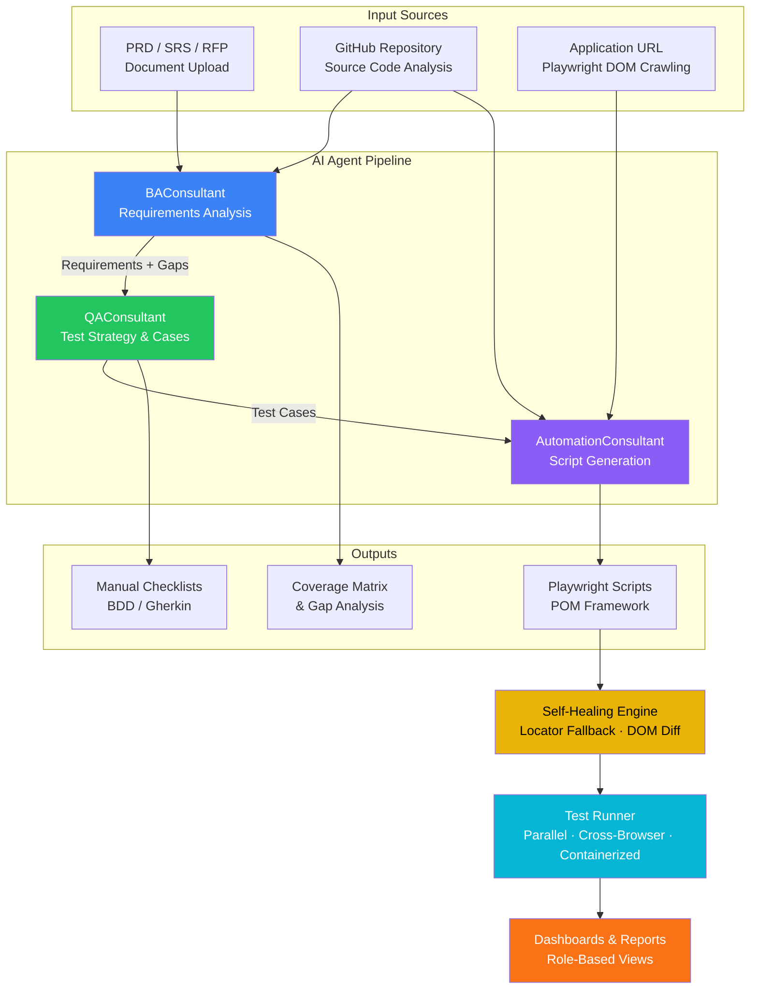

# QUALISYS

### Product Requirements Document (PRD)

**AI System Quality Assurance Platform**

---

| | |
|---|---|
| **Product** | QUALISYS — AI System Quality Assurance Platform |
| **Document Type** | Product Requirements Document (PRD) |
| **Version** | 3.0 |
| **Date** | 2026-02-15 (Updated) |
| **Author** | Azfar |
| **Status** | Approved — Ready for Architecture & Implementation |
| **Method** | BMad Method PRD Workflow |

---

> **Change Log**
>
> | Version | Date | Summary |
> |---------|------|---------|
> | **3.0** | 2026-02-15 | Added Agent Skills Integration (FR-SK1–28), Agent Extensibility & Custom Agents (FR-CA1–9), updated Growth Features and Vision sections |
> | **2.0** | 2026-02-01 | Original PRD — full product scope, functional & non-functional requirements |

---

> **Intended Audience & Stakeholder Guide**
>
> | Stakeholder | Primary Sections | Icon |
> |---|---|---|
> | **Executive / Leadership** | Parts I–II (Executive Summary, Scope & Roadmap) | :dart: |
> | **Product Manager** | Parts I–III (Overview, Scope, Platform Requirements) | :clipboard: |
> | **Architect / Tech Lead** | Parts III–V (Platform Requirements, FR, NFR) | :building_construction: |
> | **Engineering Team** | Parts IV–V (Functional & Non-Functional Requirements) | :gear: |
> | **QA / Test Lead** | Parts II, IV (Scope, Functional Requirements) | :white_check_mark: |
> | **UX Designer** | Parts II–III (Scope, RBAC, Dashboards) | :art: |
> | **Business Analyst** | Parts I–II (Overview, Scope & Roadmap) | :bar_chart: |

---

## Table of Contents

### Part I — Overview
- [1. Executive Summary](#1-executive-summary)
  - [1.1 The Core Problem](#11-the-core-problem)
  - [1.2 The Solution](#12-the-solution)
  - [1.3 What Makes This Special](#13-what-makes-this-special)
  - [1.4 Market Opportunity & Validation](#14-market-opportunity--validation)
  - [1.5 Competitive Landscape](#15-competitive-landscape)
- [2. Project Classification](#2-project-classification)
- [3. Success Criteria](#3-success-criteria)
  - [3.1 Product Success Metrics](#31-product-success-metrics)
  - [3.2 Business Metrics](#32-business-metrics)

### Part II — Product Scope & Roadmap
- [4. MVP — Minimum Viable Product](#4-mvp--minimum-viable-product)
- [5. Growth Features (Post-MVP)](#5-growth-features-post-mvp-3-6-months)
- [6. Long-Term Vision (6-12+ months)](#6-long-term-vision-6-12-months)

### Part III — Platform Requirements
- [7. Multi-Tenancy Architecture](#7-multi-tenancy-architecture)
- [8. Permissions & Roles (RBAC)](#8-permissions--roles-rbac)
- [9. Integration Requirements](#9-integration-requirements)
- [10. Compliance & Security Requirements](#10-compliance--security-requirements)

### Part IV — Functional Requirements
- [11. User Account & Access Management](#11-user-account--access-management)
- [12. Project Management](#12-project-management)
- [13. Document Ingestion & Analysis](#13-document-ingestion--analysis)
- [14. AI Agent Orchestration](#14-ai-agent-orchestration)
- [15. Test Artifact Generation](#15-test-artifact-generation)
- [16. Test Execution — Manual Testing](#16-test-execution--manual-testing)
- [17. Test Execution — Automated Testing](#17-test-execution--automated-testing)
- [18. Self-Healing Test Automation](#18-self-healing-test-automation)
- [19. Dashboards & Reporting](#19-dashboards--reporting)
- [20. Integrations](#20-integrations)
- [21. Administration & Configuration](#21-administration--configuration)
- [22. Agent Extensibility & Custom Agents (Post-MVP)](#22-agent-extensibility--custom-agents-post-mvp)
- [23. Agent Skills Integration (Post-MVP)](#23-agent-skills-integration-post-mvp)

### Part V — Non-Functional Requirements
- [24. Performance](#24-performance)
- [25. Scalability](#25-scalability)
- [26. Security](#26-security)
- [27. Reliability & Availability](#27-reliability--availability)
- [28. Integration & Interoperability](#28-integration--interoperability)
- [29. Observability](#29-observability)

### Part VI — References
- [30. References & Source Documents](#30-references--source-documents)

---
---

# Part I — Overview

---

## 1. Executive Summary

QUALISYS is an **AI System Quality Assurance Platform** that revolutionizes software testing by creating a new category — moving beyond traditional "testing tools" to provide comprehensive quality assurance for AI-powered systems and applications. The platform automates test creation, execution, and maintenance through intelligent multi-agent AI capabilities while addressing the unique challenges of testing in the AI era.

### 1.1 The Core Problem

> **Software teams spend 40% of their time on manual testing activities.** Test automation scripts break constantly with UI changes requiring constant maintenance, and test coverage gaps lead to bugs escaping to production. The fundamental issue is that **testing has not evolved to match modern development velocity** — what development teams can build in days takes testing teams weeks to validate.

| Pain Point | Impact | QUALISYS Solution |
|---|---|---|
| Manual test creation | Weeks per feature cycle | AI agents generate tests in minutes |
| Brittle test scripts | 30-50% scripts break per UI update | Self-healing automation with fallback strategies |
| Coverage gaps | Bugs escape to production | Requirements-to-test traceability matrix |
| Siloed tools | Context switching, data loss | Unified platform with role-based views |
| Slow feedback loops | Days between code commit and test results | Parallel containerized execution with real-time dashboards |

### 1.2 The Solution

QUALISYS transforms testing from a manual bottleneck into an intelligent, self-maintaining system. The platform:

1. **Ingests** requirements documents (PRDs, SRS, RFPs), crawls application UI and APIs via Playwright, and analyzes source code from repositories
2. **Generates** comprehensive test artifacts using 7 specialized AI agents (3 MVP + 4 Post-MVP) — from manual test checklists to automated Playwright/Puppeteer scripts
3. **Self-heals** when application UI changes cause tests to fail — automatically detecting changes, proposing fixes, and updating test scripts

> **The "5-Minute Value Moment"** — Users upload their PRD, connect their app URL and GitHub repo, select AI agents to run, and within minutes receive generated test suites (manual checklists + automated Playwright scripts) ready to execute. The time from project setup to running first automated tests collapses from **weeks to minutes**.

**Target Users:**

| Persona | Primary Value |
|---|---|
| **PM / CSM** | Project oversight, SLA compliance, executive dashboards |
| **Manual Test Engineer** | Guided test execution with evidence capture |
| **Automation Engineer** | AI-generated scripts with self-healing capabilities |
| **SRE / Platform Engineer** | Infrastructure monitoring and performance testing |
| **BA / Product Owner** | Requirements traceability and test coverage visibility |

**Beachhead Market:** Software development organizations including software houses, freelance development teams, and companies with in-house application development teams — any organization with PMs, CSMs, BAs, Product Owners, Developers, and QA/SQA engineers actively building and testing software applications.

**Go-to-Market Strategy:** Integration-first — connect with existing platforms (Testworthy, TestRail, JIRA) to import test plans, user stories, bugs, and manual test cases. Reduces adoption friction by fitting into existing workflows rather than requiring wholesale tool replacement.

### 1.3 What Makes This Special

QUALISYS combines **three breakthrough capabilities** that no existing solution offers together:

| # | Capability | Description |
|---|---|---|
| **1** | **Multi-Agent AI System** | 7 specialized AI agents (3 MVP + 4 Post-MVP) work in orchestrated pipelines with user-selectable workflows. Post-MVP extensibility enables admin-configured custom agents per client and a progressive skill-based architecture for cost-optimized invocations. |
| **2** | **Self-Healing Test Automation** | When application changes break tests, QUALISYS automatically detects DOM changes, proposes patched selectors using multiple fallback strategies (CSS/XPath, text anchors, accessibility labels, visual anchors), and updates tests with versioned audit trails. |
| **3** | **End-to-End Testing Lifecycle** | Unlike point solutions focused only on test generation OR execution OR management, QUALISYS covers the complete lifecycle — from ingesting requirements, to generating artifacts, to executing tests across browsers, to executive dashboards with KPIs and SLA monitoring. |

**MVP Agents (3):**

| Agent | Responsibility |
|---|---|
| **BAConsultant** | Requirements analysis, gap/ambiguity detection, coverage matrix, user story quality scoring |
| **QAConsultant** | Test strategy, manual checklists, BDD/Gherkin scenarios, negative/boundary tests, synthetic data |
| **AutomationConsultant** | Playwright/Puppeteer script generation, POM/Data-Driven frameworks, DOM crawling, CI/CD integration |

**Post-MVP Agents (4):**

| Agent | Responsibility |
|---|---|
| **AI Log Reader/Summarizer** | Application log analysis and failure pattern detection |
| **Security Scanner Orchestrator** | Security vulnerability scanning and compliance validation |
| **Performance/Load Agent** | Load testing, performance profiling, and SLA validation |
| **DatabaseConsultant** | Database testing, data integrity validation, query optimization |

#### Multi-Agent Orchestration Flow

### 1.4 Market Opportunity & Validation

| Metric | Value | Significance |
|---|---|---|
| **Market Size (2025)** | $1.01B | AI-enabled testing market |
| **Projected Size (2032)** | $3.82B | 20.9% CAGR — **25% faster** than traditional testing (16.8%) |
| **Annual Enterprise Loss** | $1.9B | Lost to undetected LLM failures and AI system bugs |
| **LLM Applications (2025)** | 750M | Massive wave creating urgent testing demand |
| **AI in Testing Adoption** | 81% | Of development teams now use AI in testing workflows |
| **IT Budget Allocation** | 40% | Allocated to AI testing infrastructure |

> **Market Timing:** Companies are moving from experimental AI to mission-critical AI deployments. AI failures don't just lose customers — they destroy trust permanently, trigger compliance violations, and cause real-world harm. **First company to solve AI System QA owns the category.**

### 1.5 Competitive Landscape

| Competitor | Threat Level | Strengths | QUALISYS Advantage |
|---|---|---|---|
| **DeepEval / Confident AI** | :red_circle: Critical | 500K downloads, 14+ metrics, Enterprise (Microsoft, BCG) | Full testing lifecycle, not just evaluation; production monitoring; team collaboration |
| **Braintrust** | :orange_circle: Growing | Strong ROI ("30% accuracy in weeks"), freemium model | Multi-agent AI (7 agents), self-healing automation, integration-first adoption |
| **Humanloop** | :green_circle: Opportunity | Being acquired by Anthropic, sunsetting Sep 2025 | Independent platform — enterprises need alternative to vendor-locked solutions |
| **Selenium / Cypress** | :yellow_circle: Indirect | Established user base, open source | Built for AI systems from ground up, not bolt-on AI features |

> **Strategic Positioning:** While competitors focus on "AI testing tools" or "LLM evaluation," QUALISYS creates the **"AI System Quality Assurance" category** — comprehensive QA for the non-deterministic era.

---

## 2. Project Classification

| Dimension | Value |
|---|---|
| **Technical Type** | SaaS B2B Platform (Multi-tenant Enterprise) |
| **Domain** | General Software Testing (Medium Complexity) |
| **Complexity** | Medium |
| **Frontend** | Vite + React 18 + TypeScript + Tailwind CSS + shadcn/ui |
| **Backend** | Python 3.11+ FastAPI + LangChain + SQLAlchemy 2.x |
| **Database** | PostgreSQL 15+ with pgvector (embeddings) |
| **Infrastructure** | Kubernetes (EKS/AKS) + Containerized Playwright Runners |
| **LLM** | Ollama (dev) / vLLM (prod) + OpenAI + Anthropic (fallback) |

QUALISYS is a multi-tenant SaaS platform serving enterprise B2B customers in the software testing domain. The platform requires multi-tenancy architecture with strict data isolation, role-based access control (RBAC), SSO integration, and enterprise-grade security and compliance measures.

The platform processes diverse inputs (PDF/Word documents, source code, live application UIs) and generates complex outputs (BDD scenarios, executable test scripts, performance test harnesses).

---

## 3. Success Criteria

> **What Winning Looks Like:** QUALISYS becomes the category-defining AI-powered testing platform that software teams trust to accelerate testing velocity while maintaining quality. Success means engineering teams spend less time on test maintenance and more time building features, while achieving better test coverage and catching bugs before production.

### 3.1 Product Success Metrics

**Activation & Value Delivery:**

1. **Time to First Test Suite Generated:** <10 minutes from project creation to first generated test artifacts
   - *Why this matters:* Validates the "instant value" promise - users see concrete output immediately
   - *Target:* 90% of projects generate test suite within 10 minutes
   - *Measurement:* Track time from project creation to first test artifact generation

2. **Test Maintenance Time Reduction:** 70% reduction in time spent fixing broken tests
   - *Why this matters:* Self-healing automation's core value proposition
   - *Target:* Users report 70% less time on test maintenance after 30 days
   - *Measurement:* User surveys + time tracking in platform (manual fixes vs auto-healed)

3. **Test Coverage Improvement:** 40% increase in requirements coverage after 60 days
   - *Why this matters:* AI-generated tests should find gaps humans miss
   - *Target:* Coverage metrics improve from baseline by 40%+
   - *Measurement:* Requirements-to-test-cases traceability matrix

4. **Adoption Across Roles:** All 3+ target personas (PM, Manual QA, Automation QA) actively using platform
   - *Why this matters:* Proves cross-functional value, not just automation engineers
   - *Target:* 80% of paying teams have 3+ different role types active weekly
   - *Measurement:* Role-based usage analytics

**Retention & Expansion:**

5. **Monthly Retention:** >85% month-over-month retention for paid teams
   - *Why this matters:* Proves sticky value and product-market fit
   - *Target:* <15% monthly churn
   - *Measurement:* Cohort retention analysis

6. **Self-Healing Success Rate:** 80% of test failures auto-fixed without human intervention
   - *Why this matters:* Validates the core technical innovation
   - *Target:* 80% of UI-change-related test failures resolved automatically
   - *Measurement:* Auto-fix success rate tracking in platform

### 3.2 Business Metrics

1. **Pricing Model:** To be determined by management (deferred to later phase)

2. **Market Penetration:** 100 paying teams in first 12 months
   - *Composition:* 60% software houses, 20% mid-size product companies, 20% freelance/consulting
   - *Average team size:* 8-15 users per paying team

3. **Integration Adoption:** 70% of teams connect at least one integration (JIRA, TestRail, Testworthy)
   - *Why this matters:* Integration usage indicates workflow adoption depth
   - *Measurement:* % of teams with active integrations

---
---

# Part II — Product Scope & Roadmap

> :dart: **Stakeholders:** Executive, Product Manager, QA Lead, Business Analyst

### Product Scope Roadmap

---

## 4. MVP — Minimum Viable Product

**Goal:** Prove the core value proposition - AI agents can generate useful test artifacts and self-healing automation reduces maintenance burden.

**Target Timeline:** First production-ready version (phased rollout over 6-10 weeks per technical doc)

**Core Capabilities:**

**1. Project & Role Management**
- Multi-tenant project creation with user invites and role assignments
- RBAC with roles: Owner/Admin, PM/CSM, QA-Manual, QA-Automation, Dev, Viewer
- Basic SSO support (OAuth/SAML) for enterprise authentication

**2. Intelligent Ingestion**
- **Document Parsing**: Upload PRD, SRS, RFP, specification documents (PDF, MS Word, Markdown)
- **Source Code Reader**: Connect GitHub repo (read-only token), parse routes/APIs/components, collect manifests
- **DOM Crawler**: Playwright-based crawler to capture site map, pages, forms, dynamic flows, handle auth cookies

**3. Multi-Agent Test Generation (MVP Agents)**
- **BAConsultant AI Agent**: Requirements analysis, gap/ambiguity detection, coverage matrix, user story creation with quality scoring
- **QAConsultant AI Agent**: Test strategy, manual test checklists, BDD/Gherkin scenarios, negative/boundary tests, checklist-driven testing (Smoke, Sanity, Integration, Regression, Usability, UAT), synthetic test data generation, sprint readiness validation
- **AutomationConsultant AI Agent**: Playwright/Puppeteer/REST-Assured script generation, framework architecture (POM/Data-Driven/Hybrid), DOM crawling and application discovery, automation suite management, CI/CD integration
- Agent Selection UI: User picks agents or orchestrates simple pipelines

**4. Test Execution Infrastructure**
- **Playwright Script Generation**: Smart locators, selectable browsers (Chromium/Firefox/WebKit)
- **Test Runner**: Parallel execution, cross-browser, headless/headful options
- **Manual Test Runner**: Checklist UI with evidence capture (screenshots/video), link defects
- **Containerized Runners**: Playwright OCI containers with basic autoscaling

**5. Self-Healing (Core POC)**
- Locator fallback strategies: CSS/XPath + text anchors + accessibility labels
- DOM-change detection: Store page fingerprints, on failure propose patched selectors
- Versioned test artifacts with audit trail of automatic fixes
- PM approval required before applying fixes to production tests

**6. Reporting & Dashboards (Basic)**
- **PM/CSM Dashboard**: Project health, test coverage %, test execution velocity, P1/P2 defect leakage
- **QA Dashboard**: Current test runs, failing suites, flaky tests, environment status
- **PDF Reports**: Exportable test execution reports
- **Slack Notifications**: Test run completion, failures, SLA breaches

**7. Essential Integrations**
- **JIRA**: Create defects automatically from test failures, link test cases to issues
- **TestRail/Testworthy**: Import test plans and test cases, sync execution results
- **GitHub**: PR comments with test results
- **Slack**: Notifications and basic ChatOps

**NOT in MVP:**
- ❌ Post-MVP AI agents (AI Log Reader/Summarizer, Security Scanner Orchestrator, Performance/Load Agent, DatabaseConsultant AI Agent)
- ❌ Full self-healing with ML-suggested selectors (basic rules-based only)
- ❌ Advanced SLA monitoring with auto-alerts
- ❌ Cost-per-test analytics
- ❌ Agent Skills progressive disclosure optimization (Epic 7 — Post-MVP)
- ❌ Admin-configured custom agents per client (Epic 6 Phase 3 — Post-MVP)
- ❌ Agent marketplace (depends on Agent SDK & Registry — Epic 6 Phase 3)
- ❌ On-premise deployment option
- ❌ SOC2 certification (target for Growth phase)

---

## 5. Growth Features (Post-MVP, 3-6 months)

**Phase 1: Complete Multi-Agent Suite (Epic 6 Phase 1)**
- Add remaining agents: AI Log Reader/Summarizer, Security Scanner Orchestrator, Performance/Load Agent, DatabaseConsultant AI Agent
- Agent pipeline orchestration: Create complex multi-step workflows
- Agent performance metrics and optimization

**Phase 2: Advanced Self-Healing**
- ML-suggested robust selectors using computer vision
- Visual anchors and visual regression detection
- Automatic rerun with smart retry strategies
- Confidence scoring for proposed fixes

**Phase 3: Enterprise Features (Epic 6 Phase 2)**
- Advanced SLA monitoring with automated breach alerts
- Cost tracking per test/story point
- Custom RBAC roles with granular permissions
- Advanced compliance features (SOC2 preparation, audit logs)
- Scheduled email report summaries

**Phase 4: Agent Extensibility & Custom Agents (Epic 6 Phase 3)**
- **Agent Registry Service**: Runtime agent registration and discovery (no code deployment for new agents)
- **Per-Tenant Agent Customization**: Admin-configured custom agent behavior per client — prompt customization, output template overrides, enable/disable per organization
- **Agent Isolation & Circuit Breakers**: Per-agent fault containment with token budgets, timeouts, and circuit breaker patterns
- **Agent Prompt Versioning**: Semantic versioning with gradual rollout (percentage-based tenant bucketing)
- Agent SDK (TypeScript/Python) for community-created agents
- Agent Marketplace (discovery, ratings, revenue share)

**Phase 5: Agent Skills Integration (Epic 7)**
- **Progressive Disclosure Model**: Three-level skill loading (Metadata ~100 tokens → Instructions ~2,000 tokens → Resources ~500 tokens) for 40–60% token cost reduction per agent invocation
- **Skill Registry Service**: Centralized skill metadata, discovery, and lifecycle management
- **Skill Proxy Service**: Skill execution via Claude API with tenant-scoped resource limits
- **Skill Adapter Library**: Python package bridging LangChain and Claude API Skills format
- **21 Custom Skills**: Covering all 7 QUALISYS agents (9 MVP agent skills + 12 post-MVP agent skills)
- **Governance Extensions**: Skill approval workflows, execution gates, risk classification (low/medium/high)
- **Zero Regression Guarantee**: Full-context fallback if skills unavailable — skills optimize, never hard-depend

**Phase 6: Enhanced Integrations**
- CI/CD: GitHub Actions, GitLab CI deep integration
- More test management tools: Zephyr, Xray, PractiTest
- APM tools: DataDog, New Relic for test correlation
- MS Teams ChatOps

**Phase 7: Intelligence & Analytics**
- Test effectiveness scoring (which tests find the most bugs)
- Flakiness detection and auto-quarantine
- Predictive analytics: Risk-based test selection
- Test optimization recommendations

---

## 6. Long-Term Vision (6-12+ months)

> **Goal:** Become the intelligent testing co-pilot that eliminates manual testing toil entirely.

**Strategic Initiatives:**

**1. Autonomous Testing**
- AI agents that understand application intent and generate tests proactively
- Self-evolving test suites that adapt to code changes automatically
- Zero-configuration testing for common frameworks (React, Vue, Angular)

**2. Vertical-Specific Agents**
- E-commerce testing agent (checkout flows, payment validation, cart abandonment)
- Healthcare compliance agent (HIPAA validation, patient data handling)
- Fintech security agent (PCI-DSS compliance, fraud detection testing)

**3. Developer Experience**
- IDE plugins (VSCode, IntelliJ) for local test generation
- CLI tool for CI/CD integration without platform UI
- Agent SDK (TypeScript/Python) for custom agent development

**4. Community & Ecosystem**
- Agent marketplace: Share and download community-created agents
- Admin-configured custom agents per client request (no code deployment)
- Agent Skills framework for modular, cost-optimized agent capabilities
- Open-source core agents with premium enterprise features
- API-first platform for third-party integrations

**5. Predictive Quality Insights**
- ML models that predict which code changes are high-risk
- Automated test prioritization based on risk
- Quality forecasting: "With current test coverage, X% chance of production bug"

---
---

# Part III — Platform Requirements

> :building_construction: **Stakeholders:** Architect, Tech Lead, Product Manager, Security

---

## 7. Multi-Tenancy Architecture

**Tenant Isolation:**
- Each customer organization is a separate tenant with complete data isolation
- Hard separation at database level: separate schemas or logical partitioning per tenant
- No cross-tenant data leakage: Customer A cannot access Customer B's projects, test results, or configuration
- Tenant-scoped API keys and authentication tokens

**Tenant Onboarding:**
- Self-service signup: Email/password or SSO (Google OAuth, SAML)
- Organization creation: First user creates organization and becomes Owner/Admin
- Team invites: Admin invites team members via email with role assignment
- Onboarding wizard: Guide new tenants through first project setup

## 8. Permissions & Roles (RBAC)

**MVP Roles:**

1. **Owner/Admin**
   - Full platform access including billing, user management, and all project operations
   - Can create/delete projects, invite/remove users, assign roles
   - Can configure integrations and organization-wide settings

2. **PM/CSM** (Project Manager / Customer Success Manager)
   - Project oversight: View all projects, test execution status, SLA dashboards
   - Cannot modify test configurations or execute tests
   - Can generate and export reports

3. **QA-Manual** (Manual Test Engineer)
   - Execute manual test checklists with evidence capture
   - Cannot generate or modify automated test scripts
   - Can file defects and link to test cases

4. **QA-Automation** (Automation Engineer)
   - Generate and execute automated tests
   - Modify test scripts and locator strategies
   - Configure self-healing rules and approve auto-fixes

5. **Dev** (Developer)
   - View test results related to their code changes
   - Run tests on demand for verification
   - Cannot modify test configurations

6. **Viewer**
   - Read-only access to dashboards and reports
   - Cannot execute tests or modify any configuration

**Permission Matrix:**

| Action | Owner/Admin | PM/CSM | QA-Manual | QA-Automation | Dev | Viewer |
|--------|-------------|--------|-----------|---------------|-----|--------|
| Create projects | ✅ | ❌ | ❌ | ❌ | ❌ | ❌ |
| Invite users | ✅ | ❌ | ❌ | ❌ | ❌ | ❌ |
| Manage billing | ✅ | ❌ | ❌ | ❌ | ❌ | ❌ |
| View dashboards | ✅ | ✅ | ✅ | ✅ | ✅ | ✅ |
| Generate reports | ✅ | ✅ | ✅ | ✅ | ❌ | ❌ |
| Execute manual tests | ✅ | ❌ | ✅ | ✅ | ❌ | ❌ |
| Generate test scripts | ✅ | ❌ | ❌ | ✅ | ❌ | ❌ |
| Execute automated tests | ✅ | ❌ | ❌ | ✅ | ✅ | ❌ |
| Modify test scripts | ✅ | ❌ | ❌ | ✅ | ❌ | ❌ |
| Approve self-healing fixes | ✅ | ✅ | ❌ | ✅ | ❌ | ❌ |
| Configure integrations | ✅ | ❌ | ❌ | ❌ | ❌ | ❌ |

## 9. Integration Requirements

**MVP Integrations (Essential for workflow adoption):**

**1. Issue Tracking**
- **JIRA**: Bi-directional sync
  - Import: User stories, bugs, test requirements from JIRA → QUALISYS projects
  - Export: Test failures auto-create JIRA issues with evidence (screenshots, logs, steps)
  - Link: Test cases linked to JIRA issues for traceability
- **GitHub Issues**: Similar capabilities for teams using GitHub-native workflows

**2. Test Management Platforms**
- **TestRail**: Bi-directional sync
  - Import: Existing test plans, test suites, test cases → QUALISYS
  - Export: QUALISYS-generated tests → TestRail
  - Sync: Test execution results back to TestRail
- **Testworthy**: Similar import/export/sync capabilities
- **Mapping**: Preserve test case IDs, folder structure, and metadata during import

**3. Version Control**
- **GitHub**:
  - Import: Clone repos (read-only token), analyze source code for test generation
  - PR Integration: Post test results as PR comments, block merges on test failures
  - Webhooks: Trigger test runs on push/PR events

**4. Communication**
- **Slack**:
  - Notifications: Test run completion, failures, SLA breaches
  - ChatOps: Basic commands to trigger tests, view status
  - Channels: Route notifications to project-specific channels

**Growth Phase Integrations:**
- GitLab (version control and CI/CD)
- Azure DevOps (end-to-end ALM)
- Zephyr, Xray, PractiTest (additional test management tools)
- MS Teams (communication alternative to Slack)
- DataDog, New Relic (APM correlation)

## 10. Compliance & Security Requirements

**MVP Security:**

1. **Authentication & Authorization**
   - OAuth 2.0 for Google SSO
   - SAML 2.0 for enterprise SSO (Okta, Azure AD)
   - Password requirements: Min 12 characters, complexity rules
   - Session management: JWT tokens, 7-day expiry with refresh tokens
   - MFA support: TOTP-based two-factor authentication (optional)

2. **Data Encryption**
   - In transit: TLS 1.3 for all API and web traffic
   - At rest: AES-256 encryption for sensitive data (API keys, credentials, test artifacts)
   - Database encryption: Encrypted PostgreSQL storage

3. **Data Privacy**
   - Data retention policies: Configurable per tenant (30/90/180/365 days)
   - Data deletion: Complete tenant data wipe within 30 days of account deletion
   - GDPR compliance: Data export (JSON/CSV), right to be forgotten
   - PII redaction: Auto-detect and mask sensitive data in logs and screenshots

4. **Secrets Management**
   - API keys and credentials encrypted with separate key management
   - Never log or expose secrets in UI, logs, or error messages
   - Secure credential vault for storing test auth credentials (OAuth tokens, cookies)

**Growth Phase Compliance:**

1. **SOC 2 Type II Certification** (Target: Month 9)
   - Security controls audit
   - Annual recertification
   - Public SOC 2 report available to Enterprise customers

2. **ISO 27001** (Optional, Enterprise demand-driven)
   - Information security management system
   - Enterprise customers in regulated industries may require

3. **On-Premise Deployment** (Enterprise feature)
   - Container/Kubernetes deployment for customer infrastructure
   - Air-gapped environments for high-security customers
   - Customer owns and manages data entirely

---
---

# Part IV — Functional Requirements

> :gear: **Stakeholders:** Engineering Team, Architect, QA Lead, Product Manager

> **CRITICAL:** This section defines ALL capabilities the product must have. Every capability discussed in vision, scope, and platform requirements MUST be represented as an FR. Missing FRs = missing capabilities.

---

## 11. User Account & Access Management

| FR ID | Requirement | Actor |
|---|---|---|
| **FR1** | Users can create accounts with email/password or Google SSO | User |
| **FR2** | Users can create organizations and become the first Owner/Admin | User |
| **FR3** | Users can log in securely with session persistence across devices | User |
| **FR4** | Users can reset passwords via email verification workflow | User |
| **FR5** | Users can enable two-factor authentication (TOTP) for their accounts | User |
| **FR6** | Admins can invite team members to organization via email with role assignment | Admin |
| **FR7** | Invited users can accept invitations and join organization | User |
| **FR8** | Admins can remove users from organization | Admin |
| **FR9** | Admins can change user roles within organization | Admin |
| **FR10** | Users can configure their profile information and notification preferences | User |

## 12. Project Management

| FR ID | Requirement | Actor |
|---|---|---|
| **FR11** | Users can create new test projects within their organization | Admin / PM |
| **FR12** | Users can configure project settings (name, description, app URL, repo link) | Admin / PM |
| **FR13** | Users can assign team members to projects with role-based access | Admin |
| **FR14** | Users can archive or delete projects | Admin |
| **FR15** | Users can view list of all projects with status and health indicators | All Roles |

## 13. Document Ingestion & Analysis

| FR ID | Requirement | Type |
|---|---|---|
| **FR16** | Users can upload requirement documents (PDF, Word, Markdown) to projects | Document |
| **FR17** | System parses uploaded documents and extracts text content | Document |
| **FR18** | System generates embeddings for document content and stores in vector database | Document |
| **FR19** | Users can connect GitHub repositories with read-only access tokens | Code |
| **FR20** | System clones connected repositories and analyzes source code structure | Code |
| **FR21** | System maps application routes, API endpoints, and components from source code | Code |
| **FR22** | Users can provide application URLs for DOM crawling | DOM |
| **FR23** | System crawls application using Playwright to capture page structure, forms, and flows | DOM |
| **FR24** | System handles authentication flows (login, cookies) during crawling | DOM |
| **FR25** | Users can view ingested content summary (documents, code files, pages crawled) | All |

## 14. AI Agent Orchestration

| FR ID | Requirement |
|---|---|
| **FR26** | Users can select which AI agents to run on their project |
| **FR27** | System provides agent descriptions and capabilities for informed selection |
| **FR28** | Users can create agent execution pipelines (sequential or parallel workflows) |
| **FR29** | System executes selected agents with project context (documents, code, DOM) |
| **FR30** | Users can view agent execution progress and status in real-time |
| **FR31** | System stores agent outputs (coverage matrices, test cases, scripts) as project artifacts |

## 15. Test Artifact Generation

| FR ID | Agent | Requirement |
|---|---|---|
| **FR32** | BAConsultant | Analyzes requirements, performs gap/ambiguity detection, generates requirements-to-test coverage matrix with user story quality scoring. Dual-review approval required before downstream release |
| **FR33** | QAConsultant | Generates manual test checklists with step-by-step instructions (Smoke, Sanity, Integration, Regression, Usability, UAT) |
| **FR34** | QAConsultant | Generates exploratory testing prompts, BDD/Gherkin scenarios, negative test cases, boundary tests, and synthetic test data |
| **FR35** | AutomationConsultant | Generates automated test scripts (Playwright, Puppeteer, REST-Assured) with smart locators and framework support (POM, Data-Driven, Hybrid) |
| **FR36** | QAConsultant | Creates test strategy documents, test plans, and validates sprint readiness |
| **FR37** | AutomationConsultant | Performs automated DOM crawling, sitemap generation, and coverage gap detection |
| **FR38** | — | Users can view all generated test artifacts organized by type and agent |
| **FR39** | — | Users can edit generated test artifacts before execution |
| **FR40** | — | Users can version and track changes to test artifacts |

## 16. Test Execution — Manual Testing

| FR ID | Requirement |
|---|---|
| **FR41** | Manual testers can view assigned manual test checklists |
| **FR42** | Manual testers can execute test steps one-by-one with pass/fail/skip status |
| **FR43** | Manual testers can capture screenshots as evidence during manual testing |
| **FR44** | Manual testers can record video of test execution sessions |
| **FR45** | Manual testers can add notes and observations to test steps |
| **FR46** | Manual testers can mark tests as passed, failed, or blocked with reason |
| **FR47** | Manual testers can file defects directly from failed test steps |
| **FR48** | System links defects to test cases for traceability |

## 17. Test Execution — Automated Testing

| FR ID | Requirement |
|---|---|
| **FR49** | Users can execute generated Playwright scripts on-demand |
| **FR50** | Users can select target browsers for test execution (Chromium, Firefox, WebKit) |
| **FR51** | Users can configure test execution modes (headless vs headful) |
| **FR52** | System runs automated tests in parallel for faster execution |
| **FR53** | System executes tests in isolated containerized environments |
| **FR54** | Users can view real-time test execution progress and logs |
| **FR55** | System captures screenshots and videos of automated test runs |
| **FR56** | System stores test execution results with pass/fail status and error details |
| **FR57** | Users can re-run failed tests individually or in batch |

## 18. Self-Healing Test Automation

| FR ID | Requirement |
|---|---|
| **FR58** | System stores multiple locator strategies for each UI element (CSS, XPath, text, ARIA) |
| **FR59** | System detects when automated tests fail due to DOM changes |
| **FR60** | System captures page fingerprints to compare against known good states |
| **FR61** | System proposes alternative locators when primary locators fail |
| **FR62** | System shows confidence scores for proposed selector fixes |
| **FR63** | Automation engineers can review and approve proposed self-healing fixes |
| **FR64** | System applies approved fixes and re-runs affected tests automatically |
| **FR65** | System maintains audit trail of all auto-fixes with before/after comparisons |
| **FR66** | PMs/Admins can configure approval workflows for production test fixes |

## 19. Dashboards & Reporting

| FR ID | Requirement | Dashboard |
|---|---|---|
| **FR67** | PM/CSM users can view project health dashboard with key metrics | PM/CSM |
| **FR68** | Dashboard shows test coverage percentage by requirements | PM/CSM |
| **FR69** | Dashboard shows test execution velocity (tests run per day/week) | PM/CSM |
| **FR70** | Dashboard shows P1/P2 defect leakage rates | PM/CSM |
| **FR71** | Dashboard shows SLA compliance status with trend indicators | PM/CSM |
| **FR72** | QA users can view test execution dashboard with current runs | QA |
| **FR73** | QA dashboard shows failing test suites and flaky tests | QA |
| **FR74** | QA dashboard shows environment status and runner availability | QA |
| **FR75** | Users can filter dashboard metrics by date range, project, or test type | All |
| **FR76** | Users can export dashboards and reports as PDF documents | All |
| **FR77** | System sends scheduled email summaries of key metrics (configurable frequency) | All |

## 20. Integrations

### 20.1 JIRA

| FR ID | Requirement | Direction |
|---|---|---|
| **FR78** | Admins can connect JIRA instances with API credentials | Setup |
| **FR79** | Users can import JIRA issues (user stories, bugs) into QUALISYS projects | Import |
| **FR80** | System maps JIRA issue types to QUALISYS test requirements | Import |
| **FR81** | Users can link test cases to JIRA issues for bi-directional traceability | Bi-directional |
| **FR82** | System automatically creates JIRA issues when tests fail | Export |
| **FR83** | System includes test failure evidence (screenshots, logs, steps) in JIRA issues | Export |
| **FR84** | System updates JIRA issue status when linked tests pass | Export |

### 20.2 TestRail / Testworthy

| FR ID | Requirement | Direction |
|---|---|---|
| **FR85** | Admins can connect TestRail/Testworthy instances with API credentials | Setup |
| **FR86** | Users can import test plans, suites, and cases from TestRail/Testworthy | Import |
| **FR87** | System preserves test case IDs and folder structure during import | Import |
| **FR88** | Users can export QUALISYS-generated tests to TestRail/Testworthy | Export |
| **FR89** | System syncs test execution results back to TestRail/Testworthy | Export |
| **FR90** | System maintains bi-directional sync to keep platforms aligned | Bi-directional |

### 20.3 GitHub

| FR ID | Requirement | Direction |
|---|---|---|
| **FR91** | Users can connect GitHub repositories with read-only access tokens | Setup |
| **FR92** | System posts test execution results as comments on pull requests | Export |
| **FR93** | Users can configure test success/failure as PR merge gate | Export |
| **FR94** | System triggers test runs automatically on push or PR events (webhook) | Import |
| **FR95** | Users can view test results directly in GitHub PR interface | Export |

### 20.4 Slack

| FR ID | Requirement | Direction |
|---|---|---|
| **FR96** | Admins can connect Slack workspaces via OAuth | Setup |
| **FR97** | Users can configure which Slack channels receive notifications | Setup |
| **FR98** | System sends test run completion notifications to Slack | Export |
| **FR99** | System sends test failure alerts with summary and links to Slack | Export |
| **FR100** | System sends SLA breach alerts to Slack | Export |
| **FR101** | Users can trigger basic test runs via Slack commands (ChatOps) | Import |

## 21. Administration & Configuration

| FR ID | Requirement | Actor |
|---|---|---|
| **FR102** | Admins can configure organization-wide settings (name, logo, domain) | Admin |
| **FR103** | Admins can manage billing and subscription (when pricing model defined) | Admin |
| **FR104** | Admins can view usage analytics (tests run, storage consumed, agent executions) | Admin |
| **FR105** | Admins can configure data retention policies for their organization | Admin |
| **FR106** | Admins can export all organization data for backup or migration | Admin |
| **FR107** | Admins can delete organization and all associated data | Admin |
| **FR108** | System provides audit logs of all administrative actions | System |
| **FR109** | Users can configure notification preferences (email, Slack, frequency) | User |
| **FR110** | Users can manage their connected integrations and API keys | User |

## 22. Agent Extensibility & Custom Agents (Post-MVP — Epic 6 Phase 3)

> **Scope:** Runtime agent registration, per-tenant customization, fault isolation, and prompt versioning.

| FR ID | Requirement | Scope |
|---|---|---|
| **FR-CA1** | Platform admins can register new agent definitions at runtime via API or admin UI without code deployment | Registry |
| **FR-CA2** | Platform admins can manage agent lifecycle (enable, disable, deprecate, retire) through the Agent Registry Service | Registry |
| **FR-CA3** | Tenant admins can enable or disable specific agents for their organization, hiding disabled agents from discovery | Tenant Config |
| **FR-CA4** | Tenant admins can customize agent behavior with organization-specific prompt instructions (append, prepend, or replace modes) | Tenant Config |
| **FR-CA5** | Tenant admins can override LLM provider and model selection per agent per organization (from platform-configured providers only) | Tenant Config |
| **FR-CA6** | System enforces per-agent fault isolation with configurable token budgets, hard timeouts, and circuit breaker patterns | Isolation |
| **FR-CA7** | Platform admins can version agent prompts using semantic versioning with gradual rollout (percentage-based tenant bucketing) | Versioning |
| **FR-CA8** | System provides Agent Registry discovery API returning tenant-scoped and role-filtered agent metadata | API |
| **FR-CA9** | All agent configuration changes, version deployments, and circuit breaker events are audit-logged with timestamps and actor identity | Audit |

## 23. Agent Skills Integration (Post-MVP — Epic 7)

> **Scope:** Progressive skill loading for 40-60% token cost reduction, skill registry, proxy execution, adapter library, and governance.

**Skill Registry (FR-SK1–7):**

| FR ID | Requirement |
|---|---|
| **FR-SK1** | System shall maintain a centralized skill registry storing metadata (name, description, version, agent_id, risk_level, tags) |
| **FR-SK2** | System shall expose REST API for skill CRUD operations with tenant-scoped access control |
| **FR-SK3** | System shall support skill discovery by agent_id, returning only skills mapped to the requesting agent |
| **FR-SK4** | System shall enforce semantic versioning (major.minor.patch) for all skills |
| **FR-SK5** | System shall support skill deprecation with 30-day notice period and migration guidance |
| **FR-SK6** | System shall prevent skill deletion when active references exist |
| **FR-SK7** | System shall support skill tagging for RAG pre-fetching optimization |

**Skill Proxy & Execution (FR-SK8–14):**

| FR ID | Requirement |
|---|---|
| **FR-SK8** | System shall execute custom skills via LLM provider's skill execution API, supporting up to 8 skills per request |
| **FR-SK9** | System shall translate QUALISYS agent context (ProjectContext, tenant_id, RAG results) into Claude API format |
| **FR-SK10** | System shall handle skill execution timeouts (configurable, default 120s) with graceful degradation |
| **FR-SK11** | System shall implement retry logic with exponential backoff for transient Claude API failures |
| **FR-SK12** | System shall route skill execution through tenant-scoped resource limits (max concurrent skills per tenant) |
| **FR-SK13** | System shall support skill fallback — if skill execution fails, agent falls back to full-context mode |
| **FR-SK14** | System shall log all skill executions with skill_id, agent_id, tenant_id, tokens_used, execution_time_ms, status |

**Skill Adapter Library (FR-SK15–18):**

| FR ID | Requirement |
|---|---|
| **FR-SK15** | Library shall provide a skill adapter component compatible with the AgentOrchestrator interface |
| **FR-SK16** | Library shall translate LangChain context objects to Claude API skill invocation format |
| **FR-SK17** | Library shall translate Claude API skill responses back to LangChain-compatible format |
| **FR-SK18** | Library shall support skill chaining — output of Skill A available as input to Skill B within same invocation |

**Governance & Approvals (FR-SK19–23):**

| FR ID | Requirement |
|---|---|
| **FR-SK19** | System shall classify skills by risk level: low (auto-approved), medium (QA-Automation approval), high (Architect/DBA approval) |
| **FR-SK20** | System shall require deployment approval for new skills and major version updates |
| **FR-SK21** | System shall require pre-execution approval for high-risk skills (e.g., DatabaseConsultant schema validation) |
| **FR-SK22** | System shall integrate skill approvals into existing approval dashboard UI |
| **FR-SK23** | System shall support skill execution approval exemptions for pre-approved skill+context combinations |

**Orchestrator Integration (FR-SK24–28):**

| FR ID | Requirement |
|---|---|
| **FR-SK24** | AgentOrchestrator shall discover available skills for the current agent before invocation |
| **FR-SK25** | AgentOrchestrator shall select relevant skills based on task context (document type, agent stage, project domain) |
| **FR-SK26** | AgentOrchestrator shall pass selected skill metadata in the agent's context initialization |
| **FR-SK27** | AgentOrchestrator shall support mixed execution — some capabilities via skills, others via existing agent logic |
| **FR-SK28** | AgentOrchestrator shall maintain backward compatibility — agents function identically with skills disabled |

---
---

# Part V — Non-Functional Requirements

> :gear: **Stakeholders:** Architect, Engineering Team, SRE/Platform, Security

### NFR Quick Reference

| Category | Key Targets |
|---|---|
| **Performance** | Test gen <5 min, Dashboard <3s, API P95 <500ms, LLM P95 <5s |
| **Scalability** | 500 tenants, 25K users, 10K tests/day, 100+ concurrent runners |
| **Security** | TLS 1.3, AES-256, OAuth 2.0 + SAML 2.0, MFA, RBAC at API level |
| **Reliability** | 99.5% uptime (MVP), 99.9% (Growth), RPO <24h, RTO <4h |
| **Integration** | RESTful OpenAPI 3.0, webhooks, JSON/CSV/PDF export |
| **Observability** | OpenTelemetry tracing, Prometheus metrics, centralized logging (ELK) |

---

## 24. Performance

**NFR-P1: Test Generation Speed**
- Test artifact generation: <5 minutes for typical project (50-page PRD, 1000-file codebase)
- Coverage matrix generation: <2 minutes for 100 requirements
- Automated script generation: <30 seconds per test case
- Manual checklist generation: <10 seconds per test case

**NFR-P2: Test Execution Speed**
- Automated test execution: Support 50+ parallel test runners per project
- Test startup latency: <10 seconds from trigger to first test execution
- Results persistence: <5 seconds from test completion to dashboard update

**NFR-P3: Dashboard & UI Response**
- Dashboard load time: <3 seconds for initial load
- API response times: <500ms for 95th percentile, <2s for 99th percentile
- Real-time updates: <2 seconds lag for test execution status updates

**NFR-P4: Agent Execution**
- LLM inference latency: <5 seconds per agent prompt (P95)
- Vector search: <1 second for document similarity search (P95)
- Concurrent agent executions: Support 10+ agents running simultaneously per tenant

## 25. Scalability

**NFR-S1: User & Tenant Scale**
- Support 500 tenants by first year
- Support 50 users per tenant on average (25,000 total users)
- Support 100+ projects per tenant

**NFR-S2: Test Execution Scale**
- Support 10,000+ test executions per day across platform
- Support 100+ concurrent test runners globally
- Auto-scale runner pools based on demand (Kubernetes HPA)

**NFR-S3: Data Storage Scale**
- Store 1M+ test artifacts (scripts, checklists, reports)
- Store 10M+ test execution results
- Store 100GB+ of test evidence (screenshots, videos, logs) per tenant
- Efficient querying: <5 seconds to search 1M test results

**NFR-S4: Document Processing Scale**
- Process documents up to 1000 pages (100MB PDFs)
- Process code repositories up to 10,000 files
- Crawl applications with up to 500 pages

## 26. Security

**NFR-SEC1: Authentication & Authorization**
- Password requirements: Min 12 characters, uppercase, lowercase, number, special character
- Session tokens: JWT with 7-day expiry, secure httpOnly cookies
- MFA: Support TOTP-based two-factor authentication
- SSO: OAuth 2.0 (Google) and SAML 2.0 (enterprise identity providers)
- API authentication: Bearer tokens with rate limiting

**NFR-SEC2: Data Encryption**
- All data in transit: TLS 1.3 minimum
- Sensitive data at rest: AES-256 encryption (API keys, credentials, secrets)
- Database: Encrypted PostgreSQL storage
- Backups: Encrypted backup files

**NFR-SEC3: Access Control**
- Role-based access control (RBAC) enforced at API level
- Tenant isolation: No cross-tenant data access possible
- API rate limiting: 1000 requests/hour per user, 10,000/hour per tenant
- Audit logging: All data access and modifications logged with user attribution

**NFR-SEC4: Vulnerability Management**
- Dependency scanning: Weekly automated scans (Snyk, Dependabot)
- Static code analysis: Semgrep on all code commits
- Dynamic security testing: OWASP ZAP scans on staging environments
- Penetration testing: Annual third-party security audit

**NFR-SEC5: Data Privacy**
- PII detection and redaction in logs and screenshots
- GDPR compliance: Data export, right to be forgotten, consent management
- Data retention: Configurable policies (30/90/180/365 days)
- Secure deletion: Cryptographic data wiping on account deletion

## 27. Reliability & Availability

**NFR-R1: Uptime & SLA**
- Target uptime: 99.5% (MVP), 99.9% (Growth phase)
- Planned maintenance: <2 hours/month with 7 days advance notice
- Incident response: P0 incidents acknowledged <30min, resolved <4 hours

**NFR-R2: Data Durability**
- Test artifacts and results: 99.99% durability (no data loss)
- Automated daily backups with 30-day retention
- Disaster recovery: RPO <24 hours, RTO <4 hours

**NFR-R3: Graceful Degradation**
- If LLM service unavailable: Queue agent requests for retry, notify users of delay
- If test runners unavailable: Queue test executions, scale up capacity automatically
- If integration (JIRA, Slack) unavailable: Store events for retry, notify users

**NFR-R4: Monitoring & Alerting**
- Application metrics: Request rate, error rate, latency (P50/P95/P99)
- Infrastructure metrics: CPU, memory, disk, network I/O
- Business metrics: Test runs, agent executions, user signups
- On-call alerting: PagerDuty for P0/P1 incidents

## 28. Integration & Interoperability

**NFR-INT1: API Design**
- RESTful API with OpenAPI 3.0 specification
- Consistent error responses with standard HTTP status codes
- API versioning: /api/v1/ with backwards compatibility guarantees
- Webhook support: Outgoing webhooks for test completion, failures

**NFR-INT2: Data Export**
- Export formats: JSON, CSV, PDF for all major data types
- Bulk export: Full project data export for migration
- API access: Programmatic access to all user-facing data

**NFR-INT3: Integration Reliability**
- Retry logic: Exponential backoff for failed integration calls
- Timeout handling: 30-second timeout for third-party API calls
- Rate limit handling: Respect third-party rate limits with backoff

## 29. Observability

**NFR-OBS1: Logging**
- Centralized logging: All application logs aggregated (ELK stack)
- Structured logs: JSON format with correlation IDs
- Log retention: 90 days
- PII redaction: Automatic scrubbing of sensitive data from logs

**NFR-OBS2: Tracing**
- Distributed tracing: OpenTelemetry traces for all API requests
- LLM observability: LangFuse for prompt/response tracking and cost monitoring
- Trace retention: 30 days

**NFR-OBS3: Metrics**
- Prometheus metrics export for infrastructure monitoring
- Custom business metrics (tests run, agents executed, coverage %)
- Grafana dashboards for engineering team visibility

---
---

# Part VI — References

---

## 30. References & Source Documents

This PRD was developed based on comprehensive discovery and strategic planning documented in the following source materials:

1. **Product Brief: QUALISYS** (`docs/product-brief-QUALISYS-2025-12-01.md`)
   - Executive summary and market positioning
   - Strategic go-to-market phases (Beachhead → Vertical → Platform)
   - Target user profiles (AI engineering leaders)
   - MVP definition and 30-day launch plan
   - Pre-mortem analysis and risk mitigation strategies

2. **Competitive Intelligence Research** (`docs/research-competitive-2025-12-01.md`)
   - Market size analysis ($1.01B → $3.82B, 20.9% CAGR)
   - Competitive landscape deep dive (DeepEval, Braintrust, Humanloop)
   - Pricing strategy research (freemium models, usage-based hybrid)
   - Enterprise positioning strategies
   - Market adoption metrics and validation data

3. **UX Design Specification** (`docs/ux-design-specification.md`)
   - 6 persona definitions (Owner/Admin, PM/CSM, QA-Manual, QA-Automation, Dev, Viewer)
   - 6 critical user flow designs (Onboarding, Agent Selection, Manual Test Execution, Self-Healing, Role-Based Dashboards, Integrations)
   - Design system foundation (Tailwind + shadcn/ui)
   - Novel UX patterns (Agent Cards, Self-Healing Diff Viewer)
   - Responsive & accessibility guidelines

4. **Agent Skills Integration PRD** (`docs/planning/prd-agent-skills-integration.md`)
   - Anthropic Agent Skills progressive disclosure model
   - 21 custom skills across 7 agents
   - Epic 7 story breakdown and phased implementation
   - Cost-benefit analysis ($82K annual savings at scale)

5. **Agent Extensibility Framework Tech Spec** (`docs/planning/tech-spec-agent-extensibility-framework.md`)
   - Agent Registry Service design
   - Per-tenant agent customization architecture
   - Agent isolation, circuit breakers, and prompt versioning
   - Stories 6.9–6.12 detailed specifications

6. **Agent Skills Evaluation Documents** (`docs/evaluations/`)
   - Architecture Board evaluation and approval (with 5 conditions)
   - Executive strategy evaluation and ROI analysis
   - Technical review and integration feasibility assessment

**Strategic Alignment:** This PRD integrates market validation data, competitive intelligence, user experience design, agent skills optimization, and custom agent extensibility into a cohesive product vision aligned with the strategic positioning of creating the "AI System Quality Assurance" category.

---
---

---

**QUALISYS — AI System Quality Assurance Platform**

*Product Requirements Document v3.0*

This PRD captures the complete vision for QUALISYS — transforming testing from a manual bottleneck into an intelligent, self-maintaining system through multi-agent AI and self-healing automation, creating a new category for comprehensive quality assurance in the AI era.

Created through collaborative discovery between **Azfar** and **Product Manager** (BMad Method PRD Workflow).

---

**Next Steps:**
Architecture (technical design) | Epic & Story Breakdown (implementation planning) | Implementation (phased rollout)

---

| Metric | Count |
|---|---|
| Total Functional Requirements | **FR1–FR110** + **FR-CA1–9** + **FR-SK1–28** = **147 FRs** |
| Non-Functional Requirement Groups | **6 groups** (Performance, Scalability, Security, Reliability, Integration, Observability) |
| MVP AI Agents | **3** (BAConsultant, QAConsultant, AutomationConsultant) |
| Post-MVP AI Agents | **4** (Log Reader, Security Scanner, Performance, DatabaseConsultant) |
| MVP Integrations | **4** (JIRA, TestRail/Testworthy, GitHub, Slack) |
| RBAC Roles | **6** (Owner/Admin, PM/CSM, QA-Manual, QA-Automation, Dev, Viewer) |

