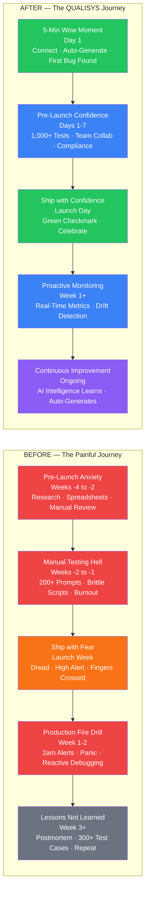
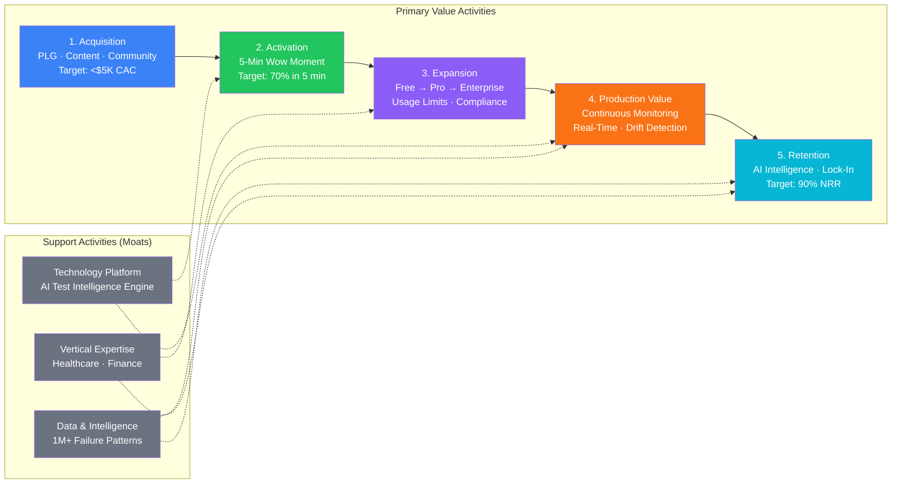
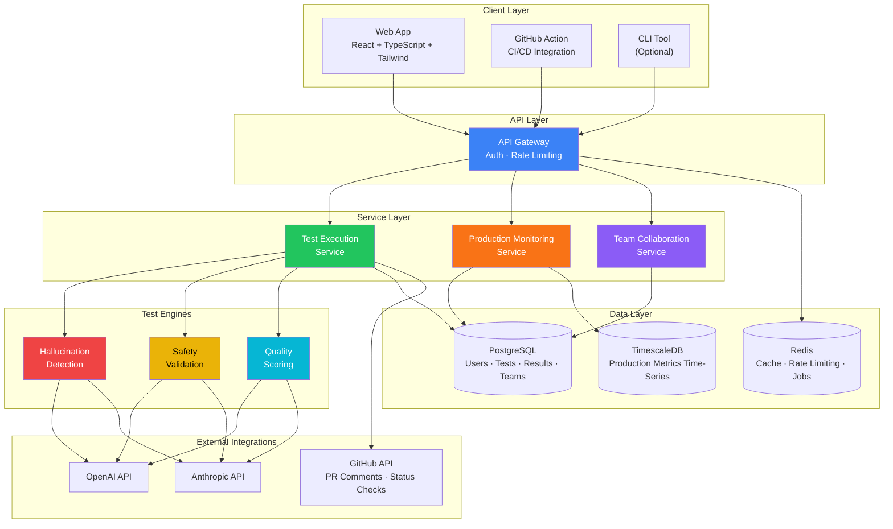
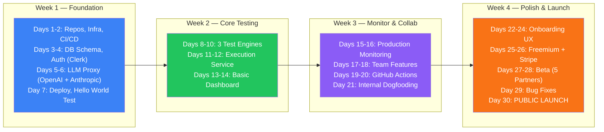

# QUALISYS

### Product Brief

**AI System Quality Assurance Platform**

---

| | |
|---|---|
| **Product** | QUALISYS — AI System Quality Assurance Platform |
| **Document Type** | Product Brief — Strategic Discovery & MVP Definition |
| **Date** | 2025-12-01 |
| **Author** | Azfar |
| **Domain** | Enterprise Software — AI System Quality Assurance |
| **Status** | Complete — Informs PRD & Architecture |
| **Method** | BMad Method — Collaborative Strategic Analysis |

---

> **Intended Audience & Stakeholder Guide**
>
> | Stakeholder | Primary Sections | Icon |
> |---|---|---|
> | **Executive / Leadership** | Parts I–II (Vision, Target Users, Market) | :dart: |
> | **Product Manager** | Parts I–III (Vision, Users, Strategy, MVP Scope) | :clipboard: |
> | **Business Analyst** | Parts I–II (Problem, Market, Users, Value Props) | :bar_chart: |
> | **Architect / Tech Lead** | Parts III–IV (Strategic Decisions, Architecture, MVP) | :building_construction: |
> | **Engineering Team** | Part IV (MVP Features, Architecture, Launch Plan) | :gear: |
> | **UX Designer** | Parts II, IV (User Journey, Empathy Map, 5-Min Activation) | :art: |
> | **Investor / Board** | Parts I, III (Vision, SWOT, Risk, Market Opportunity) | :moneybag: |

---

## Table of Contents

### Part I — Vision & Problem Space
- [1. Executive Summary](#1-executive-summary)
- [2. Problem Statement](#2-problem-statement)
  - [2.1 Root Cause Analysis](#21-root-cause-analysis)
- [3. Problem Impact](#3-problem-impact)
- [4. Why Existing Solutions Fall Short](#4-why-existing-solutions-fall-short)
- [5. Proposed Solution](#5-proposed-solution)
- [6. Key Differentiators](#6-key-differentiators)

### Part II — Target Users & Market
- [7. Primary Users: AI Engineering Leaders](#7-primary-users-ai-engineering-leaders)
- [8. Deep User Understanding (Empathy Map)](#8-deep-user-understanding-empathy-map)
- [9. Pain Points & Desired Gains](#9-pain-points--desired-gains)
- [10. Jobs to Be Done](#10-jobs-to-be-done)
- [11. Value Proposition Mapping](#11-value-proposition-mapping)
- [12. User Journey: Before vs After QUALISYS](#12-user-journey-before-vs-after-qualisys)

### Part III — Strategic Position
- [13. SWOT Analysis](#13-swot-analysis)
- [14. Risk Matrix](#14-risk-matrix)
- [15. Value Chain](#15-value-chain)
- [16. Pre-Mortem Analysis](#16-pre-mortem-analysis)
- [17. Decision Matrix: MVP Feature Prioritization](#17-decision-matrix-mvp-feature-prioritization)
- [18. Strategic Imperatives](#18-strategic-imperatives)

### Part IV — MVP Definition
- [19. MVP v1.0 Scope Summary](#19-mvp-v10-scope-summary)
- [20. Feature Breakdown & User Stories](#20-feature-breakdown--user-stories)
  - [Feature 1: LLM Testing](#feature-1-llm-testing-openai--anthropic)
  - [Feature 2: 3 Core Test Types](#feature-2-3-core-test-types)
  - [Feature 3: Production Monitoring](#feature-3-basic-production-monitoring)
  - [Feature 4: Team Features](#feature-4-basic-team-features)
  - [Feature 5: Key Integrations](#feature-5-3-key-integrations)
  - [Feature 6: Freemium & Onboarding](#feature-6-freemium-pricing--self-serve-onboarding)
- [21. Technical Architecture (MVP)](#21-technical-architecture-mvp)
- [22. Success Metrics & KPIs](#22-success-metrics--kpis)
- [23. 30-Day Launch Plan](#23-30-day-launch-plan)
- [24. Definition of Done (DoD)](#24-definition-of-done-dod)

---
---

# Part I — Vision & Problem Space

> :dart: **Stakeholders:** Executive, Product Manager, Business Analyst, Investor

---

## 1. Executive Summary

QUALISYS is an **AI System Quality Assurance Platform** addressing a critical market gap: companies shipping AI features lack proper testing tools for non-deterministic AI behavior.

| Metric | Value | Significance |
|---|---|---|
| **Annual Enterprise Loss** | $1.9B | From undetected LLM failures and AI system bugs |
| **LLM Applications (2025)** | 750M | Massive wave creating urgent testing demand |
| **Market Size** | $1.01B | Growing at 20.9% CAGR — 25% faster than traditional testing |
| **AI Testing Adoption** | 81% | Of enterprise teams now using AI in testing workflows |

> **Category Creation:** QUALISYS creates a new category — **"AI System Quality Assurance"** — providing comprehensive testing across all AI types (LLMs, traditional ML, agents, RAG, computer vision) while addressing the fear companies have about shipping AI features to production.

---

## 2. Problem Statement

Companies building AI-powered products face a **triple threat** that existing testing tools cannot address:

| # | Threat | Description |
|---|---|---|
| **1** | **Production Fear** | Engineering teams shipping AI features (LLMs, ML models, AI agents) are terrified of production failures. Hallucinations, bias, safety issues create existential risk. One bad AI output can destroy customer trust, trigger compliance violations, or cause safety incidents. |
| **2** | **Tool Inadequacy** | Traditional testing tools (Selenium, Cypress, TestRail) were built for deterministic software (same input = same output). AI systems are fundamentally non-deterministic — traditional approaches literally cannot validate AI correctness. |
| **3** | **Coverage Gap** | Current AI testing platforms (DeepEval, Braintrust) focus narrowly on LLM evaluation. Companies need to test their ENTIRE AI stack: Generative AI, Traditional ML, AI Agents, RAG Systems, and Computer Vision. |

> **The Result:** Companies are shipping AI features with inadequate testing, losing **$1.9B annually** to preventable AI failures while **81%** admit they need better AI testing solutions.

### 2.1 Root Cause Analysis

The deeper issue isn't just "poor testing tools" — it's a fundamental **paradigm shift**:

| # | Root Cause | Impact |
|---|---|---|
| **1** | **AI broke determinism** | For 30 years, testing assumed same input = same output. AI produces different outputs based on model state, training data, and stochastic sampling. |
| **2** | **Traditional QA is impossible** | You can't write a test that says "this prompt should return X" when X varies. The entire testing industry evolved for determinism. |
| **3** | **Industry inflection point** | 750M apps using LLMs (production scale), 81% mainstream adoption, regulated industries requiring AI compliance (EU AI Act, FDA guidance). |
| **4** | **Stakes have changed** | AI failures in production don't just lose customers — they destroy trust permanently, trigger compliance violations, and cause real-world harm. |

> **Why NOW is Critical:** Companies betting their businesses on AI (not just experimenting) need quality assurance for the non-deterministic era. **First company to solve this owns the AI quality assurance category.**

## 3. Problem Impact

| Dimension | Impact | Data Point |
|---|---|---|
| **Financial** | Undetected LLM failures | $1.9B lost annually across enterprises |
| **Financial** | AI testing infrastructure | 40% of IT budgets allocated |
| **Financial** | Production failures | Reputation damage, compliance fines, customer churn |
| **Operational** | Feature delivery blocked | Teams can't ship AI features due to testing inadequacy |
| **Operational** | Manual testing drain | Weeks of engineering time consumed per release |
| **Operational** | Firefighting mode | Production incidents from untested AI edge cases |
| **Strategic** | Launch delays | Companies delaying AI product launches due to quality concerns |
| **Strategic** | Competitive gap | Can't ship AI features confidently vs competitors |
| **Strategic** | Market demand | 750M applications expected to use LLMs in 2025 |

**Market Validation:**

| Signal | Data |
|---|---|
| AI in testing workflows | 81% of development teams |
| Investing in AI QA solutions | 75% of organizations |
| Enterprise demand validation | Humanloop acquisition (Anthropic) |

## 4. Why Existing Solutions Fall Short

| Category | Examples | Key Weakness | QUALISYS Fills |
|---|---|---|---|
| **Traditional Testing** | Selenium, Cypress, Katalon | Built for deterministic software; AI features are bolt-ons, not first principles | AI-native testing for non-deterministic behavior |
| **AI-First Testing** | Mabl, Testim, Functionize | Use AI to test traditional software — don't test AI systems themselves | Tests AI systems, not software with AI features |
| **LLM Evaluation** | DeepEval, Braintrust, Giskard | Narrow focus on LLM metrics only; pre-deployment, individual developer tools | Full AI stack, continuous production monitoring, cross-functional teams |

> **The Gap:** No platform provides comprehensive, production-ready AI system testing across the **full AI stack** with enterprise collaboration workflows.

## 5. Proposed Solution

QUALISYS is the **AI System Quality Assurance Platform** purpose-built for teams shipping AI systems to production.

> **Core Insight:** While traditional testing tools check if your code works, QUALISYS validates if your AI **behaves** correctly, safely, and reliably in production.

> **Paradigm Shift:** For 30 years, testing meant "verify expected output." For AI, testing means "validate behavior within acceptable boundaries of safety, accuracy, and reliability." This requires rethinking QA from first principles.

**Four Pillars of QUALISYS:**

| # | Pillar | Description | AI Types Covered |
|---|---|---|---|
| **1** | **Full-Stack AI Testing** | Test ALL AI types in one platform | Generative AI, Traditional ML, AI Agents, RAG Systems, Computer Vision |
| **2** | **Continuous Production Testing** | Real-time monitoring, automated regression detection, drift alerts | All — production environment monitoring |
| **3** | **Enterprise Collaboration** | Approval workflows, audit trails, compliance reporting (SOC2, HIPAA) | Cross-functional team workflows |
| **4** | **AI Test Intelligence** | ML-powered test prioritization, predictive failure detection, root cause analysis | Self-improving over time |

**The "5-Minute Wow Moment":**

| Minute | Action | Result |
|---|---|---|
| **1** | Sign up, connect AI system (API key) | Instant activation |
| **2** | Auto-generated first test suite | Zero manual setup |
| **3** | Run tests, see dashboard results | Real-time feedback |
| **4** | First real issue identified | Hallucination, bias, or safety concern |
| **5** | "This found a problem we missed!" | Immediate, tangible value |

> **Target ROI:** Find your first critical AI bug in **5 minutes** (vs competitors promising "30% accuracy improvement over weeks")

## 6. Key Differentiators

| Dimension | Traditional Testing | AI-First Testing | LLM Evaluation | **QUALISYS** |
|---|---|---|---|---|
| **Tests what?** | Software with AI features | Traditional apps using AI | LLMs only | **AI SYSTEMS — full stack** |
| **Handles?** | Deterministic behavior | Test automation speed | Pre-deployment metrics | **Non-deterministic AI behavior** |
| **Focus** | UI/API correctness | Speed improvement | Developer metrics | **AI safety, accuracy, reliability** |
| **Monitoring** | N/A | N/A | Pre-deployment only | **Continuous production testing** |
| **Team** | Individual | Individual | Individual developers | **Cross-functional enterprise teams** |
| **Examples** | Selenium, Cypress | Mabl, Testim | DeepEval, Braintrust | **Category creator** |

**Strategic Differentiation:**

| # | Differentiator | Description |
|---|---|---|
| **1** | **Category Creation** | "AI System QA" vs crowded "AI Testing" or "LLM Evaluation" spaces |
| **2** | **10x Not 2x** | Capabilities impossible without commercial infrastructure |
| **3** | **Full-Stack** | Only platform testing ALL AI types comprehensively |
| **4** | **Production-Ready** | Continuous monitoring, not just pre-deployment evaluation |
| **5** | **Enterprise-First** | Team collaboration, compliance, audit trails — not just developer tools |

---
---

# Part II — Target Users & Market

> :art: **Stakeholders:** Product Manager, UX Designer, Business Analyst, Executive

---

## 7. Primary Users: AI Engineering Leaders

| Dimension | Profile |
|---|---|
| **Titles** | VP Engineering, Head of AI/ML, CTO, Engineering Manager |
| **Company** | 50–500 employees, AI-native companies building GenAI products |
| **Tech Stack** | Using OpenAI, Anthropic, or open-source LLMs in production |
| **Budget Authority** | $50K–$500K/year for AI infrastructure decisions |
| **Situation** | Shipping AI features but terrified of production failures |

## 8. Deep User Understanding (Empathy Map)

| Quadrant | Insights |
|---|---|
| **SEE** | Competitors shipping AI features faster; Headlines about AI failures (hallucinations, bias lawsuits); Slack alerts: "AI just returned garbage to a customer"; Leadership pressure: "When can we ship?"; LLM provider updates breaking prompts; No credible AI testing solutions |
| **THINK** | "We're flying blind — we don't know what we don't know"; "Traditional testing gives false confidence"; "Are we the only ones struggling?"; "What if we go viral for the wrong reasons?"; "Manual testing doesn't scale"; "There has to be a better way" |
| **SAY** | To engineering: "We need more time to test this AI feature"; To leadership: "I can't guarantee production behavior"; To peers (privately): "I'm losing sleep over what could go wrong"; "Can we quantify the risk before we ship?" |
| **DO** | Manually review hundreds of AI outputs in spreadsheets; Build brittle internal testing scripts; Run AI through staging repeatedly; Monitor Slack/PagerDuty obsessively after releases; Experiment with DeepEval, Braintrust (partial help); Delay AI feature launches |

## 9. Pain Points & Desired Gains

| # | Pain Point (Current) | Desired Gain (With QUALISYS) |
|---|---|---|
| **1** | **Existential Fear** — One bad AI output could destroy reputation | **Confidence** — Ship AI features knowing they're safe and reliable |
| **2** | **No Playbook** — Traditional testing doesn't work for AI | **Comprehensive Coverage** — One platform testing entire AI stack |
| **3** | **Time Pressure** — Testing takes weeks under leadership pressure | **Speed** — Cut AI testing time from weeks to days (or hours) |
| **4** | **Resource Drain** — Engineers manually testing instead of building | **Team Velocity** — Engineers building features, not manually testing |
| **5** | **False Confidence** — Tests pass, AI still fails in production | **Visibility** — Know exactly what's working and what's risky |
| **6** | **Compliance Anxiety** — Regulated industries need audit trails | **Compliance Ready** — Audit trails and reporting for stakeholders |
| **7** | **Tool Fragmentation** — Using 5+ different tools for partial testing | **Unified Platform** — Single pane of glass for all AI quality |
| **8** | **Sleep Deprivation** — Literal stress about production failures | **Career Protection** — Not being "the person who shipped bad AI" |

## 10. Jobs to Be Done

| Type | Job |
|---|---|
| **Functional** | Validate AI behavior before production deployment |
| **Functional** | Detect regressions when models or prompts update |
| **Functional** | Monitor AI quality continuously in production |
| **Functional** | Generate compliance reports for stakeholders/auditors |
| **Functional** | Identify edge cases and failure modes proactively |
| **Emotional** | Sleep soundly after AI releases |
| **Emotional** | Feel confident defending AI quality to leadership |
| **Emotional** | Avoid being blamed for AI production failures |
| **Emotional** | Maintain reputation as technical leader who ships safely |
| **Social** | Be seen as innovator who ships AI responsibly |
| **Social** | Demonstrate due diligence to board/investors |
| **Social** | Set best practices that become organizational standards |

## 11. Value Proposition Mapping

> **Current Reality:** Weeks of manual testing → Still ship with fear → Pray nothing breaks
>
> **QUALISYS Reality:** 5 minutes to first critical bug → Confidence to ship → Sleep soundly

| Transformation | Before | After |
|---|---|---|
| **Pain → Gain** | "Existential fear" | "Confidence to ship safely" |
| **Time → Speed** | "Weeks of manual testing" | "5-minute activation + continuous monitoring" |
| **Blind → Visible** | "Don't know what we don't know" | "See exactly what's risky with AI test intelligence" |
| **Fragmented → Unified** | "5+ testing tools" | "One comprehensive platform" |

## 12. User Journey: Before vs After QUALISYS

**Journey Transformation Summary:**

| Dimension | BEFORE (Current State) | AFTER (QUALISYS) |
|---|---|---|
| **Time** | Weeks of manual testing | 5 minutes to first bug + continuous |
| **Emotion** | Fear, anxiety, dread | Confidence, relief, pride |
| **Coverage** | 200 manual test cases | 1,000+ automated + learning |
| **Team** | Engineers only, burned out | Cross-functional, energized |
| **Mode** | Reactive firefighting | Proactive prevention |
| **Confidence** | "Fingers crossed" | "Data-driven quality score" |
| **Velocity** | Slowing down | Accelerating |
| **Career** | Risk ("I'll be blamed") | Protection ("I have proof") |

---
---

# Part III — Strategic Position

> :moneybag: **Stakeholders:** Executive, Investor, Product Manager, Business Analyst

---

## 13. SWOT Analysis

### 13.1 Strengths

**Product Differentiation:**
- Full-stack coverage: Only platform testing ALL AI types (LLMs, ML, agents, RAG, vision)
- Production-ready: Continuous monitoring, not just pre-deployment evaluation
- Enterprise-first: Team collaboration, compliance, audit trails
- 10x differentiation: Capabilities impossible without commercial infrastructure

**Market Position:**
- Category creation: "AI System QA" vs crowded "AI Testing" space
- Clear ICP: AI engineering leaders at 50-500 person companies
- Strong value prop: "5-minute wow moment" vs "30% improvement over weeks"
- Paradigm shift framing: Quality assurance for non-deterministic era

**Timing Advantage:**
- Humanloop exit creates market gap (September 2025 sunset)
- Inflection point: Companies moving from experimental to mission-critical AI
- Regulatory momentum: EU AI Act, FDA guidance creating compliance demand
- Deep competitive intelligence completed with strategic clarity

### 13.2 Weaknesses

**Market Position:**
- Late to market: DeepEval has 500K monthly downloads, established mindshare
- No proof points: Zero customers, case studies, or production validation
- Unproven capabilities: Claiming "AI test intelligence" without demonstration
- Unknown brand: Competing against Y Combinator and funded players

**Product & Execution:**
- Not built yet: Everything is vision, nothing validated with real users
- Complex promise: "Full-stack AI testing" risks trying to boil the ocean
- MVP unclear: "5-minute wow moment" needs concrete definition
- Technical risk: Building "AI test intelligence that learns" is hard R&D

**Resources & GTM:**
- High CAC risk: $5K target requires efficient product-led growth
- Long sales cycles: Enterprise software typically 3-6 months
- Chicken-egg problem: Need customers for AI intelligence data, need intelligence to win customers

### 13.3 Opportunities

**Market Dynamics:**
- $1.9B in annual losses validates urgent enterprise pain
- Humanloop acquisition creates gap for independent platform
- 20.9% CAGR (25% faster than traditional testing market)
- 750M apps using LLMs in next 12-18 months (massive TAM expansion)

**Competitive Gaps:**
- DeepEval strong on evaluation, weak on production monitoring and collaboration
- Braintrust narrow focus on LLMs, doesn't cover full AI stack
- Traditional tools (Selenium/Cypress) can't pivot to non-deterministic testing
- Customer using 5+ tools creates consolidation opportunity

**Strategic Paths:**
- Vertical specialization: Healthcare AI (FDA), Financial Services (model governance)
- Platform partnerships: LangChain, LlamaIndex, SageMaker, Vertex AI integrations
- Compliance wave: EU AI Act, FDA guidance creating defensible regulatory moat
- Freemium validation: Proven conversion model (Confident AI, Galileo, Braintrust)

### 13.4 Threats

**Competitive Response:**
- DeepEval could add production monitoring (500K download distribution advantage)
- Incumbents could partner with OpenAI/Anthropic for AI testing capabilities
- Well-funded competitors (Mabl raises $100M) could outspend 20:1 on marketing
- Big Tech (Google, Microsoft, AWS) could bundle AI testing into cloud platforms

**Market & Execution Risks:**
- Timing risk: AI testing market might be 2-3 years from mainstream adoption
- Commoditization: "Good enough" AI testing becomes standard feature, not platform
- Product complexity: Full-stack might take 2+ years to build, miss market window
- Customer churn: First 10 customers love it, next 100 never materialize

**Economic Environment:**
- Enterprise budget cuts could delay "nice-to-have" AI infrastructure investment
- Consolidation preference: Customers want integrated MLOps suites over point solutions
- Open-source pressure: 40% cost savings with open-source alternatives

## 14. Risk Matrix

**Probability (1-3) x Impact (1-3) = Score (1-9)**

| # | Risk | P | I | Score | Level | Mitigation |
|---|---|---|---|---|---|---|
| **1** | Product complexity delays launch | 3 | 3 | **9** | :red_circle: Critical | Ruthless MVP scoping (one AI type, 3 tests), 30-day hard deadline |
| **2** | Market timing too early | 2 | 3 | **6** | :red_circle: Critical | 20 customer interviews Week 1-2, pivot if <50% validation |
| **3** | DeepEval adds production monitoring | 3 | 2 | **6** | :red_circle: Critical | Speed to market (30 days), enterprise collaboration, vertical moats |
| **4** | High CAC kills unit economics | 2 | 3 | **6** | :red_circle: Critical | Generous free tier, self-serve onboarding, product-led growth |
| **5** | First 10 love it, next 100 don't | 2 | 2 | **4** | :orange_circle: High | Design for mainstream, 70% activation, weekly cohort analysis |
| **6** | Well-funded competitor outspends | 2 | 2 | **4** | :orange_circle: High | Vertical moats, category ownership, capital efficient PLG |
| **7** | Open-source commoditization | 2 | 2 | **4** | :orange_circle: High | 10x better than open-source, enterprise value add, freemium |

> **Top 3 Priority Actions:**
> 1. Define concrete MVP in 48 hours (addresses Risk #1: complexity)
> 2. Validate with 20 customer interviews Week 1 (addresses Risk #2: timing)
> 3. Design self-serve onboarding (addresses Risk #4: CAC)

## 15. Value Chain

| # | Activity | Key Metric | Description |
|---|---|---|---|
| **1** | **Customer Acquisition** | CAC < $5K | Thought leadership, developer community (AI QA Guild), generous free tier |
| **2** | **Onboarding & Activation** | 70% in 5 min | Frictionless signup → API key → auto-generate tests → first bug found |
| **3** | **Expansion** | 10% conversion | Usage limits trigger upgrades, team collaboration, compliance gating |
| **4** | **Production Value** | 10x faster debugging | Real-time monitoring, drift detection, proactive alerting, root cause analysis |
| **5** | **Retention & Expansion** | 90% NRR | AI intelligence accumulates data, platform embeds in workflow, expand across AI portfolio |

**Proprietary Moats:**

| Moat | Description | Defensibility |
|---|---|---|
| **AI Test Intelligence** | Failure pattern database (1M+ test cases), benchmarks | Network effects: more customers = better product |
| **Vertical Expertise** | Healthcare (FDA 510k), Finance (SR 11-7, SOX) | Domain moats take years to build |
| **Integration Ecosystem** | CI/CD, Slack, Jira workflow embedding | Switching cost increases with usage |

## 16. Pre-Mortem Analysis

> **Scenario:** It's June 2027. QUALISYS has shut down. What happened?

| # | Failure Scenario | Root Cause | Warning Signs | Prevention |
|---|---|---|---|---|
| **1** | **"Boil the Ocean"** | Tried to build full-stack AI testing all at once. 6 months to ship. DeepEval already pivoted. | MVP >60 days; feature list growing; "just one more AI type" | ONE AI type for MVP (LLMs only), 30-day hard deadline, weekly "what can we CUT?" |
| **2** | **"No One Showed Up"** | Built product, launched, 47 signups, 3 active. Market wasn't ready. 2 years too early. | Interviews: "get back to me in 6 months"; activation <20% | 20 interviews BEFORE building; pivot if <50% say "I'd pay today" |
| **3** | **"Free Forever"** | 10K users on free tier. <1% conversion. CAC $15K. Couldn't raise Series A. | No usage limits; conversion <5% after 6 months | Tight free limits (100 tests/month), weekly conversion tracking (10% target) |
| **4** | **"Found 10, Lost 100"** | First 10 loved it (early adopters). Next 100 needed different UX. Growth stalled. | Celebrating 10 users; all from personal network; next cohort 15% activation | Design for mainstream Day 1; recruit OUTSIDE network; weekly cohort analysis |
| **5** | **"Ran Out of Money"** | Raised $500K. Hired 3 engineers. Launched with $100K left. Couldn't raise Series A. | Hiring before PMF; runway <9 months; burn rate climbing | Solo/2-person team until PMF; 18-month runway; revenue as validation |
| **6** | **"DeepEval Crushed Us"** | DeepEval added production monitoring + team collab. 500K users vs our 100. Insurmountable. | DeepEval GitHub activity; competitor overlapping features | SPEED (30 days); vertical moats (healthcare/finance); enterprise collaboration |

> **Critical Success Factors (To Avoid All Failures):**
>
> | # | Factor | Prevents |
> |---|---|---|
> | **1** | 30-Day MVP Launch | "Boil the Ocean" + "DeepEval Crushed Us" |
> | **2** | 20 Customer Interviews Week 1-2 | "No One Showed Up" |
> | **3** | 70% Activation, 10% Conversion Targets | "Free Forever" |
> | **4** | Design for Mainstream | "Found 10 Champions, Lost 100" |
> | **5** | 18-Month Runway, No Hiring Pre-PMF | "Ran Out of Money" |
> | **6** | Vertical Moat (Healthcare OR Finance) | Competitive commoditization |
>
> **Decision Framework:** Ask "Does this decision make ANY of the 6 failure scenarios more likely?" If YES, don't do it.

---

## 17. Decision Matrix: MVP Feature Prioritization

> **Purpose:** Evaluate MVP choices against weighted criteria to avoid "boil the ocean" failure and ensure 30-day ship target.

**Evaluation Criteria (Weighted):**

| Weight | Criterion | Question |
|---|---|---|
| **30%** | Time to Ship | Can we build it in 30 days? |
| **25%** | 5-Minute Wow Factor | Does it create immediate "holy shit" moment? |
| **20%** | Competitive Differentiation | Is this unique vs DeepEval/Braintrust? |
| **15%** | Activation Driver | Does it drive 70% activation target? |
| **10%** | Enterprise Value | Does it enable enterprise conversion? |

*Scoring: 1 (Low) to 5 (High)*

---

**DECISION #1: Which AI Types to Support?**

| Option | Time to Ship | Wow Factor | Differentiation | Activation | Enterprise | **Weighted Score** |
|--------|-------------|-----------|----------------|-----------|-----------|-------------------|
| **A. LLMs Only** ✅ | 5 (fast) | 4 (good) | 2 (crowded) | 5 (focused) | 4 (valuable) | **4.0** |
| B. LLMs + Traditional ML | 2 (slow) | 4 (good) | 4 (unique) | 3 (complex) | 5 (highest) | **3.3** |
| C. Full Stack (All AI) | 1 (very slow) | 5 (amazing) | 5 (unique) | 1 (overwhelming) | 5 (highest) | **2.8** |

**SELECTED: LLMs Only** - Highest score, ships in 30 days, focused activation. Full-stack is roadmap item post-PMF.

---

**DECISION #2: How Many Test Types?**

| Option | Time to Ship | Wow Factor | Differentiation | Activation | Enterprise | **Weighted Score** |
|--------|-------------|-----------|----------------|-----------|-----------|-------------------|
| **A. 3 Core Tests** ✅ | 5 (fast) | 4 (sufficient) | 3 (decent) | 5 (learnable) | 4 (valuable) | **4.25** |
| B. 10+ Test Library | 2 (slow) | 5 (impressive) | 4 (strong) | 2 (overwhelming) | 5 (comprehensive) | **3.35** |
| C. Custom Test Builder | 1 (R&D heavy) | 5 (powerful) | 5 (unique) | 2 (complex) | 5 (enterprise) | **3.2** |

**SELECTED: 3 Core Tests** - Hallucination Detection, Safety Validation, Quality Scoring. Learnable, creates wow without complexity.

---

**DECISION #3: Production Monitoring Depth?**

| Option | Time to Ship | Wow Factor | Differentiation | Activation | Enterprise | **Weighted Score** |
|--------|-------------|-----------|----------------|-----------|-----------|-------------------|
| A. Pre-Deployment Only | 5 (simple) | 2 (meh) | 1 (DeepEval parity) | 4 (easy) | 2 (limiting) | **3.15** |
| **B. Basic Production Monitoring** ✅ | 3 (moderate) | 5 (differentiating) | 5 (unique) | 4 (compelling) | 5 (critical) | **4.3** |
| C. AI Test Intelligence (Learning) | 1 (R&D) | 5 (amazing) | 5 (unique) | 2 (unclear) | 5 (valuable) | **3.25** |

**SELECTED: Basic Production Monitoring** - Real-time alerts + dashboards. This IS the differentiation vs competitors, worth moderate build time.

---

**DECISION #4: Team Collaboration Features?**

| Option | Time to Ship | Wow Factor | Differentiation | Activation | Enterprise | **Weighted Score** |
|--------|-------------|-----------|----------------|-----------|-----------|-------------------|
| A. Solo Developer Only | 5 (simple) | 2 (limiting) | 1 (parity) | 4 (easy) | 1 (no enterprise) | **2.95** |
| **B. Basic Team Features** ✅ | 4 (fast) | 4 (valuable) | 4 (differentiating) | 4 (useful) | 5 (enterprise) | **4.2** |
| C. Full Enterprise Suite | 1 (slow) | 4 (enterprise) | 3 (expected) | 3 (gated) | 5 (critical) | **3.0** |

**SELECTED: Basic Team Features** - Invite, comment, assign. Enables enterprise differentiation without boiling ocean. SSO/RBAC/audit trails post-MVP.

---

**DECISION #5: Integration Strategy?**

| Option | Time to Ship | Wow Factor | Differentiation | Activation | Enterprise | **Weighted Score** |
|--------|-------------|-----------|----------------|-----------|-----------|-------------------|
| A. API Only (no integrations) | 5 (instant) | 2 (manual) | 1 (basic) | 2 (friction) | 3 (limiting) | **2.85** |
| **B. 3 Key Integrations** ✅ | 4 (moderate) | 4 (seamless) | 4 (valuable) | 5 (activation) | 4 (workflow) | **4.25** |
| C. Integration Marketplace | 1 (platform) | 5 (powerful) | 4 (strong) | 3 (choice overload) | 5 (enterprise) | **3.3** |

**SELECTED: 3 Key Integrations** - OpenAI API, Anthropic Claude, GitHub Actions. Enables "5-minute activation" with major LLM providers + CI/CD workflow.

---

**DECISION #6: Pricing/Monetization Model?**

| Option | Time to Ship | Wow Factor | Differentiation | Activation | Enterprise | **Weighted Score** |
|--------|-------------|-----------|----------------|-----------|-----------|-------------------|
| A. Waitlist/Beta (No pricing) | 5 (simple) | 2 (no commitment) | 2 (unclear value) | 3 (no urgency) | 1 (no validation) | **2.85** |
| **B. Freemium Model** ✅ | 4 (setup required) | 4 (try easily) | 4 (proven model) | 5 (low friction) | 4 (conversion path) | **4.3** |
| C. Enterprise Sales Only | 3 (long cycles) | 2 (high barrier) | 3 (positioning) | 1 (blocks activation) | 5 (valuable) | **2.65** |

**SELECTED: Freemium Model** - 100 tests/month free tier. Enables PLG, low CAC target, proven conversion model by competitors.

---

## 18. Strategic Imperatives

| Strategy | # | Action |
|---|---|---|
| **Leverage Strengths** | 1 | Own "AI System QA" category positioning aggressively |
| | 2 | Nail the "5-minute wow moment" — activation beats features |
| | 3 | Market full-stack advantage as unique differentiator |
| **Address Weaknesses** | 1 | Build MVP fast: 30 days with 10 design partners (validate or pivot) |
| | 2 | Get proof points: 3 case studies showing "found critical bugs in 5 minutes" |
| | 3 | Define concrete MVP: one AI type, 3 test types, 1 integration |
| **Seize Opportunities** | 1 | Position as "independent AI QA platform" (Humanloop gap) |
| | 2 | Pick one vertical (healthcare or finance), build compliance moat |
| | 3 | Execute proven freemium model (generous free tier → enterprise conversion) |
| **Mitigate Threats** | 1 | Speed to market: Ship before DeepEval pivots or incumbents respond |
| | 2 | Build defensible moats: AI test intelligence, vertical expertise, integrations |
| | 3 | Stay capital efficient: Product-led growth to keep CAC <$5K |

---
---

# Part IV — MVP Definition

> :gear: **Stakeholders:** Engineering Team, Architect, Product Manager, UX Designer

---

## 19. MVP v1.0 Scope Summary

| # | Feature | Scope | Decision Score |
|---|---|---|---|
| **1** | LLMs Only | OpenAI GPT + Anthropic Claude support | 4.0 |
| **2** | 3 Core Tests | Hallucination Detection, Safety Validation, Quality Scoring | 4.25 |
| **3** | Basic Production Monitoring | Real-time dashboards, automated alerts, drift detection | 4.3 |
| **4** | Basic Team Features | Invite members, comment on test results, assign issues | 4.2 |
| **5** | 3 Key Integrations | OpenAI API, Anthropic API, GitHub Actions CI/CD | 4.25 |
| **6** | Freemium Pricing | 100 tests/month free, Pro ($49/mo unlimited), Enterprise (custom) | 4.3 |

**Explicitly OUT of Scope (Future Roadmap):**

| Feature | Phase |
|---|---|
| Traditional ML, computer vision, AI agents | Phase 2 |
| Custom test builder | Phase 3 |
| AI Test Intelligence learning system | Phase 3 |
| Advanced enterprise (SSO, RBAC, advanced audit trails) | Phase 2 |
| Integration marketplace | Phase 3 |

**MVP Success Criteria:**

| Criterion | Target | Prevents |
|---|---|---|
| Ship in 30 days | Hard deadline | "Boil the Ocean" failure |
| Activation rate | 70% in 5 minutes | Validates wow moment |
| Free-to-paid conversion | 10% within 60 days | "Free Forever" death |
| Case studies | 3 customers: "Found critical bug in 5 minutes" | Social proof for growth |

## 20. Feature Breakdown & User Stories

**FEATURE 1: LLM Testing (OpenAI + Anthropic)**

**User Stories:**
- **US-001:** As an AI engineer, I want to connect my OpenAI API key in one click, so I can start testing immediately without complex setup
  - Acceptance: API key validation, test connection, store securely, show connection status

- **US-002:** As an AI engineer, I want to connect my Anthropic Claude API key, so I can test Claude-based applications
  - Acceptance: Same flow as OpenAI, support multiple providers simultaneously

- **US-003:** As a developer, I want to see which LLM models I'm testing (GPT-4, Claude 3.5, etc.), so I understand test coverage
  - Acceptance: Auto-detect models from API, display in dashboard

**Technical Requirements:**
- Secure credential storage (encrypted at rest)
- API abstraction layer (support both providers)
- Rate limiting awareness (respect provider limits)
- Error handling for API failures

---

**FEATURE 2: 3 Core Test Types**

**2A: Hallucination Detection**

**User Stories:**
- **US-004:** As a QA lead, I want to run hallucination detection tests on my LLM outputs, so I can identify when the AI fabricates information
  - Acceptance: Upload test prompts + expected context, run batch tests, flag hallucinations with confidence scores

- **US-005:** As an engineer, I want to see WHY a response was flagged as a hallucination, so I can fix the underlying issue
  - Acceptance: Show evidence (what was fabricated, what source was missing), provide root cause hints

**Technical Implementation:**
- Fact verification engine (check claims against provided knowledge base)
- Grounding detection (did answer use provided context?)
- Confidence scoring (0-100% hallucination probability)
- Evidence highlighting (show fabricated claims)

---

**2B: Safety Validation**

**User Stories:**
- **US-006:** As a compliance officer, I want to test if my LLM produces harmful, biased, or inappropriate content, so we don't ship unsafe AI
  - Acceptance: Run safety tests covering: toxicity, bias, PII leakage, prompt injection, jailbreak attempts

- **US-007:** As a developer, I want to see safety test results with severity levels (critical/high/medium/low), so I can prioritize fixes
  - Acceptance: Categorized safety issues, severity scoring, fix recommendations

**Technical Implementation:**
- Safety category taxonomy (toxicity, bias, PII, prompt injection, jailbreak)
- Automated adversarial testing (attempt to break safety)
- Severity scoring matrix
- Compliance mapping (OWASP LLM Top 10, NIST AI RMF)

---

**2C: Quality Scoring**

**User Stories:**
- **US-008:** As a PM, I want to score LLM response quality (relevance, coherence, completeness), so I can track AI performance over time
  - Acceptance: Automated quality metrics (0-100 score), trend charts, comparison to baseline

- **US-009:** As an engineer, I want quality benchmarks for my specific use case (customer support, code generation, etc.), so I know what "good" looks like
  - Acceptance: Industry benchmarks by use case, comparison to peers, improvement recommendations

**Technical Implementation:**
- Multi-dimensional quality scoring:
  - Relevance (did it answer the question?)
  - Coherence (is it logically consistent?)
  - Completeness (did it cover all aspects?)
  - Tone/Style (appropriate for context?)
- Benchmark database (by industry/use case)
- Trend tracking (quality over time)

---

**FEATURE 3: Basic Production Monitoring**

**User Stories:**
- **US-010:** As an engineering manager, I want real-time dashboards showing AI quality metrics in production, so I know if something degrades
  - Acceptance: Live dashboard with hallucination rate, safety score, quality score, updated every 5 minutes

- **US-011:** As a DevOps engineer, I want automated alerts when AI quality drops below thresholds, so I can respond before customers are impacted
  - Acceptance: Configurable thresholds, Slack/email alerts, alert history, snooze controls

- **US-012:** As a data scientist, I want to see if my LLM is drifting over time, so I can retrain or update prompts proactively
  - Acceptance: Drift detection charts, statistical significance testing, root cause analysis (prompt changes? model updates?)

**Technical Implementation:**
- Real-time data pipeline (ingest production LLM traffic)
- Time-series database (store quality metrics over time)
- Alerting engine (threshold monitoring, anomaly detection)
- Drift detection algorithms (statistical process control, distribution shifts)
- Dashboard framework (real-time charts, filters, drill-downs)

---

**FEATURE 4: Basic Team Features**

**User Stories:**
- **US-013:** As a team lead, I want to invite my QA team and PM to review AI test results, so we can collaborate on quality decisions
  - Acceptance: Email invites, role assignment (admin/member/viewer), team member list

- **US-014:** As a QA analyst, I want to comment on specific test failures and assign them to engineers, so issues get tracked and resolved
  - Acceptance: Comment threads on test results, @mentions, assign to team members, status tracking (open/in-progress/resolved)

- **US-015:** As a PM, I want to approve or reject AI changes before production deployment, so we maintain quality gates
  - Acceptance: Approval workflow, approval history, block deployment until approved

**Technical Implementation:**
- User management (invite, roles, permissions)
- Commenting system (threads, mentions, notifications)
- Assignment workflow (assign, track, resolve)
- Approval gates (require approval before deploy)
- Activity feed (who did what, when)

---

**FEATURE 5: 3 Key Integrations**

**5A: OpenAI + Anthropic API Integrations**

**User Stories:**
- **US-016:** As a developer, I want QUALISYS to automatically test my LLM calls without code changes, so testing doesn't slow me down
  - Acceptance: SDK/proxy mode - drop-in replacement for OpenAI/Anthropic SDKs, automatic test execution

**5B: GitHub Actions CI/CD**

**User Stories:**
- **US-017:** As a DevOps engineer, I want to run QUALISYS tests in my CI/CD pipeline, so AI quality is verified before every deployment
  - Acceptance: GitHub Action available in marketplace, pass/fail exit codes, test results as PR comments

- **US-018:** As an engineering manager, I want to block PRs that fail AI quality tests, so bad AI changes don't reach production
  - Acceptance: GitHub status checks, configurable failure thresholds, override controls for emergencies

**Technical Implementation:**
- GitHub Action (official QUALISYS action in marketplace)
- PR commenting bot (post test results as comments)
- Status check API integration (pass/fail status)
- Configuration file (.qualisys.yml for thresholds)

---

**FEATURE 6: Freemium Pricing & Self-Serve Onboarding**

**User Stories:**
- **US-019:** As a developer, I want to sign up and start testing for free (no credit card), so I can evaluate QUALISYS without commitment
  - Acceptance: Email-only signup, 100 tests/month free, no credit card required, instant activation

- **US-020:** As a growing team, I want to upgrade to unlimited testing when I hit the free limit, so I can scale without interruption
  - Acceptance: Clear upgrade prompts at 80% usage, self-serve checkout (Stripe), instant plan upgrade

- **US-021:** As an enterprise buyer, I want to contact sales for custom pricing (SSO, compliance, SLA), so I can get enterprise features
  - Acceptance: "Contact Sales" flow, lead capture, sales team notification

**Technical Implementation:**
- Free tier limits (100 tests/month, 1 team member, basic features)
- Usage tracking (count tests, warn at 80%, hard limit at 100%)
- Payment integration (Stripe Checkout, subscription management)
- Plan gating (free/pro/enterprise feature access)
- Sales lead capture (form, CRM integration)

---

## 21. Technical Architecture (MVP)

**Technology Stack (MVP):**

**Frontend:**
- React + TypeScript (fast development, rich ecosystem)
- Tailwind CSS (rapid UI development)
- Recharts (dashboard visualizations)
- Deploy: Vercel (zero-config, fast, free tier)

**Backend:**
- Node.js + Express (JavaScript everywhere, fast MVP development)
- PostgreSQL (relational data: users, teams, test configs)
- TimescaleDB (time-series extension for production metrics)
- Redis (caching, rate limiting, background jobs)
- Deploy: Railway or Render (simple, affordable, auto-scaling)

**LLM Integration:**
- OpenAI Node SDK
- Anthropic Node SDK
- Proxy pattern (intercept, test, forward)

**Test Engines:**
- Hallucination: Custom fact-checking logic + embeddings similarity
- Safety: Perspective API (Google) + custom rules
- Quality: Multi-metric scoring algorithm

**CI/CD Integration:**
- GitHub Actions (TypeScript action)
- GitHub API (PR comments, status checks)

**Auth & Payments:**
- Auth: Clerk (drop-in auth, free tier, fast)
- Payments: Stripe (standard, proven, good docs)

**Infrastructure:**
- Monitoring: Sentry (error tracking)
- Analytics: PostHog (product analytics, free tier)
- Email: Resend (transactional emails, simple API)

---

## 22. Success Metrics & KPIs

| Category | Metric | Target | Tracking Method |
|---|---|---|---|
| **Activation** | 5-Minute Activation Rate | 70% Week 1 | Time from signup → first test completion |
| **Activation** | First Bug Discovery Rate | 50% Week 1, 60% Month 1 | Users flagging test failure in first 24 hours |
| **Engagement** | Weekly Active Users (WAU) | 60% return in Week 2 | Users running tests in Week 2 after signup |
| **Engagement** | Tests Per User | 50/week (active users) | Median tests run by active users |
| **Conversion** | Free → Pro Conversion | 10% within 60 days | Cohort analysis — free to paid upgrades |
| **Conversion** | Upgrade Trigger | 80% hit free tier limit | Reason for upgrade (limit hit vs features) |
| **Validation** | Case Studies | 3 by Day 30 | "Found critical bug in 5 minutes" stories |
| **Validation** | Net Promoter Score (NPS) | 40+ by Month 1 | Survey after 7 days of usage |
| **Economics** | Customer Acquisition Cost | <$5K blended | Total marketing spend / new customers |
| **Economics** | CAC Payback Period | <12 months | Months to recover CAC from revenue |

---

## 23. 30-Day Launch Plan

**Launch Checklist (Day 30):**

| # | Checkpoint | Status |
|---|---|---|
| 1 | 5 design partners activated and using daily | Required |
| 2 | All 3 test types working (hallucination, safety, quality) | Required |
| 3 | GitHub Action published and tested | Required |
| 4 | Freemium limits enforced (100 tests/month) | Required |
| 5 | Stripe checkout working (Pro plan $49/mo) | Required |
| 6 | Documentation complete (docs site, API reference) | Required |
| 7 | 1 case study documented ("found bug in 5 minutes") | Required |

---

## 24. Definition of Done (DoD)

| Category | Criteria |
|---|---|
| **Functional Completeness** | |
| | User can sign up with email (no credit card) |
| | User can connect OpenAI and/or Anthropic API keys |
| | User can create and run tests (hallucination, safety, quality) |
| | User can see test results in dashboard |
| | User can invite team members and collaborate (comment, assign) |
| | User can set up production monitoring with alerts |
| | User can install GitHub Action and run tests in CI/CD |
| | User can upgrade to Pro plan ($49/mo) self-serve |
| | Free tier limits enforced (100 tests/month) |
| **Quality Gates** | |
| | Zero critical bugs (P0) |
| | <5 high-priority bugs (P1) — documented for post-launch |
| | 5-minute activation tested with 10 users (70%+ success rate) |
| | Load tested (100 concurrent users, <2s response time) |
| | Security review complete (API keys encrypted, auth working) |
| | Error tracking configured (Sentry catching all errors) |
| **Launch Readiness** | |
| | Landing page live (clear value prop, signup CTA) |
| | Documentation site complete (getting started, API docs) |
| | Support system ready (email support, Discord community) |
| | Analytics instrumented (PostHog tracking all key events) |
| | Launch plan documented (social posts, HN launch, email list) |
| | 3 case studies ready to share (social proof) |
| **Post-Launch Monitoring** | |
| | Daily metrics dashboard (activation, engagement, conversion) |
| | Weekly cohort analysis (retention tracking) |
| | Customer interview schedule (talk to 5 users Week 1) |
| | Feedback loop (user feedback → product backlog → sprint) |

---
---

---

**QUALISYS — AI System Quality Assurance Platform**

*Product Brief — Strategic Discovery & MVP Definition*

This Product Brief was developed through collaborative strategic analysis using the BMad Method.

**Completed:** 2025-12-01 | **Author:** Azfar

---

| Dimension | Summary |
|---|---|
| **Category** | AI System Quality Assurance (new category creation) |
| **Target User** | AI Engineering Leaders at 50–500 person companies |
| **Core Value** | Find your first critical AI bug in 5 minutes |
| **MVP Timeline** | 30 days to public launch |
| **Key Metric** | 70% activation rate in 5 minutes |
| **Pricing** | Freemium: 100 tests/month free → Pro $49/mo → Enterprise custom |
| **Market** | $1.01B growing at 20.9% CAGR to $3.82B by 2032 |

**Next Steps:** PRD (detailed requirements) | Architecture (technical design) | Epic & Story Breakdown | Implementation

