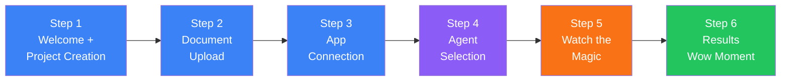
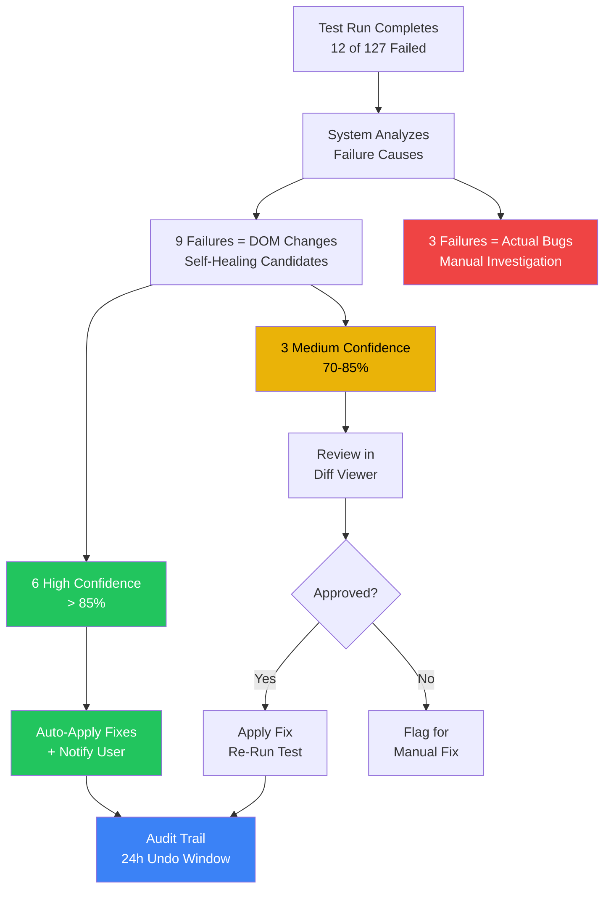

<div align="center">

# QUALISYS

### UX Design Specification

**AI System Quality Assurance Platform**

---

| | |
|---|---|
| **Product** | QUALISYS — AI System Quality Assurance Platform |
| **Document Type** | UX Design Specification |
| **Version** | 1.0 |
| **Date** | 2025-12-02 |
| **Authors** | Azfar + Sally (UX Designer) |
| **Status** | Complete — Informs Architecture & Implementation |
| **Method** | BMad Method — Create UX Design Workflow v1.0 |

</div>

---

> **Intended Audience & Stakeholder Guide**
>
> | Stakeholder | Primary Sections | Icon |
> |---|---|---|
> | **UX Designer** | Parts I–III (Design Foundation, User Flows, Component System) | :art: |
> | **Frontend Engineer** | Parts I, III–IV (Visual Foundation, Components, Implementation) | :gear: |
> | **Product Manager** | Parts I–II (Experience Principles, User Journey Flows) | :clipboard: |
> | **QA / Test Lead** | Part II (Manual Testing Flow, Self-Healing Flow, Dashboards) | :white_check_mark: |
> | **Architect / Tech Lead** | Parts III–IV (Component Strategy, Responsive, Implementation) | :building_construction: |
> | **Executive / Leadership** | Part I (Executive Summary, Design Direction) | :dart: |

---

## Table of Contents

### Part I — Design Foundation
- [1. Executive Summary](#1-executive-summary)
- [2. Design System Choice](#2-design-system-choice)
- [3. Experience Principles](#3-experience-principles)
- [4. Novel UX Patterns](#4-novel-ux-patterns)
- [5. Visual Foundation](#5-visual-foundation)
- [6. Design Direction](#6-design-direction)

### Part II — User Journey Flows
- [7. Flow 1: 5-Minute Value Onboarding](#7-flow-1-5-minute-value-onboarding)
- [8. Flow 2: Agent Selection & Pipeline Creation](#8-flow-2-agent-selection--pipeline-creation)
- [9. Flow 3: Manual Test Execution](#9-flow-3-manual-test-execution)
- [10. Flow 4: Self-Healing Magic Workflow](#10-flow-4-self-healing-magic-workflow)
- [11. Flow 5: Role-Based Dashboards](#11-flow-5-role-based-dashboards)
- [12. Flow 6: Integration Setup & Management](#12-flow-6-integration-setup--management)

### Part III — Component System
- [13. Component Library](#13-component-library)
- [14. UX Pattern Decisions](#14-ux-pattern-decisions)
- [15. Responsive Design & Accessibility](#15-responsive-design--accessibility)

### Part IV — Implementation
- [16. Implementation Guidance](#16-implementation-guidance)
- [17. Appendix & References](#17-appendix--references)

---
---

# Part I — Design Foundation

> :art: **Stakeholders:** UX Designer, Frontend Engineer, Product Manager, Executive

---

## 1. Executive Summary

QUALISYS is an AI-Powered Testing Platform serving 6 distinct user personas (Owner/Admin, PM/CSM, QA-Manual, QA-Automation, Dev, Viewer) across the complete testing lifecycle. The UX must make AI trustworthy, respect role-based workflows, and deliver instant value. This specification defines 6 critical user flows, visual foundation, and component strategy for MVP implementation.

**Design Philosophy:** Professional testing co-pilot that transforms anxiety (broken tests, maintenance burden) into confidence (self-healing automation, comprehensive coverage). The UX balances complexity (6 AI agents, multi-role workflows) with simplicity (5-minute onboarding, role-optimized interfaces).

---

## 2. Design System Choice

**Selected: Tailwind CSS + shadcn/ui**

| Layer | Technology | Purpose |
|---|---|---|
| **Base** | Tailwind CSS utilities | Layout, spacing, responsive design |
| **Components** | shadcn/ui | Button, Card, Dialog, Table, Forms — accessible, enterprise-quality |
| **Custom** | QUALISYS components | AgentCard, SelfHealingDiffViewer, TestExecutionTimeline, CoverageHeatmap |

**Rationale:**

| Criterion | Why Tailwind + shadcn/ui |
|---|---|
| **Tech Stack Alignment** | Native to Next.js + React + TypeScript |
| **Development Speed** | Pre-built accessible components, rapid iteration |
| **Quality** | Enterprise-quality without rigidity |
| **Customization** | Easy to build QUALISYS-specific components |

---

## 3. Experience Principles

| # | Principle | Key Behaviors |
|---|---|---|
| **1** | **Confidence Through Transparency** | AI actions explained ("How I created this"); Confidence scores everywhere (Red <60%, Yellow 60-80%, Green 80-100%); Human-in-the-loop for critical actions; Preview/diff before applying changes |
| **2** | **Role-Optimized Workflows** | PM/CSM → Executive Dashboard; QA-Manual → Test Queue; QA-Automation → Agent Workspace; Dev → My Tests; Owner/Admin → Organization Overview; Viewer → Reports Gallery |
| **3** | **Progressive Disclosure** | Onboarding wizard (5 steps); Layered interfaces (simple → complex on-demand); Contextual help |
| **4** | **Real-Time Feedback** | Optimistic UI updates; Live progress indicators ("Analyzing... 23%"); Toast notifications (non-blocking, actionable); WebSocket-powered live dashboards |

## 4. Novel UX Patterns

| # | Pattern | Description | Key Interaction |
|---|---|---|---|
| **1** | **Agent Cards + Pipeline Builder** | Drag-and-drop canvas for creating AI agent workflows | Card selection → Pipeline canvas → Validation |
| **2** | **Self-Healing Diff Viewer** | 3-column split: Before / AI Analysis / After | Screenshot comparison + confidence score + approve/reject |
| **3** | **Manual Test Execution Interface** | Split-screen: Test Steps (60%) + Evidence Capture (40%) | Keyboard shortcuts + inline screenshot/video |
| **4** | **Test Execution Timeline** | Horizontal swimlanes (Gantt-style) with live updates | Color-coded bars + click to expand logs |
| **5** | **Coverage Heatmap** | Matrix: Requirements (rows) x Test Types (columns) | Color intensity = test count; red outline = missing |

**Pattern 1: Agent Cards + Pipeline Builder**
- Agent cards show: Icon, name, description, inputs/outputs, runtime estimate
- Drag-and-drop canvas to create pipelines
- Visual validation (red warnings for incompatible connections)
- "Recommended Pipeline" quick start
- Save/share custom pipelines

**Pattern 2: Self-Healing Diff Viewer**
- Split-screen: Before (failed) | AI Explanation | After (proposed)
- Screenshots with highlighted selectors
- Confidence score (large circular progress) with rationale bullets
- Approve/Reject/Batch actions
- Undo capability (24 hours)

**Pattern 3: Manual Test Execution Interface**
- Split-screen: Test Steps (60%) | Evidence Capture (40%)
- Inline screenshot/video capture per step
- Keyboard shortcuts (Spacebar = screenshot, Enter = pass)
- Auto-save progress
- One-click defect creation from failed steps

**Pattern 4: Test Execution Timeline**
- Horizontal swimlanes (Gantt-style)
- Color-coded bars: Blue (running), Green (passed), Red (failed)
- Live updates, failed tests pulse red
- Click to expand logs/screenshots
- Filter/group/zoom controls

**Pattern 5: Coverage Heatmap**
- Matrix: Requirements (rows) × Test Types (columns)
- Cell color intensity = test count
- Red outline = required but missing
- Hover for test list, click to drill down
- Export as CSV/PDF

---

## 5. Visual Foundation

### 5.1 Color System

**Primary Palette:**

| Role | Color | Hex | Meaning |
|---|---|---|---|
| **Primary (Brand)** | Deep Blue | `#1E40AF` | Trust, intelligence, professionalism |
| **Secondary** | Teal | `#14B8A6` | Innovation, AI/automation signals |
| **Accent** | Purple | `#7C3AED` | Premium features, advanced capabilities |

**Semantic Colors:**

| Role | Color | Hex | Usage |
|---|---|---|---|
| **Success** | Green | `#10B981` | Tests passed, healthy status |
| **Warning** | Amber | `#F59E0B` | Medium confidence, needs attention |
| **Error** | Red | `#EF4444` | Tests failed, critical issues |
| **Info** | Sky Blue | `#0EA5E9` | Neutral information, help tooltips |

**Neutrals:**
- **Text:** Gray-900 `#111827` (primary), Gray-600 `#4B5563` (secondary)
- **Backgrounds:** White `#FFFFFF` (cards), Gray-50 `#F9FAFB` (page bg), Gray-100 `#F3F4F6` (hover states)
- **Borders:** Gray-200 `#E5E7EB` (default), Gray-300 `#D1D5DB` (emphasized)

**Confidence Score Gradient:**

| Range | Color | Hex | Meaning |
|---|---|---|---|
| **0–59%** | Red | `#EF4444` | Low confidence — manual review recommended |
| **60–79%** | Amber | `#F59E0B` | Medium confidence — review suggested |
| **80–100%** | Green | `#10B981` | High confidence — safe to apply |

**Typography:**
- **Headings:** Inter, 600-700 weight (modern, clean, readable)
- **Body:** Inter, 400-500 weight
- **Code/Selectors:** JetBrains Mono (monospace for technical content)

**Visual Personality:**
- Clean, spacious layouts (avoid clutter)
- Subtle shadows for depth (not flat, not skeuomorphic)
- Rounded corners (4-8px) for friendly professionalism
- Icon system: Lucide icons (consistent, modern)

---

## 6. Design Direction

**Direction: "Intelligent Dashboard"**

**Characteristics:**
- Data-rich but not overwhelming
- Card-based layouts for scannable information
- Emphasis on metrics, trends, visualizations
- Clear visual hierarchy (primary/secondary/tertiary actions)
- Action-oriented (CTAs prominent, workflows guided)

**Why This Direction:**
- Matches B2B SaaS expectations (users familiar with Jira, TestRail, GitHub)
- Supports multiple personas (dashboards adapt per role)
- Scales well (add widgets/metrics without redesign)
- Developer-friendly (component-based architecture)

---

---
---

# Part II — User Journey Flows

> :clipboard: **Stakeholders:** Product Manager, UX Designer, QA Lead, Frontend Engineer

> **6 critical user flows** define the complete QUALISYS interaction model across all personas.

---

## 7. Flow 1: 5-Minute Value Onboarding

**Goal:** New user → Generated test suite in <5 minutes



**Steps:**

**Step 1: Welcome + Project Creation**
- Screen: Welcome modal with "Create Your First Project" CTA
- Form fields: Project name, Description (optional)
- Quick tips: "Upload requirements → Connect app → Generate tests → See results"
- Action: "Create Project" → Navigate to Project Setup

**Step 2: Document Upload**
- Screen: Drag-and-drop zone for PRD/SRS/requirements docs
- Supported formats shown: PDF, Word, Markdown
- Or: "Import from JIRA" button (if integration exists)
- Progress: Upload → Parsing → "Ready" checkmark
- Action: "Next: Connect Your App"

**Step 3: App Connection**
- Screen: Two input fields
  - App URL: `https://staging.myapp.com`
  - GitHub Repo: `github.com/mycompany/myapp` + access token
- Help text: "We'll crawl your app and analyze code to generate smarter tests"
- Optional: Skip for now (can add later)
- Action: "Next: Select AI Agents"

**Step 4: Agent Selection (The Magic)**
- Screen: Agent Cards displayed in grid (3 MVP agents shown)
  - 📊 BAConsultant AI Agent
  - 🧪 QAConsultant AI Agent
  - 🤖 AutomationConsultant AI Agent
- Each card: Icon, name, description, "~2-5 min" runtime
- Pre-selected: "Recommended for First Project" (all 3 checked)
- Or: "Use Recommended Pipeline" button (auto-selects sensible defaults)
- Advanced: "Show 3 More Agents" expands to reveal AI Log Reader/Summarizer, Security Scanner Orchestrator, Performance/Load Agent (Post-MVP)
- Action: "Generate Tests" (primary CTA, large, green)

**Step 5: Watch the Magic (Progress)**
- Screen: Live progress dashboard
  - Agent status cards animate through: Queued → Running → Complete
  - Progress bars per agent ("BAConsultant AI Agent: Analyzing... 47% (page 23 of 47)")
  - Logs stream in real-time (expandable, not blocking)
- Estimated time: "~3 minutes remaining"
- When complete: Success animation + confetti 🎉

**Step 6: Results ("Wow" Moment)**
- Screen: Generated artifacts displayed
  - Coverage Matrix: "127 test scenarios created from 47 requirements"
  - Manual Test Checklists: "23 manual test procedures ready"
  - Automated Scripts: "89 Playwright test scripts generated"
- Actions:
  - "View Coverage Matrix"
  - "Execute Manual Tests"
  - "Run Automated Tests"
  - "Explore Agent Outputs"
- Celebration message: "🎉 Your AI testing co-pilot is ready! Time to first tests: 4m 32s"

**UX Notes:**
- Progress must feel alive (not just spinners)
- Celebrate success (confetti, positive messaging)
- Clear next actions (don't leave users wondering "now what?")

---

## 8. Flow 2: Agent Selection & Pipeline Creation

**Goal:** User understands AI agents and creates custom workflows

**Simple Mode: Agent Selection UI**

**Screen Layout:**
- Header: "Select AI Agents for Your Project"
- Subheader: "Choose which agents to run. They'll analyze your requirements and generate comprehensive test artifacts."

**Agent Cards (Grid Layout, 2-3 per row):**

Each card shows:
- Icon (emoji or custom SVG)
- Agent Name (bold, large)
- One-line description
- Tags: Inputs ("Requires: PRD") | Outputs ("Generates: Coverage Matrix")
- Runtime estimate: "~2-5 minutes"
- Checkbox or toggle: Select/deselect
- "Learn More" link → Expands inline panel with detailed description, example outputs

**Example Agent Card:**
```
┌─────────────────────────────────────┐
│ 📊 BAConsultant AI Agent             │
│                                     │
│ Analyzes requirements, detects     │
│ gaps, builds coverage matrix       │
│                                     │
│ Inputs: PRD, SRS, RFP             │
│ Outputs: Coverage Matrix, Stories  │
│                                     │
│ Est. Runtime: ~2-5 min             │
│                                     │
│ [☑ Selected]      [Learn More →]  │
└─────────────────────────────────────┘
```

**Quick Actions:**
- "Use Recommended Pipeline" button: Auto-selects BAConsultant AI Agent + QAConsultant AI Agent + AutomationConsultant AI Agent
- "Select All" / "Deselect All" toggles
- "Run Sequential" (default) vs "Run in Parallel" (advanced)

**Bottom Actions:**
- "Run Selected Agents" (primary CTA, shows count: "Run 3 Agents")
- "Save as Pipeline" (secondary) → Opens modal to name and save for reuse

---

**Advanced Mode: Pipeline Builder**

Accessed via: "Advanced: Create Custom Pipeline" link

**Canvas Interface:**
- Left sidebar: Agent library (drag agents from here)
- Center canvas: Drop zone for building pipeline
- Connections: Drag arrows between agents to define sequence/dependencies

**Example Pipeline Visual:**
```
[BAConsultant AI Agent]
         ↓
    (Coverage Matrix + Stories)
         ↓
   ┌─────┴─────┐
   ↓           ↓
[QAConsultant] [AutomationConsultant]
  AI Agent      AI Agent
   ↓           ↓
(BDD/Checklists) (Playwright/Scripts)
```

**Validation Rules:**
- Red warning if incompatible: "AutomationConsultant AI Agent requires output from BAConsultant AI Agent"
- Green checkmark when valid pipeline
- Estimated total runtime shown: "Pipeline will take ~8-12 minutes"

**Actions:**
- "Run Pipeline" → Executes the workflow
- "Save as Template" → Names and saves for organization-wide reuse
- "Load Template" → Browse saved pipelines

**UX Notes:**
- Simple mode for 80% of users (quick, guided)
- Advanced mode for power users (full control)
- Templates bridge the gap (start with recommended, customize, share)

---

## 9. Flow 3: Manual Test Execution

**Goal:** QA Manual tester executes checklist with evidence capture

**Entry Point:**
- QA-Manual persona lands on "Test Queue" dashboard
- Shows: Assigned tests, Priority (P0/P1/P2), Status (Ready/In Progress/Blocked)
- Click test → Opens execution interface

**Execution Interface (Split Screen):**

**Left Panel: Test Steps (60% width)**

Header:
- Test Name: "User Login - Happy Path"
- Priority: P1 badge
- Assigned to: Sarah Chen (with avatar)
- Timer: "Started 5m ago" (tracks duration)

Checklist:
```
Step 1 of 8: Navigate to login page
Expected: Login form visible with email/password fields
[ ] Pass  [ ] Fail  [ ] Skip  [📝 Note]

Step 2 of 8: Enter valid credentials
Expected: Credentials accepted, no error messages
[ ] Pass  [ ] Fail  [ ] Skip  [📝 Note]

... (steps continue)
```

Current step highlighted in blue background.

Actions per step:
- ✅ Pass (green button, keyboard: P)
- ❌ Fail (red button, keyboard: F)
- ⏸️ Skip (gray button, keyboard: S)
- 📝 Note (opens inline text field)

**Right Panel: Evidence Capture (40% width)**

Tools:
- 📸 Screenshot (large button, keyboard: Spacebar)
  - Captures entire screen or active window
  - Thumbnail appears in gallery below
- 🎥 Screen Recording (toggle on/off)
  - Red dot indicator when recording
  - Saves video on stop
- 📝 Notes (text area)
  - Quick notes per step
- 📎 Attachments (drag-and-drop zone)
  - Upload logs, error messages, files

Evidence Gallery:
- Thumbnails of all captured evidence
- Organized by step number
- Click to expand/download

**Fail Flow:**
When user clicks "Fail" on any step:

1. Modal appears: "Create Defect"
   - Pre-filled: Test name, step number, expected vs actual
   - Evidence auto-attached: All screenshots/videos/notes from this execution
   - Fields: Severity (P0/P1/P2), Description, Steps to Reproduce
   - Integration: "Create in JIRA" checkbox (if connected)
   - Action: "Create Defect & Continue Test"

2. Defect created, linked to test case
3. Test execution continues (doesn't block workflow)

**Completion:**
- After last step, summary shown:
  - "Test Complete! 7 of 8 steps passed, 1 failed"
  - Duration: "8m 32s"
  - Defects filed: "1 defect created: LOGIN-123"
  - Action: "Submit Results" → Marks test as complete
  - Next: "Start Next Test" button (loads next in queue)

**UX Notes:**
- Zero context switching (everything in one screen)
- Keyboard shortcuts for speed
- Evidence auto-attached (no manual linking)
- Fail doesn't break flow (create defect inline, keep going)

---

## 10. Flow 4: Self-Healing Magic Workflow

**Goal:** Automated test failed due to DOM change → AI proposes fix → User approves → Test heals



**Trigger:**
- Automated test run completes
- 12 tests failed (out of 127 total)
- System analyzes: 9 failures = DOM changes (self-healing candidates), 3 failures = actual bugs

**Entry Point:**
- QA-Automation persona sees notification: "9 tests failed due to UI changes. Review proposed fixes?"
- Click notification → Opens Self-Healing Review Dashboard

**Self-Healing Review Dashboard:**

**Summary Cards (Top):**
```
┌─────────────────┐ ┌─────────────────┐ ┌─────────────────┐
│ 9 Tests Need    │ │ 6 High Confidence│ │ 3 Medium Confidence│
│ Self-Healing    │ │ (>85%)          │ │ (70-85%)        │
└─────────────────┘ └─────────────────┘ └─────────────────┘
```

**Actions:**
- "Auto-Apply High Confidence Fixes" (applies 6 fixes automatically)
- "Review Medium Confidence" (requires manual review)
- "Review All" (shows all 9)

**List View:**
Table of tests needing review:
| Test Name | Confidence | Element Changed | Actions |
|-----------|------------|-----------------|---------|
| Login Button Click | 94% | `.submit-btn` → `.primary-action` | [Review] |
| Search Input Focus | 87% | `#search` → `#global-search` | [Review] |
| Cart Add Button | 76% | `button.add-cart` → `button.cart-add` | [Review] |

Click "Review" → Opens Diff Viewer

---

**Self-Healing Diff Viewer (Full Screen):**

**Layout: 3-Column Split**

**Left Column: Before (Failed State)**
```
┌─────────────────────┐
│ Screenshot          │
│ (when test failed)  │
│                     │
│  [Login Form]       │
│  Email: _______     │
│  Password: _____    │
│  [Submit Button]    │  ← Red outline (old selector failed here)
│                     │
└─────────────────────┘

Old Selector:
`button.submit-btn`

Error:
"Element not found after 30s timeout"
```

**Center Column: AI Analysis**
```
┌─────────────────────────────┐
│   Confidence: 94%           │
│   ╭──────────╮              │
│   │    94%   │ (green)      │
│   ╰──────────╯              │
│                             │
│ Why this will work:         │
│ ✅ Same text: "Submit Order"│
│ ✅ Same position (bottom-right) │
│ ✅ Same ARIA label          │
│ ⚠️  CSS class changed       │
│                             │
│ What changed:               │
│ • `.submit-btn` removed     │
│ • `.primary-action-btn` added │
│                             │
│ Proposed Solution:          │
│ Use ARIA label (more robust)│
│ Won't break if class changes│
│                             │
└─────────────────────────────┘
```

**Right Column: After (Proposed Fix)**
```
┌─────────────────────┐
│ Current Screenshot  │
│                     │
│  [Login Form]       │
│  Email: _______     │
│  Password: _____    │
│  [Submit Button]    │  ← Green outline (new selector works)
│                     │
└─────────────────────┘

New Selector:
`button[aria-label="submit-order"]`

Validation:
✅ Selector found successfully
✅ Ready to test
```

**Bottom Actions (Full Width):**
```
[Approve & Apply] (green, primary) | [Reject] (gray) | [Apply to Similar Cases (3 found)] (blue)
```

Approve → Fix applied instantly, test re-runs automatically, shows success notification

**Batch Approval:**
If user clicks "Apply to Similar Cases":
- Shows list of 3 similar failures (same pattern: CSS class changed)
- "Apply fix to all 3 tests?" confirmation
- One click fixes all

**Audit Trail:**
- All fixes logged: Date, User who approved, Before/After selectors, Confidence score
- Accessible in "Self-Healing History" dashboard
- Undo button available for 24 hours

**UX Notes:**
- High confidence (>85%) = safe to batch apply
- Medium confidence (70-85%) = review recommended
- Low confidence (<70%) = flag for manual review, don't allow auto-apply
- Side-by-side comparison removes ambiguity
- Undo capability builds trust

---

## 11. Flow 5: Role-Based Dashboards

**Goal:** Each persona sees relevant metrics and actions

**Dashboard Architecture:**

**Common Elements (All Roles):**
- Top nav: Projects dropdown, Search, Notifications bell, User avatar menu
- Left sidebar: Role-specific navigation
- Breadcrumbs: Current location
- "Customize Dashboard" (allows widget rearrangement)

---

**PM/CSM Dashboard: "Executive Overview"**

**Widgets (Card-based layout):**

1. **Project Health Overview**
   - Grid of project cards
   - Each card: Project name, Health indicator (Green/Yellow/Red dot), Coverage %, Recent activity
   - Click card → Drill into project details

2. **Test Coverage Trend**
   - Line chart: Coverage % over time (last 30 days)
   - Target line shown (e.g., 80% coverage goal)
   - Current: 67%, trending up ↑

3. **SLA Compliance**
   - Gauge chart: "On Track" (green), "At Risk" (yellow), "Breached" (red)
   - List of SLA metrics:
     - P1 Defect Resolution: <24 hours (✅ On Track)
     - Test Execution Time: <2 hours (⚠️ At Risk)
     - Coverage Target: >80% (❌ Not Met)

4. **Defect Leakage**
   - Bar chart: P0/P1/P2 bugs found in production vs pre-production
   - Goal: Minimize production bugs
   - Trend: "15% reduction from last month"

5. **Test Execution Velocity**
   - Metric: "1,234 tests run this week"
   - Comparison: "+23% vs last week"
   - Breakdown: Manual (234), Automated (1,000)

6. **Quick Actions**
   - "Generate Report" (PDF/CSV)
   - "Schedule Email Summary" (weekly/monthly)
   - "View All Projects"

---

**QA Dashboard: "Test Execution Hub"**

**Widgets:**

1. **Test Queue (Priority List)**
   - Assigned tests, sorted by priority
   - P0 (red), P1 (orange), P2 (yellow)
   - Status: Ready / In Progress / Blocked
   - Click test → Start execution

2. **Active Test Runs (Real-Time)**
   - Timeline visualization (swimlanes)
   - Running tests highlighted in blue
   - Failed tests pulse red
   - Click to expand logs

3. **Failed Tests (Needs Attention)**
   - List: Test name, Failure reason, Self-healing available?
   - "Review Self-Healing Proposals" CTA

4. **Flaky Tests (Intelligence)**
   - Tests that pass/fail inconsistently
   - "Fix Flakiness" suggestions
   - Option to quarantine (disable until fixed)

5. **Environment Status**
   - Test environments: Staging (✅ Healthy), UAT (⚠️ Slow), Production (🚫 Do Not Test)
   - Runner availability: "8 of 10 runners available"

6. **Quick Actions**
   - "Run Smoke Tests"
   - "Execute Regression Suite"
   - "Create Manual Test"

---

**QA-Automation Dashboard: "Agent Workspace"**

**Widgets:**

1. **Recent Agent Runs**
   - List: Pipeline name, Status (Complete/Running/Failed), Duration, Outputs
   - Click → View results

2. **Pending Approvals**
   - Self-healing fixes awaiting review
   - Badge: "9 fixes need your approval"
   - CTA: "Review Now"

3. **Test Generation Queue**
   - Requests to generate new tests
   - Status: Queued / Generating / Complete

4. **Agent Performance**
   - Metrics: Success rate, Average runtime, Cost (LLM tokens used)
   - Optimization suggestions

5. **Custom Pipelines**
   - Saved pipelines: "My Security Flow", "Nightly Regression"
   - Quick launch buttons

6. **Quick Actions**
   - "Create New Pipeline"
   - "Run Custom Agents"
   - "Configure Self-Healing Rules"

---

**Dev Dashboard: "My Tests"**

**Widgets:**

1. **PR-Related Tests**
   - Tests affected by my recent commits/PRs
   - Status: Passed (✅) / Failed (❌) / Running (⏳)
   - Click → View PR in GitHub with test results

2. **Test Results Timeline**
   - My commits on horizontal axis
   - Test results stacked: Green (passed), Red (failed)
   - Identify which commit broke tests

3. **Failure Notifications**
   - "Your PR failed 3 tests"
   - Details: Which tests, why they failed, logs
   - Action: "Re-run Tests"

4. **Quick Test Run**
   - Input: Branch name or commit SHA
   - "Run Tests on This Branch" button
   - Results appear in ~5 minutes

5. **Integration Status**
   - PR merge gates: "Blocked by failing tests"
   - Override option (with justification required)

**UX Notes for All Dashboards:**
- Responsive: Desktop (3 columns), Tablet (2 columns), Mobile (1 column, scrollable)
- Widgets draggable (rearrange to preference)
- Widgets collapsible (minimize if not needed)
- Export/print-friendly version available

---

## 12. Flow 6: Integration Setup & Management

**Goal:** Connect JIRA, TestRail, Testworthy, GitHub, Slack

**Entry Point:**
- Owner/Admin navigates to Settings → Integrations

**Integrations Dashboard:**

**Layout:**
- Grid of integration cards
- Each card: Logo, name, "Connected" or "Not Connected" status, "Configure" button

**Integration Cards:**

```
┌──────────────────────┐ ┌──────────────────────┐
│ [JIRA Logo]          │ │ [TestRail Logo]      │
│ JIRA                 │ │ TestRail             │
│                      │ │                      │
│ ✅ Connected         │ │ ⚪ Not Connected     │
│ myteam.atlassian.com │ │                      │
│                      │ │                      │
│ [Configure]          │ │ [Connect]            │
└──────────────────────┘ └──────────────────────┘

┌──────────────────────┐ ┌──────────────────────┐
│ [GitHub Logo]        │ │ [Slack Logo]         │
│ GitHub               │ │ Slack                │
│                      │ │                      │
│ ✅ Connected         │ │ ✅ Connected         │
│ github.com/myorg     │ │ myteam.slack.com     │
│                      │ │                      │
│ [Configure]          │ │ [Configure]          │
└──────────────────────┘ └──────────────────────┘
```

**Click "Connect" (e.g., TestRail):**

**Connection Flow:**

**Step 1: Authentication**
- Modal: "Connect TestRail"
- Fields:
  - TestRail URL: `https://myteam.testrail.io`
  - API Username: (email)
  - API Key: (password field)
- Help link: "Where do I find my API key?"
- Test connection button: Validates credentials before saving

**Step 2: Configuration**
- Select projects to sync: Dropdown or multi-select
- Sync direction:
  - [☑] Import test plans from TestRail → QUALISYS
  - [☑] Export QUALISYS tests → TestRail
  - [☑] Sync test results (bi-directional)
- Mapping:
  - Map QUALISYS test statuses → TestRail statuses
  - Map priority levels (P0/P1/P2 → Critical/High/Medium)
- Schedule: "Sync every 15 minutes" or "Manual sync only"

**Step 3: Initial Sync**
- "Start Initial Import" button
- Progress: "Importing 247 test cases from TestRail..."
- Result: "✅ Successfully imported 247 tests into 3 projects"

**Post-Connection:**
- Integration card updates: ✅ Connected, shows sync status
- New menu item appears in project: "Import from TestRail"

---

**JIRA Integration (Defect Creation Flow):**

**Scenario:** QA-Manual marks test as failed, creates defect

**Inline Defect Form:**
```
Create Defect
─────────────
Summary: [Login fails with valid credentials]
Project: [MYAPP ▼]
Issue Type: [Bug ▼]
Priority: [P1 - High ▼]
Description:
┌─────────────────────────────────┐
│ Test: User Login - Happy Path   │
│ Step 8: Enter valid credentials │
│ Expected: Login successful      │
│ Actual: Error message displayed │
│                                 │
│ [Auto-generated from test]      │
└─────────────────────────────────┘

Attachments: (auto-attached)
📷 screenshot-1.png
📷 screenshot-2.png
🎥 test-recording.mp4
📝 execution-notes.txt

[☑] Create in JIRA
[☐] Also create in QUALISYS (internal tracking)

[Create Defect]   [Cancel]
```

**After creation:**
- JIRA issue created: "MYAPP-1234"
- Link appears in test results: "Linked to JIRA: MYAPP-1234"
- Bidirectional: Status updates in JIRA sync back to QUALISYS

---

**GitHub Integration (PR Comment Flow):**

**Scenario:** Dev creates PR, tests run automatically, results posted as PR comment

**PR Comment Format:**
```
🤖 QUALISYS Test Results

✅ 124 passed
❌ 3 failed
⏭️ 2 skipped

Duration: 8m 32s

Failed Tests:
1. User Login - Happy Path ❌
   Error: Element not found: button.submit-btn
   [View Details] [View Logs] [View Screenshots]

2. Checkout Flow - Payment Submit ❌
   Error: Timeout waiting for payment confirmation
   [View Details]

3. Search - Autocomplete ❌
   Error: Expected 5 results, got 3
   [View Details]

[❌ Tests must pass before merging]

[Re-run Tests]  [View Full Report in QUALISYS]
```

**Merge Gate:**
- If "Block PR on test failure" enabled in settings:
  - PR cannot merge until tests pass
  - Dev must fix code and push, triggering new test run

---

**Slack Integration (Notification Flow):**

**Scenario:** Test run completes, Slack notification sent

**Slack Message:**
```
🤖 QUALISYS Test Results

Project: MyApp - Staging
Test Suite: Nightly Regression
Status: ⚠️ Completed with Failures

✅ 124 passed
❌ 3 failed
⏭️ 2 skipped

Duration: 8m 32s

Failed: User Login, Checkout Flow, Search

[View Details in QUALISYS →]
```

**Slack Commands (ChatOps):**
```
/qualisys status         → Show recent test runs
/qualisys run smoke      → Trigger smoke test suite
/qualisys help           → List available commands
```

**UX Notes:**
- OAuth-based auth where possible (GitHub, Slack) - easier than API keys
- Test connection before saving (validate credentials)
- Clear sync status (last synced, next sync, errors)
- Undo capability (disconnect integration preserves data)

---

---
---

# Part III — Component System

> :gear: **Stakeholders:** Frontend Engineer, UX Designer, Architect

---

## 13. Component Library

**Core Components (shadcn/ui):**
- Button (Primary, Secondary, Destructive, Ghost)
- Card (container for widgets/content blocks)
- Dialog/Modal (confirmations, forms)
- Table (sortable, filterable, paginated)
- Form inputs (Text, Select, Checkbox, Radio, Textarea)
- Toast (notifications)
- Tabs
- Accordion
- Badge (status indicators)
- Avatar (user images)
- Dropdown Menu
- Tooltip

**Custom QUALISYS Components:**

| # | Component | Props | Description |
|---|---|---|---|
| **1** | `AgentCard` | icon, name, description, inputs, outputs, runtime, selected, onToggle | AI agent selection card with grid/list variants |
| **2** | `TestExecutionTimeline` | tests, status, duration, onTestClick | Horizontal swimlanes with colored status bars |
| **3** | `SelfHealingDiffViewer` | beforeScreenshot, afterScreenshot, oldSelector, newSelector, confidence, rationale | Three-column comparison layout |
| **4** | `CoverageHeatmap` | requirements, testTypes, data | Interactive matrix with hover/click drill-down |
| **5** | `TestStepChecklist` | steps, currentStep, onStepAction | Inline evidence capture per step |
| **6** | `EvidenceGallery` | screenshots, videos, notes | Thumbnail grid with lightbox expansion |
| **7** | `ConfidenceScoreCircle` | score, size, showLabel | Color-coded circular progress (red/yellow/green) |
| **8** | `StatusBadge` | status, size | Color-coded badge with icon (passed/failed/running/skipped) |
| **9** | `IntegrationCard` | name, logo, connected, url, onConfigure | Status indicator + configuration button |
| **10** | `MetricCard` | title, value, change, trend, color | Dashboard widget for KPIs |

**Component Documentation:**
- Storybook for component library
- Props documentation
- Usage examples
- Accessibility notes

---

## 14. UX Pattern Decisions

**Navigation:**
- Top nav: Global (projects, search, notifications, user menu)
- Left sidebar: Role-specific navigation (collapses on mobile)
- Breadcrumbs: Always show current path
- Back button: Browser back always works (proper routing)

**Actions:**
- Primary action: Blue button, prominent, top-right of context
- Secondary actions: Gray buttons
- Destructive actions: Red button, require confirmation
- CTA text: Action-oriented ("Generate Tests", not "Submit")

**Loading States:**
- Skeleton screens (not blank pages with spinners)
- Progress indicators for long operations (percentage, status text)
- Optimistic UI (update immediately, rollback if fails)

**Error Handling:**
- Inline errors (below form fields)
- Toast for system errors (with retry button)
- Error boundaries (fallback UI if component crashes)
- Clear error messages (explain what happened, how to fix)

**Empty States:**
- Never show empty table/list without explanation
- "No tests yet. Create your first test →" with illustration
- Onboarding prompts for new users

**Confirmations:**
- Destructive actions: "Delete Project" → Confirmation dialog ("Type project name to confirm")
- Non-destructive: No confirmation needed (undo available)

**Responsive Breakpoints:**
- Mobile: <640px (single column, bottom nav)
- Tablet: 640-1024px (two columns, collapsible sidebar)
- Desktop: >1024px (three columns, persistent sidebar)

**Accessibility:**
- Keyboard navigation (Tab, Shift+Tab, Enter, Escape)
- Screen reader support (ARIA labels, semantic HTML)
- Color contrast (WCAG AA minimum)
- Focus indicators (visible outline on Tab)
- Skip links ("Skip to main content")

---

## 15. Responsive Design & Accessibility

### 15.1 Responsive Strategy

**Mobile (< 640px):**
- Single column layout
- Bottom navigation (5 icons: Home, Tests, Agents, Notifications, Profile)
- Collapsible sections (accordions)
- Simplified dashboards (1 widget per screen, swipe to navigate)
- Hamburger menu for secondary nav

**Tablet (640-1024px):**
- Two column layout
- Collapsible left sidebar (hamburger toggle)
- Dashboard widgets: 2 per row
- Table scrolls horizontally (sticky first column)

**Desktop (> 1024px):**
- Three column layout (left sidebar + main content + right panel for details)
- Dashboard widgets: 3 per row
- All navigation visible
- Hover states, tooltips, advanced interactions

**Touch Targets:**
- Minimum 44x44px (iOS guideline)
- Sufficient spacing between interactive elements

**Typography:**
- Base: 16px (mobile), 14px (desktop)
- Line height: 1.5 (readability)
- Max line length: 70 characters (avoid overly wide text blocks)

**Images & Media:**
- Lazy loading (images below fold)
- Responsive images (`srcset` for different resolutions)
- Video controls accessible (play/pause, volume, captions)

### 15.2 Accessibility (WCAG 2.1 AA)

**Color Contrast:**
- Text: Minimum 4.5:1 (normal text), 3:1 (large text)
- UI components: Minimum 3:1 (buttons, form fields)
- Test with tools: axe DevTools, Lighthouse

**Keyboard Navigation:**
- All interactive elements accessible via Tab
- Logical tab order (left-to-right, top-to-bottom)
- Focus indicators visible (2px blue outline)
- Escape closes dialogs/modals
- Enter activates buttons

**Screen Reader Support:**
- Semantic HTML (`<nav>`, `<main>`, `<article>`, `<button>`)
- ARIA labels for icons ("Close" on X button)
- ARIA live regions for dynamic updates (test results, notifications)
- Alt text for images (descriptive, not "image123.png")

**Form Accessibility:**
- Labels associated with inputs (`<label for="email">`)
- Error messages announced to screen readers
- Required fields indicated (not just color)
- Autocomplete attributes (helps password managers)

**Motion & Animation:**
- Respect `prefers-reduced-motion` (disable animations if user prefers)
- No auto-playing videos with sound
- Pause/stop controls for carousels

**Testing:**
- Manual testing with keyboard only
- Screen reader testing (NVDA on Windows, VoiceOver on Mac)
- Automated testing (axe, pa11y)
- User testing with people with disabilities

---

---
---

# Part IV — Implementation

> :building_construction: **Stakeholders:** Frontend Engineer, Architect, Product Manager

---

## 16. Implementation Guidance

**UX Design Specification Complete: 6 Critical Flows Designed**

1. ✅ **5-Minute Value Onboarding** - Welcome → Project → Upload → Connect → Agents → Results
2. ✅ **Agent Selection & Pipeline Creation** - Simple cards + Advanced canvas builder
3. ✅ **Manual Test Execution** - Split-screen checklist + inline evidence capture
4. ✅ **Self-Healing Magic Workflow** - Diff viewer with confidence scoring + batch approval
5. ✅ **Role-Based Dashboards** - 6 persona-optimized views (PM, QA-Manual, QA-Automation, Dev, Admin, Viewer)
6. ✅ **Integration Setup & Management** - JIRA, TestRail, Testworthy, GitHub, Slack connection flows

**Design System Defined:**
- Color palette: Primary (Deep Blue), Secondary (Teal), Semantic (Success/Warning/Error)
- Typography: Inter (UI), JetBrains Mono (code)
- Component library: Tailwind + shadcn/ui + 10 custom QUALISYS components
- Visual personality: Professional testing co-pilot (intelligent, trustworthy, empowering)

**Novel UX Patterns Created:**
- Agent Cards with Pipeline Builder (drag-and-drop workflows)
- Self-Healing Diff Viewer (3-column comparison with AI rationale)
- Manual Test Execution Interface (split-screen with inline evidence)
- Test Execution Timeline (real-time swimlanes)
- Coverage Heatmap (interactive matrix with drill-down)

**Responsive & Accessible:**
- Mobile/Tablet/Desktop breakpoints defined
- WCAG 2.1 AA compliance guidelines
- Keyboard navigation + screen reader support
- Touch-friendly targets (44x44px minimum)

**Next Steps for Development:**

1. **Phase 1: Design System Setup**
   - Configure Tailwind with QUALISYS color palette
   - Install shadcn/ui components
   - Build Storybook for component library
   - Create 10 custom components

2. **Phase 2: Implement Critical Flows (Priority Order)**
   - Flow 1: Onboarding (highest priority - first user experience)
   - Flow 2: Agent Selection (enables test generation)
   - Flow 5: Dashboards (daily user interface)
   - Flow 3: Manual Test Execution (QA-Manual persona)
   - Flow 4: Self-Healing (differentiator feature)
   - Flow 6: Integrations (workflow adoption)

3. **Phase 3: Polish & Optimization**
   - Responsive testing on real devices
   - Accessibility audit with axe/pa11y
   - Performance optimization (lazy loading, code splitting)
   - User testing with target personas

4. **Phase 4: Documentation**
   - Component usage documentation
   - Design system guidelines
   - Figma design files (if needed for handoff)
   - User guides for each persona

**Technical Handoff:**
- PRD: `/docs/prd.md` (110 functional requirements)
- UX Spec: `/docs/ux-design-specification.md` (this document)
- Tech Stack: Next.js + React + TypeScript + Tailwind + shadcn/ui
- Architecture Doc: (to be created by Architect agent)

**Success Metrics (UX-Specific):**
- Time to first test suite: <10 minutes (target: <5 minutes)
- Self-healing approval rate: >80% (users trust AI proposals)
- Role-based dashboard satisfaction: >4/5 stars per persona
- Onboarding completion rate: >90% (wizard flow works)
- Mobile usability: >4/5 stars (responsive design effective)

---

## 17. Appendix & References

### Related Documents

- **Product Requirements:** `prd.md` (110 FRs, 6 NFR categories)
- **Product Brief:** `product-brief-QUALISYS-2025-12-01.md`
- **Technical Documentation:** `QUALISYS-Project-Documentation.md`
- **README:** `README.md` (source of truth)

### Design Deliverables

**Created:**
- ✅ UX Design Specification (this document)
- ✅ 6 critical user flow designs
- ✅ Design system foundation (colors, typography, components)
- ✅ Novel UX patterns documentation
- ✅ Responsive & accessibility guidelines

**To Be Created (Optional Enhancements):**
- Figma design files with high-fidelity mockups
- Interactive prototypes (Figma, InVision)
- Color theme HTML visualizer (`ux-color-themes.html`)
- Design direction showcase HTML (`ux-design-directions.html`)
- Wireframe collection (Excalidraw)

### Version History

| Date       | Version | Changes                            | Author  |
| ---------- | ------- | ---------------------------------- | ------- |
| 2025-12-02 | 1.0     | Complete UX Design Specification (6 flows, design system, component library, responsive/accessibility) | Azfar + Sally |

---
---

<div align="center">

---

**QUALISYS — AI System Quality Assurance Platform**

*UX Design Specification v1.0*

Created through collaborative design facilitation with **Sally (UX Designer)** using the BMad Method.

**Completed:** 2025-12-02 | **Authors:** Azfar + Sally

---

| Dimension | Summary |
|---|---|
| **Personas** | 6 (Owner/Admin, PM/CSM, QA-Manual, QA-Automation, Dev, Viewer) |
| **Critical Flows** | 6 (Onboarding, Agent Selection, Manual Testing, Self-Healing, Dashboards, Integrations) |
| **Custom Components** | 10 QUALISYS-specific + shadcn/ui foundation |
| **Novel UX Patterns** | 5 (Agent Cards, Diff Viewer, Test Execution, Timeline, Heatmap) |
| **Design System** | Tailwind CSS + shadcn/ui + Inter + JetBrains Mono |
| **Accessibility** | WCAG 2.1 AA compliant |

**Next Steps:** Architecture (technical design) | Epic & Story Breakdown | Implementation (phased rollout)

</div>
