<div align="center">

# Technical Specification — Epic 0: Infrastructure Foundation

**QUALISYS — AI System Quality Assurance Platform**

</div>

| Attribute | Detail |
|-----------|--------|
| **Epic** | 0 — Infrastructure Foundation |
| **Author** | Azfar |
| **Date** | 2025-12-12 |
| **Status** | Draft |
| **Priority** | P0 CRITICAL — Blocking for all feature development |
| **Stories** | 22 stories across 5 sections |
| **Duration** | 2–3 weeks (Sprint 0) |

---

### Stakeholder Guide

| Stakeholder | Sections of Interest | Purpose |
|-------------|---------------------|---------|
| **DevOps Lead** | All sections — primary implementer | Cloud provisioning, CI/CD, monitoring |
| **Architect** | Sections 1–4, 8–9 | Architecture alignment, data models, security |
| **Tech Lead** | Sections 3–5, 10 | Design decisions, APIs, acceptance criteria |
| **QA Lead** | Sections 5, 10, 13 | Test infrastructure, acceptance, test strategy |
| **Developer** | Sections 3–5 | Services, APIs, workflows |
| **PM / Scrum Master** | Sections 1–2, 7, 11–12 | Scope, cost-benefit, risks, stakeholders |
| **Finance / Sponsor** | Section 8 | Cost-benefit analysis, ROI |

---

### Table of Contents

**Part I — Overview & Architecture**
- [1. Overview](#1-overview)
- [2. Objectives & Scope](#2-objectives--scope)
- [3. System Architecture Alignment](#3-system-architecture-alignment)

**Part II — Detailed Design**
- [4. Cloud Platform & Services](#4-cloud-platform--services)
- [5. Data Models, APIs & Workflows](#5-data-models-apis--workflows)

**Part III — Quality & Operations**
- [6. Non-Functional Requirements](#6-non-functional-requirements)
- [7. Dependencies & Integrations](#7-dependencies--integrations)
- [8. Cost-Benefit Analysis](#8-cost-benefit-analysis)
- [9. Security Threat Model](#9-security-threat-model)

**Part IV — Validation & Governance**
- [10. Acceptance Criteria](#10-acceptance-criteria)
- [11. Traceability Mapping](#11-traceability-mapping)
- [12. Risks, Assumptions & Open Questions](#12-risks-assumptions--open-questions)
- [13. Stakeholder Engagement & Test Strategy](#13-stakeholder-engagement--test-strategy)
- [14. Post-Review Follow-ups](#14-post-review-follow-ups)

---

# Part I — Overview & Architecture

> **Audience:** All Stakeholders | **Purpose:** Context, scope, architecture alignment

---

## 1. Overview

Epic 0 establishes the complete cloud infrastructure, CI/CD automation, test infrastructure, and development environment required to enable all feature development in Epics 1-6. This epic addresses five P0 CRITICAL gaps identified in the Implementation Readiness Assessment (2025-12-12) that would block Sprint 1 execution.

The infrastructure provisioning includes multi-tenant cloud resources (Kubernetes cluster, PostgreSQL database with schema-level isolation, Redis caching), automated deployment pipelines (GitHub Actions CI/CD with staging and production workflows), comprehensive test infrastructure (test databases, data factories, parallel test runners, reporting dashboards), monitoring and observability stack (Prometheus + Grafana metrics, ELK/CloudWatch logs), and developer productivity tools (Podman Compose local environment, third-party API keys provisioning).

**Success Validation:** Epic 0 completion is validated through smoke tests - deploying a "Hello World" service to staging via CI/CD, executing a sample test suite with coverage reporting, provisioning and querying tenant schemas with RLS verification, viewing live metrics in Grafana dashboards, and onboarding a new developer in under 30 minutes.

## 2. Objectives & Scope

**In Scope - Sprint 0 Infrastructure:**
- Cloud infrastructure provisioning (AWS/GCP/Azure account, IAM, VPC, Kubernetes cluster, PostgreSQL RDS, Redis ElastiCache, Container Registry, Secret Management)
- CI/CD pipeline automation (GitHub Actions workflows for PR checks, staging auto-deployment, production deployment with approval gates)
- Test infrastructure (Test database, test data factories, CI/CD test integration, test reporting dashboard, multi-tenant isolation mechanisms)
- Monitoring and observability (Prometheus + Grafana metrics, ELK/CloudWatch logs, alerting rules)
- Developer environment (Podman Compose local setup, environment variable templates, seed data scripts)
- Third-party integrations provisioning (OpenAI/Anthropic API keys, Google OAuth, SendGrid/Postmark, GitHub App credentials)
- Infrastructure as Code (Terraform/CloudFormation definitions for repeatable provisioning)
- Documentation (Setup guides, troubleshooting guides, infrastructure architecture diagrams)

**Out of Scope:**
- Application code implementation (Epic 1-6 responsibility)
- Production traffic load testing (deferred to Epic 4 performance validation)
- Cost optimization strategies (addressed post-MVP during growth phase)
- Multi-region deployment (single region for MVP, multi-region in enterprise phase)
- SOC 2 compliance certification (target Month 9, not Sprint 0)
- Advanced autoscaling policies (basic HPA only, advanced tuning in production optimization)
- Custom Kubernetes operators (use standard controllers and CRDs only)

## 3. System Architecture Alignment

Epic 0 infrastructure decisions directly enable the QUALISYS architecture defined in `docs/architecture.md`:

**Multi-Tenant Architecture Support:**
- PostgreSQL 15+ with schema-per-tenant design (Story 0.4) aligns with the architecture's requirement for strict tenant data isolation (NFR-SEC3)
- Row-Level Security (RLS) policies provide defense-in-depth tenant isolation as specified
- Kubernetes namespaces per environment (dev, staging, production) enable multi-tenant application deployment

**Application Platform Requirements:**
- Kubernetes cluster with autoscaling node groups (Story 0.3) supports containerized Python FastAPI backend and Next.js frontend
- Container registry (Story 0.6) enables container image versioning for microservices architecture
- Secret management (Story 0.7) secures API keys for LangChain AI agents, LLM providers (OpenAI/Anthropic), and third-party integrations

**Performance & Scalability Targets:**
- Redis 7+ with cluster mode (Story 0.5) enables session caching, LLM response caching (NFR-P4), and rate limiting (NFR-SEC3)
- Kubernetes Horizontal Pod Autoscaler (HPA) supports NFR-S2 requirement for 100+ concurrent test runners
- Multi-AZ PostgreSQL deployment (Story 0.4) supports NFR-R1 99.9% uptime target

**Test Execution Infrastructure:**
- Dedicated Playwright container pool namespace (Story 0.3) enables Epic 4 self-healing automation features
- Test database with multi-tenant isolation (Story 0.14, 0.18) supports 2,080 automated tests execution requirement
- Parallel test execution infrastructure (Story 0.16) supports NFR-P2 requirement for 50+ parallel runners per project

**Observability Requirements:**
- Prometheus + Grafana stack (Story 0.19) satisfies NFR-OBS3 metrics requirements
- ELK/CloudWatch logging (Story 0.20) satisfies NFR-OBS1 centralized logging and PII redaction requirements
- Structured JSON logs with correlation IDs enable distributed tracing for multi-agent AI pipelines

**CI/CD & DevOps Workflow:**
- GitHub Actions integration (Story 0.8-0.12) enables Epic 3 GitHub PR integration features (FR91-FR95)
- Automated test execution on PR (Story 0.10) enables quality gates before merging to main
- Staging and production deployment workflows support the phased rollout strategy defined in architecture

---

# Part II — Detailed Design

> **Audience:** DevOps, Architects, Developers | **Purpose:** Infrastructure decisions, data models, APIs, workflows

---

## 4. Cloud Platform & Services

### Cloud Platform Decision

**Selected Platform: AWS**

Evaluated using weighted decision matrix across 7 criteria:

| Criteria | Weight | AWS Score | GCP Score | Azure Score |
|----------|--------|-----------|-----------|-------------|
| Team Expertise | 25% | 8/10 | 5/10 | 4/10 |
| Managed Services Quality | 20% | 9/10 | 9/10 | 7/10 |
| Kubernetes Maturity | 20% | 8/10 | 10/10 | 7/10 |
| Pricing | 15% | 6/10 | 7/10 | 6/10 |
| Documentation & Community | 10% | 10/10 | 7/10 | 6/10 |
| LLM API Integration | 5% | 7/10 | 8/10 | 7/10 |
| Multi-region Expansion | 5% | 9/10 | 8/10 | 8/10 |
| **Weighted Total** | | **7.85/10** | **7.55/10** | **6.15/10** |

**Rationale**: AWS selected for MVP based on team expertise (reduces learning curve risk), mature managed services (RDS Multi-AZ, ElastiCache proven for multi-tenant SaaS), and extensive community support. Can migrate to GCP post-MVP if Kubernetes features justify cost.

### Services and Modules

**Infrastructure Components (Managed Services):**

| Component | Service | Configuration | Purpose | Stories |
|-----------|---------|---------------|---------|---------|
| **Compute Orchestration** | AWS EKS | Managed control plane, 2 node groups (general: t3.medium, playwright: c5.xlarge) | Container orchestration, horizontal scaling, namespace isolation | 0.3 |
| **Database** | AWS RDS PostgreSQL 15+ | db.t3.medium (dev), db.r5.large (prod), Multi-AZ, encrypted | Multi-tenant data storage with schema-per-tenant isolation | 0.4, 0.14 |
| **Cache** | AWS ElastiCache Redis 7+ | cache.t3.micro (dev), cache.r5.large (prod), cluster mode, Multi-AZ | Session management, rate limiting, LLM response caching | 0.5 |
| **Container Registry** | AWS ECR | Image scanning, lifecycle policies (keep 10 images) | Container image storage and versioning | 0.6 |
| **Secret Management** | AWS Secrets Manager | Auto-rotation (90 days), audit logging | Secure storage for credentials, API keys, DB passwords | 0.7 |
| **Load Balancer** | AWS ALB + NGINX Ingress | SSL termination, rate limiting (1000 req/min) | External traffic routing, HTTPS enforcement | 0.13 |
| **Metrics** | Prometheus + Grafana | K8s monitoring namespace, ServiceMonitor CRDs | Application and infrastructure metrics, dashboards, alerting | 0.19 |
| **Logs** | ELK Stack or CloudWatch | 30-day retention (staging), 90-day (prod) | Centralized logging, structured JSON logs with trace IDs | 0.20 |
| **CI/CD** | GitHub Actions | Team plan, self-hosted runners (optional) | Automated builds, tests, deployments | 0.8-0.12 |
| **Networking** | AWS VPC | CIDR 10.0.0.0/16, 3 subnet types (public/private/database), 2 AZs | Network segmentation, security groups, isolation | 0.2 |
| **IaC State** | Terraform + S3 + DynamoDB | Remote state backend with state locking | Infrastructure as Code versioning and collaboration | 0.1 |

**Kubernetes Architecture (First Principles Justification):**

Decision validated through first principles analysis:
- **Isolation**: Containers provide process isolation (Podman/containerd sufficient for basic needs)
- **Scaling**: Horizontal scaling needs load balancer + orchestration (ECS/Cloud Run simpler for basic scaling)
- **Dynamic Job Scheduling**: Epic 4 Playwright pool requires dynamic container lifecycle (job scheduling, pod autoscaling, pre-warming) → **This requirement justifies Kubernetes complexity**

**Kubernetes SWOT Analysis:**

**Strengths:**
- Horizontal scalability via HPA (supports NFR-S2: 100+ concurrent test runners)
- Multi-tenancy enabler through namespace isolation (dev, staging, prod, playwright-pool)
- Managed control plane (EKS) removes operational burden
- Ecosystem maturity (Helm, operators, ingress controllers battle-tested)

**Weaknesses:**
- Learning curve steep (team lacks K8s experience with RBAC, networking)
- Complexity overhead (overkill for MVP <10 services, ECS would be simpler)
- Cost unpredictability (autoscaling can spike costs without limits)
- Debugging difficulty (distributed logs, pod crashes harder than monolith)

**Opportunities:**
- Future-proof for Epic 4+ (pre-warmed Playwright container pools need K8s job scheduling)
- Multi-region readiness (cluster federation for global expansion)
- Cost optimization (spot instances, cluster autoscaler, node affinity)
- Zero-downtime deploys (rolling updates, canary deployments built-in)

**Threats:**
- Security misconfiguration (default RBAC too permissive, Pod Security Standards not enforced)
- EKS version upgrades (forced every 12 months, potential breaking changes)
- Vendor lock-in (EKS-specific features make GCP migration harder)
- Resource starvation (poor resource requests/limits cause pod evictions)

**Mitigation**: Training budget allocated, Pod Security Standards enforced (Story 0.3 AC9), managed EKS reduces ops burden.

---

## 5. Data Models, APIs & Workflows

### 5.1 Data Models & Contracts

**Multi-Tenant Database Design (First Principles Validation):**

Schema-per-tenant chosen over alternatives through first principles analysis:

| Isolation Strategy | Cost | Security | Operations | Decision |
|-------------------|------|----------|------------|----------|
| **Separate Databases** | High (N databases) | Highest (complete isolation) | Complex (N backups, migrations) | ❌ Overkill for 500 tenants |
| **Schema-per-tenant** | Medium (1 DB, N schemas) | High (RLS defense-in-depth) | Moderate (1 backup, schema migrations) | ✅ **Selected** |
| **Shared Tables (tenant_id)** | Low (1 DB, shared tables) | Medium (RLS only, higher risk) | Simple (1 backup, easy migrations) | ❌ Isolation risk too high |

**PostgreSQL Schema Structure:**

```sql
-- Master database: qualisys_master
CREATE DATABASE qualisys_master;

-- Tenant schema example (created dynamically per tenant)
CREATE SCHEMA tenant_acme;  -- Organization: Acme Corp
CREATE SCHEMA tenant_globex; -- Organization: Globex Inc

-- Row-Level Security (RLS) defense-in-depth
ALTER TABLE tenant_acme.projects ENABLE ROW LEVEL SECURITY;
CREATE POLICY tenant_isolation ON tenant_acme.projects
  USING (tenant_id = current_setting('app.current_tenant')::uuid);

-- app_user role (CRITICAL: NO SUPERUSER, NO BYPASSRLS)
CREATE ROLE app_user WITH LOGIN PASSWORD 'stored_in_secrets_manager';
GRANT CREATE ON DATABASE qualisys_master TO app_user;
-- Verified: SELECT rolsuper, rolbypassrls FROM pg_roles WHERE rolname='app_user';
-- Expected: rolsuper=f, rolbypassrls=f
```

**Infrastructure State (Terraform):**

```hcl
# Remote state backend (Story 0.1 AC7)
terraform {
  backend "s3" {
    bucket         = "qualisys-terraform-state"
    key            = "infrastructure/terraform.tfstate"
    region         = "us-east-1"
    dynamodb_table = "terraform-state-lock"  # Prevents concurrent modifications
    encrypt        = true
  }
}
```

**Kubernetes Resource Definitions:**

```yaml
# Namespace structure
apiVersion: v1
kind: Namespace
metadata:
  name: dev
---
apiVersion: v1
kind: Namespace
metadata:
  name: staging
---
apiVersion: v1
kind: Namespace
metadata:
  name: production
---
apiVersion: v1
kind: Namespace
metadata:
  name: playwright-pool
---
apiVersion: v1
kind: Namespace
metadata:
  name: monitoring
```

**Redis Key Namespacing (Tenant Isolation):**

```
# Key format: tenant_id:scope:key_identifier
tenant_acme:session:user_12345
tenant_acme:llm_cache:prompt_hash_abc123
tenant_globex:rate_limit:api_user_67890

# Prevents tenant A from reading tenant B's cached data
# Enforced at application layer (Epic 1 implementation)
```

### 5.2 APIs & Interfaces

**Cloud Provider APIs (Terraform Abstraction):**

| API | Purpose | Authentication | Stories |
|-----|---------|----------------|---------|
| AWS EC2 API | VPC, subnets, security groups, EKS node provisioning | IAM role (DevOps) | 0.2, 0.3 |
| AWS RDS API | PostgreSQL database provisioning, backups, Multi-AZ failover | IAM role (DevOps) | 0.4, 0.14 |
| AWS ElastiCache API | Redis cluster provisioning, replication groups | IAM role (DevOps) | 0.5 |
| AWS ECR API | Docker image push/pull, vulnerability scanning | IAM role (CI/CD) | 0.6, 0.9 |
| AWS Secrets Manager API | Secret creation, rotation, retrieval | IAM role (app_user, CI/CD) | 0.7 |
| AWS EKS API | Kubernetes cluster management, node groups | IAM role (DevOps) | 0.3 |
| Kubernetes API (kubectl) | Pod deployment, service creation, namespace management | kubeconfig (RBAC roles) | 0.3, 0.8-0.12 |
| GitHub API | Repository cloning, PR comments, workflow triggers | GitHub App (read-only) | 0.8, 0.10 |

**Terraform CLI Interface:**

```bash
# Initialize with remote state backend (Story 0.1)
terraform init -backend-config="bucket=qualisys-terraform-state"

# Plan infrastructure changes (dry-run)
terraform plan -var-file="environments/staging.tfvars"

# Apply infrastructure (requires approval)
terraform apply -var-file="environments/staging.tfvars"

# State locking prevents concurrent modifications
# DynamoDB table: terraform-state-lock
```

**kubectl CLI Interface:**

```bash
# Switch context between environments
kubectl config use-context dev
kubectl config use-context staging
kubectl config use-context production

# Deploy application (Story 0.11, 0.12)
kubectl set image deployment/qualisys-api qualisys-api=<ECR_IMAGE>:<TAG> -n staging
kubectl rollout status deployment/qualisys-api -n staging

# Rollback on failure
kubectl rollout undo deployment/qualisys-api -n staging
```

**GitHub Actions Workflow API:**

```yaml
# .github/workflows/pr-checks.yml (Story 0.8, 0.10)
name: PR Checks
on: pull_request
permissions:
  contents: read
  pull-requests: write

jobs:
  test:
    runs-on: ubuntu-latest
    steps:
      - uses: actions/checkout@v3
      - name: Run tests
        run: npm test
      - name: Post results
        uses: actions/github-script@v6
```

### 5.3 Workflows & Sequencing

**Story Dependency Graph (Critical Path):**


> **Legend:** Blue = foundation layer | Green = final deliverables | Orange = independent / deferrable

**Critical Path Stories (Must Complete First):**
1. Story 0.1 → 0.2 → 0.3 → 0.7 → 0.8 (Foundation for CI/CD)
2. Story 0.2 → 0.4 → 0.14 (Database infrastructure for tests)
3. Story 0.6 → 0.9 → 0.10 (Container images for deployments)

**CI/CD Pipeline Sequence:**

```mermaid
flowchart TD
    DEV["Developer pushes commit<br/>to feature branch"] --> PR["PR Checks Workflow<br/>(Story 0.8)"]

    subgraph PR_CHECKS ["PR Checks"]
        PR --> LINT["Lint, Format,<br/>Type-check"]
        LINT --> TEST["Unit + Integration<br/>+ E2E Tests"]
        TEST --> COV["Coverage Report<br/>(Target: 80%)"]
    end

    COV --> BUILD["Build Container Image<br/>(Story 0.9)"]

    subgraph CONTAINER ["Container Build"]
        BUILD --> TAG["Multi-stage Build<br/>Tag: git-sha"]
        TAG --> ECR["Push to ECR<br/>(Story 0.6)"]
        ECR --> SCAN["Trivy Vulnerability<br/>Scan (AC8)"]
    end

    SCAN --> COMMENT["Post PR Comment<br/>Pass/Fail + Coverage<br/>(Story 0.10)"]

    COMMENT --> |"On merge<br/>to main"| STAGING["Deploy to Staging<br/>(Story 0.11)"]

    subgraph STAGING_DEPLOY ["Staging"]
        STAGING --> ROLL["Rolling Update<br/>(Zero-Downtime)"]
        ROLL --> HEALTH["Health Check<br/>/health, /ready"]
        HEALTH --> NOTIFY["Slack Notification"]
    end

    NOTIFY --> |"Manual trigger<br/>+ approval"| PROD["Deploy to Production<br/>(Story 0.12)"]

    subgraph PROD_DEPLOY ["Production"]
        PROD --> APPROVE["GitHub Environment<br/>Approval"]
        APPROVE --> GRADUAL["Gradual Rollout<br/>10% → 50% → 100%"]
        GRADUAL --> SMOKE["Smoke Tests"]
        SMOKE --> |"Failure"| ROLLBACK["Rollback"]
    end

    style DEV fill:#e3f2fd,stroke:#2196f3,color:#000
    style COMMENT fill:#fff3e0,stroke:#ff9800,color:#000
    style PROD fill:#e8f5e9,stroke:#4caf50,color:#000
    style ROLLBACK fill:#ffebee,stroke:#f44336,color:#000
```



**Infrastructure Provisioning Sequence (Week 1-4):**


---

# Part III — Quality & Operations

> **Audience:** DevOps, QA, Architect | **Purpose:** NFRs, cost analysis, security

---

## 6. Non-Functional Requirements

### Performance

**Infrastructure Response Times:**
- Kubernetes pod startup: <10 seconds from image pull to running (Story 0.3)
- RDS connection pool: <100ms to establish connection from application (Story 0.4)
- Redis cache lookup: <5ms P95 latency (Story 0.5)
- ELK log query: <2 seconds for 1M log entries search (Story 0.20)

**CI/CD Pipeline Performance:**
- PR checks workflow: <10 minutes total (lint + tests + build) (Story 0.10 AC5)
- Docker build time: <5 minutes per service with layer caching (Story 0.9 AC6)
- Deployment to staging: <2 minutes from merge to main (Story 0.11)
- Production deployment: <10 minutes including gradual rollout + smoke tests (Story 0.12)

**Auto-Scaling Targets:**
- Kubernetes HPA: Scale up when CPU >70%, scale down when <30% for 5 minutes (Story 0.3)
- Test runner parallelization: Support 50+ parallel Playwright containers (NFR-P2, Story 0.3 node group)

### Security

**Authentication & Access Control:**
- IAM MFA enforced for all human users (Story 0.1 AC4)
- Least-privilege RBAC: CI/CD can deploy to staging namespace ONLY, cannot read secrets, cannot exec into pods (Story 0.3 AC4 Enhanced)
- Pod Security Admission: Restricted profile enforces no root containers, no privilege escalation (Story 0.3 AC10)
- app_user PostgreSQL role: NO SUPERUSER, NO BYPASSRLS privileges (Story 0.4 AC11 - Red Team finding)

**Data Encryption:**
- In transit: TLS 1.3 for ALB, RDS connections, ElastiCache connections (Story 0.13, 0.4, 0.5)
- At rest: AES-256 encryption for RDS storage, EBS volumes, S3 buckets, Secrets Manager (Story 0.4 AC5, 0.7)
- Backup encryption: RDS automated backups encrypted with AWS KMS (Story 0.4)

**Secrets Management:**
- No secrets in Git repositories (Story 0.7, 0.9 AC4 .dockerignore)
- No secrets baked into Docker images - Trivy secret scanning fails build if detected (Story 0.9 AC8 - Red Team finding)
- Secret rotation: Database passwords every 90 days (Story 0.7 AC4)
- Redis key namespacing: tenant_id:scope:key to prevent cross-tenant cache collisions (Story 0.5 AC10 - Red Team finding)

**Audit & Compliance:**
- CloudTrail enabled for all AWS API calls, S3 logging, 90-day retention (Story 0.1 AC9 - Red Team finding)
- Secrets Manager access logging: Who accessed which secret when (Story 0.7 AC5)
- Kubernetes audit logs: API server audit trail for all resource modifications (Story 0.3)

**Tenant Isolation:**
- RLS policies enabled on all tenant tables (Story 0.4 AC10)
- RLS bypass attempt test: SET LOCAL row_security = off fails with permission denied (Story 0.18 AC8 - Red Team finding)
- Isolation verification tests pass on STAGING database, not just test DB (Story 0.18 AC7 - Pre-mortem finding)

**GitHub Workflow Security:**
- Workflows use least-privilege permissions (permissions: read-all by default, write only when needed) (Story 0.8 AC7 - Red Team finding)
- Branch protection rules: .github/workflows/*.yml changes require DevOps Lead approval (Story 0.8 AC8 - Red Team finding)

### Reliability/Availability

**Uptime Targets:**
- Target uptime: 99.5% for MVP (NFR-R1)
- Multi-AZ deployment for RDS (Story 0.4 AC3), Redis (Story 0.5 AC4), Kubernetes nodes (Story 0.3 spread across 2 AZs)
- Automated failover: RDS Multi-AZ <60 seconds failover time, Redis replica promotion <30 seconds

**Backup & Recovery:**
- RDS automated backups: Daily at 3 AM UTC, 7-day retention (Story 0.4 AC4)
- Disaster recovery: RPO <24 hours (last daily backup), RTO <4 hours (restore from snapshot)
- Terraform state backup: S3 versioning enabled, 30-day retention (Story 0.1)

**Zero-Downtime Deployments:**
- Kubernetes rolling updates: maxUnavailable=0, maxSurge=1 (Story 0.11 AC3)
- Health checks: Readiness probe (/ready), liveness probe (/health) (Story 0.11 AC4)
- Deployment rollback on failed health checks (Story 0.11 AC5)
- Blue-green deployment tested successfully in staging before production use (Story 0.12 AC4 Enhanced - Pre-mortem finding)

**Cost Protection:**
- AWS Budget alerts: $500, $1000, $2000 thresholds (Story 0.1 AC8 - Pre-mortem finding)
- Budget anomaly detection: Alert if 150% of forecast (Story 0.1 AC10 - Red Team finding)
- Kubernetes autoscaler limits: Max 10 nodes (general), max 20 nodes (playwright) to prevent runaway scaling

### Observability

**Metrics & Monitoring:**
- Prometheus scrapes: Kubernetes nodes (CPU, memory, disk), application pods (/metrics endpoint), PostgreSQL (connection pool, query performance), Redis (cache hit rate, memory usage) (Story 0.19 AC2)
- Grafana dashboards: Kubernetes cluster overview, application performance (request rate, latency, errors), database performance (Story 0.19 AC3)
- Alerting rules: Pod crash loop, high CPU/memory (>80%), database connection pool exhaustion, API response time >500ms P95 (Story 0.19 AC4)

**Logging:**
- Centralized log aggregation: ELK Stack or CloudWatch Logs (Story 0.20 AC1)
- Structured logs: JSON format with fields: timestamp, level, message, trace_id, tenant_id (Story 0.20 AC3)
- Log retention: 30 days staging, 90 days production (Story 0.20 AC4)
- Log-based alerts: Error rate spike (>10 errors/min), 5xx response rate >5% (Story 0.20 AC6)

**Tracing:**
- Correlation IDs in logs enable distributed tracing across services (Story 0.20 AC3)
- Future: OpenTelemetry traces (defer to Epic 2+)

## 7. Dependencies & Integrations

**Epic 0 Enables All Feature Epics:**

| Epic | Dependencies on Epic 0 Stories | Justification |
|------|-------------------------------|---------------|
| **Epic 1** (Foundation & Administration) | 0.4 (PostgreSQL), 0.7 (Secrets), 0.11 (Staging deployment), 0.21 (Local dev env) | User accounts, organizations, projects require multi-tenant database and deployment infrastructure |
| **Epic 2** (AI Agent Platform) | 0.22 (OpenAI/Anthropic API keys), 0.5 (Redis for LLM caching), All Epic 0 infrastructure | AI agents require LLM API keys, caching for performance, full infrastructure stack |
| **Epic 3** (Manual Testing & Dev Integration) | 0.22 (GitHub App credentials), All Epic 0 infrastructure | GitHub PR integration requires webhook infrastructure, test execution needs CI/CD pipeline |
| **Epic 4** (Automated Execution & Self-Healing) | Playwright container pool (Story 0.3 dedicated node group), All Epic 0 infrastructure | Self-healing automation requires dynamic container orchestration (Kubernetes job scheduling) |
| **Epic 5** (Complete Integration Ecosystem) | 0.22 (JIRA, Slack credentials), All Epic 0 infrastructure | Third-party integrations require provisioned API keys and deployment infrastructure |

**Third-Party Service Dependencies:**

| Service | Purpose | Stories | Notes |
|---------|---------|---------|-------|
| **AWS** | Cloud infrastructure provider | All infrastructure stories (0.1-0.7, 0.13, 0.19-0.20) | Primary dependency - Epic 0 cannot proceed without cloud account |
| **GitHub** | Source control, CI/CD platform | 0.8-0.12 | Required for automated deployments |
| **Docker Hub** | Base images (node:18-alpine, python:3.11-slim) | 0.9 | Public base images for Docker builds |
| **Terraform Registry** | Infrastructure modules (vpc, rds, eks) | 0.1-0.5 | Optional - can use manual Terraform config |
| **OpenAI/Anthropic** | LLM API providers | 0.22 | API keys provisioned in Epic 0, consumed in Epic 2 |
| **SendGrid/Postmark** | Email delivery | 0.22 | Email API key provisioned, consumed in Epic 1 |
| **1Password/HashiCorp Vault** | Developer credential storage | 0.1 AC6 | Team uses 1Password for local credential management |

**Internal System Dependencies:**

- **PRD** (docs/prd.md): NFRs define infrastructure requirements (99.5% uptime → Multi-AZ, <500ms API → Redis caching)
- **Architecture** (docs/architecture.md): Multi-tenant design, Kubernetes orchestration, PostgreSQL schema-per-tenant
- **Epic 1-6 Stories**: Epic 0 must complete before any feature development can begin (blocking dependency)

## 8. Cost-Benefit Analysis

**Sprint 0 Infrastructure Investment (6-Month Horizon):**

**Monthly Infrastructure Costs (MVP Scale):**

| Component | Configuration | Monthly Cost |
|-----------|--------------|--------------|
| EKS Cluster | Control plane + 3 t3.medium nodes | $220 |
| RDS PostgreSQL | db.t3.medium, Multi-AZ, 100GB SSD | $180 |
| ElastiCache Redis | cache.t3.micro, Multi-AZ | $35 |
| Application Load Balancer | 1 ALB, 10GB data transfer | $25 |
| S3 Storage | 50GB (images, artifacts) | $1.15 |
| CloudWatch Logs | 10GB ingestion, 30-day retention | $5 |
| Secrets Manager | 10 secrets | $4 |
| Data Transfer | 20GB outbound | $2 |
| Container Registry (ECR) | 5GB images | $0.50 |
| GitHub Actions | Team plan (5 users) | $21 |
| **TOTAL MVP (Dev+Staging)** | | **~$494/month** |

**Production Scale (Month 6+):** $1,200-1,500/month (db.r5.large, cache.r5.large, 5-10 K8s nodes)

**Benefits Delivered (Quantified):**

| Benefit | Without Epic 0 | With Epic 0 | Value Delivered |
|---------|----------------|-------------|-----------------|
| Time to Deploy | 2-3 days manual setup | <5 min automated (GitHub Actions) | 16 hours saved per deployment |
| Test Execution Time | Manual testing (8 hours/iteration) | Parallel automated (<10 min CI/CD) | 7.8 hours saved per PR |
| Bug Detection | Production bugs (10% escape) | Pre-merge CI/CD catches 80% | $5,000-10,000 saved per major bug |
| Developer Onboarding | 2-3 days setup | 30 min Podman Compose | 12 hours saved per new developer |
| Infrastructure Reproducibility | Manual setup (drift, inconsistencies) | Terraform IaC (identical envs) | Eliminates "works on my machine" |
| Monitoring Blind Spots | No visibility | Real-time Grafana + alerts | MTTR reduced hours → minutes |

**ROI Calculation (6-month horizon):**
- **Cost**: $494/month × 6 = **$2,964**
- **Savings**:
  - 20 PRs/month × 7.8 hours × $50/hour = $7,800/month = **$46,800 (6 months)**
  - 2 major bugs prevented × $7,500 avg cost = **$15,000 one-time**
  - 3 new developers × 12 hours × $50/hour = **$1,800 one-time**
- **Total 6-month benefit**: $46,800 + $15,000 + $1,800 = **$63,600**
- **Net ROI**: ($63,600 - $2,964) / $2,964 = **2,047% ROI** 🚀

**Cost Optimization Opportunities (Post-Sprint 0):**
1. Defer Redis to Epic 2: Save $35/month in Sprint 0 (LLM caching not needed until Epic 2)
2. Use CloudWatch instead of Prometheus: Save $50/month (no Prometheus pods)
3. Spot instances for non-critical nodes: Save 60-70% on K8s compute ($88 → $35/month)
4. Reserved Instances for RDS (12 months): 40% savings ($180 → $108/month)

## 9. Security Threat Model

**Attack Vectors Identified & Mitigations:**

| # | Attack Vector | Current Defense | Vulnerability | Mitigation (Story Enhancement) |
|---|--------------|-----------------|---------------|-------------------------------|
| **1** | **Stolen AWS Credentials** | MFA enforced (0.1 AC4), 1Password storage (0.1 AC6) | No audit trail, no billing alerts | ✅ Story 0.1 AC9: CloudTrail enabled (S3, 90-day)<br>✅ Story 0.1 AC10: Budget anomaly detection (150% alert) |
| **2** | **Kubernetes RBAC Privilege Escalation** | RBAC policies configured (0.3 AC4) | AC4 too vague, no least-privilege spec | ✅ Story 0.3 AC4 Enhanced: CI/CD staging-only, no secrets read, no pod exec<br>✅ Story 0.3 AC10: Pod Security Admission (restricted profile) |
| **3** | **SQL Injection → RLS Bypass** | RLS enabled (0.4 AC10), isolation tests (0.18) | app_user might have SUPERUSER/BYPASSRLS | ✅ Story 0.4 AC11: app_user NO SUPERUSER, NO BYPASSRLS<br>✅ Story 0.18 AC8: RLS bypass test (SET LOCAL fails) |
| **4** | **Secrets Exposure in Docker Image** | Secrets Manager (0.7), .dockerignore (0.9 AC4) | No validation secrets aren't baked in | ✅ Story 0.9 AC8: Trivy secret scanning (fails build if detected) |
| **5** | **Tenant Isolation via Shared Cache** | Redis cluster (0.5) | No tenant key namespacing specified | ✅ Story 0.5 AC10: Redis keys prefixed tenant_id:scope:key |
| **6** | **GitHub Actions Workflow Injection** | Workflows exist (0.8) | No workflow permissions, no branch protection | ✅ Story 0.8 AC7: Least-privilege permissions (read-all default)<br>✅ Story 0.8 AC8: .github/workflows/*.yml needs DevOps approval |

**Summary**: 6 attack vectors identified, 10 new acceptance criteria added across 6 stories to mitigate threats.

---

# Part IV — Validation & Governance

> **Audience:** All Stakeholders | **Purpose:** Acceptance criteria, traceability, risks, governance

---

## 10. Acceptance Criteria

**Epic 0 Smoke Test Suite (Executable Sign-Off Tests):**

| # | Test Name | Purpose | Validation Command | Success Criteria | Stories Validated |
|---|-----------|---------|-------------------|------------------|-------------------|
| **1** | **Infrastructure Smoke Test** | Deploy "Hello World" service to staging via CI/CD | `kubectl get pods -n staging` | Pod running, accessible via https://staging.qualisys.dev/health | 0.1-0.3, 0.6-0.13 |
| **2** | **Database Smoke Test** | Create tenant schema, insert data, query with RLS | `psql -c "CREATE SCHEMA tenant_smoke; INSERT INTO tenant_smoke.test VALUES (1); SELECT * FROM tenant_smoke.test;"` | Schema created, data inserted, RLS blocks cross-tenant access | 0.4, 0.14 |
| **3** | **Test Infrastructure Smoke Test** | Run sample test suite in CI/CD with coverage | Open PR → GitHub Actions runs tests → Check PR comment | Tests pass, coverage report shows 80%+, PR comment posted | 0.8, 0.10, 0.14-0.18 |
| **4** | **Monitoring Smoke Test** | Grafana dashboards show live metrics from staging | Open https://grafana.qualisys.io → Check dashboards | Kubernetes cluster dashboard shows CPU/memory metrics from staging pods | 0.19 |
| **5** | **Developer Onboarding Test** | New team member sets up local environment | New developer runs `podman-compose up` → Access http://localhost:3000 | Local env running in <30 minutes, app accessible, test data seeded | 0.21 |
| **6** | **Multi-Tenant Isolation Test** | Verify tenant A cannot access tenant B data | Run Story 0.18 isolation verification tests | All isolation tests pass (cannot query, cannot modify, RLS bypass fails) | 0.4 AC10-AC11, 0.18 AC7-AC8 |

**Sign-off Required From:**
- ✅ DevOps Lead (infrastructure provisioned correctly)
- ✅ Tech Lead (CI/CD pipeline functional, smoke tests pass)
- ✅ QA Lead (test infrastructure operational)
- ✅ Architect (multi-tenant design implemented correctly)

## 11. Traceability Mapping

**Epic 0 Stories → PRD NFRs → Epic Dependencies:**

| Story | PRD NFRs Covered | Epics Enabled | Technical Rationale |
|-------|------------------|---------------|---------------------|
| 0.1-0.3 | NFR-SEC1 (IAM, MFA), NFR-S1 (scalability), NFR-R1 (uptime) | All Epics | Foundation: Cloud account, network, Kubernetes orchestration |
| 0.4 | NFR-SEC3 (tenant isolation), NFR-S3 (data scale), NFR-R2 (durability) | Epic 1 (user data), Epic 2-5 (all features) | Multi-tenant database with schema-per-tenant isolation |
| 0.5 | NFR-P4 (LLM latency <5s), NFR-SEC3 (rate limiting) | Epic 2 (LLM caching), Epic 1 (session mgmt) | Redis caching for performance and rate limiting |
| 0.6-0.12 | NFR-P2 (test execution speed), NFR-R1 (uptime 99.5%) | Epic 1-5 (deployment pipeline) | CI/CD automation, zero-downtime deployments |
| 0.14-0.18 | NFR-P2 (parallel execution), NFR-SEC3 (tenant isolation in tests) | Epic 1-5 (quality gates) | Test infrastructure enabling 2,080 automated tests |
| 0.19-0.20 | NFR-OBS1-OBS3 (logging, metrics, tracing), NFR-R4 (monitoring) | All Epics | Observability stack for production operations |
| 0.21 | Developer productivity (not in PRD, operational excellence) | Epic 1-5 (dev velocity) | Local environment reducing setup time from days to minutes |
| 0.22 | NFR-INT1-INT3 (API integration), Epic 2 (LLM APIs), Epic 5 (third-party integrations) | Epic 2 (AI agents), Epic 5 (JIRA, Slack) | API keys provisioning enabling integrations |

## 12. Risks, Assumptions & Open Questions

### Risk Matrix (Probability × Impact)

**P0 CRITICAL Risks:**

| Risk | Probability | Impact | Mitigation | Story |
|------|------------|--------|------------|-------|
| **Cloud platform decision delayed** | High (70%) | High | Default to AWS Day 2 if no consensus (Decision Matrix shows AWS 7.85/10) | 0.1 |
| **Terraform state corruption** | Medium (40%) | High | S3 + DynamoDB locking configured before any provisioning | 0.1 AC7 |
| **RLS policies misconfigured** | Medium (40%) | Critical | Staging isolation tests mandatory (not just test DB) | 0.18 AC7 |

**P1 HIGH Risks:**

| Risk | Probability | Impact | Mitigation | Story |
|------|------------|--------|------------|-------|
| **Kubernetes learning curve blocks DevOps** | High (60%) | Medium | Training budget (4-hour workshop Week 1), managed EKS, pair programming | 0.3 Note |
| **Cost overrun in Month 1** | Medium (50%) | Medium | Billing alerts ($500/$1000/$2000), t3.micro defaults, autoscale limits (max 10 nodes) | 0.1 AC8, 0.3 |

**P2 MEDIUM Risks:**

| Risk | Probability | Impact | Mitigation | Story |
|------|------------|--------|------------|-------|
| **Test data factories generate PII** | Low (15%) | Medium | Use Faker with seed, never real data | 0.15 Note |
| **GitHub Actions runner quota exhausted** | Low (20%) | Medium | Self-hosted runners if quota hit | 0.8 Contingency |

**P3 LOW Risks:**

| Risk | Probability | Impact | Mitigation | Story |
|------|------------|--------|------------|-------|
| **SSL cert provisioning delay (Let's Encrypt rate limit)** | Medium (30%) | Low | Use staging certs in dev, production certs once | 0.13 |

### Pre-Mortem Failure Points (Preventive Measures)

**Failure Scenario: "We can't deploy anything" (Week 4)**
- **Root Cause**: Terraform state conflicts (3 DevOps engineers modified simultaneously)
- **Prevention**: ✅ Story 0.1 AC7 - S3 backend with DynamoDB locking configured Day 1

**Failure Scenario: "Tests won't run in CI/CD"**
- **Root Cause**: Test database credentials not in GitHub Secrets, Story 0.14 blocked 0.10
- **Prevention**: ✅ Dependency graph enforces Story 0.7 (secrets) and 0.14 (test DB) before 0.10

**Failure Scenario: "Production deployment failed, can't rollback"**
- **Root Cause**: Blue-green deployment mentioned but never tested in staging
- **Prevention**: ✅ Story 0.12 AC4 Enhanced - Blue-green rollback tested successfully in staging

**Failure Scenario: "$5000 cloud bill in Week 1"**
- **Root Cause**: Kubernetes autoscaler misconfigured, scaled to 50 nodes overnight
- **Prevention**: ✅ Story 0.1 AC8 (Budget alerts), Story 0.3 (autoscaler max 10 nodes limit)

**Failure Scenario: "Multi-tenant tests passing but tenants see each other's data in staging"**
- **Root Cause**: RLS policies written but never enabled on master database
- **Prevention**: ✅ Story 0.18 AC7 - RLS isolation tests pass on STAGING database

### Assumptions

1. **Team has AWS access** - Organization has existing AWS account OR DevOps Lead can create one Day 1
2. **GitHub Team plan** - Organization has GitHub Team ($4/user/month) OR will upgrade from Free
3. **Cloud platform alignment** - Team agrees to AWS (Decision Matrix default) unless GCP strongly preferred
4. **Kubernetes acceptable complexity** - Team accepts K8s learning curve justified by Epic 4 Playwright pool requirement
5. **Budget approval** - $494/month MVP infrastructure cost approved by Finance/Budget owner

### Open Questions (Require User Input)

1. **Cloud platform confirmation**: Proceed with AWS or override with GCP/Azure?
2. **Monitoring strategy**: Prometheus + Grafana (self-hosted, complex) OR CloudWatch (managed, simpler)? Recommend CloudWatch for MVP.
3. **Redis timing**: Provision in Sprint 0 (story in Epic 0) OR defer to Epic 2 (when LLM caching needed)? Recommend defer.
4. **EKS version**: Use latest stable (1.28) OR one version behind for stability (1.27)?
5. **GitHub self-hosted runners**: Use GitHub-hosted (quota limits, simpler) OR self-hosted (unlimited, complex)?

## 13. Stakeholder Engagement & Test Strategy

### 13.1 Stakeholder Engagement Matrix

| Stakeholder | Interest | Influence | Engagement Actions | Timing |
|-------------|----------|-----------|-------------------|--------|
| **DevOps Lead** | High | High | Review Tech Spec, cloud platform decision, weekly risk review | Day 1, ongoing |
| **Tech Lead** | High | High | Sign-off on Epic 0 acceptance criteria, review dependency graph, staging smoke test | Week 1, Week 4 |
| **Architect (Winston)** | High | Medium | Review System Architecture Alignment section, multi-tenant RLS design, K8s namespace strategy | Week 1 |
| **QA Lead (Murat)** | High | Medium | Test infrastructure review (Stories 0.14-0.18), CI/CD test integration demo, test data factories | Week 3 |
| **Finance/Budget Owner** | High | High | Review Cost-Benefit Analysis (2,047% ROI), approve $494/month spend, billing alerts verification | Week 1 |
| **Security/Compliance** | Medium | Medium | Review Red Team Analysis, RLS bypass prevention, secrets management validation | Week 2 |
| **PM (John)** | Low | Medium | Weekly status email ("on track, 12/22 stories complete, ETA Week 3") | Weekly |
| **Developers (Amelia)** | Medium | Low | Docker Compose demo, kubectl cheat sheet, onboarding guide | Week 1 (Story 0.21) |

### 13.2 Test Strategy

**Infrastructure Validation Approach:**

**Level 1: Story-Level Acceptance Tests**
- Each story has acceptance criteria (AC1-ACN) that are testable and verifiable
- Example: Story 0.4 AC3 "Multi-AZ deployment enabled" → Verify via `aws rds describe-db-instances --query 'DBInstances[0].MultiAZ'` = true

**Level 2: Integration Tests (Story Dependencies)**
- Test sequences across dependent stories
- Example: Story 0.1 (IAM) → 0.2 (VPC) → 0.3 (K8s) → Deploy test pod, verify running

**Level 3: Epic-Level Smoke Tests (6 Tests)**
- Executable tests validating Epic 0 completion
- See "Acceptance Criteria" section for 6 smoke tests
- All 6 must pass for DevOps Lead, Tech Lead, QA Lead, Architect sign-off

**Level 4: Red Team Security Tests**
- Attack vector validation: 6 attack scenarios attempted, all mitigated
- Example: Story 0.18 AC8 - Attempt `SET LOCAL row_security = off`, verify permission denied

**Test Execution:**
- **Who**: DevOps Lead executes infrastructure tests, QA Lead executes smoke tests
- **When**: After each story completion (Level 1), after critical path milestones (Level 2), Week 4 (Level 3+4)
- **Criteria**: All tests pass before Epic 0 marked "contexted" → "done" in sprint-status.yaml

**Regression Prevention:**
- Terraform plan output reviewed before every apply (infrastructure-as-code safety)
- Staging environment smoke tests run before production deployment (blue-green validation)
- Monitoring dashboards + alerts catch infrastructure degradation in production

## 14. Post-Review Follow-ups

### Story 0.1: Cloud Account & IAM Setup

*From Senior Developer Review (AI) — 2026-02-02*

- [x] [Med] Scope bootstrap state bucket policy to actual account ID using `data.aws_caller_identity` — ~~currently uses wildcard `*` allowing cross-account access~~ RESOLVED (bootstrap/main.tf)
- [x] [Med] Add `replicationgroup` resource type to ElastiCache service policy — ~~`DescribeReplicationGroups`/`ModifyReplicationGroup` actions will be denied at runtime~~ RESOLVED (iam/policies.tf)
- [x] [Med] Scope CI/CD ECR push/pull actions to `qualisys-*` repositories — RESOLVED (iam/policies.tf)
- [x] [Low] Consolidate duplicate `data.aws_caller_identity` data sources — RESOLVED (moved to providers.tf)
- [x] [Low] Replace hardcoded bucket names with `var.project_name` interpolation — RESOLVED (cloudtrail.tf; backend.tf cannot use vars, documented)
- [x] [Low] Add explicit `filter {}` block to CloudTrail lifecycle rule — RESOLVED (cloudtrail.tf)

---

<div align="center">

---

**QUALISYS — Technical Specification: Epic 0 Infrastructure Foundation**
*22 Stories | 5 Sections | Sprint 0 (2–3 weeks)*

| Metric | Value |
|--------|-------|
| Document | Tech Spec — Epic 0 v1.0 |
| Sections | 14 sections across 4 parts |
| MVP Infrastructure Cost | ~$494/month |
| 6-Month ROI | 2,047% |
| Status | Draft — Ready for Sprint 0 Planning |

*Authored by Azfar — QUALISYS Platform Team*

---

</div>
