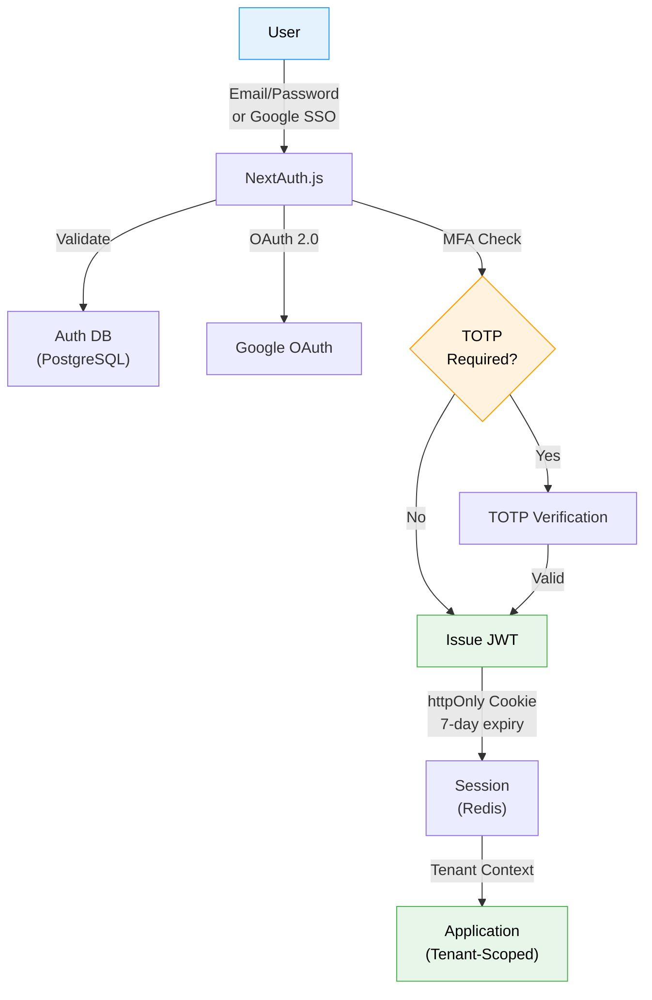

<div align="center">

# Technical Specification — Epic 1: Foundation & Administration

**QUALISYS — AI System Quality Assurance Platform**

</div>

| Attribute | Detail |
|-----------|--------|
| **Epic** | 1 — Foundation & Administration |
| **Author** | Azfar |
| **Date** | 2026-01-23 |
| **Status** | Complete |
| **Duration** | 2 weeks |
| **Stories** | 13 stories |
| **FRs Covered** | FR1–FR15, FR102–FR108 (25 FRs) |
| **Dependencies** | Epic 0 (Infrastructure Foundation) |

---

### Stakeholder Guide

| Stakeholder | Sections of Interest | Purpose |
|-------------|---------------------|---------|
| **Owner / Admin** | Sections 1–3, 5 | Auth, org setup, RBAC, project management |
| **Architect** | Sections 3–4, 6–7 | Multi-tenancy design, data models, security |
| **Tech Lead / Dev** | Sections 4–5, 8 | APIs, workflows, acceptance criteria |
| **QA Lead** | Sections 6, 8, 10 | NFRs, acceptance criteria, test strategy |
| **PM / Scrum Master** | Sections 1–2, 9 | Scope, dependencies, risks |

---

### Table of Contents

**Part I — Overview & Architecture**
- [1. Overview](#1-overview)
- [2. Objectives & Scope](#2-objectives--scope)
- [3. System Architecture Alignment](#3-system-architecture-alignment)

**Part II — Detailed Design**
- [4. Services, Data Models & APIs](#4-services-data-models--apis)
- [5. Workflows & Sequencing](#5-workflows--sequencing)

**Part III — Quality Attributes**
- [6. Non-Functional Requirements](#6-non-functional-requirements)
- [7. Dependencies & Integrations](#7-dependencies--integrations)

**Part IV — Validation & Governance**
- [8. Acceptance Criteria](#8-acceptance-criteria)
- [9. Traceability Mapping](#9-traceability-mapping)
- [10. Risks, Assumptions & Open Questions](#10-risks-assumptions--open-questions)
- [11. Test Strategy](#11-test-strategy)

---

# Part I — Overview & Architecture

> **Audience:** All Stakeholders | **Purpose:** Context, scope, architecture alignment

---

## 1. Overview

Epic 1 establishes the foundational infrastructure for the QUALISYS multi-tenant SaaS platform. This epic delivers the essential capabilities that all subsequent epics depend upon: user authentication, organization management, role-based access control (RBAC), project creation, and basic administration.

**Business Context:**
- **Platform Foundation:** All feature epics (2-5) require authenticated users, organizations, and projects
- **Multi-tenant B2B SaaS:** Schema-level tenant isolation from day one
- **6 Persona Support:** Owner/Admin, PM/CSM, QA-Manual, QA-Automation, Dev, Viewer
- **Enterprise Ready:** OAuth 2.0, SAML 2.0 (Phase 2), MFA (TOTP), audit logging

**Key Deliverables:**
- User registration and authentication (email/password + Google SSO)
- Organization creation with branding and settings
- Team member invitation with role assignment
- Project creation and team assignment
- Basic administration (usage analytics, audit logs, data export)

**Dependencies:**
- Infrastructure (Epic 0): AWS account, Kubernetes cluster, PostgreSQL database, Redis cache
- No upstream epic dependencies (Epic 1 is the first feature epic)

## 2. Objectives & Scope

### Primary Objectives

1. **Enable User Onboarding:** New users can sign up, create organizations, and invite team members in <10 minutes
2. **Establish Multi-Tenancy:** Schema-level PostgreSQL isolation prevents cross-tenant data leakage
3. **Implement RBAC:** 6 persona roles with appropriate permission boundaries
4. **Create Project Framework:** Projects as containers for test artifacts, team assignments, and integrations
5. **Provide Admin Tools:** Basic usage analytics, audit logging, and data management

### In Scope (13 Stories)

| Story | Title | FRs Covered |
|-------|-------|-------------|
| 1.1 | User Account Creation | FR1 |
| 1.2 | Organization Creation & Setup | FR2, FR102, FR105 |
| 1.3 | Team Member Invitation | FR6, FR7 |
| 1.4 | User Management (Remove, Change Roles) | FR8, FR9 |
| 1.5 | Login & Session Management | FR3 |
| 1.6 | Password Reset Flow | FR4 |
| 1.7 | Two-Factor Authentication (TOTP) | FR5 |
| 1.8 | Profile & Notification Preferences | FR10 |
| 1.9 | Project Creation & Configuration | FR11, FR12 |
| 1.10 | Project Team Assignment | FR13 |
| 1.11 | Project Management (Archive, Delete, List) | FR14, FR15 |
| 1.12 | Usage Analytics & Audit Logs (Basic) | FR104, FR108 |
| 1.13 | Data Export & Org Deletion | FR106, FR107 |

### Out of Scope (Deferred)

- **SAML 2.0 SSO:** Okta, Azure AD integration (deferred to Epic 5)
- **Advanced RBAC:** Custom roles, permission hierarchies (deferred to Growth phase)
- **Billing & Subscription Management:** FR103 (deferred until pricing model defined)
- **Advanced User Analytics:** Per-user activity tracking (deferred to Growth phase)

## 3. System Architecture Alignment

### Multi-Tenancy Architecture (From architecture.md)

**PostgreSQL Schema Isolation:**
```
┌─────────────────────────────────────────────┐
│                  PostgreSQL                  │
├─────────────────────────────────────────────┤
│  tenant_acme         │  tenant_beta         │
│  ├── users           │  ├── users           │
│  ├── projects        │  ├── projects        │
│  ├── audit_logs      │  ├── audit_logs      │
│  └── ...             │  └── ...             │
├─────────────────────────────────────────────┤
│  public (shared)                            │
│  ├── tenants         (tenant registry)      │
│  ├── users           (cross-tenant lookup)  │
│  └── migrations                             │
└─────────────────────────────────────────────┘
```

**Defense-in-Depth:**
- Schema-level isolation (primary)
- Row-level security policies (defense layer)
- Application-level tenant context validation
- Automated daily audit scanning for cross-tenant queries

### Authentication Architecture

**Primary Flow (OAuth 2.0 + Email/Password):**
```
┌──────────┐    ┌───────────────┐    ┌──────────────┐
│  Client  │───►│  Next.js API  │───►│   Auth DB    │
│  (Next)  │    │  (NextAuth)   │    │ (PostgreSQL) │
└──────────┘    └───────────────┘    └──────────────┘
                       │
                       ▼
              ┌───────────────┐
              │  Google OAuth │
              │  (Provider)   │
              └───────────────┘
```

**Session Management:**
- JWT tokens (7-day expiry, httpOnly cookies)
- Refresh token rotation for security
- Redis for session storage and rate limiting
- MFA (TOTP) challenge at login time

### RBAC Permission Matrix

| Permission | Owner/Admin | PM/CSM | QA-Manual | QA-Automation | Dev | Viewer |
|------------|-------------|--------|-----------|---------------|-----|--------|
| Create projects | ✅ | ❌ | ❌ | ❌ | ❌ | ❌ |
| Invite users | ✅ | ❌ | ❌ | ❌ | ❌ | ❌ |
| Manage billing | ✅ | ❌ | ❌ | ❌ | ❌ | ❌ |
| View dashboards | ✅ | ✅ | ✅ | ✅ | ✅ | ✅ |
| Generate reports | ✅ | ✅ | ✅ | ✅ | ❌ | ❌ |
| Execute manual tests | ✅ | ❌ | ✅ | ✅ | ❌ | ❌ |
| Generate test scripts | ✅ | ❌ | ❌ | ✅ | ❌ | ❌ |
| Execute automated tests | ✅ | ❌ | ❌ | ✅ | ✅ | ❌ |
| Modify test scripts | ✅ | ❌ | ❌ | ✅ | ❌ | ❌ |
| Approve self-healing | ✅ | ✅ | ❌ | ✅ | ❌ | ❌ |
| Configure integrations | ✅ | ❌ | ❌ | ❌ | ❌ | ❌ |

### Authentication Flow



---

# Part II — Detailed Design

> **Audience:** Architects, Developers, Tech Lead | **Purpose:** Services, data models, APIs, workflows

---

## 4. Services, Data Models & APIs

### 4.1 Services & Modules

| Service | Location | Responsibilities | Key Inputs | Key Outputs |
|---------|----------|-----------------|------------|-------------|
| **AuthService** | `backend/services/auth/auth_service.py` | Registration (email/password + Google OAuth), JWT issuance (RS256: 15-min access token + 7/30-day refresh), refresh token rotation with reuse detection, password reset (SHA-256 token, 1-hr expiry), MFA (TOTP setup/verify/backup codes), session invalidation (single + all) | Registration form, OAuth authorization code, credentials, TOTP code | JWT access token, refresh token, MFA challenge token |
| **OrgService** | `backend/services/org/org_service.py` | Organization CRUD, slug generation with collision handling, tenant schema provisioning (`CREATE SCHEMA tenant_{id}` + Alembic `upgrade head`), S3 logo upload (presigned PUT URL pattern), org settings management (data retention, domain, JSONB config) | Org metadata, logo file, settings JSONB | Org record, S3 presigned URL, schema name |
| **MemberService** | `backend/services/org/member_service.py` | Invitation lifecycle (create → send email → accept → expire → revoke), bulk invite (up to 20), role assignment and change, soft-delete removal (`is_active=False`, `removed_at`, `removed_by`), last-admin guard (atomic `SELECT FOR UPDATE`), session invalidation on removal | Invite email + role list, user_id, role, invite token | Invitation record, membership record, session invalidation events |
| **ProjectService** | `backend/services/project/project_service.py` | Project CRUD with slug generation, team member management (add/remove), archive (`is_active=False`), restore, hard-delete (`CASCADE` to `project_members`, `test_cases`, `test_executions`), reusable `check_project_access` FastAPI dependency | Project form data, member user_id | Project record, project_members record |
| **AuditService** | `backend/services/audit/audit_service.py` | INSERT-ONLY audit logging (no UPDATE/DELETE enforced via PG rules), `@audit_action` decorator for implicit logging, 21-action catalog, non-blocking execution (FastAPI `BackgroundTask`), streaming CSV export (generator pattern) | Action, actor_id, resource_type/id, details JSONB | `audit_logs` INSERT, CSV stream |
| **AnalyticsService** | `backend/services/analytics/analytics_service.py` | Usage metrics aggregation (users count, projects count, test-runs placeholder, storage placeholder), Redis-cached aggregates (5-min TTL, lazy creation), dashboard endpoint data | — | Metrics JSONB (value + trend delta) |
| **ExportService** | `backend/services/admin/export_service.py` | Background org data export (all tenant tables → JSON → ZIP), S3 upload with presigned download URL (30-day expiry), email notification on completion, `export_jobs` table tracking | org_id, requested_by_user | `export_jobs` record, S3 key |
| **NotificationService** | `backend/services/notification/notification_service.py` | Email delivery via SendGrid/SES, Jinja2 template rendering (branded + Google-only variants), checks `notification_preferences` before sending (security alerts are never suppressible), rate limiting | Recipient email, template name, context dict | Email delivery status, suppression log |

### 4.2 Data Models & Contracts

#### Shared Schema (`public`)

```sql
-- Tenant registry (provisioned in Epic 0 — extended here)
ALTER TABLE public.tenants
  ADD COLUMN IF NOT EXISTS logo_url TEXT,
  ADD COLUMN IF NOT EXISTS data_retention_days INTEGER NOT NULL DEFAULT 90,
  ADD COLUMN IF NOT EXISTS settings JSONB NOT NULL DEFAULT '{}';

-- Cross-tenant email index (invite deduplication, login tenant lookup)
CREATE TABLE public.user_email_index (
    email          VARCHAR(255) PRIMARY KEY,
    tenant_id      UUID NOT NULL REFERENCES public.tenants(id) ON DELETE CASCADE,
    created_at     TIMESTAMP WITH TIME ZONE NOT NULL DEFAULT NOW()
);

-- Background export job tracking
CREATE TABLE public.export_jobs (
    id                  UUID PRIMARY KEY DEFAULT gen_random_uuid(),
    tenant_id           UUID NOT NULL REFERENCES public.tenants(id),
    status              VARCHAR(20) NOT NULL DEFAULT 'pending', -- pending, processing, ready, failed, expired
    s3_key              TEXT,
    download_url        TEXT,
    requested_by        UUID NOT NULL,
    requested_by_email  VARCHAR(255) NOT NULL,
    expires_at          TIMESTAMP WITH TIME ZONE,
    error_message       TEXT,
    created_at          TIMESTAMP WITH TIME ZONE NOT NULL DEFAULT NOW()
);

-- Post-schema-drop org deletion record (survives DROP SCHEMA CASCADE)
CREATE TABLE public.deletion_audit (
    id              UUID PRIMARY KEY DEFAULT gen_random_uuid(),
    tenant_id       UUID NOT NULL,
    org_name        VARCHAR(255) NOT NULL,
    deleted_by_email VARCHAR(255) NOT NULL,
    member_emails   TEXT[],
    project_count   INTEGER,
    deleted_at      TIMESTAMP WITH TIME ZONE NOT NULL DEFAULT NOW(),
    notes           TEXT
);
```

#### Per-Tenant Schema (`tenant_{tenant_id}`)

```sql
-- Users & Authentication (extends architecture base)
CREATE TABLE users (
    id                          UUID PRIMARY KEY DEFAULT gen_random_uuid(),
    email                       VARCHAR(255) UNIQUE NOT NULL,
    password_hash               VARCHAR(255),           -- NULL for OAuth-only accounts
    full_name                   VARCHAR(255) NOT NULL,
    role                        VARCHAR(50) NOT NULL,   -- owner|admin|pm-csm|qa-manual|qa-automation|developer|viewer
    is_active                   BOOLEAN NOT NULL DEFAULT TRUE,
    removed_at                  TIMESTAMP WITH TIME ZONE,
    removed_by                  UUID REFERENCES users(id),
    email_verified              BOOLEAN NOT NULL DEFAULT FALSE,
    email_verification_token    VARCHAR(255),
    email_verification_expires  TIMESTAMP WITH TIME ZONE,
    oauth_provider              VARCHAR(50),            -- google
    oauth_sub                   VARCHAR(255),           -- Google sub claim
    totp_secret                 TEXT,                   -- AES-256-GCM encrypted TOTP secret
    totp_enabled                BOOLEAN NOT NULL DEFAULT FALSE,
    backup_codes                JSONB,                  -- [{hash: '...', used: false}] × 10 (bcrypt-hashed)
    avatar_url                  TEXT,                   -- S3 presigned URL
    timezone                    VARCHAR(50) NOT NULL DEFAULT 'UTC',
    last_login                  TIMESTAMP WITH TIME ZONE,
    created_at                  TIMESTAMP WITH TIME ZONE NOT NULL DEFAULT NOW(),
    updated_at                  TIMESTAMP WITH TIME ZONE NOT NULL DEFAULT NOW()
);
CREATE INDEX idx_users_email       ON users(email);
CREATE INDEX idx_users_role        ON users(role);
CREATE INDEX idx_users_is_active   ON users(is_active) WHERE NOT is_active;

-- Password reset tokens
CREATE TABLE password_reset_tokens (
    id          UUID PRIMARY KEY DEFAULT gen_random_uuid(),
    user_id     UUID NOT NULL REFERENCES users(id) ON DELETE CASCADE,
    token_hash  VARCHAR(255) NOT NULL UNIQUE, -- SHA-256(raw_token)
    used        BOOLEAN NOT NULL DEFAULT FALSE,
    expires_at  TIMESTAMP WITH TIME ZONE NOT NULL, -- NOW() + 1 hour
    created_at  TIMESTAMP WITH TIME ZONE NOT NULL DEFAULT NOW()
);
CREATE INDEX idx_prt_token_hash ON password_reset_tokens(token_hash);

-- Organizations
CREATE TABLE organizations (
    id                   UUID PRIMARY KEY DEFAULT gen_random_uuid(),
    name                 VARCHAR(255) NOT NULL,
    slug                 VARCHAR(63) UNIQUE NOT NULL,
    logo_url             TEXT,
    domain               VARCHAR(255),
    data_retention_days  INTEGER NOT NULL DEFAULT 90,
    settings             JSONB NOT NULL DEFAULT '{}', -- {default_environment, allowed_domains[]}
    created_by           UUID NOT NULL REFERENCES users(id),
    created_at           TIMESTAMP WITH TIME ZONE NOT NULL DEFAULT NOW(),
    updated_at           TIMESTAMP WITH TIME ZONE NOT NULL DEFAULT NOW()
);

-- Team invitations
CREATE TABLE invitations (
    id          UUID PRIMARY KEY DEFAULT gen_random_uuid(),
    org_id      UUID NOT NULL REFERENCES organizations(id) ON DELETE CASCADE,
    email       VARCHAR(255) NOT NULL,
    role        VARCHAR(50) NOT NULL,
    token_hash  VARCHAR(255) NOT NULL UNIQUE,   -- SHA-256(raw_token)
    status      VARCHAR(20) NOT NULL DEFAULT 'pending', -- pending|accepted|expired|revoked
    invited_by  UUID NOT NULL REFERENCES users(id),
    expires_at  TIMESTAMP WITH TIME ZONE NOT NULL, -- NOW() + 7 days
    accepted_at TIMESTAMP WITH TIME ZONE,
    created_at  TIMESTAMP WITH TIME ZONE NOT NULL DEFAULT NOW()
);
CREATE INDEX idx_inv_token_hash ON invitations(token_hash);
CREATE INDEX idx_inv_email      ON invitations(email);
CREATE INDEX idx_inv_status     ON invitations(status) WHERE status = 'pending';

-- Projects (extended from architecture base)
CREATE TABLE projects (
    id              UUID PRIMARY KEY DEFAULT gen_random_uuid(),
    name            VARCHAR(255) NOT NULL,
    slug            VARCHAR(63) UNIQUE NOT NULL,
    description     TEXT,
    app_url         TEXT,
    github_repo_url TEXT,
    status          VARCHAR(20) NOT NULL DEFAULT 'active', -- active|archived
    is_active       BOOLEAN NOT NULL DEFAULT TRUE,
    settings        JSONB NOT NULL DEFAULT '{}', -- {default_environment, default_browser, tags[]}
    created_by      UUID NOT NULL REFERENCES users(id),
    created_at      TIMESTAMP WITH TIME ZONE NOT NULL DEFAULT NOW(),
    updated_at      TIMESTAMP WITH TIME ZONE NOT NULL DEFAULT NOW()
);
CREATE INDEX idx_projects_slug      ON projects(slug);
CREATE INDEX idx_projects_is_active ON projects(is_active);

-- Project team membership (no project-level roles — uses org-level role)
CREATE TABLE project_members (
    id          UUID PRIMARY KEY DEFAULT gen_random_uuid(),
    project_id  UUID NOT NULL REFERENCES projects(id) ON DELETE CASCADE,
    user_id     UUID NOT NULL REFERENCES users(id) ON DELETE CASCADE,
    added_by    UUID NOT NULL REFERENCES users(id),
    added_at    TIMESTAMP WITH TIME ZONE NOT NULL DEFAULT NOW(),
    UNIQUE (project_id, user_id)
);
CREATE INDEX idx_pm_project_id ON project_members(project_id);
CREATE INDEX idx_pm_user_id    ON project_members(user_id);

-- User notification preferences (lazy-created on first profile save)
CREATE TABLE notification_preferences (
    id          UUID PRIMARY KEY DEFAULT gen_random_uuid(),
    user_id     UUID NOT NULL REFERENCES users(id) ON DELETE CASCADE,
    category    VARCHAR(50) NOT NULL,   -- security|system|test_results|team
    enabled     BOOLEAN NOT NULL DEFAULT TRUE,
    frequency   VARCHAR(20) NOT NULL DEFAULT 'real-time', -- real-time|daily|weekly
    digest_hour INTEGER DEFAULT 9,     -- UTC hour for digest/weekly delivery
    created_at  TIMESTAMP WITH TIME ZONE NOT NULL DEFAULT NOW(),
    updated_at  TIMESTAMP WITH TIME ZONE NOT NULL DEFAULT NOW(),
    UNIQUE (user_id, category)
);

-- Immutable audit log (INSERT-ONLY enforced via PostgreSQL rules)
CREATE TABLE audit_logs (
    id            UUID PRIMARY KEY DEFAULT gen_random_uuid(),
    action        VARCHAR(100) NOT NULL,      -- See 21-action catalog below
    actor_id      UUID REFERENCES users(id),  -- NULL for system-generated events
    actor_email   VARCHAR(255) NOT NULL,
    resource_type VARCHAR(50) NOT NULL,        -- user|organization|project|invitation|session
    resource_id   UUID,
    details       JSONB NOT NULL DEFAULT '{}',
    ip_address    INET,
    user_agent    TEXT,
    created_at    TIMESTAMP WITH TIME ZONE NOT NULL DEFAULT NOW()
);
CREATE INDEX idx_al_action      ON audit_logs(action);
CREATE INDEX idx_al_actor_id    ON audit_logs(actor_id);
CREATE INDEX idx_al_resource    ON audit_logs(resource_type, resource_id);
CREATE INDEX idx_al_created_at  ON audit_logs(created_at DESC);
-- Enforce immutability
CREATE RULE audit_no_update AS ON UPDATE TO audit_logs DO INSTEAD NOTHING;
CREATE RULE audit_no_delete AS ON DELETE TO audit_logs DO INSTEAD NOTHING;
```

#### Audit Action Catalog (21 actions)

| Action | Trigger |
|--------|---------|
| `user.registered` | New account created |
| `user.email_verified` | Email verification link clicked |
| `user.login` | Successful login |
| `user.login_failed` | Failed login attempt |
| `user.logout` | Explicit logout |
| `user.password_reset_requested` | Forgot password submitted |
| `user.password_changed` | Password successfully reset or changed |
| `user.mfa_enabled` | TOTP 2FA activated |
| `user.mfa_disabled` | TOTP 2FA deactivated |
| `user.profile_updated` | Name, avatar, timezone changed |
| `org.created` | Organization provisioned |
| `org.settings_updated` | Name, logo, domain, retention changed |
| `member.invited` | Invitation email sent |
| `member.invitation_revoked` | Invitation cancelled by admin |
| `member.joined` | Invitation accepted |
| `member.role_changed` | User role updated |
| `member.removed` | User soft-deleted from org |
| `project.created` | New project created |
| `project.archived` | Project soft-deleted |
| `project.deleted` | Project hard-deleted (CASCADE) |
| `org.deletion_initiated` | Org deletion background job queued |

### 4.3 APIs & Interfaces

All endpoints follow the standard response envelope: `{"data": {...}, "meta": {"request_id": "..."}}`. Paginated responses add `meta.page`, `meta.per_page`, `meta.total`. Errors: `{"error": {"code": "...", "message": "...", "details": {}}}`.

#### Auth Endpoints (15)

| Method | Path | Auth | Request Body | Response | Notes |
|--------|------|------|-------------|----------|-------|
| POST | `/api/v1/auth/register` | — | `{email, password, full_name}` | `{user, access_token, refresh_token}` | Sends verification email; rate-limited: 5/hour/IP |
| POST | `/api/v1/auth/verify-email` | — | `{token}` | `{message}` | 1-hour token expiry |
| POST | `/api/v1/auth/login` | — | `{email, password, remember_me?}` | `{access_token, refresh_token} \| {mfa_token}` | MFA challenge if enabled; rate-limited: 5 fails/15min |
| POST | `/api/v1/auth/logout` | Bearer | `{}` | `204` | Revokes current refresh token |
| POST | `/api/v1/auth/logout-all` | Bearer | `{}` | `204` | Revokes all sessions (Redis key pattern) |
| POST | `/api/v1/auth/refresh` | Cookie (refresh) | `{}` | `{access_token, refresh_token}` | Rotation — old token invalidated immediately |
| GET | `/api/v1/auth/oauth/google/authorize` | — | `?state=...` | `302 → Google` | PKCE code challenge |
| GET | `/api/v1/auth/oauth/google/callback` | — | `?code=...&state=...` | `{access_token, refresh_token}` | Creates account on first login |
| POST | `/api/v1/auth/password/forgot` | — | `{email}` | `202` | No email enumeration (same response regardless) |
| POST | `/api/v1/auth/password/reset` | — | `{token, new_password}` | `204` | Validates strength + same-password check |
| POST | `/api/v1/auth/mfa/setup` | Bearer | `{}` | `{secret, qr_code_url, backup_codes}` | AES-256 encrypted secret stored |
| POST | `/api/v1/auth/mfa/verify-setup` | Bearer | `{code}` | `{enabled: true}` | Confirms TOTP code before activating |
| POST | `/api/v1/auth/mfa/verify` | — | `{mfa_token, code}` | `{access_token, refresh_token}` | MFA challenge completion |
| POST | `/api/v1/auth/mfa/backup-codes/regenerate` | Bearer + password | `{password}` | `{backup_codes[]}` | Invalidates previous backup codes |
| DELETE | `/api/v1/auth/mfa` | Bearer + password | `{password}` | `204` | Disables TOTP and clears encrypted secret |

#### Organization Endpoints (10)

| Method | Path | Role Required | Request Body | Response |
|--------|------|--------------|-------------|----------|
| POST | `/api/v1/organizations` | Authenticated | `{name, logo_url?}` | `{org, schema_name}` |
| GET | `/api/v1/organizations/{org_id}` | Member | — | `{org, settings}` |
| PUT | `/api/v1/organizations/{org_id}` | Admin | `{name?, logo_url?, domain?, data_retention_days?, settings?}` | `{org}` |
| GET | `/api/v1/orgs/{org_id}/members` | Member | `?page&per_page&search&status` | `{members[], meta}` |
| POST | `/api/v1/organizations/{org_id}/invitations` | Admin | `{invites: [{email, role}]}` (max 20) | `{invited[], failed[]}` |
| DELETE | `/api/v1/organizations/{org_id}/invitations/{invite_id}` | Admin | — | `204` |
| PATCH | `/api/v1/orgs/{org_id}/members/{user_id}/role` | Admin | `{role}` | `{member}` |
| DELETE | `/api/v1/orgs/{org_id}/members/{user_id}` | Admin | — | `204` |
| POST | `/api/v1/organizations/{org_id}/export` | Owner | — | `{job_id, status: "pending"}` |
| DELETE | `/api/v1/organizations/{org_id}` | Owner | `{org_name_confirm, totp_code}` | `202` |

#### Project Endpoints (10)

| Method | Path | Role Required | Request Body | Response |
|--------|------|--------------|-------------|----------|
| GET | `/api/v1/projects` | Member | `?status=active\|archived&search&page` | `{projects[], meta}` |
| POST | `/api/v1/projects` | Admin | `{name, description?, app_url?, github_repo_url?}` | `{project}` |
| GET | `/api/v1/projects/{project_id}` | Project Member | — | `{project, settings}` |
| PUT | `/api/v1/projects/{project_id}` | Admin | `{name?, description?, app_url?, github_repo_url?, settings?}` | `{project}` |
| DELETE | `/api/v1/projects/{project_id}` | Admin | `{project_name_confirm}` | `202` |
| POST | `/api/v1/projects/{project_id}/archive` | Admin | — | `{project}` |
| POST | `/api/v1/projects/{project_id}/restore` | Admin | — | `{project}` |
| GET | `/api/v1/projects/{project_id}/members` | Project Member | `?page&per_page` | `{members[], meta}` |
| POST | `/api/v1/projects/{project_id}/members` | Admin | `{user_ids: []}` | `{added[], already_member[]}` |
| DELETE | `/api/v1/projects/{project_id}/members/{user_id}` | Admin | — | `204` |

#### User/Profile Endpoints (5)

| Method | Path | Auth | Request Body | Response |
|--------|------|------|-------------|----------|
| GET | `/api/v1/users/me` | Bearer | — | `{user, org_memberships[]}` |
| PUT | `/api/v1/users/me` | Bearer | `{full_name?, timezone?}` | `{user}` |
| PUT | `/api/v1/users/me/avatar` | Bearer | `{}` | `{upload_url, avatar_url}` (S3 presigned PUT) |
| GET | `/api/v1/users/me/notifications` | Bearer | — | `{preferences[]}` |
| PUT | `/api/v1/users/me/notifications` | Bearer | `{preferences: [{category, enabled, frequency}]}` | `{preferences[]}` |

#### Invitation Endpoints (2)

| Method | Path | Auth | Request Body | Response |
|--------|------|------|-------------|----------|
| GET | `/api/v1/invitations/{token}` | — | — | `{org_name, role, inviter_name, expires_at}` |
| POST | `/api/v1/invitations/{token}/accept` | — | `{full_name?, password?}` | `{access_token, refresh_token}` |

#### Admin Endpoints (4)

| Method | Path | Role Required | Query Params | Response |
|--------|------|--------------|-------------|----------|
| GET | `/api/v1/admin/audit-logs` | Admin | `?start&end&action&actor_id&page` | `{logs[], meta}` |
| GET | `/api/v1/admin/audit-logs/export` | Admin | `?start&end&action` | `text/csv` (streaming) |
| GET | `/api/v1/admin/analytics` | Admin | — | `{users_count, projects_count, storage_used, trend_delta}` |
| GET | `/api/v1/admin/export-jobs` | Admin | — | `{jobs[]}` |

## 5. Workflows & Sequencing

#### 5.1 New User Onboarding (Happy Path)

```
User → POST /auth/register
  ↳ Validate email format + password policy
  ↳ bcrypt hash password (cost factor 12)
  ↳ INSERT users (email_verified=false)
  ↳ INSERT public.user_email_index
  ↳ BackgroundTask: send verification email (SendGrid/SES)
  ↳ Return 201 + {user}

User → GET /auth/verify-email?token=...
  ↳ SHA-256 hash token → lookup password_reset_tokens
  ↳ UPDATE users SET email_verified=true
  ↳ Redirect → /onboarding/create-org

User → POST /organizations
  ↳ INSERT organizations (slug auto-generated)
  ↳ UPDATE public.tenants SET ... (logo, settings)
  ↳ CREATE SCHEMA tenant_{id}
  ↳ alembic upgrade head (async job)
  ↳ Issue JWT (tenant context embedded)
  ↳ Redirect → /onboarding/invite-team

User → POST /organizations/{id}/invitations
  ↳ INSERT invitations (status=pending, SHA-256 token hash stored)
  ↳ BackgroundTask: send invite email × N (max 20)
  ↳ Redirect → /onboarding/create-project
```

#### 5.2 Google OAuth Login

```
User → GET /auth/oauth/google/authorize
  ↳ Generate PKCE code_verifier + code_challenge
  ↳ Store state + verifier in Redis (5-min TTL)
  ↳ 302 → Google OAuth endpoint

Google → GET /auth/oauth/google/callback?code=...&state=...
  ↳ Verify state (anti-CSRF)
  ↳ Exchange code for Google tokens (verify code_verifier)
  ↳ Fetch Google profile (sub, email, name)
  ↳ Lookup public.user_email_index by email
  ↳ If exists: load user, issue JWT
  ↳ If not: INSERT user (oauth_provider=google, oauth_sub=sub)
         → INSERT public.user_email_index
         → Redirect → /onboarding/create-org
  ↳ Issue JWT + refresh token → httpOnly cookie
```

#### 5.3 MFA (TOTP) Login Flow

```
User → POST /auth/login {email, password}
  ↳ Verify password (bcrypt.verify)
  ↳ IF totp_enabled=true:
      ↳ Issue short-lived mfa_token (Redis, 5-min TTL)
      ↳ Return 200 {mfa_required: true, mfa_token}
  ↳ ELSE: Issue JWT + return 200

User → POST /auth/mfa/verify {mfa_token, code}
  ↳ Verify mfa_token from Redis (pop → invalidate)
  ↳ Decrypt TOTP secret (AES-256-GCM)
  ↳ pyotp.TOTP.verify(code, valid_window=1)
  ↳ Issue JWT + refresh token
```

#### 5.4 Team Invitation Accept (Existing User)

```
Invitee → GET /invitations/{token}
  ↳ SHA-256 hash token → lookup invitations
  ↳ Verify status=pending AND expires_at > NOW()
  ↳ Return {org_name, role, inviter_name}

Invitee → POST /invitations/{token}/accept {}
  ↳ Lookup user by email in users table
  ↳ UPDATE invitations SET status=accepted, accepted_at=NOW()
  ↳ INSERT (or UPDATE) memberships SET role=...
  ↳ BackgroundTask: audit_log(member.joined)
  ↳ BackgroundTask: notify inviter (if preferences allow)
  ↳ Issue JWT + return 200
```

#### 5.5 Organization Deletion (Owner)

```
Owner → DELETE /organizations/{org_id} {org_name_confirm, totp_code}
  ↳ Verify org_name_confirm matches org.name (exact)
  ↳ Verify TOTP code (pyotp)
  ↳ BackgroundTask (Celery/arq job):
      1. SELECT all member emails for notification
      2. INSERT public.deletion_audit (org metadata snapshot)
      3. Revoke all active sessions (Redis SCAN + DEL)
      4. Send departure emails to all members
      5. DROP SCHEMA tenant_{id} CASCADE
      6. DELETE FROM public.tenants WHERE id=...
      7. DELETE FROM public.user_email_index WHERE tenant_id=...
  ↳ Return 202 {message: "Organization deletion queued"}
```

# Part III — Quality Attributes

> **Audience:** QA, Architects, DevOps | **Purpose:** NFRs, dependencies, integration points

---

## 6. Non-Functional Requirements

### 6.1 Performance

| Metric | Target | Source |
|--------|--------|--------|
| API response time (P95) | < 500ms | NFR-P3 |
| API response time (P99) | < 2s | NFR-P3 |
| Login endpoint (P99) | < 500ms | Epic 1 target |
| Onboarding flow (signup → project created) | < 10 minutes | Epic Completion Criteria |
| Email delivery (invite, verification, reset) | < 1 hour | FR6, FR4 |
| Org data export (background job) | < 30 minutes for typical org | FR106 |
| Dashboard load (analytics page) | < 3 seconds | NFR-P3 |
| Redis cache TTL (analytics metrics) | 5 minutes | AnalyticsService |
| bcrypt cost factor | 12 (≈ 300ms/hash) | NFR-SEC1 |

### 6.2 Security

| Control | Specification |
|---------|--------------|
| **Password policy** | Min 12 chars, uppercase + lowercase + number + special char (NFR-SEC1) |
| **Password hashing** | bcrypt, cost factor 12, no pepper (library handles salting) |
| **Access tokens** | RS256 JWT, 15-minute expiry, tenant_id embedded in claims |
| **Refresh tokens** | opaque 256-bit random, stored hashed in Redis, rotation-on-use with reuse detection |
| **Session storage** | Redis, keys: `sessions:{user_id}:{tenant_id}:{token_suffix}` — per-tenant scoped; invalidated on remove/logout-all. **Story 1.5 MUST use this exact format.** Per-tenant scoping is intentional: removing a user from org A must not invalidate their sessions in org B. |
| **TOTP secrets** | AES-256-GCM encrypted at rest; key stored in AWS Secrets Manager |
| **Backup codes** | bcrypt-hashed, 10 codes, single-use, regeneration invalidates all previous |
| **Password reset tokens** | SHA-256 hashed, 1-hour TTL, single-use |
| **Invite tokens** | SHA-256 hashed, 7-day TTL, stored as hash only |
| **Transport** | TLS 1.3 minimum (NFR-SEC2) |
| **Data in transit** | All cookies `Secure; HttpOnly; SameSite=Lax` |
| **Tenant isolation** | PostgreSQL `search_path` enforcement via `tenant_middleware` (ContextVar), RLS as defence-in-depth |
| **RBAC enforcement** | FastAPI `Depends(require_role(...))` on all protected endpoints |
| **Rate limiting** | Register: 5/hr/IP; Login: 5 fails/15min + lockout at 10/hr; Invites: 30 ops/org/hr; Projects: 10 creates/org/hr |
| **No email enumeration** | Password-forgot returns 202 regardless of email existence |
| **GDPR** | Data export (FR106), right-to-erasure via org deletion (FR107), configurable retention (FR105) |
| **Dependency scanning** | Dependabot (weekly), Snyk (CI) (NFR-SEC4) |
| **SAST** | Semgrep on all commits (NFR-SEC4) |

### 6.3 Reliability/Availability

| Metric | Target | Notes |
|--------|--------|-------|
| **Uptime** | 99.5% MVP → 99.9% growth phase | NFR-R1 |
| **RPO** | < 24 hours | NFR-R2 |
| **RTO** | < 4 hours | NFR-R2 |
| **Backup retention** | 30 days automated daily (Epic 0 PostgreSQL config) | NFR-R2 |
| **Redis HA** | ElastiCache Multi-AZ, automatic failover | Epic 0 Story 0-5 |
| **Database durability** | RDS Multi-AZ + automated snapshots | Epic 0 Story 0-4 |
| **Auth service degradation** | If Redis unavailable: fall back to stateless JWT only (no session revocation) — alert P1 |
| **Email degradation** | If SendGrid fails: retry via SES fallback (dual-provider), queue for retry |
| **Incident response** | P0 (auth outage): < 30min acknowledge, < 4hr resolve (NFR-R1) |

### 6.4 Observability

| Signal | Implementation | Key Metrics |
|--------|---------------|-------------|
| **Structured logs** | Pino JSON logger (from Epic 0 Story 0-20) with `trace_id`, `tenant_id`, `user_id`, `request_id` | Login success/fail rate, registration rate, invitation accept rate |
| **Distributed tracing** | OpenTelemetry → Jaeger; spans on all API handlers and DB queries | Auth latency breakdown, DB query time per tenant |
| **Prometheus metrics** | Custom Epic 1 metrics exported via `/metrics` endpoint | `auth_login_total{status}`, `org_schema_provision_duration_seconds`, `audit_log_write_total{action}` |
| **Grafana dashboards** | Epic 1 dashboard (extends Epic 0 infrastructure dashboard) | Login rates, invite funnel (sent → accepted), org creation rate |
| **Audit log** | INSERT-ONLY `audit_logs` table (21 actions) | Queryable in admin UI, exportable as CSV |
| **Alerting** | Prometheus AlertManager → PagerDuty | Alert: login failure rate > 10/min/tenant, audit log INSERT failure |
| **PII redaction** | Fluent Bit Lua filter (from Epic 0 Story 0-20) — emails masked as `u***@***.com` in logs |  |

## 7. Dependencies & Integrations

#### Backend (Python) Dependencies

| Package | Version | Purpose |
|---------|---------|---------|
| `fastapi` | ^0.109.0 | API framework |
| `uvicorn[standard]` | ^0.27.0 | ASGI server |
| `sqlalchemy` | ^2.0.25 | ORM |
| `alembic` | ^1.13.1 | DB migrations |
| `pydantic` | ^2.6.0 | Schema validation |
| `asyncpg` | ^0.29.0 | Async PostgreSQL driver |
| `redis[hiredis]` | ^5.0.1 | Session + cache store |
| `passlib[bcrypt]` | ^1.7.4 | Password hashing (cost=12) |
| `python-jose[cryptography]` | ^3.3.0 | RS256 JWT (access tokens) |
| `secrets` (stdlib) | — | Opaque refresh token generation |
| `pyotp` | ^2.9.0 | TOTP generation + verification |
| `cryptography` | ^42.0.0 | AES-256-GCM TOTP secret encryption |
| `qrcode[pil]` | ^7.4.2 | QR code image generation for TOTP setup |
| `boto3` | ^1.34.0 | S3 (logo + export upload), SES (email fallback) |
| `sendgrid` | ^6.11.0 | Primary transactional email |
| `jinja2` | ^3.1.3 | Email template rendering |
| `arq` | ^0.25.0 | Async background jobs (export, org deletion) |
| `pino` | — (see Pino for Node) | Structured JSON logging (backend uses stdlib `logging` + JSON formatter) |
| `opentelemetry-sdk` | ^1.22.0 | Distributed tracing |
| `prometheus-fastapi-instrumentator` | ^6.1.0 | Prometheus metrics auto-export |

#### Frontend (TypeScript/React) Dependencies

| Package | Version | Purpose |
|---------|---------|---------|
| `react` | ^18.2.0 | UI framework |
| `vite` | ^5.0.0 | Build tool |
| `typescript` | ^5.3.0 | Type safety |
| `tailwindcss` | ^3.4.0 | Styling |
| `shadcn/ui` | latest | Component library (forms, dialogs, tables) |
| `react-hook-form` | ^7.49.0 | Form state management |
| `zod` | ^3.22.0 | Schema validation (form + API) |
| `@tanstack/react-query` | ^5.17.0 | API state management + caching |
| `axios` | ^1.6.0 | HTTP client |
| `react-router-dom` | ^6.21.0 | Client-side routing |
| `qrcode.react` | ^3.1.0 | QR code display (TOTP setup) |
| `date-fns` | ^3.3.0 | Date formatting (audit logs, timestamps) |

#### Infrastructure Dependencies (from Epic 0)

| Dependency | Version / Config | Story Origin |
|------------|-----------------|--------------|
| PostgreSQL | 15.x (RDS Multi-AZ + AKS equivalent) | Story 0-4 |
| Redis (ElastiCache) | 7.x, Multi-AZ | Story 0-5 |
| AWS S3 / Azure Blob | — | Stories 0-1, 0-7 |
| AWS SES / SendGrid | — | Story 0-22 (third-party API keys) |
| AWS Secrets Manager / Azure Key Vault | — | Story 0-7 |
| Kubernetes (EKS/AKS) | 1.28+ | Story 0-3 |
| GitHub Actions CI/CD | — | Story 0-8 |
| Prometheus + Grafana | kube-prometheus-stack | Story 0-19 |
| Fluent Bit + CloudWatch/Log Analytics | — | Story 0-20 |

#### External Integrations (Epic 1 scope)

| Integration | Purpose | Auth Method |
|-------------|---------|------------|
| **Google OAuth 2.0** | Social login (FR1) | OAuth 2.0 PKCE flow; client_id + client_secret in Secrets Manager |
| **SendGrid** | Transactional email (invites, verification, reset, export) | API Key in Secrets Manager |
| **AWS SES** | Email fallback if SendGrid unavailable | IRSA via ExternalSecret |
| **AWS S3 / Azure Blob** | Logo storage, export ZIP storage | IRSA / Workload Identity |

# Part IV — Validation & Governance

> **Audience:** Tech Lead, QA, PM | **Purpose:** Acceptance criteria, traceability, risks, testing

---

## 8. Acceptance Criteria

Criteria are ordered by story. Each AC is atomic and directly testable.

#### Story 1.1 — User Account Creation (FR1)
1. Email/password registration form validates email format and password policy (≥12 chars, upper + lower + number + special)
2. Submitting valid registration creates `users` row with `bcrypt`-hashed password and `email_verified=false`
3. Google OAuth redirect triggers and on callback creates account with `oauth_provider=google`
4. Verification email sent within 60 seconds; clicking link sets `email_verified=true`
5. Duplicate email registration returns `409 Conflict` with descriptive error
6. Registration is rate-limited: more than 5 attempts per hour per IP returns `429`
7. GDPR consent checkbox is required and stored in audit log

#### Story 1.2 — Organization Creation & Setup (FR2, FR102, FR105)
1. First-time verified user is prompted with org creation wizard (name, logo upload optional)
2. Submitting form creates `organizations` row and provisions `tenant_{id}` PostgreSQL schema within 30 seconds
3. Creating user is automatically assigned `owner` role in `memberships`
4. Org settings page shows name, logo, domain, data retention policy (30/90/180/365 days)
5. Logo upload generates S3 presigned PUT URL; accepted formats: PNG/JPG/SVG ≤ 2MB
6. Slug collision is resolved automatically by appending numeric suffix
7. Schema provisioning failure rolls back org record and surfaces error

#### Story 1.3 — Team Member Invitation (FR6, FR7)
1. Invite form accepts up to 20 email + role pairs; each email validated for format
2. Duplicate email within same org (active member) is rejected per-row with error; other rows proceed
3. Invite email delivered within 5 minutes with org name, inviter name, role, and expiry (7 days)
4. Invitation token is stored only as SHA-256 hash; raw token never persisted
5. Clicking invite link with `status=pending` and `expires_at > NOW()` shows org name, role, inviter
6. Existing user accepting invite creates `memberships` row; new user prompted for password
7. Accepted invitation sets `status=accepted`; expired invitation shows "link expired" error
8. Admin can revoke pending invitation; revoked status renders link invalid
9. Invites are rate-limited: 30 invite operations per org per hour

#### Story 1.4 — User Management Remove & Change Roles (FR8, FR9)
1. Members list displays all org members with name, email, role, join date, status
2. Admin can change any non-Owner member's role via dropdown; change takes effect immediately
3. Removing a user sets `is_active=false`, records `removed_at` and `removed_by`; user cannot log in to this org
4. Last-admin guard: removing or downgrading the last Owner/Admin returns `409` with descriptive message (atomic `SELECT FOR UPDATE` check)
5. Removed user's active sessions are invalidated within 5 seconds via Redis key deletion
6. Removal and role-change trigger email notification to affected user (respects preferences)
7. Both actions are captured in `audit_logs` with actor, timestamp, old role, new role

#### Story 1.5 — Login & Session Management (FR3)
1. Valid email/password login issues RS256 JWT (15-min access) + opaque refresh token (7-day default)
2. "Remember me" extends refresh token to 30 days
3. Google OAuth login option is available on login page
4. Incorrect password returns `401`; 5 consecutive failures within 15 minutes triggers 15-minute lockout with `429`
5. TOTP-enabled accounts receive `{mfa_required: true, mfa_token}` after password validation
6. `/auth/refresh` issues new token pair and immediately invalidates old refresh token (rotation)
7. Refresh token reuse after rotation returns `401` and invalidates all sessions for that user
8. Multi-org user selects active org via org-switcher; tenant context set per session
9. `/auth/logout` revokes current session; `/auth/logout-all` revokes all active sessions across devices

#### Story 1.6 — Password Reset Flow (FR4)
1. "Forgot Password" link on login page navigates to reset request form
2. Submitting any email (valid or not) returns `202` — no email enumeration
3. Reset email delivered within 5 minutes for valid registered email; contains branded link with 1-hour expiry
4. Google-only accounts receive branded email explaining password reset not applicable
5. Reset link validates token hash; expired or already-used token shows error
6. Reset form enforces same password policy (≥12 chars, complexity); same-as-current-password rejected
7. Successful reset invalidates all existing sessions via `logout_all()` and records `user.password_changed` audit event

#### Story 1.7 — Two-Factor Authentication TOTP (FR5)
1. Profile Security tab shows "Enable 2FA" if not enabled; "Manage 2FA" if enabled
2. Enabling 2FA shows QR code scannable by Google Authenticator, Authy, or any TOTP app
3. User must confirm with valid 6-digit TOTP code before 2FA activates (`totp_enabled=true`)
4. 10 single-use backup codes displayed on setup (bcrypt-hashed, stored in JSONB); each code usable once
5. Login with 2FA enabled requires TOTP code after password; backup code accepted as alternative
6. 3 consecutive wrong TOTP codes trigger 15-minute MFA lockout
7. "Disable 2FA" requires password confirmation and clears `totp_secret`
8. "Regenerate backup codes" requires password confirmation and invalidates previous codes
9. TOTP secret stored AES-256-GCM encrypted; encryption key in Secrets Manager
10. All MFA events (enable, disable, backup-code-used, lockout) captured in `audit_logs`

#### Story 1.8 — Profile & Notification Preferences (FR10)
1. Profile page shows tabbed layout: Profile / Security / Notifications
2. Profile tab: edit full name, upload avatar (S3 presigned URL, same pattern as org logo), set timezone (IANA tz)
3. Security tab: change password form (requires current password); shows 2FA management link
4. Notifications tab: 4 categories (Security Alerts, System, Test Results, Team) each with on/off toggle
5. Security Alerts category cannot be disabled (toggle disabled, tooltip explains)
6. Frequency selector (Real-time / Daily Digest / Weekly) available per category
7. Preferences saved immediately on toggle change; `notification_preferences` rows lazy-created on first save
8. Email notifications sent only to users with matching `enabled=true` and correct frequency bucket
9. Profile updates captured in `audit_logs` as `user.profile_updated`

#### Story 1.9 — Project Creation & Configuration (FR11, FR12)
1. "Create Project" button (visible to Owner/Admin only) opens form with name (required), description, app URL, GitHub repo URL
2. Submitting creates `projects` row with auto-generated unique slug
3. Project creator is auto-assigned to `project_members` with their org role
4. Project settings page allows editing all fields; changes saved with `updated_at` timestamp
5. Project list excludes archived projects by default; "Show Archived" toggle reveals them
6. Project creation rate-limited: 10 creates per org per hour
7. Project creation captured in `audit_logs` as `project.created`

#### Story 1.10 — Project Team Assignment (FR13)
1. Project settings shows "Team Members" tab with current assigned members list (name, role, added date)
2. "Add Members" dropdown shows org users not already on project; supports multi-select
3. Owner/Admin always has implicit access to all projects regardless of `project_members` membership
4. `check_project_access` FastAPI dependency enforces access for non-admin roles
5. Removing a project member removes their `project_members` row; they lose access to project
6. New project member receives email notification (respects Story 1.8 team notification preference)
7. Project creator auto-assigned to `project_members` on project creation
8. Add/remove captured in `audit_logs`

#### Story 1.11 — Project Management Archive Delete List (FR14, FR15)
1. Project list page shows name, status (Active/Archived), health indicator (placeholder — "Pending Epic 2"), last activity
2. List is searchable by project name, sortable by name/created date, paginated (20 per page)
3. Non-admin users see only projects they are members of; admins see all org projects
4. "Archive Project" sets `is_active=false`, `status=archived`; project disappears from default list
5. Archived projects appear under "Show Archived" toggle with distinct visual treatment
6. "Restore Project" sets `is_active=true`, `status=active`
7. "Delete Project" requires user to type project name exactly (case-sensitive confirmation input)
8. Hard-delete cascades to `project_members`, `test_cases`, `test_executions` (via ON DELETE CASCADE)
9. Both archive and delete rate-limited: 10 operations per org per hour
10. All operations captured in `audit_logs`

#### Story 1.12 — Usage Analytics & Audit Logs Basic (FR104, FR108)
1. Admin dashboard shows MetricCard widgets: Users (total + delta last 30 days), Projects (total + delta), Test Runs (placeholder: "0 — available in Epic 2"), Storage (placeholder: "0 GB — available in Epic 2")
2. Metrics are Redis-cached with 5-minute TTL (lazy creation)
3. Audit log page loads within 3 seconds for up to 10,000 log entries
4. Audit log is filterable by: date range, action type (dropdown of 21 actions), actor (user search)
5. Audit log is paginated (50 rows per page) with cursor-based pagination for performance
6. "Export as CSV" streams audit log entries matching current filters (no size limit, streaming response)
7. Only Admin and Owner roles can access analytics and audit log pages

#### Story 1.13 — Data Export & Org Deletion (FR106, FR107)
1. Settings page "Export Data" button (Owner-only) queues background export job and returns `{job_id}`
2. Export covers all tenant data: users, organizations, projects, project_members, invitations, audit_logs in JSON format, packaged as ZIP
3. Completed export uploaded to S3 with 30-day signed URL; download link emailed to Owner
4. "Delete Organization" button (Owner-only, not Admin) opens multi-step modal: type org name + enter TOTP code
5. Both confirmations must pass before deletion job is queued (returns `202`)
6. Background deletion: sends departure email to all active members, drops `tenant_{id}` schema (CASCADE), removes public registry entries, inserts `public.deletion_audit` record
7. All existing sessions invalidated immediately on deletion queue (Redis purge)
8. User accounts (email addresses) are preserved if user is member of other orgs

## 9. Traceability Mapping

| AC | FR | Spec Section | Component | Test Idea |
|----|-----|-------------|-----------|-----------|
| 1.1-AC1 (register validation) | FR1 | §4.3 POST /auth/register | AuthService.register() | Unit: invalid email, weak password → 422 |
| 1.1-AC2 (bcrypt hash) | FR1 | §4.2 users.password_hash | AuthService | Unit: bcrypt.verify(plain, hash) is true |
| 1.1-AC3 (Google OAuth) | FR1 | §4.3 /auth/oauth/google/callback | AuthService.oauth_google_callback() | Integration: mock Google token exchange |
| 1.1-AC4 (verification email) | FR1 | §5.1 Onboarding flow | NotificationService | Integration: mock SendGrid, verify email sent |
| 1.1-AC6 (rate limiting) | FR1 | §6.2 Rate limits | FastAPI middleware | Integration: 6th request within 1hr → 429 |
| 1.2-AC2 (schema provision) | FR2 | §5.1, §4.1 OrgService | OrgService.provision_schema() | Integration: schema created, alembic head applied |
| 1.2-AC3 (owner role) | FR2 | §4.2 memberships | MemberService | Unit: creating user has role=owner |
| 1.2-AC4 (settings page) | FR102, FR105 | §4.3 GET /orgs/{id} | OrgService | E2E: settings fields visible and editable |
| 1.3-AC3 (invite email) | FR6 | §4.1 NotificationService | NotificationService | Integration: invite email contains correct link |
| 1.3-AC4 (token hash) | FR6 | §4.2 invitations.token_hash | MemberService | Unit: raw token never stored in DB |
| 1.3-AC5 (accept flow) | FR7 | §5.4 Invitation Accept | MemberService.accept_invitation() | Integration: token lookup → membership created |
| 1.4-AC3 (soft delete) | FR8 | §4.2 users.is_active | MemberService | Unit: removed user cannot authenticate |
| 1.4-AC4 (last-admin guard) | FR8, FR9 | §5.1, §4.1 MemberService | MemberService.remove_member() | Unit: removing last admin → 409 |
| 1.4-AC5 (session invalidation) | FR8 | §6.2 Session storage | AuthService.invalidate_sessions() | Integration: Redis keys deleted within 5s |
| 1.4-AC7 (audit old + new role) | FR8, FR9 | §4.2 audit_logs + §4.3 PATCH /orgs/{id}/members/{user_id}/role | MemberService + AuditService | Integration: audit_logs row contains both old_role and new_role after change |
| 1.5-AC1 (JWT issued) | FR3 | §4.3 POST /auth/login | AuthService.login() | Unit: valid creds → JWT with correct claims |
| 1.5-AC5 (TOTP challenge) | FR3 | §5.3 MFA Login flow | AuthService | Integration: totp_enabled → mfa_token returned |
| 1.5-AC7 (token reuse detection) | FR3 | §6.2 refresh token rotation | AuthService.refresh() | Integration: reused token → 401 + all sessions cleared |
| 1.6-AC2 (no enumeration) | FR4 | §4.3 POST /auth/password/forgot | AuthService | Unit: unknown email → same 202 response |
| 1.6-AC5 (token expiry) | FR4 | §4.2 password_reset_tokens | AuthService.reset_password() | Unit: expired token → 400 |
| 1.7-AC3 (TOTP confirm) | FR5 | §5.3 MFA setup | AuthService.enable_mfa() | Unit: wrong code → not enabled |
| 1.7-AC4 (backup codes) | FR5 | §4.2 users.backup_codes | AuthService | Unit: each code single-use |
| 1.7-AC9 (AES encryption) | FR5 | §6.2 TOTP secrets | AuthService | Security: secret not readable in DB without key |
| 1.8-AC2 (avatar S3 presigned URL) | FR10 | §4.3 PUT /users/me/avatar | ProfileService | Unit: response contains upload_url (presigned PUT) and avatar_url |
| 1.8-AC5 (security alerts non-disableable) | FR10 | §4.3 PUT /users/me/notifications | NotificationService | Unit: category=security enabled cannot be set false |
| 1.8-AC7 (lazy-create notification_preferences) | FR10 | §4.2 notification_preferences | NotificationService | Integration: first save creates rows; subsequent toggle updates existing row |
| 1.8-AC9 (audit log) | FR10 | §4.2 audit_logs | AuditService | Unit: profile update creates user.profile_updated audit entry |
| 1.9-AC1 (RBAC gate) | FR11 | §4.3 POST /projects | ProjectService | Integration: PM role → 403; Admin → 201 |
| 1.9-AC2 (slug auto-generation) | FR11 | §4.2 projects.slug | ProjectService | Unit: slug derived from name; collision appends numeric suffix |
| 1.9-AC6 (rate limiting) | FR11 | §6.2 Rate limits | FastAPI middleware | Integration: 11th project create in 1hr → 429 |
| 1.10-AC3 (implicit admin access) | FR13 | §4.1 check_project_access | FastAPI dependency | Unit: admin user passes access check without project_members row |
| 1.10-AC4 (non-admin blocked without membership) | FR13 | §4.1 check_project_access | FastAPI dependency | Unit: non-admin user with no project_members row → 403 |
| 1.10-AC5 (remove project member) | FR13 | §4.2 project_members | ProjectService | Integration: DELETE project member → row removed, user loses project access |
| 1.11-AC3 (non-admin sees only their projects) | FR15 | §4.1 ProjectService | ProjectService | Integration: non-admin user sees only projects where project_members row exists |
| 1.11-AC4 (archive sets is_active=false) | FR14 | §4.2 projects | ProjectService | Unit: archive action → is_active=false, status=archived; excluded from default list |
| 1.11-AC7 (name confirmation) | FR14 | §4.3 DELETE /projects/{id} | ProjectService | Unit: wrong name → 400; correct name → 202 |
| 1.11-AC8 (cascade delete) | FR14 | §4.2 project_members | ProjectService | Integration: deleted project → related rows removed |
| 1.11-AC9 (rate limiting) | FR14 | §6.2 Rate limits | FastAPI middleware | Integration: 11th archive/delete in 1hr → 429 |
| 1.12-AC4 (audit log filters) | FR108 | §4.3 GET /admin/audit-logs | AuditService | Integration: filter by action type returns correct subset |
| 1.12-AC6 (CSV export) | FR108 | §4.3 GET /admin/audit-logs/export | AuditService | Integration: streaming response, CSV headers correct |
| 1.13-AC1 (export job) | FR106 | §4.1 ExportService | ExportService.queue_export() | Integration: job_id returned, background job queued |
| 1.13-AC5 (multi-step confirm) | FR107 | §5.5 Org Deletion flow | AuthService + OrgService | Integration: wrong org name → 400; wrong TOTP → 401 |
| 1.13-AC6 (schema drop) | FR107 | §5.5 Org Deletion flow | OrgService.delete_org_background() | Integration: schema no longer exists after job |
| 1.13-AC8 (user preservation) | FR107 | §4.2 users table | OrgService | Unit: user in another org still active after deletion |

**Multi-tenant isolation ACs (cross-cutting):**

| Test | Components | Test Idea |
|------|-----------|-----------|
| Tenant A cannot read Tenant B data | tenant_middleware, search_path | Integration: two tenants, cross-query attempt → empty result |
| search_path prevents cross-schema leakage | PostgreSQL search_path | Security: raw query without SET search_path → schema not found |
| RLS as defence-in-depth | PostgreSQL RLS policies | Security: disable search_path, verify RLS blocks access |

## 10. Risks, Assumptions & Open Questions

#### Risks

| ID | Type | Risk | Likelihood | Impact | Mitigation |
|----|------|------|-----------|--------|-----------|
| R1 | **Risk** | Foundation scope creep — auth features expand ("just one more") | Medium | High | Strict 13-story limit enforced. SAML 2.0, billing UI, advanced RBAC deferred to Epic 5 and later |
| R2 | **Risk** | Multi-tenancy bug — Tenant A reads Tenant B data (cross-tenant leak) | Low | Critical | Schema isolation + RLS + automated daily audit scan + manual QA with 3-tenant regression suite |
| R3 | **Risk** | TOTP secret exposure — AES-256 key compromised | Very Low | Critical | Key in AWS Secrets Manager (not code or env var); rotation procedure documented; key never logged |
| R4 | **Risk** | Onboarding friction — 50%+ drop-off before org creation | Medium | High | Guided wizard, auto-org-prompt post-verification, user testing with 5 real users before Epic 2 |
| R5 | **Risk** | Email delivery failure (invite, reset, verification) | Low | Medium | Dual-provider (SendGrid primary + SES fallback), retry queue, delivery monitoring |
| R6 | **Risk** | Org deletion job failure mid-run — partial data left | Low | Medium | Idempotent job design, `deletion_audit` written first, schema drop last; failed job re-runnable by ops |
| R7 | **Risk** | Redis unavailability — session revocation broken | Very Low | Medium | Circuit breaker: fall back to stateless JWT; alert P1; sessions naturally expire within 15min (access token) |
| R8 | **Risk** | Last-admin guard race condition — two admins removed simultaneously | Low | Medium | `SELECT FOR UPDATE` atomic check in transaction prevents race |

#### Assumptions

| ID | Assumption |
|----|-----------|
| A1 | Epic 0 is fully complete: PostgreSQL (multi-tenant, RLS, schema-per-tenant), Redis, S3, Secrets Manager, SendGrid/SES API keys all provisioned and accessible |
| A2 | Google OAuth `client_id` and `client_secret` have been obtained and stored in Secrets Manager (Story 0-22) |
| A3 | Email sending domain (DKIM/SPF/DMARC) is verified for SendGrid — required for invite deliverability |
| A4 | Frontend uses Vite + React 18 + TypeScript + shadcn/ui (not Next.js — no SSR required) |
| A5 | No billing or subscription management in Epic 1 — FR103 explicitly deferred |
| A6 | SAML 2.0 (Okta, Azure AD) deferred to Epic 5; only Google OAuth in Epic 1 |
| A7 | Notification preferences for Slack/severity-level filtering deferred to Story 5.15 (Epic 5) |
| A8 | Project-level roles do not exist — all role enforcement uses org-level roles from `memberships` |

#### Open Questions

| ID | Question | Owner | Target Resolution |
|----|---------|-------|-----------------|
| Q1 | Should Google-only users have a password (set via reset flow) or remain OAuth-only forever? | PM | Before Story 1.5 dev |
| Q2 | What is the data retention default for new organizations — 90 days or configurable during onboarding? | PM | Before Story 1.2 dev |
| Q3 | Should email verification be mandatory before org creation, or can it be deferred? | PM | Before Story 1.1 dev |
| Q4 | Rate limit values (5 login fails/15min, 30 invites/hr) — are these acceptable for enterprise customers who may bulk-invite? | PM + Architect | Before Story 1.3 dev |

## 11. Test Strategy

#### Test Levels

| Level | Framework | Coverage Target | Scope |
|-------|-----------|----------------|-------|
| **Unit** | `pytest` + `pytest-asyncio` | ≥ 80% branch coverage on services | AuthService, OrgService, MemberService, ProjectService, AuditService logic |
| **Integration** | `pytest` + `httpx.AsyncClient` + test DB | All 45 API endpoints; all service ↔ DB interactions | Full request/response cycle, real PostgreSQL schema-per-tenant, Redis mock |
| **Security** | `pytest` + manual OWASP checklist | Rate limiting, token rotation, tenant isolation, TOTP | OWASP Top 10 relevant to auth: A01 (IDOR), A07 (Auth failure) |
| **E2E** | `Playwright` | Critical user journeys (3 flows) | Signup → Org → Invite → Project onboarding; Login + MFA; Org deletion |

#### Critical Test Groups (mapped to ACs)

| Group | Stories | Key Test Cases |
|-------|---------|----------------|
| **Multi-tenant isolation** | All | Two-tenant isolation: Tenant A query returns only Tenant A data; cross-schema attempt blocked |
| **Auth security** | 1.1, 1.5, 1.6, 1.7 | Rate limiting thresholds; bcrypt hash verification; token rotation + reuse detection; TOTP window validation |
| **Invitation lifecycle** | 1.3 | Pending → accepted; expired token → 400; revoked token → 400; duplicate email handling |
| **RBAC enforcement** | 1.4, 1.9, 1.10, 1.11, 1.12, 1.13 | Each endpoint tested with wrong-role user → 403; correct-role → 200 |
| **Last-admin guard** | 1.4 | Concurrent removal race test (two parallel requests) → exactly one succeeds |
| **Audit log immutability** | 1.12 | PostgreSQL rule blocks UPDATE/DELETE on `audit_logs`; INSERT succeeds |
| **Org deletion** | 1.13 | Schema drop confirmed; deletion_audit inserted; sessions invalidated; user in other org unaffected |

#### Test Data Strategy

- Use `tenant-fixtures.ts` and `conftest.py` factories from Epic 0 (Story 0-15) for test data seeding
- Create isolated test tenant schema per test run (via `create_test_tenant()` utility from Story 0-18)
- Factory builders: `UserFactory`, `OrgFactory`, `InvitationFactory`, `ProjectFactory`
- Teardown: `cleanup_test_tenant()` drops schema after each test session

#### Definition of Done (per Story)

- [ ] All ACs for the story pass automated test assertions
- [ ] Unit test coverage ≥ 80% for changed service files
- [ ] Integration tests covering happy path + at least 2 error paths per endpoint
- [ ] Multi-tenant isolation test passes (Tenant A/B cross-query returns empty)
- [ ] RBAC test: at least one wrong-role → 403 per protected endpoint
- [ ] No `HIGH` findings in Semgrep SAST scan
- [ ] `audit_logs` INSERT verified for all tracked actions in the story
- [ ] Deployed to staging and smoke-tested

---

<div align="center">

---

**QUALISYS — Technical Specification: Epic 1 Foundation & Administration**
*13 Stories | 25 FRs | 2-Week Sprint*

| Metric | Value |
|--------|-------|
| Document | Tech Spec — Epic 1 v1.0 |
| Sections | 11 sections across 4 parts |
| Personas | 6 (Owner/Admin, PM/CSM, QA-Manual, QA-Auto, Dev, Viewer) |
| Status | Draft |

*Authored by Azfar — QUALISYS Platform Team*

---

</div>
