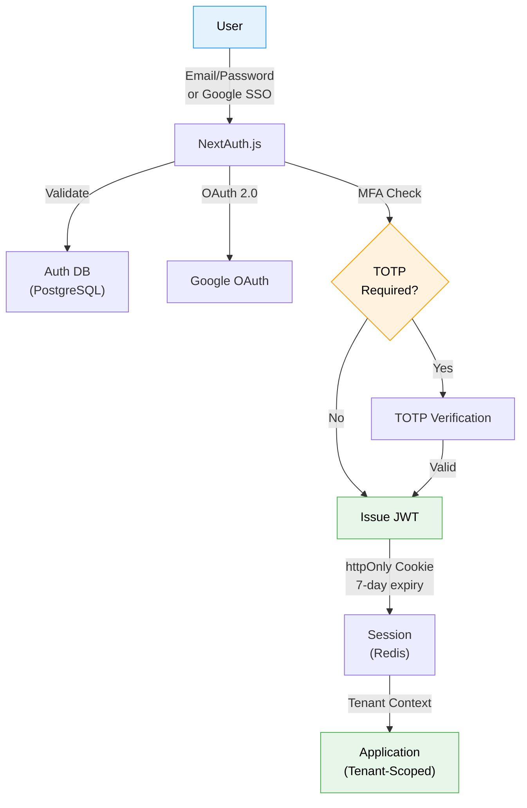

<div align="center">

# Technical Specification — Epic 1: Foundation & Administration

**QUALISYS — AI System Quality Assurance Platform**

</div>

| Attribute | Detail |
|-----------|--------|
| **Epic** | 1 — Foundation & Administration |
| **Author** | Azfar |
| **Date** | 2026-01-23 |
| **Status** | Draft |
| **Duration** | 2 weeks |
| **Stories** | 13 stories |
| **FRs Covered** | FR1–FR15, FR102–FR108 (25 FRs) |
| **Dependencies** | Epic 0 (Infrastructure Foundation) |

---

### Stakeholder Guide

| Stakeholder | Sections of Interest | Purpose |
|-------------|---------------------|---------|
| **Owner / Admin** | Sections 1–3, 5 | Auth, org setup, RBAC, project management |
| **Architect** | Sections 3–4, 6–7 | Multi-tenancy design, data models, security |
| **Tech Lead / Dev** | Sections 4–5, 8 | APIs, workflows, acceptance criteria |
| **QA Lead** | Sections 6, 8, 10 | NFRs, acceptance criteria, test strategy |
| **PM / Scrum Master** | Sections 1–2, 9 | Scope, dependencies, risks |

---

### Table of Contents

**Part I — Overview & Architecture**
- [1. Overview](#1-overview)
- [2. Objectives & Scope](#2-objectives--scope)
- [3. System Architecture Alignment](#3-system-architecture-alignment)

**Part II — Detailed Design**
- [4. Services, Data Models & APIs](#4-services-data-models--apis)
- [5. Workflows & Sequencing](#5-workflows--sequencing)

**Part III — Quality Attributes**
- [6. Non-Functional Requirements](#6-non-functional-requirements)
- [7. Dependencies & Integrations](#7-dependencies--integrations)

**Part IV — Validation & Governance**
- [8. Acceptance Criteria](#8-acceptance-criteria)
- [9. Traceability Mapping](#9-traceability-mapping)
- [10. Risks, Assumptions & Open Questions](#10-risks-assumptions--open-questions)
- [11. Test Strategy](#11-test-strategy)

---

# Part I — Overview & Architecture

> **Audience:** All Stakeholders | **Purpose:** Context, scope, architecture alignment

---

## 1. Overview

Epic 1 establishes the foundational infrastructure for the QUALISYS multi-tenant SaaS platform. This epic delivers the essential capabilities that all subsequent epics depend upon: user authentication, organization management, role-based access control (RBAC), project creation, and basic administration.

**Business Context:**
- **Platform Foundation:** All feature epics (2-5) require authenticated users, organizations, and projects
- **Multi-tenant B2B SaaS:** Schema-level tenant isolation from day one
- **6 Persona Support:** Owner/Admin, PM/CSM, QA-Manual, QA-Automation, Dev, Viewer
- **Enterprise Ready:** OAuth 2.0, SAML 2.0 (Phase 2), MFA (TOTP), audit logging

**Key Deliverables:**
- User registration and authentication (email/password + Google SSO)
- Organization creation with branding and settings
- Team member invitation with role assignment
- Project creation and team assignment
- Basic administration (usage analytics, audit logs, data export)

**Dependencies:**
- Infrastructure (Epic 0): AWS account, Kubernetes cluster, PostgreSQL database, Redis cache
- No upstream epic dependencies (Epic 1 is the first feature epic)

## 2. Objectives & Scope

### Primary Objectives

1. **Enable User Onboarding:** New users can sign up, create organizations, and invite team members in <10 minutes
2. **Establish Multi-Tenancy:** Schema-level PostgreSQL isolation prevents cross-tenant data leakage
3. **Implement RBAC:** 6 persona roles with appropriate permission boundaries
4. **Create Project Framework:** Projects as containers for test artifacts, team assignments, and integrations
5. **Provide Admin Tools:** Basic usage analytics, audit logging, and data management

### In Scope (13 Stories)

| Story | Title | FRs Covered |
|-------|-------|-------------|
| 1.1 | User Account Creation | FR1 |
| 1.2 | Organization Creation & Setup | FR2, FR102, FR105 |
| 1.3 | Team Member Invitation | FR6, FR7 |
| 1.4 | User Management (Remove, Change Roles) | FR8, FR9 |
| 1.5 | Login & Session Management | FR3 |
| 1.6 | Password Reset Flow | FR4 |
| 1.7 | Two-Factor Authentication (TOTP) | FR5 |
| 1.8 | Profile & Notification Preferences | FR10 |
| 1.9 | Project Creation & Configuration | FR11, FR12 |
| 1.10 | Project Team Assignment | FR13 |
| 1.11 | Project Management (Archive, Delete, List) | FR14, FR15 |
| 1.12 | Usage Analytics & Audit Logs (Basic) | FR104, FR108 |
| 1.13 | Data Export & Org Deletion | FR106, FR107 |

### Out of Scope (Deferred)

- **SAML 2.0 SSO:** Okta, Azure AD integration (deferred to Epic 5)
- **Advanced RBAC:** Custom roles, permission hierarchies (deferred to Growth phase)
- **Billing & Subscription Management:** FR103 (deferred until pricing model defined)
- **Advanced User Analytics:** Per-user activity tracking (deferred to Growth phase)

## 3. System Architecture Alignment

### Multi-Tenancy Architecture (From architecture.md)

**PostgreSQL Schema Isolation:**
```
┌─────────────────────────────────────────────┐
│                  PostgreSQL                  │
├─────────────────────────────────────────────┤
│  tenant_acme         │  tenant_beta         │
│  ├── users           │  ├── users           │
│  ├── projects        │  ├── projects        │
│  ├── audit_logs      │  ├── audit_logs      │
│  └── ...             │  └── ...             │
├─────────────────────────────────────────────┤
│  public (shared)                            │
│  ├── tenants         (tenant registry)      │
│  ├── users           (cross-tenant lookup)  │
│  └── migrations                             │
└─────────────────────────────────────────────┘
```

**Defense-in-Depth:**
- Schema-level isolation (primary)
- Row-level security policies (defense layer)
- Application-level tenant context validation
- Automated daily audit scanning for cross-tenant queries

### Authentication Architecture

**Primary Flow (OAuth 2.0 + Email/Password):**
```
┌──────────┐    ┌───────────────┐    ┌──────────────┐
│  Client  │───►│  Next.js API  │───►│   Auth DB    │
│  (Next)  │    │  (NextAuth)   │    │ (PostgreSQL) │
└──────────┘    └───────────────┘    └──────────────┘
                       │
                       ▼
              ┌───────────────┐
              │  Google OAuth │
              │  (Provider)   │
              └───────────────┘
```

**Session Management:**
- JWT tokens (7-day expiry, httpOnly cookies)
- Refresh token rotation for security
- Redis for session storage and rate limiting
- MFA (TOTP) challenge at login time

### RBAC Permission Matrix

| Permission | Owner/Admin | PM/CSM | QA-Manual | QA-Automation | Dev | Viewer |
|------------|-------------|--------|-----------|---------------|-----|--------|
| Create projects | ✅ | ❌ | ❌ | ❌ | ❌ | ❌ |
| Invite users | ✅ | ❌ | ❌ | ❌ | ❌ | ❌ |
| Manage billing | ✅ | ❌ | ❌ | ❌ | ❌ | ❌ |
| View dashboards | ✅ | ✅ | ✅ | ✅ | ✅ | ✅ |
| Generate reports | ✅ | ✅ | ✅ | ✅ | ❌ | ❌ |
| Execute manual tests | ✅ | ❌ | ✅ | ✅ | ❌ | ❌ |
| Generate test scripts | ✅ | ❌ | ❌ | ✅ | ❌ | ❌ |
| Execute automated tests | ✅ | ❌ | ❌ | ✅ | ✅ | ❌ |
| Modify test scripts | ✅ | ❌ | ❌ | ✅ | ❌ | ❌ |
| Approve self-healing | ✅ | ✅ | ❌ | ✅ | ❌ | ❌ |
| Configure integrations | ✅ | ❌ | ❌ | ❌ | ❌ | ❌ |

### Authentication Flow



---

# Part II — Detailed Design

> **Audience:** Architects, Developers, Tech Lead | **Purpose:** Services, data models, APIs, workflows

---

## 4. Services, Data Models & APIs

### 4.1 Services & Modules

{{services_modules}}

### 4.2 Data Models & Contracts

{{data_models}}

### 4.3 APIs & Interfaces

{{apis_interfaces}}

## 5. Workflows & Sequencing

{{workflows_sequencing}}

# Part III — Quality Attributes

> **Audience:** QA, Architects, DevOps | **Purpose:** NFRs, dependencies, integration points

---

## 6. Non-Functional Requirements

### 6.1 Performance

{{nfr_performance}}

### 6.2 Security

{{nfr_security}}

### 6.3 Reliability/Availability

{{nfr_reliability}}

### 6.4 Observability

{{nfr_observability}}

## 7. Dependencies & Integrations

{{dependencies_integrations}}

# Part IV — Validation & Governance

> **Audience:** Tech Lead, QA, PM | **Purpose:** Acceptance criteria, traceability, risks, testing

---

## 8. Acceptance Criteria

{{acceptance_criteria}}

## 9. Traceability Mapping

{{traceability_mapping}}

## 10. Risks, Assumptions & Open Questions

{{risks_assumptions_questions}}

## 11. Test Strategy

{{test_strategy}}

---

<div align="center">

---

**QUALISYS — Technical Specification: Epic 1 Foundation & Administration**
*13 Stories | 25 FRs | 2-Week Sprint*

| Metric | Value |
|--------|-------|
| Document | Tech Spec — Epic 1 v1.0 |
| Sections | 11 sections across 4 parts |
| Personas | 6 (Owner/Admin, PM/CSM, QA-Manual, QA-Auto, Dev, Viewer) |
| Status | Draft |

*Authored by Azfar — QUALISYS Platform Team*

---

</div>
